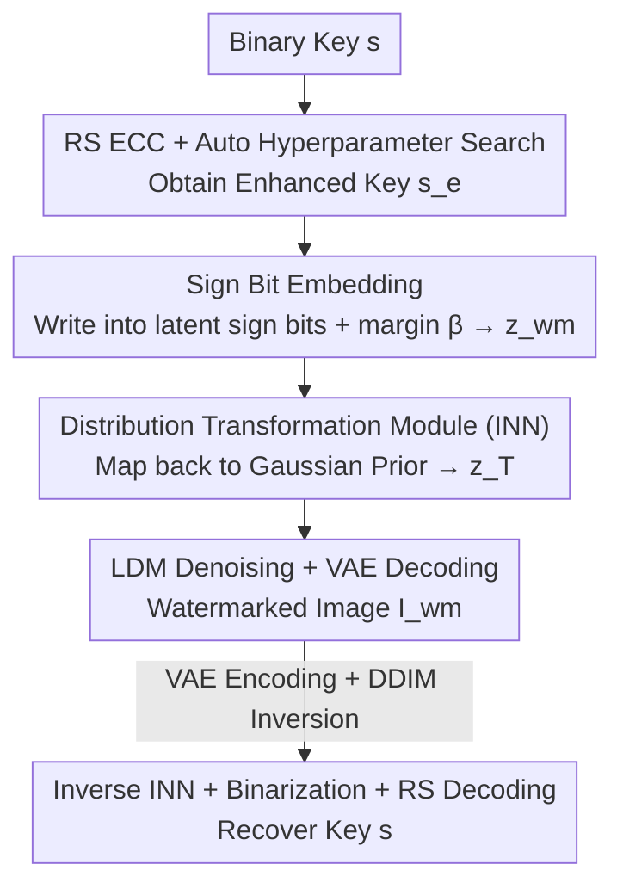

# MaxMark: High-Capacity Diffusion-Native Watermarking via Robust and Invertible Latent Embedding

**Conference**: CVPR 2026  
**Paper**: [CVF Open Access](https://openaccess.thecvf.com/content/CVPR2026/html/Chang_MaxMark_High-Capacity_Diffusion-Native_Watermarking_via_Robust_and_Invertible_Latent_Embedding_CVPR_2026_paper.html)  
**Code**: https://github.com/SeRAlab/MaxMark  
**Area**: AI Security / Diffusion Model Watermarking  
**Keywords**: Diffusion Model Watermarking, High-Capacity Watermarking, Invertible Neural Network, Sign Bit Embedding, Error Correction Code

## TL;DR
MaxMark embeds watermarks into the "most reliable sign bits" of latent noise and utilizes an Invertible Neural Network (INN) to map the watermarked latent back to a standard Gaussian distribution. This achieves a "high-capacity + high-robustness + high-fidelity" latent-space watermark for latent diffusion models, improving extraction accuracy by approximately 46% compared to the strongest baseline at a full capacity of 16,384 bits.

## Background & Motivation

**Background**: Images generated by Latent Diffusion Models (LDM) are becoming increasingly realistic, making provenance and copyright authentication urgent. Compared to post-processing methods that apply watermarks after generation, **diffusion-native watermarking** embeds signals directly into the generation process, making them more stealthy and resistant to tampering. Among these, **latent-based watermarking**—which embeds the watermark into the initial noise latent and recovers it via the DDIM inversion process—is most suitable for real-world deployment as it does not require modifications to the LDM (no fine-tuning of VAE/UNet).

**Limitations of Prior Work**: **Capacity** is the Achilles' heel of latent-space watermarking. The strongest baseline, Gaussian Shading, sees its accuracy drop by 15% when the payload on SD v1.5 increases from 256 bits to 8,192 bits. PRC Watermark's accuracy collapses to near-random (50%) after 4,096 bits. Once capacity increases, extraction fails.

**Key Challenge**: Capacity limitations stem from conflicts between two types of mechanisms. In encoder-decoder methods, the asymmetry between the encoder and decoder, coupled with approximation errors in the DDIM inversion, leads to **accumulated distortion**. Structured perturbation methods (Tree-Ring / Gaussian Shading / PRC) that directly modify the latent **disrupt its Gaussian distribution**, perturbing the diffusion trajectory and damaging image quality. To preserve quality, perturbations must remain minimal, naturally suppressing capacity.

**Goal**: To achieve three objectives without modifying the LDM: (1) Place information in the **most reliable regions** of the latent; (2) **Map perturbed latents back to the LDM's native Gaussian prior**; (3) Ensure **minimal loss** during embedding and extraction to guarantee high-accuracy recovery.

**Key Insight**: The authors make three key observations: **Sign bits are the most reliable information carriers** (most stable after the DDIM inversion); **Error Correction Code (ECC) parameters can be automatically tuned** to adapt to different capacities; and **invertibility is the key to minimizing recovery loss**.

**Core Idea**: Use "Sign Bit Embedding + Auto-tuned ECC" for robust embedding, and then use an "Invertible Neural Network" for distribution transformation to map the watermarked latent back to Gaussian. The invertible architecture allows the forward transformation and reverse recovery to share parameters with strictly zero loss, simultaneously achieving high capacity, high robustness, and high image quality.

## Method

### Overall Architecture
MaxMark consists of two collaborative modules: the **Robust Watermark Embedding Module** first enhances the binary key using ECC and writes it into the sign bits of the latent noise to obtain the watermarked latent $z_{wm}$. The **Distribution Transformation Module** uses an Invertible Neural Network (INN) to map $z_{wm}$ back to a standard Gaussian distribution, resulting in the initial noise $z_T$ that can be fed directly to the diffusion model. During generation, $z_T$ undergoes standard LDM denoising and VAE decoding to produce the watermarked image $I_{wm}$. Extraction follows the exact inverse process: the image is VAE-encoded and inverted via DDIM to recover an approximate $z_T'$, then processed by the inverse INN with the same parameters to obtain $z_{wm}'$, and finally decoded via binarization and RS decoding to restore the key.

### Key Designs

**1. RS ECC + Auto Hyperparameter Search: Resisting Inversion Errors with Minimum Redundancy**

During latent-space watermark extraction, the DDIM inversion process introduces bit-flip errors, which increase with capacity. Instead of the PRC codes used in prior work, the authors adopt **Reed–Solomon (RS) block codes** (on $GF(2^m)$ with $m$ bits per symbol, default $m=8$). RS offers two advantages: encoding/decoding is much lighter than PRC, and it provides **optimal worst-case error correction capability** under a fixed redundancy budget, which is particularly suited for the "clustered/bursty flips" caused by inverse diffusion. By slicing a key of length $l$ into blocks of length $B$, each with $k=B/m$ data symbols and $r$ parity symbols, forming an $RS(n,k)$ ($n=k+r$) code, it can correct up to $t=\lfloor r/2\rfloor$ symbol errors per codeword.

A standard redundancy-capacity tradeoff exists between block length $B$ and parity length $r$. The authors' key observation is that **errors introduced by inverse diffusion are approximately i.i.d. across latent dimensions**. Thus, the block failure probability has a closed-form expression, allowing for an "Auto Hyperparameter Search" to find RS parameters that satisfy a target reliability $\varepsilon$ while **leaving as much effective payload as possible**, eliminating manual tuning. The parity bits are appended to the original key to form the enhanced key $s_e$; if the remaining space after the payload is insufficient for parity bits, no ECC is applied. Ablations show that automatic search (99.6%) significantly outperforms random ECC configurations (95.5%) and no ECC (94.3%).

**2. Sign Bit Embedding: Writing Watermarks into the Most Inversion-Resistant Bits of the Latent**

The authors embed the watermark into the **sign bits** of the latent noise. Empirically, sign bits and other high-order bits are the most stable after the DDIM inversion, while low-order bits carry almost no usable signal. Furthermore, modifying extremely high-order bits other than the sign bit seriously damages image quality, making sign bits the optimal compromise between robustness and stealth (see Fig. 5 for ablation). Specifically, a noise vector $x\sim\mathcal{N}(0,1)$ is sampled, its sign bits are overwritten according to the enhanced key $s_e$, and a margin parameter $\beta$ is added to push the modified values away from zero, improving separability and robustness against inversion noise:

$$x'_i = \sigma(s_i)\,|x_i|\pm\beta,\quad \sigma(s_i)=2s_i-1$$

This is applied pixel-wise to obtain the watermarked latent $z_{wm}$. Comparative experiments with $\beta=0$ verify that sign bits and high-order bits are indeed much more robust than low-order bits.

**3. Distribution Transformation Module (INN): Mapping Back to Gaussian to Preserve Quality and Lossless Recovery**

Directly using $z_{wm}$ for generation severely degrades image quality due to distribution disruption (FID jumps from ~42 to ~388 in ablations). The authors use an **Invertible Neural Network (INN)** to map $z_{wm}$ back to the LDM's native standard Gaussian $\mathcal{N}(0,I)$. The INN establishes a bijection between input and output: the forward $y=f_\theta(x)$ and backward $x=f_\theta^{-1}(y)$ **share the same parameters $\theta$**, ensuring lossless reconstruction. The module consists of 12 stacked asymmetric coupling blocks. Each block splits the input into two halves $z_a^{i-1}, z_b^{i-1}$ along the channel dimension, transforming them alternately through sub-networks $f_a^i, f_b^i$ and multiplicative coupling $\phi(z,s,t)=ze^s+t$ (the inverse uses $\phi^{-1}(z,s,t)=(z-t)e^{-s}$).

Invertibility confers a training advantage: **no reconstruction loss is needed**, only a distribution loss to constrain the output to be Gaussian. The authors use a Maximum Likelihood Estimation (MLE) loss combined with a KL divergence term:

$$\mathcal{L}_{total}=\mathcal{L}_{MLE}(z,J)+\lambda\,\mathcal{KL}_{div}(z,y)$$

where $J$ is the Jacobian determinant of the transformation, $y\sim\mathcal{N}(0,I)$, and default $\lambda=0.1$. This mitigates the impact of embedding perturbations on image quality while allowing the extraction phase to be strictly inverted and nearly lossless due to the bijective structure. An additional benefit is **capacity generalization**: after training on length $M=C\times H\times W$ (16,384 for SD), it can embed any watermark length $\le M$ without retraining; once the model is trained, encoding any message does not require per-message retraining.

### Loss & Training
During training, binary keys of length $M$ are randomly generated and processed by the robust embedding module to produce $z_{wm}$, which serves as the input for the distribution transformation module. Only the forward process is optimized (parameters are shared for the reverse). The INN uses 12 asymmetric coupling blocks with hyperparameters $\lambda=0.1$ and $\beta=10$. Inference uses DDIM with 50 steps and a guidance scale of 7.5 to generate $512\times512$ images; the inversion process uses an empty prompt and a guidance scale of 1. RS code symbol size is $m=8$.

## Key Experimental Results

> Metric Descriptions: **Bit Accuracy** = Proportion of bits correctly extracted (higher is better, random baseline is 50%); **Bit Accuracy under Adversarial** = Average accuracy across 7 types of attacks; **TPR@1%FPR** = True Positive Rate at a 1% False Positive Rate (detectability); Quality is measured by **CLIP Score** (higher is better) and **CMMD / FID** (lower is better, authors note CMMD is more reliable than FID for SD). Payloads from 256→16,384 bits occupy 1.56%→100% of the latent space respectively.

### Main Results
Watermark effectiveness under different payloads on SD v1.5 (Selected from Table 1, units in %):

| Payload (bit) | Metric | MaxMark | Gaussian Shading | PRC Watermark | DiffuseTrace |
|--------|------|------|----------|------|------|
| 4096 | Bit Acc | 97.7 | 93.8 | 50.1 | 49.9 |
| 8192 | Bit Acc | 96.0 | 84.4 | 51.4 | 49.9 |
| 12288 | Bit Acc | 95.6 | — | 51.0 | 50.1 |
| 16384 | Bit Acc | 95.4 | 49.9 | 43.6 | 50.0 |
| 16384 | Bit Acc under Attack | 86.9 | 50.1 | 48.1 | 50.3 |
| 16384 | TPR@1%FPR | 1.00 | 0.00 | 0.01 | 0.01 |

It can be observed that baselines almost entirely collapse to random levels at high capacities, while MaxMark maintains a clean accuracy of 95.4%, an accuracy under attack of 86.9%, and TPR@1%FPR=1.00 even at a full capacity of 16,384 bits. The authors report improvements of 12% / 45% / 46% at 8,192 / 12,288 / 16,384 bits respectively. Regarding image quality (Table 2), MaxMark achieves CLIP Score ≈ 0.33, CMMD ≈ 0.76, and FID ≈ 42, which are on par with baselines, indicating no sacrifice of quality for high capacity.

### Ablation Study

| Configuration | Key Metrics | Note |
|------|---------|------|
| Full MaxMark | 16384bit Acc 98.6 / FID 41.8 | — |
| w/o Distribution Transformation | 16384bit Acc 88.4 / FID 386.9 | Catastrophic quality collapse; accuracy also drops (Table 4, COCO). |
| w/o ECC | 256bit Acc 94.3 | No error correction (Table 6). |
| Random ECC | 256bit Acc 95.5 | Randomly selected ECC parameters. |
| Auto Search ECC | 256bit Acc 99.6 | Proposed automatic parameter tuning. |
| RS vs BCH | 96.0 vs 96.0 (8192bit) | Framework is generic to different ECCs (Table 5). |

### Key Findings
- **The Distribution Transformation Module (INN) is critical for image quality**: Without it, FID surges from ~42 to ~387, indicating the method is unusable without mapping back to Gaussian; simultaneously, asymmetry in forward/backward diffusion worsens, causing extraction accuracy to drop.
- **Auto ECC Search > Random ECC > No ECC**: RS codes correct inversion errors, and auto-tuning maximizes reliability within the capacity ceiling.
- **Cross-modal Transferability**: By spreading the watermark across spatio-temporal latents and applying distribution transformation, accuracies of 98.2% for video (ModelScope) at 32k bits and 96.7% for audio (AudioLDM2) at 32k bits were achieved, whereas PRC collapsed to ~50% at 32k bits.

## Highlights & Insights
- **The observation that "Sign bits are reliable channels" is highly practical**: Placing information in bits most stable under inversion, rather than uniformly perturbing the entire latent, is the prerequisite for high capacity. This finding is transferable to other watermarking scenarios requiring recovery after lossy transformations.
- **Ingenious use of invertibility instead of reconstruction loss**: INN forward/backward parameter sharing + bijection ensures zero loss. Training requires only a distribution loss, making it lightweight and pushing recovery errors to a structural lower bound—the key mechanism for high capacity without accuracy loss.
- **Auto ECC tuning transforms the "redundancy-capacity tradeoff" into a searchable problem**: Based on the observation that "inverse diffusion errors are approximately i.i.d.," a closed-form failure probability is derived, allowing ECC strength to be automatically allocated per target reliability.
- **Train once, use for any message**: Compared to DiffuseTrace/Stable Signature which require per-message or per-content retraining, MaxMark has much lower deployment costs.

## Limitations & Future Work
- Extraction depends on the **approximation quality of the DDIM inversion**; inversion errors are the primary source of accuracy degradation. Performance under more aggressive samplers or stronger image editing attacks remains to be verified.
- Evaluations focused on common signal-level perturbations (blur/noise/JPEG/scaling); robustness against stronger adaptive attacks like **regeneration** or **VAE re-encoding** has not been fully tested. ⚠️ Specific attack details refer to the original Appendix.
- Accuracy under attack drops to ~86.9% at a full capacity of 16,384 bits, leaving a gap compared to the 95.4% clean accuracy, suggesting room for improvement between high capacity and attack resistance.
- The use of 12 coupling blocks in the INN, while lightweight, still adds an extra transformation step; the paper does not provide detailed figures on its impact on inference latency.

## Related Work & Insights
- **vs Gaussian Shading**: Both maintain Gaussian distributions, but GS relies on repeating/shuffling watermark sequences, which limits capacity (message length must divide 16,384) and collapses at high capacity. MaxMark remains stable at full capacity using sign bit embedding + INN transformation.
- **vs PRC Watermark**: PRC uses pseudorandom error correction embedded in the initial latent; decoding costs spike after 1,024 bits and accuracy collapses after 4,096 bits. MaxMark uses lighter RS codes + auto-tuning and embeds in sign bits rather than global perturbations.
- **vs Tree-Ring / RingID / ZoDiac**: These structured perturbation methods are essentially "few bits + detection" and have very low capacity. MaxMark targets multi-bit high-capacity provenance.
- **vs Stable Signature / DiffuseTrace (Model modification/Retraining required)**: These fine-tune VAE/UNet or require per-message retraining, which is costly and alters model behavior. MaxMark does not modify the LDM and is trained once for any message.

## Rating
- Novelty: ⭐⭐⭐⭐ The "sign bits as reliable channel + INN for distribution transformation" combination is clean and effective, though the individual components are clever assemblies of existing technologies.
- Experimental Thoroughness: ⭐⭐⭐⭐⭐ Covers 6 payloads, multiple baselines, attack robustness, three types of quality metrics, ablations, and cross-modal applications to video/audio.
- Writing Quality: ⭐⭐⭐⭐ Motivation and mechanism are explained clearly. The framework in Figure 3 is information-dense but slightly cluttered. Some formulas have OCR noise in symbols.
- Value: ⭐⭐⭐⭐ High-capacity latent-space watermarking is very practical for C2PA-style provenance. Being open-source and avoiding per-message retraining makes it highly deployable.

<!-- RELATED:START -->

## Related Papers

- [\[CVPR 2026\] Forensic-Friendly Image Manipulation via Controllable Latent Diffusion](forensic-friendly_image_manipulation_via_controllable_latent_diffusion.md)
- [\[CVPR 2026\] RecoverMark: Robust Watermarking for Localization and Recovery of Manipulated Faces](recovermark_robust_watermarking_for_localization_and_recovery_of_manipulated_fac.md)
- [\[CVPR 2026\] Meta-FC: Meta-Learning with Feature Consistency for Robust and Generalizable Watermarking](meta-fc_meta-learning_with_feature_consistency_for_robust_and_generalizable_wate.md)
- [\[CVPR 2026\] ClusterMark: Towards Robust Watermarking for Autoregressive Image Generators with Visual Token Clustering](clustermark_towards_robust_watermarking_for_autoregressive_image_generators_with.md)
- [\[AAAI 2026\] RegionMarker: A Region-Triggered Semantic Watermarking Framework for Embedding-as-a-Service](../../AAAI2026/ai_safety/regionmarker_a_region-triggered_semantic_watermarking_framework_for_embedding-as.md)

<!-- RELATED:END -->
