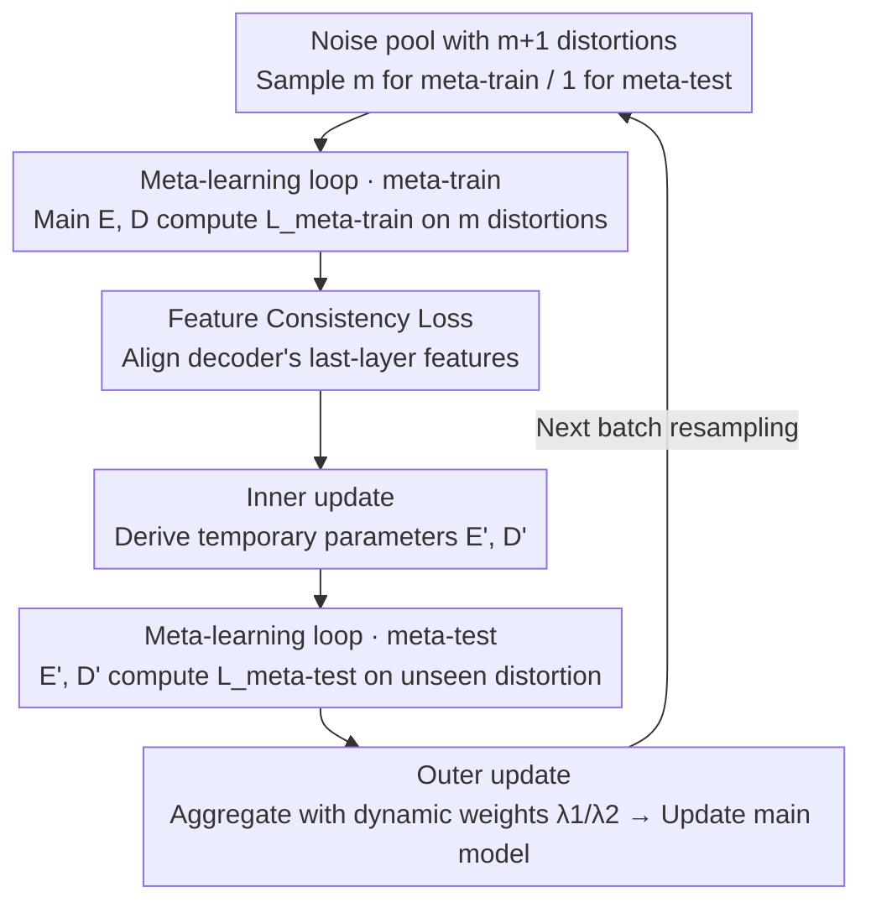

# Meta-FC: Meta-Learning with Feature Consistency for Robust and Generalizable Watermarking

**Conference**: CVPR 2026  
**Paper**: [CVF Open Access](https://openaccess.thecvf.com/content/CVPR2026/html/Li_Meta-FC_Meta-Learning_with_Feature_Consistency_for_Robust_and_Generalizable_Watermarking_CVPR_2026_paper.html)  
**Code**: Open-sourced (claimed in the paper; ⚠️ check the original text for the specific address)  
**Area**: AI Security / Deep Watermarking Training Strategy  
**Keywords**: Robust Watermarking, Meta-Learning, Feature Consistency, Distortion-Invariant Representation, Plug-and-play Training

## TL;DR
Meta-FC replaces the conventional "Single Random Distortion" (SRD) strategy in deep watermarking—which randomly selects one distortion per batch—with meta-learning. Each batch samples multiple distortions for meta-train and reserves one as an "unseen distortion" for meta-test, combined with a feature consistency loss to align decoder features. This allows the model to learn distortion-invariant representations. As a plug-and-play strategy applied to five existing models, it improves average accuracy by 1.59%, 4.71%, and 2.38% under high-intensity, combined, and unseen distortions, respectively.

## Background & Motivation

**Background**: Deep-learning-based robust watermarking generally utilizes the **Encoder-Noise-Decoder (END)** end-to-end framework: the encoder embeds the watermark into a cover image, the noise layer simulates various distortions, and the decoder extracts the watermark from the distorted image. To resist multiple distortions, the mainstream training strategy is **SRD (Single Random Distortion)**, where each training batch randomly selects **one** type of distortion from a noise pool.

**Limitations of Prior Work**: SRD learns each distortion **in isolation** batch by batch, ignoring the intrinsic relationships between different distortions. This leads to two issues: (1) the model **overfits to features of specific distortions** rather than learning true distortion-invariant representations; (2) **optimization is unstable**, as gradient directions from different distortions conflict with each other (gradient conflict), preventing the model from capturing shared invariances.

**Key Challenge**: To remain stable under **high-intensity distortions, combined distortions, and unseen distortions**, a watermark model must learn invariant representations shared across distortions. However, the "one distortion per batch" mechanism of SRD inherently fails to capture this commonality—it never faces multiple distortions in a single update, nor does it "rehearse" for unseen distortions.

**Goal**: Design a **model-agnostic, plug-and-play** training strategy that enables any END watermark model to learn distortion-invariant representations, thereby improving robustness and generalization across the three challenging scenarios.

**Key Insight**: The authors are inspired by the **success of meta-learning in domain generalization**—methods like MAML and MLDG essentially "extract invariant features across tasks through meta-train/meta-test iterations." By treating "different distortion combinations" as different "tasks," meta-learning can be naturally adapted to watermarking training.

**Core Idea**: Simulate "training on known distortions and testing on unknown distortions" **within each batch**. Sample $m$ distortions for meta-train to compute temporary parameters, then use a reserved $(m+1)$-th distortion for meta-test to calculate generalization loss. Jointly optimize to approach parameters that are "stable across various distortions." Additionally, a feature consistency loss is used to further refine "stable activations" into "distortion-invariant representations."

## Method

### Overall Architecture
Meta-FC is a training loop wrapped around existing END models without modifying the network architecture. The noise pool contains $m+1$ distortions. Every batch randomly samples $m$ distortions as meta-train distortions and reserves 1 as a "pseudo-unseen" meta-test distortion. One iteration consists of four steps: ① **Meta-train**: The main encoder $E$ and decoder $D$ compute meta-train losses (including decoding loss $\mathcal{L}^{tra}_{msg}$ and feature consistency loss $\mathcal{L}_{w,n}$) on $m$ distortions. ② **Inner update**: Temporary parameters $E', D'$ are updated using the meta-train loss. ③ **Meta-test**: Use $E', D'$ to compute meta-test loss $\mathcal{L}^{tes}_{msg}$ on the reserved "unseen" distortion. ④ **Outer update**: Aggregate meta-train, meta-test, and image losses into $\mathcal{L}_{total}$ to update the **main model** parameters $\theta_e, \theta_d$. This process gradually converges toward parameters where gradient directions are coordinated across various distortions.

### Key Designs

**1. Meta-Learning Loop: "Train on known, test on unknown" within a batch**

This is the core of Meta-FC, specifically addressing SRD's overfitting and gradient conflict. In the **meta-train** phase, the main $E, D$ decode messages $\mathcal{M}^i_{tra}$ from $m$ sampled distortions. The decoding loss is the sum of MSE across distortions, combined with the feature consistency loss:

$$\mathcal{L}_{meta\text{-}train} = \mathcal{L}^{tra}_{msg} + \lambda_f \mathcal{L}_{w,n}, \quad \mathcal{L}^{tra}_{msg} = \sum_{i=1}^{m} \text{MSE}(\mathcal{M}_{en}, \mathcal{M}^i_{tra})$$

(Default $\lambda_f = 0.001$). An **inner update** with $\mathcal{L}_{meta\text{-}train}$ yields temporary parameters $E', D'$, allowing the model to "adapt to this cluster of known distortions." In the **meta-test** phase, the reserved $(m+1)$-th distortion is treated as "unseen." Decoding is performed using $E', D'$ to compute $\mathcal{L}^{tes}_{msg} = \text{MSE}(\mathcal{M}_{en}, \mathcal{M}_{tes})$. Crucially, the **meta-test loss is computed with temporary parameters but used to update the main parameters**. Thus, the main parameters are pushed toward a direction that remains effective on unseen distortions even after one update on known distortions. This minimizes the gradient gap between known and unknown distortions. Note that no truly unknown distortions are used; "unseen" is merely simulated within the batch.

**2. Feature Consistency Loss: Refining "stable activations" into "distortion-invariant representations"**

Meta-learning alone identifies stable parameters but does not necessarily improve the model's representation capability. The authors add a feature consistency loss to align the **features of the undistorted watermarked image $I^{tra}_w$ and its distorted versions $I^i_{tra}$ at the final layer of the decoder**. The intuition is that features $f_w$ from the clean image are more reliable; pulling distorted features $f^i_{no}$ toward $f_w$ forces the model to extract distortion-robust watermark representations. Using L2 normalization and cosine similarity:

$$\mathcal{L}_{w,n} = \sum_{i=1}^{m} (1 - \cos(\bar{f}_w, \bar{f}^i_{no})) = \sum_{i=1}^{m} (1 - \langle \bar{f}_w, \bar{f}^i_{no} \rangle)$$

Using $\bar{f}_w$ as an anchor encourages consistent watermark representations across all distortions. Ablation studies show this term primarily strengthens performance against **combined distortions** (dropping ~2.21% without it).

**3. Dynamic Loss Weights: Prioritizing "decodability" then "visual similarity"**

The total loss aggregates meta-train, meta-test, and image losses:

$$\mathcal{L}_{total} = \lambda_1 \cdot \frac{\mathcal{L}_{meta\text{-}train} + \mathcal{L}_{meta\text{-}test}}{m+1} + \lambda_2 \cdot \frac{\mathcal{L}_{img}}{2}$$

The image loss $\mathcal{L}_{img} = \mathcal{L}^{tra}_{img} + \mathcal{L}^{tes}_{img}$ constrains both main and temporary encoders to ensure imperceptibility. Weights $\lambda_1, \lambda_2$ are adjusted dynamically: in early training, since watermark signals are weaker than image content, $\lambda_1$ is initialized to 5 and $\lambda_2$ to 1 to stabilize robust decoding. Once decoding is stable across distortions, $\lambda_1$ gradually decreases to 1 and $\lambda_2$ increases to 15 to focus on image quality. This "robustness first, quality second" schedule prevents the weak watermark signal from being overwhelmed by the image quality term early on.

## Key Experimental Results

> Metrics: **ACC (Bit Accuracy)** = ratio of correctly recovered watermark bits (higher is better). Image quality uses **PSNR / SSIM**. Experiments conducted at $128 \times 128$, 64-bit watermark, on RTX 3090. For fair comparison, SRD and Meta-FC are tuned to the same PSNR. Baselines include five END models: StegaStamp, MBRS, FIN, SepMark, and DERO.

### Main Results
Average ACC under high-intensity distortions (Excerpt from Table 1, DIV2K, %):

| Model | SRD Avg | Meta-FC Avg | Gain |
| :--- | :--- | :--- | :--- |
| StegaStamp | 94.48 | 95.57 | +1.09 |
| MBRS | 94.58 | 96.14 | +1.56 |
| FIN | 92.19 | 93.25 | +1.06 |
| SepMark | 94.75 | 97.28 | +2.53 |
| DERO | 95.92 | 97.20 | +1.28 |

Average gains in combined and unseen distortions (aggregated across three datasets):

| Scenario | StegaStamp | MBRS | FIN | SepMark | DERO |
| :--- | :--- | :--- | :--- | :--- | :--- |
| Combined Dist. ACC Gain | +0.63 | +7.92 | +1.62 | +12.79 | +1.23 |
| Unseen Dist. ACC Gain | +2.51 | +2.16 | +1.04 | +3.12 | +1.87 |

Meta-FC outperforms SRD across all five models and all three scenarios. The improvements for SepMark and MBRS on combined distortions are particularly significant (+12.79 / +7.92), suggesting that meta-learning and feature consistency yield higher returns in challenging scenarios where SRD fails.

### Ablation Study

| Configuration | High Intensity | Combined | Unseen | Description |
| :--- | :--- | :--- | :--- | :--- |
| Full Meta-FC | 95.93 | 92.65 | 90.93 | — |
| w/o meta-test (Keep FC) | 95.85 | 91.09 | 89.60 | Drop in combined/unseen |
| w/o FC | 95.56 | 90.44 | 90.99 | Combined drops by 2.21 |
| w/o meta-test & FC (Meta-train only) | 95.27 | 90.58 | 88.96 | — |
| w/o meta-train & FC (≈SRD) | 94.34 | 87.94 | 88.55 | Degenerates to SRD |

### Key Findings
- **Meta-train is more critical than meta-test**: Retaining only meta-train is already significantly stronger than SRD, proving that facing multiple distortions in one update alleviates gradient conflicts. Meta-test adds further generalization.
- **Feature Consistency (FC) targets combined distortions**: Removing FC drops performance on combined distortions by ~2.21%, but has negligible impact on unseen distortions (+0.06%). It ensures decoding features converge under multiple distortions.
- **Acceptable Overhead**: Meta-FC increases training time by approximately 0.6x (e.g., MBRS 2.07h → 3.37h), which is considered a worthwhile trade-off for stable ACC gains.
- **Visual Quality Maintained**: Under the same PSNR constraints, robustness improves without affecting imperceptibility, as shown in residual maps.

## Highlights & Insights
- **Reframing "Distortions" as "Tasks"**: The key conceptual leap is treating distortion combinations as meta-learning tasks. This allows domain generalization mechanisms to be ported over, explaining why the strategy excels in combined/unseen scenarios.
- **Plug-and-play, zero structural changes**: Meta-FC only modifies the training procedure. It does not touch the END network architecture, offering high reusability for any existing watermark model.
- **Pragmatic Dynamic Weighting**: Recognizing that watermark signals are naturally weaker than image content, the schedule ($\lambda_1$ 5→1, $\lambda_2$ 1→15) stabilizes early optimization. This is transferable to other steganography or embedding tasks.
- **Feature Consistency with Clean Anchor**: Using undistorted features as an anchor to align distorted features is more focused on "watermark-related" representations than simple logit alignment.

## Limitations & Future Work
- **Architectural Bottlenecks**: The authors acknowledge that the model architecture itself limits the generalization ceiling. Meta-FC improves robustness within existing architectures, but cannot grant complete immunity to entirely new types of attacks.
- **Training Overhead**: The 0.6x extra training cost and the reliance on a "sufficiently diverse" noise pool for effective meta-testing are inherent dependencies.
- **Resolution and Payload**: Experiments are fixed at $128 \times 128$ and 64 bits. Stability and gains at higher resolutions or longer payloads remain to be verified.
- **Scope of Unseen Distortions**: Evaluated unseen distortions still consist of common categories (JPEG, brightness, crop, etc.). Generalization toward generative or adaptive adversarial attacks is not addressed. 

## Related Work & Insights
- **vs. SRD (Single Random Distortion)**: SRD is batch-isolated, leading to overfitting and gradient conflicts. Meta-FC addresses multiple distortions simultaneously and practices for unseen ones.
- **vs. per-SRD / PDL (Progressive Distortion Layer)**: While these intend to reduce conflict (e.g., different images having different distortions), they do not capture cross-distortion commonalities or learn invariant representations.
- **vs. MBRS Circular JPEG Training**: MBRS relies on specific cyclic training for JPEG resistance, which is an engineering solution for a single distortion. Meta-FC is a general, cross-distortion paradigm.
- **vs. MAML / MLDG**: While they share the dual-gradient update mechanism for invariance, Meta-FC replaces "domains" with "distortion combinations" and introduces feature consistency specifically for watermark decoding.

## Rating
- Novelty: ⭐⭐⭐⭐ Clean migration of meta-learning/domain generalization to watermarking training with an added feature consistency loss. The underlying mechanism follows MAML logic.
- Experimental Thoroughness: ⭐⭐⭐⭐⭐ Evaluated across 5 models × 3 datasets × 3 distortion scenarios plus ablation and time analysis. The plug-and-play claim is well-supported.
- Writing Quality: ⭐⭐⭐⭐ Clear motivation (the "two sins" of SRD) and mechanism. Complete pseudocode.
- Value: ⭐⭐⭐⭐ High practical value as a training paradigm that enhances existing models without structural changes, though gains (1~3% ACC) are categorized as moderate.

<!-- RELATED:START -->

## Related Papers

- [\[CVPR 2026\] DASH: A Meta-Attack Framework for Synthesizing Effective and Stealthy Adversarial Examples](dash_a_meta-attack_framework_for_synthesizing_effective_and_stealthy_adversarial.md)
- [\[ICCV 2025\] FedMeNF: Privacy-Preserving Federated Meta-Learning for Neural Fields](../../ICCV2025/ai_safety/fedmenf_privacy-preserving_federated_meta-learning_for_neural_fields.md)
- [\[CVPR 2026\] RecoverMark: Robust Watermarking for Localization and Recovery of Manipulated Faces](recovermark_robust_watermarking_for_localization_and_recovery_of_manipulated_fac.md)
- [\[CVPR 2026\] ClusterMark: Towards Robust Watermarking for Autoregressive Image Generators with Visual Token Clustering](clustermark_towards_robust_watermarking_for_autoregressive_image_generators_with.md)
- [\[CVPR 2026\] Domain-Skewed Federated Learning with Feature Decoupling and Calibration](domain-skewed_federated_learning_with_feature_decoupling_and_calibration.md)

<!-- RELATED:END -->
