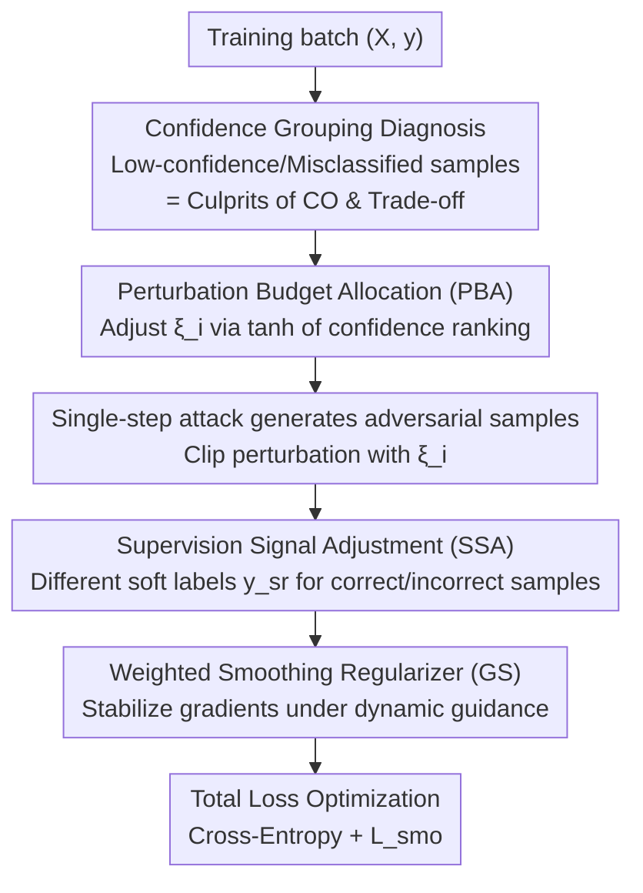

# Mitigating Error Amplification in Fast Adversarial Training

**Conference**: CVPR 2026  
**Paper**: [CVF Open Access](https://openaccess.thecvf.com/content/CVPR2026/html/Zhao_Mitigating_Error_Amplification_in_Fast_Adversarial_Training_CVPR_2026_paper.html)  
**Code**: None  
**Area**: Adversarial Robustness / AI Safety  
**Keywords**: Fast Adversarial Training, Catastrophic Overfitting, Robustness-Accuracy Trade-off, Dynamic Perturbation Budget, Confidence-aware Adaptation

## TL;DR
This paper identifies low-confidence/misclassified samples as the primary culprits behind catastrophic overfitting (CO) and the robustness-accuracy trade-off in Fast Adversarial Training (FAT). It proposes the Distribution-aware Dynamic Guidance (DDG) strategy, which dynamically allocates perturbation budgets based on sample confidence, adaptively adjusts supervision signals according to prediction status, and incorporates a weighted smoothing regularizer. DDG simultaneously mitigates CO and improves the robustness-accuracy trade-off across CIFAR-10/100 and Tiny-ImageNet.

## Background & Motivation

**Background**: Adversarial Training (AT) is one of the most effective methods to enhance model robustness, but standard AT is computationally expensive due to iterative adversarial sample generation. Fast Adversarial Training (FAT) utilizes single-step attacks like FGSM-RS to accelerate training, serving as a mainstream approach to balancing efficiency and robustness.

**Limitations of Prior Work**: FAT faces two major long-standing issues. First, catastrophic overfitting (CO), where robustness suddenly collapses after several epochs. Second, the robustness-accuracy trade-off, where increasing robustness often sacrifices clean sample accuracy; larger perturbation budgets typically exacerbate this accuracy loss. Prior works attribute CO to gradient misalignment or divergent feature pathways and suggest techniques like prior-guided initialization or label relaxation to manage the trade-off. However, the intrinsic link between CO and the trade-off remains unclear.

**Key Challenge**: Existing FAT methods **treat all samples equally**, applying a uniform perturbation budget and uniform supervision signal. However, different samples vary significantly in their tolerance to perturbations: high-confidence samples can withstand large perturbations, while low-confidence (mostly misclassified) samples trigger CO when subjected to large perturbations. Treating them uniformly essentially allows "underperforming" samples to poison the entire training process.

**Goal**: To clarify (1) the distinct behaviors of samples with different confidence levels in FAT; (2) how to adaptively adjust perturbation intensity and supervision strength to suppress both CO and the trade-off.

**Key Insight**: The authors follow the TDAT framework and perform controlled ablations on CIFAR-10/ResNet-18. By partitioning each batch into groups based on prediction confidence and independently adjusting the perturbation budget or labels for specific groups, they observe changes in Clean/PGD/C&W metrics. This "group-wise intervention" precisely identifies which samples drive CO and the trade-off.

**Core Idea**: Replace uniform processing with "Distribution-aware Dynamic Guidance (DDG)" based on confidence ranking. Higher perturbations are assigned to high-confidence samples, while smaller perturbations are assigned to low-confidence samples with suppressed erroneous supervision. This guides samples toward a consistent decision boundary and prevents the learning of spurious correlations.

## Method

### Overall Architecture

The logic of DDG is to first establish the insight that "low-confidence samples are the culprits" through diagnostic ablations. Based on this, it modifies the two control knobs of FAT (perturbation budget and supervision signal) to be **sample-wise and adaptive to the training state**. Finally, a weighted smoothing regularizer is employed to suppress gradient oscillations caused by dynamic guidance. It does not modify the backbone or the single-step nature of the attack; it only reshapes "how hard each sample is attacked and supervised."

For each training batch: it calculates the ranking $r_i$ based on the confidence of the ground-truth class; a sample-wise perturbation budget $\xi_i$ is computed using a tanh-shaped function of the ranking (**Perturbation Budget Allocation, PBA**), where higher ranks receive larger budgets; this budget is used to clip the single-step adversarial perturbation; then, based on whether the sample is currently correctly classified, a soft supervision label $y_{sr}$ is generated (**Supervision Signal Adjustment, SSA**), using relaxed labels for correct predictions and positive enhancement + negative suppression for incorrect ones; finally, optimization is performed using cross-entropy combined with a **Weighted Smoothing Regularizer $\mathcal{L}_{smo}$ (GS)**.

### Key Designs

**1. Confidence Grouping Diagnosis: Locating the True Culprits of CO and the Trade-off**

This is the foundation of the paper, answering "what is wrong with uniform guidance." The authors split the batch by prediction confidence into 4 groups (for CO analysis) or 32 groups (for trade-off analysis). By increasing/decreasing the perturbation budget or changing labels for a specific group and observing the Clean/PGD/C&W metrics, they find that high-confidence samples tolerate large perturbations without harming optimization. In contrast, **low-confidence (misclassified) samples trigger CO under large perturbations** because the model captures "perturbation-specific spurious features" rather than semantic cues, effectively learning a class-dependent backdoor feature. Conversely, reducing the budget of the lowest confidence group from 8/255 to 4/255 improves Clean/PGD/C&W by +1.06/+0.47/+0.41, indicating that **alleviating the excessive reinforcement of already incorrect samples improves both robustness and clean accuracy**.

**2. Perturbation Budget Allocation (PBA): Customizing Attack Intensity for Each Sample**

Addressing the issue where a uniform budget poisons low-confidence samples, DDG abandons the fixed $\xi_{base}=8/255$. Instead, it calculates a per-sample budget based on the descending confidence rank $r_i$ within the batch:

$$\xi_i = \xi_{base} + \kappa\left[\tanh(r_i-\tau_1) - \tanh(\tau_2 - r_i)\right]$$

where $\kappa$ is a scaling factor (default $2/255$, making $\xi_i\in[4/255, 12/255]$) and $\tau_1+\tau_2=B$ (batch size) constrains the transition zone. High-rank (high-confidence) samples get a larger budget, while low-rank samples get a smaller one. When generating adversarial samples, it is clipped by $\xi_i$: $\delta_i = \mathrm{clip}(\delta_{init} + \max\{\xi_i,\xi_{base}\}\cdot\mathrm{sign}(\nabla\mathcal{L}),\ -\xi_i,\ \xi_i)$, where $\delta_{init}$ follows the previous step's perturbation.

**3. Supervision Signal Adjustment (SSA): Differentiated Soft Labels Based on Correctness**

Addressing the issue where forcing error supervision on already incorrect samples worsens performance, DDG provides piecewise soft labels based on current classification status:

$$y_{sr} = \begin{cases}\hat{y}, & \arg\max f(x') = y \\ \hat{y} + \gamma(1-\mathrm{Acc})\,y - \tfrac{1}{L}y_m, & \text{otherwise}\end{cases}$$

where $\hat{y}$ is the relaxed label, $\mathrm{Acc}$ is the empirical accuracy of the current batch (providing a dynamic global signal), and $y_m$ is the one-hot vector for the most likely incorrect class. When the prediction is correct, relaxed labels are used. When incorrect, the positive enhancement term $\gamma(1-\mathrm{Acc})y$ weakens as ground-truth confidence rises, and the negative suppression term $\frac{1}{L}y_m$ is inversely proportional to the number of classes.

**4. Weighted Smoothing Regularizer (GS): Dampening Gradient Fluctuations**

Addressing the side effect where per-sample dynamic adjustments make gradients less smooth and training unstable, the total loss is $\mathcal{L}_{total} = -\frac{1}{B}\sum y_{sr}\log f(x') + \mathcal{L}_{smo}$, with the smoothing regularizer:

$$\mathcal{L}_{smo} = \|f(x+\delta_{init}) - f(x')\|_2\left(\lambda\frac{\max(\xi_B)-\xi_B}{\max(\xi_B)-\min(\xi_B)} + \alpha\,y_{false} + 1\right)$$

It is weighted by three parts: the first term normalizes the regularization strength based on the budget within the batch; the misclassification penalty $\alpha\,y_{false}$ ($y_{false}=1$ if $\arg\max f(x')\neq y$) strengthens regularization for incorrect samples during negative suppression to maintain gradient smoothness; the constant term 1 ensures non-zero regularization for all samples.

### Loss & Training
The final objective $\mathcal{L}_{total}$ is cross-entropy (using $y_{sr}$ soft labels) + $\mathcal{L}_{smo}$. The backbone is ResNet-18, optimized using SGD (momentum 0.9, weight decay $5\times10^{-4}$), batch size 128, initial lr 0.1, trained for 110 epochs with a 0.1 reduction at 100/105 epochs. Key hyperparameters include $\tau_1=8$, $\lambda=1.33$, $\alpha=1.5$. Results are reported for both "best" (highest PGD-10 robustness) and "final" (last round) to check stability.

## Key Experimental Results

### Main Results

On CIFAR-10 / ResNet-18 with an $\ell_\infty$ budget of 8/255, comparing various FAT methods (selected best epoch):

| Method | Clean | FGSM | PGD-10 | C&W | APGD |
|------|-------|------|--------|-----|------|
| FGSM-PGK | 81.52 | 64.95 | 56.14 | 50.90 | 55.44 |
| FGSM-PGI | 81.71 | 65.02 | 55.26 | 50.88 | 54.62 |
| TDAT | 82.46 | 66.28 | 56.36 | 49.99 | 55.10 |
| **Ours (DDG)** | **82.67** | **68.44** | **60.44** | 49.86 | **59.48** |

DDG leads in Clean, FGSM, PGD-10, and APGD, surpassing TDAT by approximately 4 points in PGD-10. C&W is slightly lower than PGI/PGK (attributed to attack objectives, see Key Findings). On CIFAR-100, DDG achieves Clean 57.98 / PGD-10 34.42, outperforming TDAT (57.32/33.56).

### Ablation Study

Effect of components on CIFAR-10 (best epoch; PBA: Perturbation Budget Allocation, SSA: Supervision Signal Adjustment, GS: Gradient Smoothing):

| Configuration | Clean | FGSM | PGD-10 | C&W | APGD |
|------|-------|------|--------|-----|------|
| Full DDG | 82.67 | 68.44 | 60.44 | 49.86 | 59.48 |
| w/o PBA | 81.70 | 68.33 | 59.54 | 49.58 | 57.46 |
| w/o SSA | 80.38 | 66.11 | 58.21 | **50.87** | 57.03 |
| w/o GS | **84.32** | 68.44 | 58.71 | 49.08 | 57.11 |

Removing PBA decreases both clean and robust accuracy. Removing SSA slightly increases C&W but significantly drops Clean. Removing GS achieves the highest Clean accuracy but at the cost of robustness.

### Key Findings
- **Low-confidence samples are culprits**: Diagnosis shows that reducing the budget for the lowest-confidence group increases Clean/PGD/C&W simultaneously, while increasing it triggers CO.
- **Clean accuracy vs Attacks**: Clean accuracy correlates positively with PGD but negatively with C&W. The authors attribute this to "one-to-many" (PGD) vs "many-to-one" (C&W) attack targets. Higher clean accuracy sharpens boundaries, making it harder for PGD to push samples to *any* wrong class but potentially exposing clearer descent directions for C&W.
- **Hyperparameter Robustness**: The method is relatively insensitive to hyperparameters like $\tau_1$ and $\lambda$.

## Highlights & Insights
- **Diagnosis-driven Design**: The paper uses controlled ablations to locate specific sample groups causing issues before designing interventions.
- **Dual-Adaptive Control**: Simultaneously making both perturbation intensity and supervision strength sample-wise adaptive.
- **Geometric Explanation**: Explaining the inverse relationship between PGD and C&W robustness from the perspective of attack geometry (one-to-many vs many-to-one).

## Limitations & Future Work
- Evaluation is limited to ResNet-18; performance on larger architectures (WideResNet, ViT) is unverified.
- Dependency on "confidence ranking" for budget allocation may be affected by ranking noise during training.
- C&W robustness remains slightly inferior to specialized methods like PGI/PGK.
- Only tested under $\ell_\infty$ budget 8/255; effectiveness under $\ell_2$ or larger budgets is unknown.

## Related Work & Insights
- **vs TDAT**: DDG extends TDAT's confidence analysis by making both perturbation and supervision fully dynamic and adding gradient smoothing, leading to significant PGD gains.
- **vs FGSM-PGK/PGI**: While those methods rely on initialization or historical perturbations, DDG focuses on per-sample guidance intensity.
- **vs GradAlign**: While GradAlign uses gradient alignment to suppress CO, DDG uses targeted intervention on low-confidence samples, offering higher interpretability.

## Rating
- Novelty: ⭐⭐⭐⭐ Strong diagnostic focus; while components like label relaxation exist, the dual-adaptive dynamic guidance is well-integrated.
- Experimental Thoroughness: ⭐⭐⭐⭐ Fine-grained ablations and multiple datasets, though limited by backbone variety.
- Writing Quality: ⭐⭐⭐⭐ Clear logical flow from diagnosis to design.
- Value: ⭐⭐⭐⭐ Practical and lightweight solution for improving the FAT trade-off.

<!-- RELATED:START -->

## Related Papers

- [\[ICML 2026\] SORA: Free Second-Order Attacks in Fast Adversarial Training](../../ICML2026/ai_safety/sora_free_second-order_attacks_in_fast_adversarial_training.md)
- [\[ECCV 2024\] Preventing Catastrophic Overfitting in Fast Adversarial Training: A Bi-level Optimization Perspective](../../ECCV2024/ai_safety/preventing_catastrophic_overfitting_in_fast_adversarial_training_a_bi-level_opti.md)
- [\[CVPR 2026\] Taming the Long Tail: Rebalancing Adversarial Training via Adaptive Perturbation](taming_the_long_tail_rebalancing_adversarial_training_via_adaptive_perturbation.md)
- [\[CVPR 2026\] FedCART: Tackling Long-Tailed Distributions in Federated Adversarial Training via Classifier Refinement](fedcart_tackling_long-tailed_distributions_in_federated_adversarial_training_via.md)
- [\[CVPR 2026\] SafeLogo: Turning Your Logos into Jailbreak Shields via Micro-Regional Adversarial Training](safelogo_turning_your_logos_into_jailbreak_shields_via_micro-regional_adversaria.md)

<!-- RELATED:END -->
## Related Papers

- [\[ICML 2026\] SORA: Free Second-Order Attacks in Fast Adversarial Training](../../ICML2026/ai_safety/sora_free_second-order_attacks_in_fast_adversarial_training.md)
- [\[CVPR 2026\] Taming the Long Tail: Rebalancing Adversarial Training via Adaptive Perturbation](taming_the_long_tail_rebalancing_adversarial_training_via_adaptive_perturbation.md)
- [\[CVPR 2026\] FedCART: Tackling Long-Tailed Distributions in Federated Adversarial Training via Classifier Refinement](fedcart_tackling_long-tailed_distributions_in_federated_adversarial_training_via.md)
- [\[CVPR 2026\] SafeLogo: Turning Your Logos into Jailbreak Shields via Micro-Regional Adversarial Training](safelogo_turning_your_logos_into_jailbreak_shields_via_micro-regional_adversaria.md)
- [\[ECCV 2024\] Preventing Catastrophic Overfitting in Fast Adversarial Training: A Bi-level Optimization Perspective](../../ECCV2024/ai_safety/preventing_catastrophic_overfitting_in_fast_adversarial_training_a_bi-level_opti.md)

<!-- RELATED:END -->
