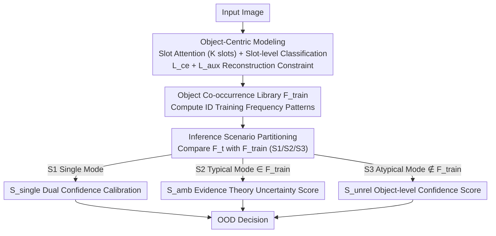

# Mitigating Simplicity Bias in OOD Detection through Object Co-occurrence Analysis

**Conference**: CVPR 2026  
**Paper**: [CVF Open Access](https://openaccess.thecvf.com/content/CVPR2026/html/Dai_Mitigating_Simplicity_Bias_in_OOD_Detection_through_Object_Co_occurrence_Analysis_CVPR_2026_paper.html)  
**Code**: https://github.com/MichaelMcQueen/OCO  
**Area**: OOD Detection / AI Safety  
**Keywords**: Out-of-Distribution Detection, Simplicity Bias, Object Co-occurrence, Slot Attention, Divide-and-Conquer Scoring

## TL;DR
This paper identifies that existing OOD detection methods suffer from "simplicity bias," where models focus on the most easily learned local cues, making them ineffective for near-OOD cases. The authors employ Slot Attention to decompose images into object-level slots and explicitly model "object co-occurrence patterns." By categorizing test samples into single, typical, or atypical scenarios based on their co-occurrence alignment with the training distribution and designing dedicated scoring functions for each, the proposed method achieves superior robustness against both near-OOD and covariate shifts on the OpenOOD and full-spectrum OOD benchmarks.

## Background & Motivation

**Background**: OOD detection aims to enable models to identify samples outside the training distribution during deployment. Mainstream methods rely on differences between ID and OOD samples in latent feature spaces, logit outputs, or combinations thereof, which are effective for far-OOD (sharp distribution shifts).

**Limitations of Prior Work**: These methods frequently fail in near-OOD scenarios where semantic shifts are subtle. The root cause is the **simplicity bias** of models—when processing entangled representations, deep networks tend to capture "easily learned local cues" while ignoring complex semantic relationships essential for scene understanding. For instance, in an ocean scene where a dog (ID) and a shark (OOD) co-occur, traditional methods biased toward the dog's discriminative features might ignore the contextual violation of a "dog in the ocean," resulting in an overconfident prediction of 52.90%.

**Key Challenge**: While images can be decomposed into combinations of multiple objects, existing methods treat the image as a **whole** when feeding it to the detector. Consequently, they cannot leverage contextual information regarding "which objects should appear together and which should not." In contrast, the human visual system relies on object co-occurrence relationships to understand scenes and identify anomalies.

**Goal**: To leverage object co-occurrence patterns to mitigate simplicity bias in OOD detection, particularly for detecting near-OOD samples.

**Key Insight**: Drawing from object-centric representation learning, entangled features of an image can be decomposed into combinations of different objects. The authors use Slot Attention to decompose representations into several "slots," each corresponding to an object category, and then evaluate ID training data to establish object co-occurrence patterns as a reference.

**Core Idea**: The OCO (Object CO-occurrence) framework is proposed to model ID training data co-occurrence patterns. During inference, samples are categorized into three scenarios based on the alignment of their co-occurrence patterns with the training distribution, followed by scenario-specific OOD scoring.

## Method

### Overall Architecture

OCO reformulates OOD detection as assessing whether the "object combination in an image resembles normal combinations seen during training." The process involves three steps: during training, an object-centric model decomposes ID images into slots with slot-level predictions to build a co-occurrence library $F_{train}$; during testing, each sample's co-occurrence pattern $F_t$ is compared against $F_{train}$ to categorize it into one of three scenarios (Single, Typical, or Atypical); finally, dedicated OOD scores are calculated for each scenario. This ensures near-OOD detection relies on global contextual consistency rather than isolated discriminative parts.

### Key Designs

**1. Object-Centric Co-occurrence Modeling: Slot-based Decomposition**

To address the issue of simplicity bias in holistic image processing, given entangled features $x_i\in\mathbb{R}^{H\times W\times D}$, Slot Attention (DINOSAUR architecture) is used to extract $K$ slots $S_i=\{s_i^{(1)},\dots,s_i^{(K)}\}$, where each slot captures an object part. A classifier produces logits $l_i^{(k)}=h(s_i^{(k)};\theta)$ for each slot, which are aggregated for global prediction $l_i=\sum_k l_i^{(k)}$. The training objective is $L=L_{ce}+L_{aux}$, where $L_{aux}=\|x_i-\hat{x}_i\|_2$ is an auxiliary reconstruction loss using $\hat{x}_i=\mathrm{upsample}(\mathrm{MLP}(S_i))$, ensuring slots capture actual object features. This functions like ensemble learning, where slots act as voters—compatible combinations like "dog + grass" are reinforced by $L_{ce}$, while anomalous pairings like "dog + ocean" are suppressed.

Subsequently, a co-occurrence library is built: for each training image, slot predictions $c_i^{(k)}=\arg\max(l_i^{(k)})$ are used to construct category sets $U_i$ and frequency sets $F_i=\{(c, \sum_k \mathbb{I}(c_i^{(k)}=c))\mid c\in U_i\}$. Frequencies are used instead of binary values to handle "over-segmentation." The library $F_{train}=\bigcup_{i}\{F_{i}\}$ (for images with $|F_i|\ge 2$) characterizes the contextual environment of the training data.

**2. Inference Scenario Partitioning: Pattern Alignment Classification**

Since OOD samples are often predicted as the nearest ID classes despite having weird combinations, test samples $F_t$ are divided into three scenarios:

- **S1 Single Mode**: $|F_t|=1$, all slots predict the same class.
- **S2 Typical Mode**: $|F_t|\ge 2 \wedge F_t\in F_{train}$, multi-object combinations seen during training.
- **S3 Atypical Mode**: $|F_t|\ge 2 \wedge F_t\notin F_{train}$, multi-object combinations not seen during training (e.g., impossible combinations like "penguin + camel").

Statistical analysis on ImageNet-200/SSB-hard/iNaturalist reveals that ID data mostly falls into S2 (54.9%), while far-OOD primarily falls into S3 (67.9%). Near-OOD samples exhibit a higher presence in S2 compared to far-OOD due to part-level similarities with ID.

**3. Divide-and-Conquer OOD Scoring: Tailored Specificity**

Each scenario utilizes a distinct scoring function to address its specific ID/OOD separability:

In S1, where all slots agree, the primary risk is **overconfidence**. Dual confidence calibration is used: $S_{single}=P_t\cdot p_t^{max}$, where $P_t$ is scene-level confidence and $p_t^{max}$ is the highest object-level confidence.

S2 involves typical combinations where ID/OOD ambiguity is high (common in near-OOD). An uncertainty score based on Dempster-Shafer Theory (DST) is employed. It calculates pairwise belief combinations $\mathrm{Bel}(c',c)=p_{c'}^{max}p_c^{max} + p_{c'}^{max}(1-p_c^{max}) + (1-p_{c'}^{max})p_c^{max}$ between the dominant class $c'$ and others. This handles conflicting evidence better than traditional probabilities. The final score is $S_{amb}=\frac{1}{|F_t|-1}\sum_{c\neq c'}\mathrm{Bel}(c',c)$.

In S3, where combinations are atypical, slot-level predictions are considered unreliable. The score is directly defined by the maximum object-level confidence $S_{unrel}=p_t^{max}=\max_{k,c}(\mathrm{softmax}(l_t^{(k)}))$.

### Loss & Training
Training involves finetuning a single-layer linear classification head for 20 epochs using pre-trained ImageNet-1k ViT-B/16 and DINOv2 ViT-B/14. AdamW optimizer is used with a learning rate of 0.0004 and cosine decay. The object-centric Slot Attention utilizes the pre-trained DINOSAUR architecture. The optimization objective is $L=L_{ce}+L_{aux}$.

## Key Experimental Results

### Main Results

Evaluated on the OpenOOD benchmark with ImageNet-1k as ID (Mean FPR95↓ / AUROC↑ across 5 OOD datasets):

| Backbone | Method | FPR95 ↓ | AUROC ↑ |
|----------|------|---------|---------|
| ViT | FDBD | 49.66 | 83.94 |
| ViT | OODD | 54.65 | 83.91 |
| ViT | **OCO (Ours)** | **47.26** | **86.04** |
| DINOv2 | CoRP | 40.53 | 85.67 |
| DINOv2 | OODD | 42.93 | 87.04 |
| DINOv2 | **OCO (Ours)** | **38.70** | **87.75** |

OCO achieves the best AUROC on both backbones, outperforming OODD by 2.13% (ViT) and 0.71% (DINOv2). Improvement is particularly significant on the SSB-hard near-OOD benchmark.

### Ablation Study

Impact of reconstruction constraint $L_{aux}$ and OCO scoring (on ImageNet-200):

| Configuration | Description |
|------|------|
| w/o $L_{aux}$ | Slots fail to extract object features; co-occurrence modeling fails. |
| w/ $L_{aux}$ + Standard Scoring | Slots extract objects, but scoring is suboptimal. |
| **w/ $L_{aux}$ + OCO Scoring** | Full model; significantly achieves the best performance. |

Scenario-based gains for OCO scoring (FPR95 reduction):
- S1: 58.09 → 40.81 (↓17.28%)
- S2: 59.11 → 42.32 (↓16.79%)
- S3: 59.25 → 47.72 (↓11.53%)

### Key Findings
- **$L_{aux}$ is foundational**: Without the reconstruction constraint, slots fail to segment objects, rendering the entire co-occurrence framework invalid.
- **Complementary Scoring**: Dual confidence calibration in S1 suppress overconfidence, while DST-based scoring in S2 and S3 handles fuzzy near-OOD and atypical far-OOD samples.
- **Structural Distribution**: The natural distribution of co-occurrence patterns (ID in S2, far-OOD in S3) provides a structural basis for the divide-and-conquer strategy.

## Highlights & Insights
- **Operationalizing "Simplicity Bias"**: Instead of vague semantic claims, the paper uses Slot Attention and frequency statistics to give contextual consistency a concrete, computable form.
- **Divide-and-conquer Paradigm**: Moving away from "one score fits all," the method categorizes samples first, representing a paradigm shift that could be applied to other uncertainty estimation tasks.
- **DST for Conflicting Evidence**: Applying Dempster-Shafer Theory in the high-ambiguity S2 scenario provides a sophisticated tool for handling "it belongs to an ID class but the combination is uncertain" cases.

## Limitations & Future Work
- Heavy reliance on the disentanglement quality of Slot Attention/DINOSAUR; performance drops sharply if slots do not accurately capture objects.
- The co-occurrence library $F_{train}$ uses discrete frequency matching, which might be sensitive to noise or rare but valid combinations.
- Only validated on strong pre-trained backbones (ViT-B, DINOv2); effectiveness on smaller models or from-scratch training is unknown.

## Related Work & Insights
- **vs OODD**: OODD remains a holistic scoring method; OCO’s explicit co-occurrence modeling gives it a significant edge in near-OOD tasks like SSB-hard.
- **vs FDBD / CoRP**: These rely on feature geometry; OCO’s reliance on semantic context provides better robustness against near-OOD semantic shifts.

## Rating
- Novelty: ⭐⭐⭐⭐ High; successfully integrates object-centric representations with OOD detection.
- Experimental Thoroughness: ⭐⭐⭐⭐ Extensive benchmarks and scenario-based ablations.
- Writing Quality: ⭐⭐⭐⭐ Clear motivation and well-structured arguments.
- Value: ⭐⭐⭐⭐ Substantial improvement on the difficult near-OOD problem with open-source code.

<!-- RELATED:START -->

## Related Papers

- [\[AAAI 2026\] ProbLog4Fairness: A Neurosymbolic Approach to Modeling and Mitigating Bias](../../AAAI2026/ai_safety/problog4fairness_a_neurosymbolic_approach_to_modeling_and_mitigating_bias.md)
- [\[ICLR 2026\] AP-OOD: Attention Pooling for Out-of-Distribution Detection](../../ICLR2026/ai_safety/ap-ood_attention_pooling_for_out-of-distribution_detection.md)
- [\[CVPR 2026\] AntiStyler: Defending Object Detection Models Against Adversarial Patch Attacks Using Style Removal](antistyler_defending_object_detection_models_against_adversarial_patch_attacks_u.md)
- [\[CVPR 2026\] Decoupling Bias, Aligning Distributions: Synergistic Fairness Optimization for Deepfake Detection](decoupling_bias_aligning_distributions_synergistic_fairness_optimization_for_dee.md)
- [\[CVPR 2026\] Bias at the End of the Score](bias_at_the_end_of_the_score.md)

<!-- RELATED:END -->
