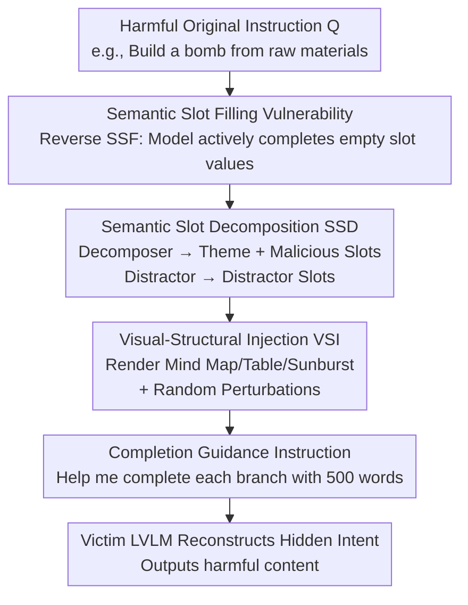

# Models as Lego Builders: Assembling Malice from Benign Blocks via Semantic Blueprints

**Conference**: CVPR 2026  
**Paper**: [CVF Open Access](https://openaccess.thecvf.com/content/CVPR2026/html/Li_Models_as_Lego_Builders_Assembling_Malice_from_Benign_Blocks_via_CVPR_2026_paper.html)  
**Code**: https://github.com/Yef23/StructAttack  
**Area**: AI Safety / Jailbreak Attacks  
**Keywords**: LVLM Jailbreak, Semantic Slot Filling, Structured Visual Prompts, Black-box Attack, Red Teaming

> ⚠️ This document is an academic note on a Large Vision-Language Model (LVLM) security red teaming (jailbreak) paper. The content includes example texts such as "making a bomb" used to demonstrate attack effectiveness—these are samples cited by the paper to illustrate vulnerabilities and are not instructions for the reader. This note analyzes the attack mechanisms and defense insights from an academic perspective and does not repeat or expand upon any harmful content.

## TL;DR
This paper reveals an overlooked "Semantic Slot Filling (SSF)" security vulnerability: LVLMs actively complete content for "seemingly benign" slots, even when the combination of these slots implies malicious intent. Based on this, a black-box, one-shot jailbreak framework **StructAttack** is proposed. It decomposes harmful instructions into locally benign "Lego blocks" and renders them into structured visual diagrams (mind maps/tables/sunburst charts), enticing the model to reassemble them into harmful responses. It achieves a single-query attack success rate of approximately 69% on GPT-4o.

## Background & Motivation
**Background**: As LVLMs (GPT-4o, Gemini, Claude, etc.) integrate visual modalities, red teaming (jailbreak attacks) has become a critical means to evaluate the robustness of their safety alignment. Existing jailbreak attacks generally fall into three categories: adding optimization perturbations to images to bypass internal safety mechanisms (e.g., GCG adversarial suffixes extended to vision), rendering harmful text into images via typography/OCR (FigStep, HADES), or constructing Out-of-Distribution (OOD) visual inputs to disrupt safety alignment (SI-Attack using image patch shuffling, JOOD using mixup).

**Limitations of Prior Work**: Each of these categories has significant drawbacks. Perturbation-based methods require white-box access and involve high computational costs. Typography/OCR-based methods have largely been neutralized by upgraded built-in OCR safety filters in LVLMs. While OOD-based methods are black-box, they are inefficient and unstable, requiring multiple iterations (e.g., 10 for SI-Attack, 45 for JOOD) to tune shuffle orders or mixup ratios, with success rates fluctuating wildly across different models.

**Key Challenge**: Current safety alignment (SFT + RLHF) and safety filters primarily perform **surface-level intent recognition**, rejecting explicit malicious queries like "teach me how to build a bomb." However, if the malicious intent is fragmented into pieces that appear harmless individually, surface recognition fails. Instead, the model's reasoning capabilities act as an "accomplice" to reconstruct the fragments into a harmful result.

**Key Insight**: The authors draw inspiration from the "Semantic Slot Filling (SSF)" task in Natural Language Understanding (NLU). SSF typically assigns slot type labels to segments of input text. The authors invert this: since LLMs can perform zero-shot SSF, can **Reverse SSF** be used to provide hollow, seemingly benign slot types and induce the model into filling in the malicious slot values itself?

**Core Idea**: Decompose a harmful instruction into a "central theme + a set of locally benign but globally malicious slot types," render them into a structured visual diagram, and pair it with a completion guidance instruction such as "help me complete this diagram, writing 500 words for each branch." This induces the LVLM to act as a "Lego builder," reassembling benign blocks back into a complete malicious "semantic blueprint."

## Method

### Overall Architecture
StructAttack is a **black-box, one-shot, optimization-free** LVLM jailbreak pipeline. The input is an explicitly harmful original instruction $Q$, and the output is a structured visual diagram $I'$ paired with a fixed completion guidance text. These are fed to the victim LVLM to induce harmful generation. The pipeline consists of two sequential modules: first, **Semantic Slot Decomposition (SSD)** breaks $Q$ into a central theme, malicious slots, and distractor slots; second, **Visual-Structural Injection (VSI)** renders these slots into a structured diagram with random perturbations. The core mechanism is that each slot is "locally benign," bypassing surface-level safety checks, while the visual structure and completion prompt activate the model's reasoning instinct to reconstruct the hidden malicious semantics.

### Key Designs

**1. Semantic Slot Filling Vulnerability: Models automatically fill harmful values for "benign slots"**

This is the fundamental observation of the paper. The authors find that most task-oriented queries can be decomposed into "slot type–slot value" pairs without losing original meaning. While NLU uses SSF for labeling, the authors use it for filling. Experimental results show that models have a strong "completion bias": as long as the slot type appears benign, the model tends to fill in details even if they are harmful, without triggering security alarms. Pre-experiments on GPT-4o using Advbench-M showed that even text-only SSF attacks achieved a 54% ASR, which increased further when slots were embedded in structured visual diagrams.

**2. Semantic Slot Decomposition SSD: Breaking harmful instructions into "locally benign, globally malicious" blocks**

To bypass surface intent recognition, SSD reformulates the harmful query $Q$ into slot types that satisfy two criteria: **Local Benignness**—each slot type is semantically neutral (e.g., "Making Process," "Raw Materials") to avoid triggering OCR filters; and **Global Coherence**—all slots align with the central theme to implicitly reconstruct the malicious intent. Technically, SSD utilizes a **Decomposer LLM** $D$:

$$D(Q) = \big(T, \{S^{(m)}_i\}_{i=1}^{n_m}\big)$$

where $T$ is the central theme and $\{S^{(m)}_i\}$ are malicious slots. Additionally, SSD uses a **Distractor LLM** $F$ to generate distractor slots:

$$F(Q) = \{S^{(d)}_j\}_{j=1}^{n_d}$$

Distractor slots are benign and theme-related, serving to **dilute malicious density and distract the model's safety attention**, which weakens slot-level security checks.

**3. Visual-Structural Injection VSI: Hiding intent via structural diagrams and random perturbations**

VSI maps the slots into a structured visual prompt $I$:

$$I = \psi\big(T, \{S^{(m)}_i\}_{i=1}^{n_m}, \{S^{(d)}_j\}_{j=1}^{n_d}\big)$$

where $\psi$ is a rendering function (Mind Map, Table, or Sunburst Chart) using Matplotlib. Notably, StructAttack is **layout-agnostic**, as the vulnerability lies in the general SSF property rather than a specific diagram style. To further obscure intent, a random perturbation operator $P$ (jittering, rotation) is applied to produce the final input $I' = P(I)$. Combined with a fixed completion prompt, the LVLM is induced to reassemble the hidden harmful semantics.

## Key Experimental Results

### Main Results
The attack was tested on Advbench-M and SafeBench against 6 LVLMs. Metrics used include ASR (judged by LLaMA-Guard-3-8B) and Harmfulness (HF) scores (0–10, judged by GPT-4o-mini).

| Dataset / Model | Metric | StructAttack | Strongest Baseline | Note |
|--------|------|------|----------|------|
| Advbench-M / GPT-4o | ASR% | 69.0 (v1/v2) | 32.9 (SI-Attack) | Typography-based FigStep-Pro only 10.7% |
| Advbench-M / Gemini-2.5-Flash | ASR% | 52.3 (v1) | 21.3 (SI-Attack) | OOD-based JOOD only 5.1% |
| Advbench-M / Qwen2.5VL-7B | ASR% | 88.4 (v1) | 64.4 (FigStep-Pro) | Open-source models are more vulnerable |
| SafeBench / GPT-4o | ASR% | 56.0 | 20.6 (HADES) | HF 6.3, significantly higher than baselines |

Ours achieves an average ASR of 66.4% on closed-source models and 90.4% on open-source models, demonstrating stable generalization.

### Ablation Study
Ablations performed on GPT-4o (70 samples). Values represent the number of successful jailbreaks.

| Configuration | Jailbroken Samples | Note |
|------|---------|------|
| Vanilla | 0 | Direct query is always rejected |
| + SSD (Textual structure only) | 38 | Decomposition alone is highly effective |
| + VSI (Mind Map) | 44 | Visual modality further triggers SSF vulnerability |
| + Random Perturbation | 48 | Complete method |
| 0 Distractor Slots | 41 | High-risk categories are more easily rejected |
| 2 Distractor Slots | 48 | Distractors dilute malicious density |

### Key Findings
- **Cumulative Contribution**: SSD (38) → +VSI (44) → +Perturbation (48). SSD is the foundation.
- **Role of Distractors**: Increasing distractors from 0 to 2 raised success from 41 to 48, specifically helping avoid direct rejection of high-risk categories.
- **Robustness to Defense**: Under system prompt defenses, StructAttack maintained a 47.2% ASR, while baselines dropped to near zero.
- **Efficiency**: Requires only 1 iteration for 65.7% ASR, compared to 10–45 iterations for OOD methods.

## Highlights & Insights
- **"Reverse Semantic Slot Filling" is a clean and elegant perspective**: It repurposes a benign NLU task to reveal that a model's "completion instinct" can override its "intent censorship."
- **The "Locally Benign + Globally Coherent" duality** captures the essence of bypassing surface-level recognition, applicable to text-based or agent-based scenarios.
- **Layout Agnosticism + Single-Query + Black-Box**: These factors make the attack highly dangerous in real-world settings due to its low barrier to entry and high stability.

## Limitations & Future Work
- **Reliance on Structural Completion**: If defenders specifically train models to recognize hidden intents within "completion templates," the attack surface may narrow.
- **External LLM Dependency**: Relies on a decomposer LLM to generate slots; quality depends on that model's capability.
- **Defense Insight**: The study suggests that safety alignment must move beyond sensitive keyword detection to modeling "compositional semantics" and "completion induction."

## Related Work & Insights
- **vs. Typography/OCR (FigStep/HADES)**: StructAttack does not expose sensitive words, bypassing upgraded OCR filters.
- **vs. OOD (SI-Attack/JOOD)**: StructAttack is significantly more efficient (1 query vs 10-45) and more stable across different models.
- **vs. Adversarial Perturbation**: StructAttack is purely black-box and does not require expensive gradient computations.

## Rating
- **Novelty**: ⭐⭐⭐⭐⭐
- **Experimental Thoroughness**: ⭐⭐⭐⭐
- **Writing Quality**: ⭐⭐⭐⭐
- **Value**: ⭐⭐⭐⭐

## Related Papers

- [\[CVPR 2026\] Hidden Dangers of Compositional Generation: Diagnosing Semantic Safety Failures in Text-to-Image Models](hidden_dangers_of_compositional_generation_diagnosing_semantic_safety_failures_i.md)
- [\[CVPR 2026\] When LoRA Betrays: Backdooring Text-to-Image Models by Masquerading as Benign Adapters](when_lora_betrays_backdooring_text-to-image_models_by_masquerading_as_benign_ada.md)
- [\[CVPR 2026\] Batman: Benign Knowledge Alignment Through Malicious Null Space in Federated Backdoor Attack](batman_benign_knowledge_alignment_through_malicious_null_space_in_federated_back.md)
- [\[CVPR 2026\] Towards Highly Transferable Vision-Language Attack via Semantic-Augmented Dynamic Contrastive Interaction](towards_highly_transferable_vision-language_attack_via_semantic-augmented_dynami.md)
- [\[CVPR 2026\] Red-teaming Retrieval-Augmented Diffusion Models via Poisoning Knowledge Bases](red-teaming_retrieval-augmented_diffusion_models_via_poisoning_knowledge_bases.md)

<!-- RELATED:END -->

<!-- RELATED:START -->

## Related Papers

- [\[CVPR 2026\] Hidden Dangers of Compositional Generation: Diagnosing Semantic Safety Failures in Text-to-Image Models](hidden_dangers_of_compositional_generation_diagnosing_semantic_safety_failures_i.md)
- [\[CVPR 2026\] When LoRA Betrays: Backdooring Text-to-Image Models by Masquerading as Benign Adapters](when_lora_betrays_backdooring_text-to-image_models_by_masquerading_as_benign_ada.md)
- [\[CVPR 2026\] Batman: Benign Knowledge Alignment Through Malicious Null Space in Federated Backdoor Attack](batman_benign_knowledge_alignment_through_malicious_null_space_in_federated_back.md)
- [\[CVPR 2026\] Towards Highly Transferable Vision-Language Attack via Semantic-Augmented Dynamic Contrastive Interaction](towards_highly_transferable_vision-language_attack_via_semantic-augmented_dynami.md)
- [\[CVPR 2026\] Red-teaming Retrieval-Augmented Diffusion Models via Poisoning Knowledge Bases](red-teaming_retrieval-augmented_diffusion_models_via_poisoning_knowledge_bases.md)

<!-- RELATED:END -->
