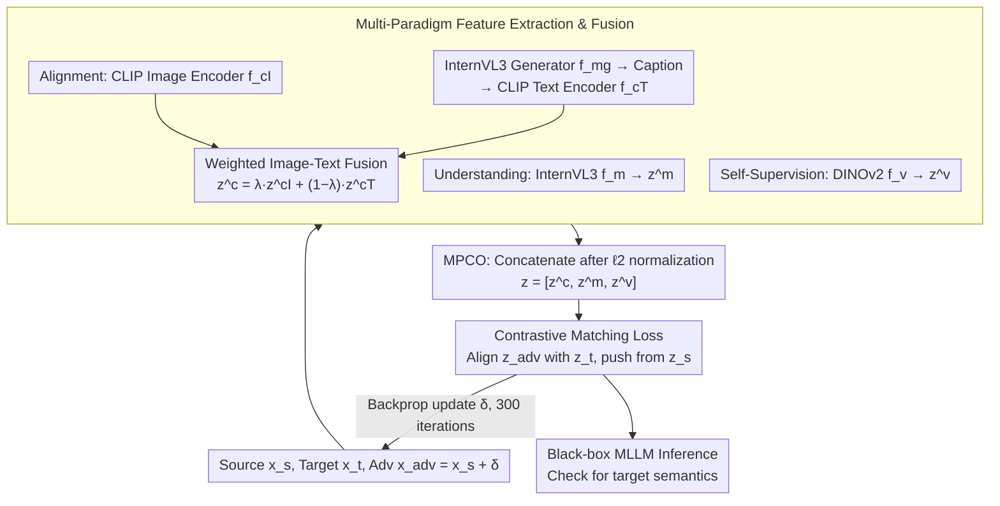

# Multi-Paradigm Collaborative Adversarial Attack Against Multi-Modal Large Language Models

**Conference**: CVPR 2026  
**arXiv**: [2603.04846](https://arxiv.org/abs/2603.04846)  
**Code**: [LiYuanBoJNU/MPCAttack](https://github.com/LiYuanBoJNU/MPCAttack)  
**Area**: AI Security / Adversarial Attack  
**Keywords**: adversarial attack, MLLM, Transferability, Multi-Paradigm, Collaborative Optimization

## TL;DR

Proposes the MPCAttack framework, which integrates feature representations from three learning paradigms—cross-modal alignment, multi-modal understanding, and visual self-supervision. By employing a multi-paradigm collaborative optimization strategy to generate highly transferable adversarial samples, it achieves SOTA attack performance on both open-source and closed-source MLLMs.

## Background & Motivation

Multi-modal Large Language Models (MLLMs) face severe adversarial attack threats in safety-critical domains. Existing transferable adversarial attacks suffer from two core issues:

**Single-Paradigm Representation Constraint**: Existing methods (e.g., CoA, FOA-Attack) rely on surrogate models from a single learning paradigm (e.g., cross-modal alignment in CLIP) to generate adversarial samples. However, each paradigm captures only a subset of multi-modal semantics—cross-modal alignment focuses on modality matching, multi-modal understanding captures abstract semantic relationships, and visual self-supervision emphasizes low-level visual cues. Perturbations generated by a single paradigm tend to overfit its representation bias, leading to poor transferability.

**Independent Feature Optimization**: Current methods treat features from different surrogate models as independent optimization targets and aggregate them using simple fusion strategies. This approach ignores the semantic complementarity between different representation spaces and can produce redundant or even conflicting gradient directions, causing perturbation optimization to get trapped in local optima.

The **Key Insight** of this paper is: rather than relying on a single-paradigm surrogate model, it is better to jointly optimize features from cross-modal alignment, multi-modal understanding, and visual self-supervision within a unified space. This allows perturbations to simultaneously match three complementary semantic structures, covering a broader feature space and transferring better to unseen black-box models.

## Method

### Overall Architecture

MPCAttack operates straightforwardly: given a source image $x_s$, find an imperceptible perturbation $\delta$ such that the adversarial sample $x_{adv} = x_s + \delta$ is "read" by a black-box MLLM as the semantics of a target image $x_t$. The pipeline consists of two stages. In the generation phase, encoders from three paradigms extract features for the source, target, and current adversarial images. The Multi-Paradigm Collaborative Optimization (MPCO) strategy concatenates these features into a unified representation and iteratively optimizes $\delta$ using a contrastive matching loss on white-box surrogate models. In the inference phase, the optimized $x_{adv}$ is fed directly into unseen black-box MLLMs to evaluate if they describe the image as the target $x_t$.

Three surrogate models are used for complementary roles: CLIP (image encoder $f_{c_I}$ + text encoder $f_{c_T}$) for alignment semantics; InternVL3-1B ($f_m$, including text generator $f_{mg}$) for multi-modal understanding; and DINOv2 ($f_v$) for visual self-supervision.

### Key Designs

**1. Multi-Paradigm Feature Fusion: Incorporating Bi-modal Semantics into Alignment**

To address the issue where single paradigms overfit specific biases, the alignment branch does not merely use the CLIP image encoder. Instead, it utilizes the multi-modal understanding model $f_{mg}$ to generate a descriptive caption of the image, which is then encoded by the CLIP text encoder. The vision and text features are fused via weighted addition:

$$z_s^c = \lambda \cdot z_s^{c_I} + (1-\lambda) \cdot z_s^{c_T}$$

Setting $\lambda=0.6$ balances visual and semantic features. Ablation shows that $\lambda=1$ (vision only) reduces performance, indicating that high-level semantics in captions capture information missed by the visual encoder alone.

**2. Multi-Paradigm Collaborative Optimization (MPCO): Concatenation Over Averaging**

This is the core design addressing independent optimization and gradient redundancy. MPCO does not treat the three features as separate objectives. Instead, it applies $\ell_2$ normalization to each feature before concatenating them into a single long vector:

$$z_s = \left[\frac{z_s^c}{\|z_s^c\|_2},\ \frac{z_s^m}{\|z_s^m\|_2},\ \frac{z_s^v}{\|z_s^v\|_2}\right]$$

Optimization occurs in this unified space. Concatenation is preferred over weighted averaging because averaging blurs semantic structures, whereas concatenation preserves independent semantic subspaces, allowing the optimization to adaptively emphasize the most informative regions across paradigms.

**3. Contrastive Matching Loss: Global Alignment in Aggregated Space**

Using the unified features, the optimization goal is formulated as contrastive learning, pulling $z_{adv}$ toward the target $z_t$ and pushing it away from the source $z_s$:

$$\mathcal{L} = -\log \frac{\exp(\text{sim}(z_{adv}, z_t) / \omega \cdot \tau)}{\exp(\text{sim}(z_{adv}, z_t) / \tau) + \exp(\text{sim}(z_{adv}, z_s) / \tau)}$$

Where $\tau=0.2$ is the temperature coefficient and $\omega=2$ is the balance factor. This loss acts on the global representation, ensuring all three semantic types are optimized simultaneously in a single gradient direction, preventing conflicting updates.

### Loss & Training

- Adversarial Optimization: $\min_{\delta} \mathcal{L}(f(x_s+\delta), f(x_t))$, subject to $\|\delta\|_\infty \leq \epsilon$.
- Perturbation Budget: $\epsilon = 16/255$ ($\ell_\infty$ constraint).
- Attack Steps: $1/255$ step size, 300 iterations.
- Hardware: Executable on a single NVIDIA RTX 3090.
- Evaluation: Uses LLM-as-a-judge (GPTScore) with a 0.5 threshold for success.

## Key Experimental Results

### Main Results

Attack Success Rate (ASR %) on ImageNet for open and closed-source MLLMs:

| Method | Open-Targeted ASR | Open-Untargeted ASR | Closed-Targeted ASR | Closed-Untargeted ASR |
|------|------------------|--------------------|--------------------|---------------------|
| AnyAttack | 1.08 | 23.85 | 0.60 | 18.85 |
| CoA | 0.18 | 12.55 | 0.13 | 13.53 |
| M-Attack | 44.08 | 75.30 | 44.48 | 78.73 |
| FOA-Attack | 48.60 | 79.80 | 47.73 | 82.63 |
| **Ours (MPCAttack)** | **63.33** | **92.10** | **63.38** | **90.55** |

MPCAttack improves Targeted ASR by **+14.73%** (open) and **+15.65%** (closed) over the previous SOTA (FOA-Attack).

### Ablation Study

| Configuration | Targeted ASR (avg) | Untargeted ASR (avg) | Description |
|------|-------------------|---------------------|------|
| MPCAttack (Full) | 63.33 | 92.10 | Complete Framework |
| w/o Alignment | Largest Drop | Largest Drop | CLIP is the core of transferability |
| w/o MPCO | Significant Drop | Significant Drop | Collaborative optimization is vital |
| w/o Understanding | Moderate Drop | Moderate Drop | Semantic reasoning contributes |
| w/o Self-Supervision | Small Drop | Small Drop | Visual cues act as supplement |

### Key Findings

- **Alignment is the Cornerstone**: Removing CLIP causes the largest performance drop, as MLLM visual encoders are highly correlated with cross-modal alignment representations.
- **MPCO Effectiveness**: Global optimization is particularly effective on complex models like GLM-4.1V-9B-Thinking.
- **Textual Semantics Matter**: $\lambda=1$ (vision only) performs worse than $\lambda=0.6$, proving that vision alone cannot capture critical semantic information.
- **Closed-source Vulnerability**: MPCAttack reaches 88.0% Targeted ASR on GPT-5 and is effective across most models except Claude-3.5.
- **Claude-3.5 Robustness**: Targeted ASR is only 8.2%, likely due to unique architectural or training strategies.

## Highlights & Insights

1.  **Multi-Paradigm Perspective**: First to unify cross-modal alignment, multi-modal understanding, and visual self-supervision into a single adversarial framework.
2.  **Concatenation over Averaging**: Proves that preserving paradigm structure via concatenation is superior to blurring them via weighted averaging.
3.  **Joint Vision-Language Semantics**: Cleverly utilizes MLLM-generated captions encoded by CLIP to introduce additional linguistic semantics.
4.  **Comprehensive Evaluation**: Covers 8 victim models, 3 datasets, and both targeted and untargeted scenarios.

## Limitations & Future Work

1.  **Computational Overhead**: Requires running three paradigm encoders for 300 iterations, making it less efficient than single-paradigm methods.
2.  **Claude-3.5 Resistance**: Low Targeted ASR (8.2%) highlights a bottleneck for certain models.
3.  **LLM-Dependency**: Relying on GPTScore for evaluation may introduce assessment bias.
4.  **Defense Analysis**: The impact of adversarial training or input purification on MPCAttack was not analyzed.
5.  **Modal Limitation**: Currently limited to image-side perturbations; joint text-side perturbations remain unexplored.

## Related Work & Insights

- **AttackVLM**: Alignment attack based on CLIP alone; MPCAttack addresses its feature diversity limitations via multiple paradigms.
- **FOA-Attack**: Uses feature optimal alignment and dynamic ensemble, but relies on independent optimization.
- **AnyAttack**: Unsupervised targeted attack via self-supervision, which fails significantly on MLLMs (ASR ~1%).
- **Insight**: Adversarial transferability fundamentally depends on feature space coverage; multi-paradigm collaboration significantly expands the adversarial search space.

## Rating

- **Novelty**: ⭐⭐⭐⭐ Innovative multi-paradigm framework; effective concatenation and contrastive matching strategies.
- **Experimental Thoroughness**: ⭐⭐⭐⭐⭐ Extensive testing across 8 models and multiple datasets with full ablation.
- **Writing Quality**: ⭐⭐⭐⭐ Clear diagrams and comprehensive comparisons, though method descriptions are slightly long.
- **Value**: ⭐⭐⭐⭐ Reveals adversarial vulnerabilities in MLLMs and provides a strong tool for safety evaluation.

<!-- RELATED:START -->

## Related Papers

- [\[CVPR 2026\] Towards Robust Multimodal Large Language Models Against Jailbreak Attacks](towards_robust_multimodal_large_language_models_against_jailbreak_attacks.md)
- [\[ICLR 2026\] Co-LoRA: Collaborative Model Personalization on Heterogeneous Multi-Modal Clients](../../ICLR2026/ai_safety/co-lora_collaborative_model_personalization_on_heterogeneous_multi-modal_clients.md)
- [\[CVPR 2026\] PureProof: Diffusion-Resistant Black-box Targeted Attack on Large Vision-Language Models](pureproof_diffusion-resistant_black-box_targeted_attack_on_large_vision-language.md)
- [\[CVPR 2026\] Generative Adversarial Perturbations with Cross-paradigm Transferability on Localized Crowd Counting](generative_adversarial_perturbations_with_cross-paradigm_transferability_on_loca.md)
- [\[CVPR 2026\] Transform to Transfer: Boosting Adversarial Attack Transferability on Vision-Language Pre-training Models](transform_to_transfer_boosting_adversarial_attack_transferability_on_vision-lang.md)

<!-- RELATED:END -->
