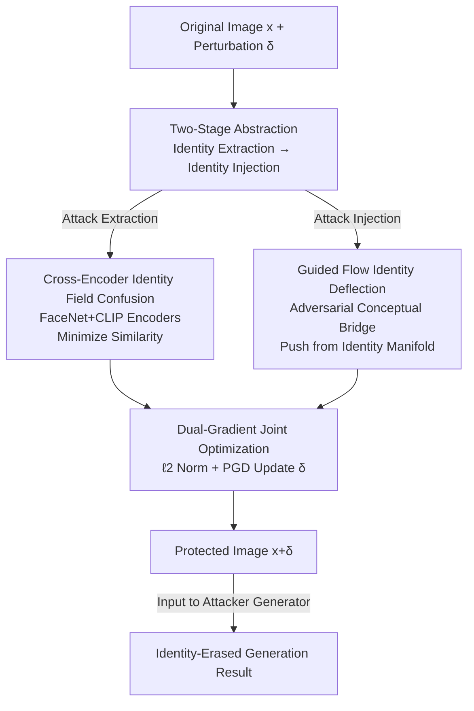

# No Way To Steal My Face: Proactive Defense Against Identity-Preserving Personalized Generation

**Conference**: CVPR 2026  
**Paper**: [CVF Open Access](https://openaccess.thecvf.com/content/CVPR2026/html/Xiong_No_Way_To_Steal_My_Face_Proactive_Defense_Against_Identity-Preserving_CVPR_2026_paper.html)  
**Area**: AI Security / Privacy Protection / Diffusion Model Adversarial Defense  
**Keywords**: Facial Privacy, Proactive Defense, Personalized Generation, Adversarial Perturbation, Diffusion Models

## TL;DR
To address the misuse of "identity-preserving personalized generation" in diffusion models for face theft, this paper proposes IDGuardian. It abstracts the personalization process into two stages: "identity extraction" and "identity injection." By simultaneously disrupting both stages through cross-encoder identity field confusion and guided flow identity deflection, it achieves the first universal, model-agnostic facial identity protection effective against both **training-based** and **training-free** personalization methods.

## Background & Motivation

**Background**: Diffusion models have made "identity-preserving personalized generation" extremely powerful. By providing a single reference face image, these models can generate high-fidelity images in various scenes while accurately preserving the target's identity. These methods are categorized into two paradigms: **training-based** (e.g., DreamBooth, LoRA, Textual Inversion), which fine-tunes the diffusion model on a few user images with high fidelity but high computational cost; and **training-free** (e.g., PhotoMaker, IP-Adapter, InstantID, Infinite-ID), which uses pre-trained identity encoders for zero-shot extraction and injection into the diffusion process, becoming mainstream due to their speed and ease of deployment.

**Limitations of Prior Work**: This capability has become a privacy nightmare, as public social media photos can be scraped to synthesize convincing fake content without consent. Existing proactive defenses (e.g., Anti-DreamBooth, AdvDM, SimAC, ACE) primarily treat **training-based personalization as a proxy task** to optimize perturbations that interfere with the fine-tuning process. However, this paper finds that these defenses suffer a **severe performance drop** when applied to training-free scenarios.

**Key Challenge**: This failure stems from two paradigm gaps. First, **Pipeline Discrepancy**: training-based methods "internalize" identity into model weights, while training-free methods "inject" identity embeddings directly without modifying parameters. Second, **Fusion Diversity**: training-free pipelines utilize various encoder architectures and fusion strategies (Direct Stack, Cross-Attention, Mixed Attention, Self-Attention), making perturbations tailored to one pipeline ineffective for others.

**Goal**: To develop a universal facial protection perturbation that is effective against **both** training-based and training-free methods without depending on specific encoders or architectures.

**Key Insight**: The authors move beyond targeting specific personalization methods and identify the **minimal common structure** shared by all such methods. Regardless of the implementation, identity preservation involves two essential steps: first, **extracting** the identity from the reference image, and second, **injecting** it into the generation process. Disrupting both steps ensures cross-paradigm defense.

**Core Idea**: The personalization process is abstracted into an "identity extraction + identity injection" two-stage framework. A single adversarial perturbation is used to strike both stages—distorting the extracted identity in the feature space while deflecting the generation trajectory away from the true identity manifold.

## Method

### Overall Architecture
IDGuardian is an imperceptible adversarial perturbation $\delta$ added to the original image. It is based on the observation that any personalization pipeline must follow the "identity extraction (encoding features) → identity injection (fusing features into denoising)" sequence. Defense is achieved by: 1) using **cross-encoder identity field confusion** to make extracted features dissimilar to the original identity, and 2) using **guided flow identity deflection** to push the diffusion sampling trajectory away from the clean identity manifold. Both paths contribute gradients, which are merged via **dual-gradient joint optimization** using PGD to generate the final perturbation $\delta$, constrained by $\|\delta\|_\infty<\epsilon$.

The threat model involves three parties: the identity owner (victim), the generation user (attacker), and the defender (deployed by the victim). The defender operates under a **restricted access** setting—knowing the perturbation budget but not the specific generation method used by the attacker. The optimization objective is formulated as:

$$\min_{\delta}\ \mathrm{SIM}\big(\mathrm{ID}(x),\ \mathrm{ID}(G(x+\delta))\big)\quad \text{s.t.}\ \|\delta\|_\infty<\epsilon,$$

where $\mathrm{ID}(\cdot)$ is an identity feature extractor, $\mathrm{SIM}(\cdot,\cdot)$ quantifies identity similarity, and $G(\cdot)$ is an arbitrary identity-preserving generator.

### Key Designs

**1. Cross-Encoder Identity Field Confusion: Making the "extracted face" no longer the target**

This step targets the "identity extraction" stage. Since training-free pipelines rely on external identity encoders, the defense distorts features directly in the embedding space. To improve robustness and avoid overfitting to a specific domain, the authors minimize identity similarity across two **complementary** encoders: FaceNet (capturing geometric/local features) and CLIP (capturing high-level semantic identity). The identity loss is the sum of their cosine similarities:

$$L_{ID}=L_{FaceNet}+L_{CLIP},\quad L_{*}=\cos\big(f_{*}(x),\ f_{*}(x+\delta)\big),$$

Minimizing this forces $x+\delta$ to "deviate" from the original identity in both feature spaces, ensuring that any downstream fusion strategy receives contaminated identity information.

**2. Guided Flow Identity Deflection: Using an "Adversarial Conceptual Bridge" to derail denoising**

To strengthen the defense, this step targets the "identity injection" stage. Identity-preserving personalization is reinterpreted as a **conceptual bridge** in diffusion. Diffusion models push noise toward high-likelihood regions using the score function $\nabla_{x_t}\log p_\theta(x_t)\approx -\tfrac{1}{\sqrt{1-\bar\alpha_t}}\,\epsilon_\theta(x_t,t)$. Under conditional generation, the direction brought by identity condition $y$ can be approximated by the difference between two noise predictions:

$$\nabla_{x_t}\log p(y\mid x_t)\approx -\tfrac{1}{\sqrt{1-\bar\alpha_t}}\big(\epsilon_\theta(x_t,t,y)-\epsilon_\theta(x_t,t,\varnothing)\big),$$

This displacement from the unconditional distribution to the target identity distribution is the conceptual bridge. The authors construct an **adversarial conceptual bridge** $S^*$ using the difference between the gradients of an adversarial identity $y_{adv}$ (extracted from the protected image) and the clean identity $y_{clean}$:

$$S^*=\nabla_{x_t}\log p(y_{adv}\mid x_t)-\nabla_{x_t}\log p(y_{clean}\mid x_t)\approx -\tfrac{1}{\sqrt{1-\bar\alpha_t}}\big(\epsilon_\theta(x_t,t,y_{adv})-\epsilon_\theta(x_t,t,y_{clean})\big).$$

This **explicitly models the displacement between the two distributions**, providing more stable optimization than unilateral guidance. The adversarial bridge pushes the denoising trajectory toward a low-likelihood region for $y_{clean}$.

**3. Dual-Gradient Joint Optimization: Merging two adversarial paths into one perturbation**

The identity loss gradient $\nabla_\delta L_{ID}$ exists in the pixel domain, while the adversarial conceptual bridge $S^*$ is calculated in the latent score domain. $S^*$ is upsampled and channel-aligned to the pixel domain ($S^*_{up}$). Both gradients are $\ell_2$-normalized to balance their contributions:

$$\text{total\_grad}\leftarrow \frac{\nabla_\delta L_{ID}}{\|\nabla_\delta L_{ID}\|_2}-\frac{S^*_{up}}{\|S^*_{up}\|_2},$$

The perturbation is updated via PGD: $\delta\leftarrow\delta-\alpha\cdot\mathrm{sign}(\text{total\_grad})$, with $\|\delta\|_\infty$ clipped at $\epsilon=8/255$. This image-specific, training-free optimization is lightweight and universal.

### Loss & Training
The surrogate model is IP-Adapter SDXL Plus Face. PGD uses the prompt "A photo of a person," $\epsilon=8/255$, learning rate $\alpha=0.005$, and up to 200 iterations. Experiments were conducted on an RTX A6000 (48G). Optimization on a single white-box SDXL model transfers effectively to unseen black-box pipelines.

## Key Experimental Results

Evaluations were performed on VGGFace2 and CelebA-HQ. Metrics include **ISM↓** (average identity similarity of ArcFace/FaceNet/VGG-Face), **Visual Quality** (PSNR/SSIM), and **Recognition Usability** (FaceQNet/MagFace). Comparisons were made against 5 defenses across 7 personalization pipelines (DreamBooth, IP-Adapter, PhotoMaker, etc.) and multiple base models (SD 1.5, SDXL, FLUX).

### Main Results (Identity Protection, ISM↓)

| Method | IP-Adapter | IP-Ada+XL | Blip-Diffu | InfiniteID | DreamBooth | InfiniteYou |
|------|-----------|-----------|-----------|-----------|-----------|------------|
| Unprotected | 0.382 | 0.582 | 0.336 | 0.675 | 0.525 | 0.673 |
| Anti-DreamBooth | 0.307 | 0.548 | 0.271 | 0.620 | 0.433 | 0.594 |
| AdvDM | 0.286 | 0.398 | 0.260 | 0.542 | 0.337 | 0.563 |
| IDProtector | 0.291 | 0.425 | 0.263 | 0.603 | 0.402 | 0.541 |
| **IDGuardian** | **0.036** | **0.126** | **0.220** | **0.444** | **0.336** | **0.301** |

IDGuardian achieves the lowest identity similarity across all pipelines, demonstrating cross-paradigm effectiveness.

### Ablation Study (ISM↓)

| Configuration | IP-Adapter | IP-Ada+XL | InfiniteYou | Description |
|------|-----------|-----------|------------|------|
| CLIP only | 0.243 | 0.217 | 0.531 | Single encoder identity loss |
| FaceNet only | 0.246 | 0.222 | 0.531 | Single encoder identity loss |
| CLIP+FaceNet | 0.175 | 0.167 | 0.477 | Dual-encoder confusion |
| Only $G_{adv}$ | 0.044 | 0.144 | 0.307 | Unilateral adversarial guidance |
| **Full Model** | **0.036** | **0.126** | **0.301** | Dual-encoder + Conceptual Bridge |

### Key Findings
- **Both stages are essential**: While cross-encoder confusion (CLIP+FaceNet) reduces ISM, identity injection disruption (Adversarial Conceptual Bridge) is the key to pushing the defense to "unrecognizable" levels.
- **Dual-encoder outperforms single-encoder**: The combination of semantic (CLIP) and local (FaceNet) features is harder to bypass.
- **Robustness**: IDGuardian maintains low ISM against JPEG compression, Gaussian blur, and specialized adaptive attacks like Impress.
- **Black-box Transfer**: Perturbations optimized on SDXL transfer to unknown pipelines (FLUX) and commercial APIs (Kling-AI, Qwen-Image).

## Highlights & Insights
- **Abstracting common structures**: Instead of chasing every new personalization method, the authors target the "extraction + injection" backbone. This makes the defense naturally cross-paradigm.
- **Identity as a Conceptual Bridge**: Reinterpreting identity conditions as directional shifts in the score function allows for precise counter-displacement, which is more effective than generic noise.
- **Difference over Unilateral Optimization**: Explicitly modeling the displacement between two distributions is more stable for optimization than simply trying to "flee" one distribution.

## Limitations & Future Work
- **Surrogate dependency**: Guided flow deflection relies on a white-box diffusion backbone; while it transfers well, extreme differences in injection mechanisms might reduce effectiveness.
- **Invisibility vs. Strength**: The budget of $\epsilon=8/255$ is a compromise; lower budgets may not provide sufficient protection for high-resolution images.
- **Adaptive Attacks**: While tested against Impress, long-term robustness against specifically designed "defense-aware" attackers remains to be explored.

## Related Work & Insights
- **vs. Anti-DreamBooth / AdvDM**: These focus on fine-tuning processes and fail against training-free pipelines due to paradigm gaps.
- **vs. IDProtector**: IDProtector relies on complex multi-encoder feature alignment and specific model architectures; IDGuardian is image-specific, model-agnostic, and much faster.
- **vs. Conceptual Bridge**: While original works use bridges for generation, this paper utilizes an **adversarial** bridge to destroy identity preservation, turning a generative tool into a defensive weapon.

## Rating
- **Novelty**: ⭐⭐⭐⭐⭐ First universal, model-agnostic defense for both personalization paradigms.
- **Experimental Thoroughness**: ⭐⭐⭐⭐⭐ Extensive testing across 7 pipelines, multiple datasets, and commercial APIs.
- **Writing Quality**: ⭐⭐⭐⭐ Clear motivation and mathematical derivation of the score function and conceptual bridge.
- **Value**: ⭐⭐⭐⭐⭐ Directly addresses face theft privacy concerns with a lightweight, practical solution.

<!-- RELATED:START -->

## Related Papers

- [\[CVPR 2026\] DeepProtect: Proactive Face-Swapping Defense using Identity Blending and Attribute Distortion](deepprotect_proactive_face-swapping_defense_using_identity_blending_and_attribut.md)
- [\[CVPR 2026\] Bridging Privacy and Provenance: Traceable Virtual Identity Generation](bridging_privacy_and_provenance_traceable_virtual_identity_generation.md)
- [\[CVPR 2026\] Reinforcement-Guided Synthetic Data Generation for Privacy-Sensitive Identity Recognition](reinforcement-guided_synthetic_data_generation_for_privacy-sensitive_identity_re.md)
- [\[CVPR 2026\] UniDef: Universal Defense Against Unauthorized Image Manipulation](unidef_universal_defense_against_unauthorized_image_manipulation.md)
- [\[CVPR 2026\] GROW: Watermark Generation with Progressive Guidance for Diffusion Models](grow_watermark_generation_with_progressive_guidance_for_diffusion_models.md)

<!-- RELATED:END -->
