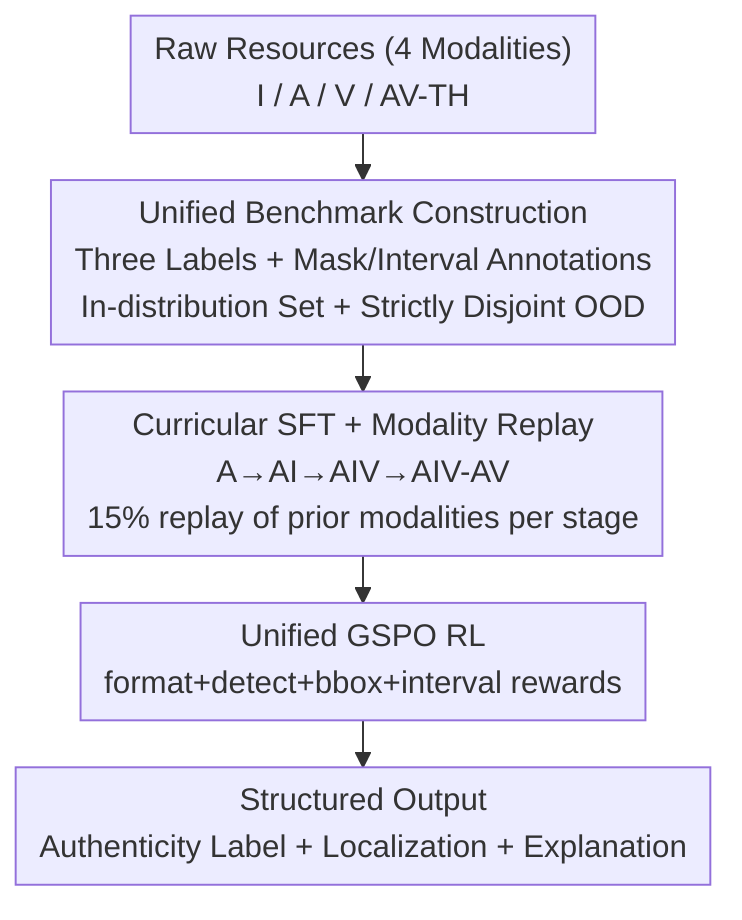

# Omni-Fake: Benchmarking Unified Multimodal Social Media Deepfake Detection

**Conference**: CVPR 2026  
**arXiv**: [2605.01638](https://arxiv.org/abs/2605.01638)  
**Code**: [Project Page](https://tianxiao1201.github.io/omni-fake-project-page/)  
**Area**: AI Security / Deepfake Detection / Multimodal  
**Keywords**: deepfake detection, multimodal benchmark, OOD generalization, detect-locate-explain, reinforcement learning

## TL;DR
This paper constructs Omni-Fake, the first social media deepfake benchmark covering four modalities (Image, Audio, Video, Audio-Visual Talking Head) with over 1 million training samples and 200,000+ strictly disjoint OOD samples, unified under "Detect-Locate-Explain" annotations. It also presents Omni-Fake-R1, a unified detector based on Qwen2.5-Omni-7B trained with "Curricular SFT + GSPO Reinforcement Learning," which outperforms single-modality SOTAs in detection, localization, explanation, and cross-generator generalization across all four modalities.

## Background & Motivation
**Background**: Generative AI (Sora, Kling, WanX, etc.) can now produce near-photorealistic videos with synchronized audio. Social media feeds are increasingly filled with forged content across image, audio, video, and talking head formats. However, most existing deepfake detection datasets and methods remain stuck in the old paradigm of single-modality, face-swapping, and binary "real/fake" classification.

**Limitations of Prior Work**: The authors identify three specific deficiencies. First, **benchmarks lag behind the real world**—mainstream datasets use simplified generation pipelines and outdated synthesis models, failing to cover recent generators, multi-platform formats, or multi-round adversarial attacks. They rarely provide strict multimodal OOD evaluation protocols, causing models to learn superficial artifacts that fail on new generators. Second, **unified multimodal modeling is absent**—most detectors are trained separately on single or paired modalities, lacking a framework to handle both unimodal and multimodal inputs simultaneously, leading to fragile cross-modal reasoning and inconsistent outputs across platforms. Third, **the decision process is opaque**—mainstream methods output binary labels without revealing forged regions, cross-modal inconsistencies, or reasoning. Detection, localization, and explanation are handled by independent modules, lacking consistency checks across spatial, temporal, and semantic dimensions, which limits their value for content moderation and forensics.

**Key Challenge**: Real-world social media forgeries are "multimodal + multi-generator + heavily post-processed," whereas current benchmarks are "unimodal + few generators + clean distribution." There is a systemic distribution gap. Furthermore, detection, localization, and explanation are artificially fragmented, lacking a unified model that answers "whether it is fake, where it is fake, and why it is fake" simultaneously.

**Goal**: The problem is bifurcated into two sub-problems: (1) creating a unified multimodal benchmark to realistically measure real-world robustness and cross-modal generalization; and (2) training a unified detector for end-to-end joint detection-localization-explanation.

**Key Insight**: By mapping all four modalities to the **same label space and the same "Detect-Locate-Explain" annotation protocol**, and intentionally carving out an OOD split where generators, speakers, content, and post-processing pipelines are entirely disjoint from the training set, "generalization to unseen generators" becomes a measurable metric. On the model side, the shared semantic space of a unified multimodal LLM (Qwen2.5-Omni) is leveraged to make the model rely on semantic and cross-modal inconsistencies rather than generator-specific artifacts.

**Core Idea**: Replace fragmented unimodal binary benchmarks with a "Unified Four-Modality Benchmark + Disjoint OOD Split + Detect-Locate-Explain Protocol." Train an MLLM into a cross-modal consistent and interpretable unified detector using "Curricular Modality Replay SFT + GSPO RL with Structured Rewards."

## Method

### Overall Architecture
Omni-Fake consists of two parts: the **Benchmark** (Omni-Fake-Set for in-distribution + Omni-Fake-OOD for out-of-distribution) and the **Unified Detector** Omni-Fake-R1. For the benchmark, data across four modalities (Image I, Audio A, General Video V, Audio-Visual Talking Head AV-TH) is unified under three labels (REAL / TAMPERED / FULL_SYNTHETIC; talking heads use binary real/full_synthetic). It provides pixel-level masks and temporal interval annotations to enable joint evaluation. The OOD split ensures that generator families, speakers, content, and post-processing pipelines are **strictly disjoint** from the training set. For the model, Omni-Fake-R1 uses Qwen2.5-Omni-7B as the backbone to produce a **structured triplet** for any input: a global fraud label, spatial or temporal localization, and a natural language explanation. Training involves two stages: Curricular Modality Replay SFT to learn shared representations and output formats, followed by Unified GSPO RL to directly align with "Detect-Locate-Explain" metrics.

### Key Designs

**1. Omni-Fake Benchmark Construction: Unified Labels + Strictly Disjoint OOD Split**

This addresses the "benchmarks lag behind real world" pain point. Omni-Fake-Set contains 790k+ images, 210k+ videos, 120k+ audio samples, and 15k+ talking heads from 30+ generation methods. Omni-Fake-OOD contains 100k images, 3k videos, 100k audio samples, and 8k talking heads. The key is that the two splits are **completely disjoint in underlying content, speakers, data distribution, tampering pipelines, and generator families**. For instance, the image Set uses FLUX.1-dev/Kandinsky3/StyleGAN3, while OOD uses GPT-4o/Ideogram3.0/Nano Banana. This turns "unseen generator detection" into a quantifiable generalization experiment rather than relying on high scores from i.i.d. test sets.

**2. Unified Detect-Locate-Explain Protocol: Consolidating Fragmented Tasks**

To solve the "opaque decision process," Omni-Fake binds three tasks into a single annotation: pixel-level masks for image/video tampering (derivable to bboxes), temporal intervals for audio/video forgeries, and a requirement for the model to output a structured triplet of "label + localization + reasoning." Since talking heads are most relevant to impersonation and fraud, they focus on identity-driven and lip-driven generation; partially edited talking heads are categorized under general video for fine-grained spatio-temporal localization.

**3. Curricular SFT + Modality Replay: Sequential Unlocking with Anti-Forgetting**

To prevent larger modalities from overwhelming earlier learned skills, a **four-stage curriculum** is used: Audio → Image → Video → Talking Head (A → AI → AIV → AIV-AV). Each stage trains on the new modality's full set mixed with a **15% replay subset from all previously seen modalities**. This prevents catastrophic forgetting and allows newly added modalities to reuse earlier learned shared representations. Ablations show that 10–15% is the optimal replay ratio.

**4. Unified GSPO RL with Structured Rewards: Direct Alignment with Task Metrics**

A stage of Unified Group Sequence Policy Optimization (GSPO) is added atop the SFT checkpoint. For each input, multiple responses are sampled and scored with a "Detect-Locate-Explain" reward. The policy is updated using relative intra-group advantage with a KL penalty:

$$J_{\text{GSPO}}(\theta)=\mathbb{E}_{x,\{y_i\}}\left[\frac{1}{G}\sum_{i=1}^{G}\frac{1}{|y_i|}\sum_{t=1}^{|y_i|}\min\big(s_{i,t}(\theta)\hat{A}_{i,t},\ \mathrm{clip}(s_{i,t}(\theta),1-\epsilon,1+\epsilon)\hat{A}_{i,t}\big)\right]$$

The reward is a weighted sum of four components:
$$r(x,y)=\lambda_{\mathrm{fmt}}r_{\mathrm{fmt}}+\lambda_{\mathrm{acc}}r_{\mathrm{acc}}+\lambda_{\mathrm{bbox}}r_{\mathrm{bbox}}+\lambda_{\mathrm{int}}r_{\mathrm{int}}$$
- **Format Reward ($r_{\mathrm{fmt}}$)**: Ensures the presence of `<think>` and `<answer>` tags and parsable labels/boxes.
- **Detection Reward ($r_{\mathrm{acc}}$)**: Gives higher rewards for correctly identifying TAMPERED samples (usually harder) vs. REAL/FULL_SYNTHETIC to prevent simple-class dominance.
- **Spatial/Temporal Rewards ($r_{\mathrm{bbox}}$, $r_{\mathrm{int}}$)**: Use IoU for tampered samples; for Real/Full samples, a reward is given only if no box/interval is output, suppressing false alarms.

## Key Experimental Results

### Main Results (Omni-Fake-Set Validation)

| Modality | Method | Detect Acc | Detect F1 | Locate IoU | Locate F1 |
|------|------|---------|---------|---------|---------|
| Image | SIDA | 89.88 | 88.15 | 46.27 | **56.10** |
| Image | **Omni-Fake-R1** | **91.92** | **90.58** | **47.06** | 51.63 |
| Video | DeMamba | 84.22 | 82.19 | – | – |
| Video | **Omni-Fake-R1** | **89.84** | **88.29** | **40.63** | **43.35** |
| Audio | SafeEar | 81.62 | 79.27 | – | – |
| Audio | **Omni-Fake-R1** | **92.13** | **90.47** | **45.92** | **47.58** |
| AV-TH | **Omni-Fake-R1** | **96.18** | **95.54** | – | – |

### Key Findings
- **Mixed SFT is suboptimal**: Training all modalities simultaneously leads to modal imbalance (Audio Acc drops to 71.96 vs. 79.73 in single-modality SFT), confirming the necessity of the curriculum.
- **GSPO RL refines explanations**: Adding GSPO atop Curricular SFT primarily improves reasoning quality (CSS) and localization precision, whereas RL-only training fails, indicating RL requires a strong SFT foundation.
- **Strict OOD Generalization**: While all models degrade on Omni-Fake-OOD, Omni-Fake-R1 remains the most stable, particularly in the AV modality, suggesting that the unified protocol encourages reliance on cross-modal semantic consistency.

## Highlights & Insights
- **Strict OOD Design**: Disjoining generators and post-processing is the most rigorous aspect of this benchmark, providing a true measure of real-world generalization.
- **Consistent Constraints**: Binding the three tasks ensures self-consistency across spatial, temporal, and semantic dimensions, which is more reliable than independent modules.
- **Weighted Detection Reward**: Assigning higher rewards to the "Tampered" class effectively counters the common issue of models being dominated by "easier" classes during optimization.

## Limitations & Future Work
- **Granularity**: Talking heads are currently binary; fine-grained localized tampering for talking heads is not yet fully covered.
- **Inference Cost**: Omni-Fake-R1 is based on a 7B model; investigation into smaller, distilled versions is needed for real-time deployment on social platforms.
- **Base Model Evolution**: The OOD set reflects generators up to 2026; the benchmark must be a "living" entity to remain challenging against future models.

## Related Work & Insights
- **vs SIDA/So-Fake**: Expands from image-only to four modalities with strict OOD protocols.
- **vs LOKI**: Moves from a small evaluation-only suite to a million-scale training-ready corpus with pixel/temporal annotations.
- **vs Traditional Detectors**: Replaces generator-specific artifact detection with semantic and cross-modal inconsistency reasoning via MLLMs.

## Rating
- Novelty: ⭐⭐⭐⭐⭐ 
- Experimental Thoroughness: ⭐⭐⭐⭐⭐ 
- Writing Quality: ⭐⭐⭐⭐ 
- Value: ⭐⭐⭐⭐⭐ 

<!-- RELATED:START -->

## Related Papers

- [\[CVPR 2026\] FVBench: Benchmarking Deepfake Video Detection Capability of Large Multimodal Models](fvbench_benchmarking_deepfake_video_detection_capability_of_large_multimodal_mod.md)
- [\[CVPR 2026\] UniGame: Turning a Unified Multimodal Model Into Its Own Adversary](unigame_turning_a_unified_multimodal_model_into_its_own_adversary.md)
- [\[CVPR 2026\] DFD-HR: Generalizable Deepfake Detection via Hierarchical Routing Learning](dfd-hr_generalizable_deepfake_detection_via_hierarchical_routing_learning.md)
- [\[CVPR 2026\] Tutor-Student Reinforcement Learning: A Dynamic Curriculum for Robust Deepfake Detection](tutor-student_reinforcement_learning_a_dynamic_curriculum_for_robust_deepfake_de.md)
- [\[CVPR 2026\] DeepfakeImpact: A Two-Stage Benchmark with Real-World Impact in Deepfake Detection](deepfakeimpact_a_two-stage_benchmark_with_real-world_impact_in_deepfake_detectio.md)

<!-- RELATED:END -->
