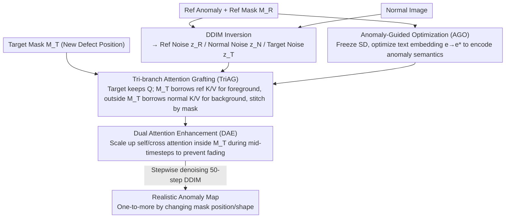

# One-to-More: High-Fidelity Training-Free Anomaly Generation with Attention Control

**Conference**: CVPR 2026  
**arXiv**: [2603.18093](https://arxiv.org/abs/2603.18093)  
**Code**: None  
**Area**: AI Security / Anomaly Detection  
**Keywords**: Anomaly Generation, Training-free/Fine-tuning-free, Self-Attention Grafting, Diffusion Models, Industrial Anomaly Detection

## TL;DR

O2MAG proposes a training-free few-shot anomaly generation method that synthesizes realistic anomalies from a single reference image via Tri-branch Attention Grafting (TriAG). Combined with Anomaly-Guided Optimization (AGO) to align text semantics and Dual Attention Enhancement (DAE) to ensure complete mask filling, it significantly outperforms existing methods in downstream MVTec-AD anomaly detection tasks.

## Background & Motivation

1. **Background**: Industrial anomaly detection faces data imbalance—sufficient normal images but scarce anomaly data. Existing synthesis methods include training-based (DreamBooth fine-tuning, Textual Inversion) and training-free methods.
2. **Limitations of Prior Work**: Training-based methods incur high computational and storage costs and are prone to overfitting in few-shot scenarios. The only training-free method, AnomalyAny, only manipulates cross-attention, failing to precisely control anomaly semantics and spatial layout, resulting in unrealistic generation.
3. **Key Challenge**: Industrial defects are extremely rare in Stable Diffusion training data. Simple text prompts cannot accurately describe defect semantics, leading to generation results that deviate from real anomaly distributions.
4. **Goal**: Utilize the inherent priors of diffusion models to synthesize diverse and realistic anomalies from a single reference anomaly image without training.
5. **Key Insight**: PCA analysis of self-attention maps reveals that anomaly foregrounds and normal backgrounds are naturally separated in the attention space. Information can be transferred across branches by manipulating K/V in self-attention.
6. **Core Idea**: Tri-branch parallel diffusion + mask-guided self-attention grafting, harvesting foreground defect features from the reference anomaly branch and background features from the normal branch.

## Method

### Overall Architecture

O2MAG focuses on a specific task: given only one reference anomaly image with its mask and some normal images, synthesize numerous realistic industrial defects at varied positions and shapes to train downstream detectors without parameter updates. The mechanism involves three simultaneous diffusion trajectories: the Reference Anomaly branch (DDIM inversion of the reference), the Normal Image branch (inversion of a clean image), and the Target Anomaly branch (starting from normal noise to generate new images). These branches share a frozen SD model. In each denoising step, the target branch "borrows" foreground defect features from the reference branch and background features from the normal branch, determined by masks. Additionally, AGO calibrates text embeddings toward "anomaly semantics" before inference, and DAE boosts attention in mask regions during denoising to prevent defects from fading.

### Key Designs

**1. Tri-branch Attention Grafting (TriAG): Stitching defects via "Question and Answer"**

The primary challenge is transferring visual features of a defect from a reference image to a target location without destroying the target's normal background. TriAG treats self-attention Q and K/V separately: Q represents "what the target image is asking," and K/V represents "where to find the answers." The target branch maintains its own Q but replaces K/V sources: inside target mask $M_T$, K/V are taken from the reference anomaly branch (querying only the reference mask $M_R$ region); outside $M_T$, K/V are taken from the normal branch (querying background). The outputs are stitched:

$$\text{Attn}^*_{T} = M_T \odot \text{Attn}_{fg} + (1-M_T) \odot \text{Attn}_{bg}$$

This allows the target image to query "informants"—the reference for defects and the normal image for background—creating a realistic composite. This works because PCA visualization shows that anomaly foregrounds and normal backgrounds are naturally separated in SD's attention space.

**2. Anomaly-Guided Optimization (AGO): Shifting embeddings to "Anomaly Semantics"**

Grafting alone is insufficient because generation requires text prompts. Since SD rarely sees industrial defects, prompts like "a photo of cable with bent wire" fail to capture true appearance. AGO freezes the diffusion model and treats the text embedding $\mathbf{e}$ as a learnable variable, optimizing it via reconstruction loss on the reference anomaly image:

$$\mathbf{e}^* = \arg\min_{\mathbf{e}} \mathbb{E}\big[\|\epsilon - \epsilon_\theta(x_t, t, \mathbf{e})\|^2\big]$$

Optimized for 500 steps using Adam ($3 \times 10^{-3}$). This data-driven approach creates a text anchor matching real defect appearances, which is particularly beneficial for classification tasks.

**3. Dual Attention Enhancement (DAE): Preventing "Wash-out" of small defects**

Small defects are often treated as noise and smoothed out during denoising. DAE addresses this by actively scaling up self-attention and cross-attention weights within the mask region at specific timesteps. This forces the model to "pay more attention" to the defect area, ensuring the anomaly fully fills the mask region without fading. This is a training-free inference-time "reinforcement" for TriAG.

### Example: Generating a "Bent Wire" on a Cable

Using a normal cable image and a reference "bent wire" anomaly image:

1. **Noise Preparation**: $z_R$ and $z_N$ are obtained via DDIM inversion; target branch starts from normal noise $z_T$.
2. **AGO Warm-up**: Optimize text embedding $\mathbf{e}$ for 500 steps to obtain $\mathbf{e}^*$ encoding "bent wire" features.
3. **Stepwise Denoising + Grafting**: Target branch keeps its Q. Inside $M_T$, it borrows K/V from the reference branch (looking at bent wire features); outside $M_T$, it borrows K/V from the normal branch.
4. **DAE Reinforcement**: Scale attention inside $M_T$ during middle timesteps to ensure the bent wire is fully generated.
5. **Output**: A realistic anomaly map with the bent wire at a new position while preserving the original clean background.

### Loss & Training

The entire pipeline requires no training of network parameters. The only optimization is the lightweight AGO on text embeddings (500 steps, Adam, LR $3 \times 10^{-3}$). Generation uses 50-step DDIM sampling on SD v1.5. TriAG and DAE are direct manipulations of attention during inference.

## Key Experimental Results

### Main Results

| Method | AP-I (Detection)↑ | AUC-P (Localization)↑ | F1-P (Localization)↑ | Accuracy (Classification)↑ |
|------|------------|-------------|------------|----------------|
| DFMGAN | 93.5 | 86.7 | 59.2 | - |
| AnomalyDiffusion | 99.3 | 98.9 | 78.2 | - |
| DualAnoDiff | 99.4 | 99.1 | 82.6 | 78.5 |
| SeaS | 99.3 | 98.7 | 79.1 | - |
| **O2MAG (Ours)** | **99.7** | **99.3** | **84.6** | **90.6** |

O2MAG leads across all metrics, with classification accuracy 12.1% higher than the best training-based method.

### Ablation Study

| Configuration | AP-I | F1-P | Description |
|------|------|------|------|
| Full O2MAG | 99.7 | 84.6 | Complete model |
| w/o AGO | 98.9 | 81.2 | Contribution of embedding optimization |
| w/o DAE | 99.3 | 82.4 | Contribution of attention enhancement |
| w/o TriAG Mask | 97.5 | 75.8 | Mask guidance is core |

### Key Findings

- Mask guidance in TriAG is the most critical component; without it, foreground/background confusion occurs.
- AGO significantly boosts classification performance (+12.1%), as accurate anomaly semantics are vital for category differentiation.
- A training-free method outperformed training-based methods for the first time in downstream anomaly detection, proving the strength of SD's self-attention priors.
- KID and IC-LPIPS metrics indicate superior generation quality and diversity for O2MAG.

## Highlights & Insights

- **Anomaly-Normal Separability in Self-Attention**: PCA visualization reveals that SD self-attention naturally encodes semantic separation of foreground and background, a finding applicable to other editing tasks.
- **Training-free Outperforming Training-based**: Demonstrates that well-designed attention manipulation can surpass fine-tuning methods, lowering the barrier for anomaly synthesis.
- **Tri-branch Parallel Design**: Achieves precise region-level control by separating anomaly sources, background sources, and the target.

## Limitations & Future Work

- AGO still requires 500 optimization steps, increasing inference latency.
- Reliance on predefined anomaly masks, which may be difficult to obtain in real-world scenarios.
- Limited generation effectiveness for extremely tiny defects.
- Future work could integrate segmentation models like SAM for automatic mask generation.

## Related Work & Insights

- **vs AnomalyAny**: AnomalyAny only manipulates cross-attention; O2MAG manipulates self-attention K/V for more precise control.
- **vs DualAnoDiff**: DualAnoDiff requires training a defect branch; O2MAG is entirely training-free.
- **vs MasaCtrl**: O2MAG introduces tri-branching and mask guidance on top of such ideas, specifically designed for anomaly synthesis.

## Rating

- Novelty: ⭐⭐⭐⭐ Tri-branch attention grafting is novel, though based on existing attention manipulation concepts.
- Experimental Thoroughness: ⭐⭐⭐⭐ Comprehensive evaluation on MVTec with multi-dimensional metrics.
- Writing Quality: ⭐⭐⭐⭐ Method is clearly described with sufficient visualization.
- Value: ⭐⭐⭐⭐ Lowers the threshold for industrial anomaly synthesis.

<!-- RELATED:START -->

## Related Papers

- [\[ICML 2026\] Training-Free Coverless Multi-Image Steganography with Access Control](../../ICML2026/ai_safety/training-free_coverless_multi-image_steganography_with_access_control.md)
- [\[CVPR 2026\] Your Classifier Can Do More: Towards Balancing the Gaps in Classification, Robustness, and Generation](your_classifier_can_do_more_towards_balancing_the.md)
- [\[CVPR 2026\] Bridging Privacy and Provenance: Traceable Virtual Identity Generation](bridging_privacy_and_provenance_traceable_virtual_identity_generation.md)
- [\[CVPR 2026\] GROW: Watermark Generation with Progressive Guidance for Diffusion Models](grow_watermark_generation_with_progressive_guidance_for_diffusion_models.md)
- [\[CVPR 2026\] Reinforcement-Guided Synthetic Data Generation for Privacy-Sensitive Identity Recognition](reinforcement-guided_synthetic_data_generation_for_privacy-sensitive_identity_re.md)

<!-- RELATED:END -->
