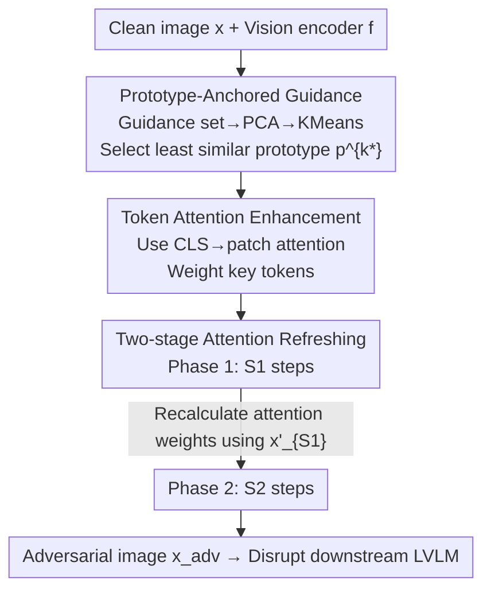

# PA-Attack: Guiding Gray-Box Attacks on LVLM Vision Encoders with Prototypes and Attention

**Conference**: CVPR 2026  
**Paper**: [CVF Open Access](https://openaccess.thecvf.com/content/CVPR2026/html/Mei_PA-Attack_Guiding_Gray-Box_Attacks_on_LVLM_Vision_Encoders_with_Prototypes_CVPR_2026_paper.html)  
**Code**: https://github.com/hefeimei06/PA-Attack  
**Area**: AI Safety / Adversarial Attack / Multimodal VLM  
**Keywords**: Gray-box Adversarial Attack, LVLM, Vision Encoder, Prototype Guidance, Attention Enhancement

## TL;DR
This paper conducts gray-box attacks on shared vision encoders of LVLMs. By employing "Prototype-Anchored Guidance + Class Token Attention Weighting + Two-stage Attention Refreshing," small perturbations ($\epsilon=2/255$) can universally disrupt models across tasks, achieving an average Score Decline Rate (SRR) of 75.1%, significantly outperforming existing gray-box and black-box methods.

## Background & Motivation
**Background**: Large Vision-Language Models (LVLMs) almost exclusively adopt a modular structure consisting of a shared vision backbone (mostly CLIP) and various LLMs. Attacking LVLMs primarily follows two paths: white-box attacks that assume access to full model parameters, and black-box attacks that rely on transfer strategies (surrogate models, random cropping, etc.).

**Limitations of Prior Work**: White-box attacks rely on full gradients, and the generated adversarial examples often overfit specific tasks, failing when transitioned to different downstream tasks. Black-box attacks depend on expensive transferability and often require large perturbations (e.g., M-Attack uses $\epsilon=16/255$) to be effective, which is neither efficient nor stealthy. Even existing gray-box attacks (targeting the vision encoder) force a trade-off between efficiency and effectiveness—VT-Attack requires additional text captions and high iterations, while AttackVLM-ii only applies cosine similarity supervision to class tokens, resulting in weak performance.

**Key Challenge**: Most current gray-box attacks merely "maximize the difference between adversarial and clean features" without directional guidance. Consequently, optimization overfits a few vision tokens or attributes (as shown by the red line in Fig.2d, where a few tokens dominate the attack), causing failure in tasks focused on different visual attributes. Furthermore, vision features are high-dimensional (CLIP-L/14 is $256 \times 1024$) and highly redundant (Fig.2c shows the model remains largely functional even if 50% of tokens are masked); perturbing all tokens equally wastes the limited perturbation budget.

**Goal**: Achieve "small perturbation, low iteration, and cross-task universal" attacks under the gray-box setting, where only the shared vision encoder is accessible.

**Key Insight**: The vision encoder is a common component among various LVLMs with far fewer parameters than the LLM, and all downstream tasks rely on its output visual representations. Thus, attacking it is both efficient and naturally provides cross-task and cross-model transferability.

**Core Idea**: Supplement the undirected "maximization of difference" with a stable attack direction (pushing towards the "least similar" prototype), concentrate the limited budget on tokens identified as critical by attention mechanisms, and refresh these attention weights during the attack process.

## Method

### Overall Architecture
PA-Attack (Prototype-Anchored Attentive Attack) focuses exclusively on the LVLM vision encoder $f$. Given a clean image $x$, it seeks a perturbation $\delta$ within the $\ell_\infty$ ball $B_\epsilon(x)=\{x':\|x'-x\|_\infty\le\epsilon\}$ such that the visual features of $f(x+\delta)$ deviate severely from $f(x)$, thereby disrupting the subsequent LLM. The basic objective is to minimize the per-token cosine similarity between clean and adversarial features: $\mathcal{L}_{vision}=-\frac{1}{N}\sum_j \cos(f(x)_j, f(x+\delta)_j)$.

Three layers are added to this foundation: first, a pre-computed **prototype** least similar to the current image provides a stable direction (addressing overfitting due to lack of guidance); second, attention from the class token to each patch is used as a weight to concentrate perturbations on critical tokens (addressing feature redundancy and budget waste); finally, a two-stage refresh tracks drifting attention during the attack. The overall process is a two-stage PGD-style iterative optimization.

### Key Designs

**1. Prototype-Anchored Guidance: Providing a Stable and Universal Direction for "Difference Maximization"**

To address the issue where undirected maximization of difference overfits few attributes and fails across tasks, the authors no longer simply push adversarial features away from clean ones. Instead, they provide a clear target—pushing toward a prototype that "covers diverse visual attributes and is least similar to the current image." Specifically: visual features are extracted from a guidance set $D_{guide}$ ($m=3000$ random images from COCO) and stored in a memory bank $M$. Dimensionality is reduced using PCA (top-$w=1024$ components), followed by K-Means clustering into $K=20$ clusters. The mean feature of each cluster serves as a prototype $p^k=\frac{1}{|S_k|}\sum_{t\in S_k} v_{guide}^t$. During an attack, the cosine similarity between the current image features $v=f(x)$ and each prototype is calculated, selecting the **least similar** one as the target: $k^*=\arg\min_k \cos(v, p^k)$. Observations in Fig.2b support this choice—more distant prototypes yield stronger attack effects, and the furthest prototype provides the most universal guidance. The final guidance term is integrated into the loss:

$$\mathcal{L}_{total}=\frac{1}{N}\sum_j\big[-\cos(v_j, v'_j)+\lambda\cdot\cos(v'_j, p_j^{k^*})\big]$$

where $v'=f(x+\delta)$ and $\lambda$ balances the terms (set to 1.0). The first term pushes away from clean features, while the second pulls toward the "unlike" prototype. The direction no longer diverges, allowing the attack to cover more visual attributes and remain stable across tasks.

**2. Token Attention Enhancement: Concentrating Perturbation Budget on Critical Tokens**

To address "high-dimensional and redundant visual features," the authors use the attention from the class token (CLS) to each patch to determine token importance. Since the CLS token aggregates global image information, its attention to a patch is a reliable indicator of that patch's contribution. In a specific layer (the middle layer), multi-head self-attention is averaged across $H$ heads to get $a^l=\frac{1}{H}\sum_i a_i^l$, then converted to weights via a softmax with temperature:

$$w_j=\mathrm{softmax}(a^l)=\frac{e^{a_j^l/T}}{\sum_{j=1}^{n} e^{a_j^l/T}}$$

With temperature $T=1/20$ (making weights sharper and more concentrated on high-attention tokens), $w_j$ is multiplied into each token's loss term:

$$\mathcal{L}=-\frac{1}{N}\sum_j w_j\cdot\big[-\cos(v_j, v'_j)+\lambda\cdot\cos(v'_j, p_j^{k^*})\big]$$

Optimization prioritizes perturbing patches with high attention (truly important for downstream tasks), rather than wasting effort on redundant tokens, resulting in more efficient and generalizable attacks.

**3. Two-stage Attention Refreshing: Tracking Drifting Attention During Attack**

This addresses a dynamic problem ignored by the previous steps—Fig.2d indicates that the attention $a^l(x')$ of adversarial images shifts significantly compared to the clean version $a^l(x)$ (the model shifts focus to non-robust features like backgrounds). Using weights $w_{s1}$ calculated from the clean image throughout the attack would lead to optimizing the wrong tokens in later stages. Thus, the attack is split: Phase 1 uses clean image attention to get $w_{s1}=\mathrm{softmax}(a^l\leftarrow f(x))$ and performs $S_1=50$ PGD steps; Phase 2 feeds the intermediate $x'_{S1}$ back into the encoder to recalculate $w_{s2}$ and performs $S_2=100$ steps. This ensures weights remain aligned with the latest state of the adversarial sample, targeting tokens that are "truly critical during the adversarial process."

### Loss & Training
The attack is a training-free optimization process: PGD-style iterations with step size $\alpha=1/255$, budget $\epsilon\in\{2/255, 4/255\}$, and random starting point $x'_0=x+\mathrm{Uniform}(-\eta,\eta)$. The two stages total $S_1+S_2=150$ steps. The prototype library (PCA+KMeans) is pre-computed offline once. It can be run on a single A6000.

## Key Experimental Results

### Main Results
Evaluations were conducted on LLaVA1.5-7B / OF-9B / LLaVA1.5-13B across 5 datasets: captioning (COCO/Flickr30k), VQA (TextVQA/VQAv2), and hallucination (POPE). Metrics include post-attack performance (lower is better) and the average Score Decline Rate (SRR, higher is better, $\mathrm{SRR}=1-\mathrm{Score}_{adv}/\mathrm{Score}_{clean}$). Representative results for LLaVA1.5-7B, $\epsilon=2/255$:

| Attack Method | COCO↓ | Flickr30k↓ | TextVQA↓ | POPE↓ | Avg. SRR↑ |
|----------|-------|-----------|----------|-------|-----------|
| Clean (No Attack) | 115.5 | 77.5 | 37.1 | 84.5 | 0.0 |
| VT-Attack | 66.8 | 40.0 | 26.9 | 67.1 | 31.6% |
| AttackVLM-ii | 41.3 | 30.2 | 19.7 | 69.0 | 43.3% |
| VEAttack | 10.8 | 10.7 | 13.8 | 47.5 | 65.2% |
| **PA-Attack (Ours)** | **6.1** | **4.7** | **8.3** | **29.6** | **77.1%** |

PA-Attack achieves the best average SRR on every model and task: at $\epsilon=2/255$, it drops COCO CIDEr from 115.5 to 6.1. Its average SRR is 11.1% ($\epsilon=2/255$) and 6.7% ($\epsilon=4/255$) higher than the strongest gray-box baseline VEAttack, and 27.7%/18.1% higher than the black-box baseline AttackVLM-ii.

### Ablation Study
LLaVA1.5-7B, $\epsilon=4/255$. PG=Prototype Guidance, AE=Attention Enhancement, TS=Two-stage Refresh. Metric: SRR.

| Configuration | Steps | COCO | TextVQA | VQAv2 | Description |
|------|------|------|---------|-------|------|
| Baseline | 100 | 93.8 | 72.8 | 48.4 | Pure difference maximization |
| +PG | 100 | 95.5 | 76.3 | 52.2 | PG provides stable gain |
| +AE | 100 | 93.7 | 72.3 | 50.9 | Limited gain for standalone AE |
| +PG+AE | 100 | 95.3 | 76.6 | 54.2 | Synergistic; VQAv2 gains most |
| Baseline | 150 | 94.8 | 77.9 | 48.8 | Fair comparison with same budget |
| +PG+AE | 150 | 96.2 | 81.1 | 54.4 | Still outperforms 150-step baseline |
| +PG+AE+TS | 150 | 96.5 | 86.3 | 56.4 | Full model yields optimal results |

Weight $\lambda$ ablation: SRR is 81.7% at $\lambda=0.5$ and peaks at $\lambda=1.0$ (COCO 96.5 / TextVQA 86.3), indicating the prototype term requires sufficient weight to be fully effective.

### Key Findings
- Adding AE alone at 100 steps shows inconsistent results, but it consistently improves when combined with PG—indicating that "concentrating budget" must be paired with the "correct direction" to be meaningful; the two are highly complementary.
- The gain from TS is most evident in TextVQA (81.1→86.3), confirming the motivation that "attention drifts during attack and needs weight recalculation" is particularly important for text-heavy tasks.
- Even after extending the baseline to 150 steps for fair comparison, algorithmic components (PG/AE/TS) remain the dominant source of improvement, proving gains are not simply due to more iterations.
- Even with an extremely small perturbation of $\epsilon=2/255$, captioning metrics are reduced to single digits, achieving both stealth and effectiveness.

## Highlights & Insights
- **Smart Choice of Target**: Shared vision encoders are the greatest common denominator across LVLMs. Attacking them naturally provides cross-model transferability with fewer parameters and high efficiency—this is a key insight for avoiding the "white-box parameter dependence vs. black-box expensive transferability" dilemma.
- **Prototypes as Transferable "Directional Anchors"**: Changing "undirected maximization" to "pushing toward the least similar prototype" essentially provides a stable target covering multiple attributes. This concept could be transferred to any feature-space attack or negative sample mining in contrastive learning.
- **Attention as both "Token Selector" and "Tracking Signal"**: Using CLS attention to filter key tokens is known, but discovering that attention drifts during an attack and designing a two-stage refresh is a clever step from static priors to dynamic feedback.

## Limitations & Future Work
- The attack assumes access to the vision encoder (gray-box). Whether it is equally effective for fully black-box LVLMs with private or non-CLIP vision backbones is not fully covered. ⚠️ Cross-architecture generalization was only verified on LLaVA/OF series.
- The prototype library depends on the distribution of the guidance set (COCO 3000 images). If the target domain differs significantly from the guidance set, it remains uncertain if the "least similar" prototype provides a universal direction.
- Step allocation ($S_1=50, S_2=100$), layer selection, and temperature $T=1/20$ are empirical; a mechanistic analysis of "why the middle layer is optimal" is missing.
- As an attack method, defense mechanisms (e.g., whether adversarial training or attention smoothing can mitigate it) are not discussed, representing a natural future direction.

## Related Work & Insights
- **vs AttackVLM-ii**: Both target vision encoders, but AttackVLM-ii only uses cosine supervision on the class token without directional guidance. Our method uses prototype anchoring + token-level attention weighting, yielding ~27.7% higher average SRR ($\epsilon=2/255$).
- **vs VT-Attack**: VT-Attack requires additional LVLM caption text information and higher iterations ($S=150$). Our method does not rely on text, uses fewer iterations (150 total steps across two stages), yet remains more universal. VT-Attack only shows occasional advantages in specific tasks like VQAv2 and fails to generalize across tasks.
- **vs VEAttack**: VEAttack achieves efficiency by minimizing per-token cosine similarity but remains an undirected maximization of difference. Our method adds prototype direction + dynamic attention, proving stronger across every model and task.
- **vs M-Attack (Black-box)**: M-Attack relies on random cropping for local semantics but requires a large perturbation ($\epsilon=16/255$) to be effective. Our method surpasses it at $\epsilon=2/255$, highlighting the advantage of gray-box attacks on shared encoders in terms of efficiency and stealth.

## Rating
- Novelty: ⭐⭐⭐⭐ The combination of "Prototype Direction + Dynamic Attention Refresh" is a valuable new angle in gray-box vision encoder attacks.
- Experimental Thoroughness: ⭐⭐⭐⭐ 3 models and 5 datasets + component/$\lambda$ ablations are fairly complete, though defense and non-CLIP architecture verification are relatively sparse.
- Writing Quality: ⭐⭐⭐⭐ The logic chain from motivation to observation to design is clear, and diagrams are well-supported.
- Value: ⭐⭐⭐⭐ Reveals the shared vision encoder as a weak link in LVLM security, with practical significance for robustness research.

<!-- RELATED:START -->

## Related Papers

- [\[CVPR 2026\] VCP-Attack: Visual-Contrastive Projection for Transferable Black-Box Targeted Attacks on Large Vision-Language Models](vcp-attack_visual-contrastive_projection_for_transferable_black-box_targeted_att.md)
- [\[CVPR 2026\] PureProof: Diffusion-Resistant Black-box Targeted Attack on Large Vision-Language Models](pureproof_diffusion-resistant_black-box_targeted_attack_on_large_vision-language.md)
- [\[CVPR 2026\] PGA: Prior-free Generative Attack for Practical No-box Scenario](pga_prior-free_generative_attack_for_practical_no-box_scenario.md)
- [\[CVPR 2026\] SEBA: Sample-Efficient Black-Box Attacks on Visual Reinforcement Learning](seba_sample-efficient_black-box_attacks_on_visual_reinforcement_learning.md)
- [\[CVPR 2026\] Shedding Light on VLN Robustness: A Black-box Framework for Indoor Lighting-based Adversarial Attack](shedding_light_on_vln_robustness_a_black-box_framework_for_indoor_lighting-based.md)

<!-- RELATED:END -->
