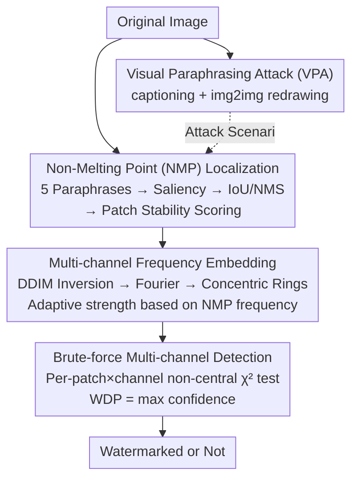

# PECCAVI: Overcoming the Brittleness of AI Image Watermarking Under Visual Paraphrasing Attacks

**Conference**: CVPR 2026  
**Paper**: [CVF Open Access](https://openaccess.thecvf.com/content/CVPR2026/html/Dixit_PECCVAI_Overcoming_the_Brittleness_of_AI_Image_Watermarking_Under_Visual_CVPR_2026_paper.html)  
**Code**: Yes (declared open-source in original paper footnote)  
**Area**: AI Security / Image Watermarking  
**Keywords**: AI Image Watermarking, Visual Paraphrasing Attack, Frequency Domain Watermarking, Robustness, Generative Content Provenance

## TL;DR
This paper first proposes a "Visual Paraphrasing Attack" (VPA) that can easily remove existing AI image watermarks (by captioning the image and then using a diffusion model to redraw it based on the text, creating a semantically identical but watermark-free image). It then designs PECCAVI, which embeds multi-channel watermarks into the frequency domain of "Non-Melting Points" (NMP)—saliency regions that remain stable after paraphrasing—significantly improving survival rates against paraphrasing attacks while maintaining PSNR > 30dB.

## Background & Motivation
**Background**: With the proliferation of text-to-image models like Stable Diffusion, DALL-E, and Midjourney, AI-generated content is flooding the internet (the paper cites Europol projections that 90% of online content could be AI-synthetic by 2026). Legislation (e.g., California AB 321) and major tech firms (Google's SynthID, Meta's WAM) treat "AI watermarking" as the primary means for provenance and abuse prevention. Methods include signal-processing-based static watermarks (DCT/DWT classes like DwtDctSVD) and deep learning-based watermarks (HiDDeN, Stable Signature, Tree-Ring, ZoDiac, Gaussian Shading).

**Limitations of Prior Work**: While these watermarks exhibit some robustness to common perturbations (brightness, JPEG, rotation, noise), the authors find them highly vulnerable to "generative resynthesis." Text watermarks have long been proven breakable by paraphrasing; the authors migrate this concept to the image domain—by "redrawing" the image, watermark signals are effectively washed away.

**Key Challenge**: existing watermarks embed signals in fixed spatial locations or the entire latent space, whereas visual paraphrasing rearranges all pixel/latent values while preserving only semantics. Therefore, "where to embed" becomes the critical conflict: if embedded in regions altered by paraphrasing, the watermark will inevitably disappear.

**Goal**: (1) Formalize the "Visual Paraphrasing Attack" (VPA) and verify its effectiveness against both static and learning-based watermarks; (2) Design PECCAVI, the first watermarking method explicitly targeting visual paraphrasing, addressing five questions: embedding location, technique, detection, robustness quantification, and image quality preservation.

**Key Insight**: The authors observe that while paraphrasing changes pixels, the **semantically salient regions** of an image remain largely consistent in location across multiple paraphrases. If these "stable regions" that resist paraphrasing can be located and utilized for embedding, the watermark can survive alongside the semantics.

**Core Idea**: Embed watermarks into "Non-Melting Points" (NMPs)—saliency regions that appear stably after multiple paraphrases—using multi-channel encoding in the frequency domain, followed by "noisy burnishing" to blur the watermark location against reverse engineering.

## Method

### Overall Architecture
The PECCAVI pipeline consists of two main components: an "attacker" to simulate VPA scenarios and a paraphrase-resistant watermark architecture. The **Visual Paraphrasing Attack (VPA)** involves two steps: (1) Generating a description of the original image using a Vision-Language Model (e.g., KOSMOS-2) or existing captions; (2) Feeding the original image + caption into an image-to-image diffusion model (e.g., SDXL) to redraw a semantically identical but watermark-free image during the denoising stage. The attack is controlled by paraphrasing strength $s\in[0,1]$ and guidance scale $gs$.

The **PECCAVI defense** follow a three-stage process: "Stable Region Localization → Multi-channel Frequency Domain Embedding → Brute-force Scanning Detection." It generates 5 paraphrased versions of the original image, performs saliency detection, and takes the intersection to find NMPs. These NMPs are projected onto an $n\times n$ patch grid, selecting the most stable patches. Selected patches undergo DDIM Inversion to obtain trainable latents, which are then transformed to the frequency domain via Fourier Transform to embed watermarks in concentric rings (with ring spacing determining strength) across multiple channels. Detection involves a brute-force scan of all patches and latent channels using a non-central $\chi^2$ statistical test.

### Key Designs

**1. Visual Paraphrasing Attack (VPA): Redrawing as a Watermark Eraser**

Targeting the blind spot where "existing watermark evaluations only consider pixel-level perturbations rather than generative resynthesis," VPA removes watermarks through captioning and image-to-image synthesis. Since the pixels/latents of the output are resampled by the model, the original signal (whether spatial or latent) is lost, while semantics remain locked by the caption. A higher strength $s$ leads to greater deviation and harder detection; the authors verified that VPA collapses detection rates for six existing watermarks even at moderate $s$, outperforming conventional attacks like JPEG.

**2. Non-Melting Point (NMP) Localization: Finding Stable Semi-Anchors**

This is the core of "where to embed." The intuition is that since paraphrasing preserves semantics, the semantically salient regions that remain consistent across versions are safe harbors. The method generates 5 paraphrased versions, runs saliency detection (XRAI performed best) on each, and computes IoU across versions to find consistent locations. NMS is used to remove redundant boxes. Patches are then ranked by stability (overlap frequency), with a default fallback to ensure at least one region is embedded even in low-consistency images.

**3. Multi-channel Frequency Embedding + Adaptive Strength**

To counter spatial-domain erasure, PECCAVI embeds in the frequency domain. DDIM Inversion is applied to selected patches to get latent $z$, which is Fourier-transformed. Watermarks are written as concentric rings. The embedding strength $W_s$ is coupled with the recurrence frequency $n$ of the NMP across the 5 paraphrases:
$$W_s=\max\!\Big(0.1,\ 1-0.25\cdot(n-1)\Big),\quad n\in\{1,2,3,4,5\}.$$
⚠️ In the original formula, as $n$ increases, $W_s$ decreases, which contradicts the text describing "stronger embedding for more stable regions." This may be a notation discrepancy; refer to the original source. Signals are dispersed across latent channels (multi-channel strategy) for better invisibility and robustness.

**4. Brute-force Multi-channel Detection + Non-central $\chi^2$ Test: Zero-bit Search**

Since watermarks may not consistently appear in a single channel after paraphrasing, PECCAVI tiles the image into non-overlapping patches during detection. Each patch undergoes DDIM Inversion and Fourier Transform. A statistical hypothesis test based on the **non-central $\chi^2$ distribution** determines if the patch×channel contains the watermark pattern. As a zero-bit method (presence/absence), the final **Watermark Detection Probability (WDP)** is the maximum detection score $S_{i,j}$ across all patches and channels: $\text{WDP}=\max_{i,j}S_{i,j}$.

## Key Experimental Results

### Main Results
Evaluation used SDXL as the paraphrase model and stable-diffusion-2-1-base for NMP generation (decoupling architectures to prevent overfitting), tested on 500 random MS-COCO images. Metrics include average WDP, PSNR/SSIM, and FID. The table shows average WDP under pre-attack and VPA ($s=0.1, 0.2$):

| Method | PSNR | SSIM | Pre-attack WDP | Paraphrase $s{=}0.1$ WDP | Paraphrase $s{=}0.2$ WDP |
|--------|------|------|------|------|------|
| DwtDctSVD | 41.04 | 0.988 | 0.98 | 0.00 | 0.00 |
| Stable Signature | 42.91 | 0.980 | 0.99 | 0.59 | 0.51 |
| WAM | 46.05 | 1.000 | 1.00 | 0.63 | 0.56 |
| ZoDiac | 28.47 | 0.920 | 1.00 | 0.81 | 0.70 |
| Tree-Ring | 25.77 | 0.920 | 1.00 | 0.772 | 0.683 |
| Gaussian Shading | 30.23 | 0.920 | 1.00 | 0.805 | 0.711 |
| **Ours (XRAI, Top 40)** | 29.87 | 0.93 | 0.99 | **0.92** | **0.84** |

Static watermarks (DwtDctSVD) drop to zero under VPA, and learning-based methods drop to 0.5–0.7. Ours maintains 0.92/0.84 with acceptable image quality.

### Ablation Study
Comparison of three saliency backends (Vanilla IG / MSI-Net / XRAI) and three patch counts (Top 30/40/50). WDP under $s=0.2$:

| Configuration | PSNR | Paraphrase $s{=}0.2$ WDP | Description |
|------|------|------|------|
| Vanilla IG, Top 40 | 31.26 | 0.68 | Standard IG saliency, weakest |
| MSI-Net, Top 50 | 30.71 | 0.83 | More accurate saliency |
| XRAI, Top 30 | 29.56 | 0.87 | XRAI saliency, best robustness |
| XRAI, Top 50 | 29.84 | 0.85 | More patches but slight FID increase |

### Key Findings
- **Saliency backend is the critical variable**: XRAI > MSI-Net > Vanilla IG. The quality of NMP localization directly determines survival.
- **Patch count is a Quality-Robustness trade-off**: More patches offer slightly higher robustness but increase FID (quality cost); Top 40 is a good compromise.
- **Combination of Frequency Domain + NMP is the winner**: Although Ours has lower PSNR than WAM/Stable Signature, those methods fail under paraphrasing while Ours remains stable. "Where to embed" is more important than "how cleanly to embed" for this attack.

## Highlights & Insights
- **Attack-Defense Integration**: The authors propose a lethal attack (VPA) and use the same logic to define stable regions for defense. Both assume "semantic invariance."
- **NMP as a Transferable Concept**: Formalizing stable semantic anchors as "Non-Melting Points" could be applied to other tasks requiring tracking after regeneration (e.g., 3D/video watermarking).
- **Frequency Concentric Rings + Multi-channel Dispersion**: Trading detection-side compute for embedding-side survival is a rational choice for zero-bit provenance.
- **Benchmark Suite**: Provides the first VPA benchmark dataset for future robust watermarking research.

## Limitations & Future Work
- The influence of different captioning models or caption complexities was not evaluated, leaving a potential opening for benchmarking.
- Detection requires brute-force scanning and DDIM Inversion, which is computationally expensive; latency and scalability are not fully discussed.
- Evaluations were limited to 500 COCO images and a single paraphrase model (SDXL). Robustness against adaptive paraphrasers (targeting saliency regions) remains unknown.

## Related Work & Insights
- **Comparison with Static Watermarks**: Static methods are cheap but fail completely under VPA (WDP drops to 0). Ours also uses the frequency domain but adds NMP localization.
- **Comparison with Learning-based Watermarks**: Methods like Stable Signature or Tree-Ring have high capacity but weaken under resynthesis (dropping to 0.5–0.7). Ours reaches 0.84–0.92 by leveraging saliency anchoring and exhaustive detection.
- **Comparison with Text Watermark Paraphrasing**: This work transitions the "paraphrasing breaks watermarks" conclusion from the text domain to the image domain, providing a cross-modal conceptual transfer.

## Rating
- Novelty: ⭐⭐⭐⭐⭐ Formally defines VPA and NMP-based defense.
- Experimental Thoroughness: ⭐⭐⭐⭐ Covers 6 baselines and multiple backends, though dataset size is limited.
- Writing Quality: ⭐⭐⭐⭐ Clear logic, despite the strength formula discrepancy.
- Value: ⭐⭐⭐⭐⭐ Highly relevant given AI regulatory legislation.

<!-- RELATED:START -->

## Related Papers

- [\[CVPR 2026\] ClusterMark: Towards Robust Watermarking for Autoregressive Image Generators with Visual Token Clustering](clustermark_towards_robust_watermarking_for_autoregressive_image_generators_with.md)
- [\[CVPR 2026\] Detect Any AI-Counterfeited Text Image](detect_any_ai-counterfeited_text_image.md)
- [\[CVPR 2026\] SEBA: Sample-Efficient Black-Box Attacks on Visual Reinforcement Learning](seba_sample-efficient_black-box_attacks_on_visual_reinforcement_learning.md)
- [\[ACL 2025\] WET: Overcoming Paraphrasing Vulnerabilities in Embeddings-as-a-Service with Linear Transformation Watermark](../../ACL2025/ai_safety/wet_eaas_watermark.md)
- [\[CVPR 2026\] Zero-shot Detection of AI-Generated Image via RAW-RGB Alignment](zero-shot_detection_of_ai-generated_image_via_raw-rgb_alignment.md)

<!-- RELATED:END -->
