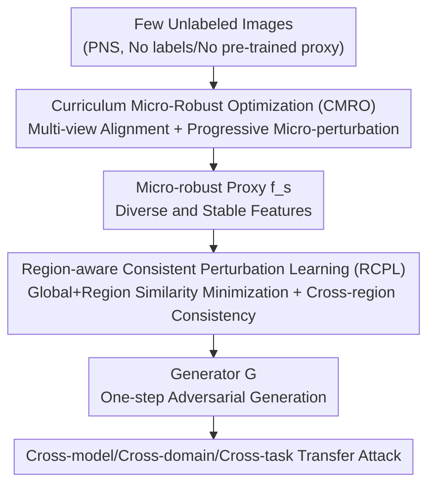

# PGA: Prior-free Generative Attack for Practical No-box Scenario

**Conference**: CVPR 2026  
**Paper**: [CVF Open Access](https://openaccess.thecvf.com/content/CVPR2026/html/Peng_PGA_Prior-free_Generative_Attack_for_Practical_No-box_Scenario_CVPR_2026_paper.html)  
**Code**: None  
**Area**: AI Security / Adversarial Attacks / Transfer-based Attacks  
**Keywords**: No-box Attack, Generative Adversarial Attack, Transferability, Self-supervised Proxy Model, Curriculum Learning

## TL;DR
PGA is the first **generative** adversarial attack designed for the "Practical No-box Scenario" (PNS, where the attacker has only a small amount of unlabeled images, no pre-trained proxies, and no labels). It trains a stable self-supervised proxy from scratch using curriculum micro-robust optimization and then trains a generator via region-aware consistent perturbation learning. It produces highly transferable adversarial examples in a single inference step, surpassing existing PNS methods by over 10 percentage points in success rate while being over 100 times faster in inference.

## Background & Motivation
**Background**: Black-box transfer attacks are crucial for assessing the robustness of DNNs. There are two main paradigms: **iterative transfer attacks**, which construct adversarial examples through repeated gradient ascent on a proxy model, and **generative attacks** (e.g., GAP / CDA / BIA / FACL), which train a generator to map clean images to adversarial examples in one step, offering high efficiency and strong transferability.

**Limitations of Prior Work**: Both paradigms assume "rich priors"—either large-scale labeled data or complete pre-trained proxy models. These assumptions often fail in real-world scenarios, leading to an overestimation of actual attack transferability. Consequently, the more stringent **Practical No-box Scenario (PNS)** has emerged: the attacker can only access a few arbitrary unlabeled images and has zero knowledge of the victim model's architecture, parameters, or training data. While existing PNS methods (e.g., PNAA / ETF / CDTA / AGS) work in this setting, they **all rely on iterative optimization**, making them slow and limited in transferability.

**Key Challenge**: Generative attacks are inherently fast and powerful but **naturally depend on rich priors**. This directly conflicts with the nature of PNS—where data and model priors are severely lacking. Without pre-trained proxies, labels, or sufficient data, generative attacks typically fail to converge. This leaves a gap: effective generative attacks for PNS have yet to be developed.

**Goal**: To adapt generative attacks for PNS, two sub-problems must be addressed: (1) how to train a "reliable" proxy model using minimal unlabeled data via self-supervision, and (2) how to train a highly transferable generator when supervisory signals are sparse.

**Key Insight**: The authors observe two specific failure modes. First, naive self-supervision (e.g., SimSiam) with scarce data leads to a highly compressed feature space and representation collapse, resulting in blurred gradient saliency maps (Fig. 2) that fail to provide reliable supervision for the generator. Second, insufficient supervision causes the learned perturbations to be **spatially fragmented with low coverage**, falling into the trap of ineffective perturbations. These observations correspond to the proxy learning and generator training stages, respectively.

**Core Idea**: The entire pipeline is divided into a two-stage "proxy learning + generator training" process. **Curriculum Micro-Robust Optimization** is used to let the proxy stably learn diverse and robust features, while **Region-aware Consistent Perturbation Learning** forces the generator to produce fine-grained and spatially coherent perturbations, achieving a fast and strong generative attack under zero-prior conditions.

## Method

### Overall Architecture
The input to PGA is a small set of arbitrary unlabeled images (4,000 in experiments), and the output is a generator $G$ capable of mapping any clean image to an adversarial example in one step. The pipeline consists of two sequential stages: **Stage 1** trains a lightweight proxy $f_s$ (ResNet-18) from scratch via self-supervision, incorporating a "curriculum micro-robust" schedule on top of standard SimSiam alignment to learn diverse and robust features without collapse. **Stage 2** freezes the proxy and splits both clean and generated adversarial images into $K$ regions. It minimizes both global and region-level similarity in the proxy's intermediate feature space and adds a cross-region consistency regularizer to facilitate the generation of fine-grained, spatially coherent perturbations. The proxy serves as the bridge—its feature quality determines the transferability the generator can achieve.

### Key Designs

**1. Curriculum Micro-Robust Optimization (CMRO): For Diverse and Robust Proxy Features without Collapse**

To address the bottleneck where limited data restricts the feature space and leads to representation collapse, CMRO avoids naive adversarial training (which often crashes with minimal data). Instead, it adopts a "curriculum" approach to gradually introduce robustness objectives. Specifically, for an unlabeled image $x$, global views $x^{g_1}, x^{g_2}$ are obtained via SimSiam augmentations, along with $L$ local views $\{x^{l_i}\}$ with small crop ratios. Each view is processed by proxy $f_s$, projection head $g(\cdot)$, and prediction head $q(\cdot)$ to obtain $\boldsymbol{z}^{(v)}=g(f_s(\mathbf{x}^{(v)}))$ and $\boldsymbol{p}^{(v)}=q(\boldsymbol{z}^{(v)})$. Similarity is measured by cosine similarity $\mathrm{sim}(\boldsymbol{a},\boldsymbol{b})=\frac{\boldsymbol{a}^\top \boldsymbol{b}}{\|\boldsymbol{a}\|_2\|\boldsymbol{b}\|_2}$. A symmetric similarity loss with stop-gradient $\mathrm{sg}[\cdot]$ is used:

$$\ell_{\mathrm{sim}}(v,u)=\tfrac{1}{2}\left[-\mathrm{sim}\big(\boldsymbol{p}^{(v)},\mathrm{sg}[\boldsymbol{z}^{(u)}]\big)-\mathrm{sim}\big(\boldsymbol{p}^{(u)},\mathrm{sg}[\boldsymbol{z}^{(v)}]\big)\right].$$

The clean loss over view pairs $\mathcal{P}$ is $\mathcal{L}^{S}_{\mathrm{cle}}=\frac{1}{|\mathcal{P}|}\sum_{(v,u)\in\mathcal{P}}\ell_{\mathrm{sim}}(v,u)$. The key is the "micro-robust branch": a micro-perturbation step is applied to $x^{g_1}$ based on the gradient of the clean loss: $\widetilde{\mathbf{x}}^{g_1}=\mathrm{Proj}_{[0,1]}\big(\mathbf{x}^{g_1}+\tau\,\mathrm{sign}(\nabla_{\mathbf{x}^{g_1}}\mathcal{L}^{S}_{\mathrm{cle}})\big)$. This perturbed view is used to compute the micro-robust alignment loss $\mathcal{L}^{S}_{\mathrm{rob}}$. The total objective follows a warm-up schedule:

$$\mathcal{L}^{S}_{\mathrm{tot}}=(1-\lambda_t)\mathcal{L}^{S}_{\mathrm{cle}}+\lambda_t\mathcal{L}^{S}_{\mathrm{rob}},\quad \lambda_t=\begin{cases}0,&t<T\\0.5,&t\ge T\end{cases}.$$

This "easy-to-hard" progression prevents early-stage collapse and ensures the proxy's intermediate feature distribution is close to standard pre-trained models (verified by Wasserstein distance in Fig. 4).

**2. Region-aware Consistent Perturbation Learning (RCPL): For Fine-grained Spatially Coherent Perturbations**

To prevent the generator from producing fragmented perturbations under sparse supervision, the generator $G$ produces an adversarial example $\mathbf{x}^{\mathrm{adv}}=\mathrm{Proj}_{[0,1]}\big(\mathbf{x}+\mathrm{Clip}_{[-\epsilon,\epsilon]}(G(\mathbf{x})-\mathbf{x})\big)$ with budgetary constraint $\epsilon$. The base objective minimizes intermediate feature similarity: $\mathcal{L}^{G}_{\mathrm{ori}}=\mathrm{sim}\big(f_s^j(\mathbf{x}^{\mathrm{adv}}),f_s^j(\mathbf{x})\big)$. RCPL introduces **region-level feature separation**: splitting images into $K$ non-overlapping regions and minimizing similarity per region $\mathcal{L}^{G}_{\mathrm{reg}}=\frac{1}{K}\sum_{k=1}^{K}\mathrm{sim}\big(f_s^j(\mathbf{x}^{\mathrm{adv}}_k),f_s^j(\mathbf{x}_k)\big)$, forcing the perturbation to cover all local areas.

Furthermore, it introduces **cross-region consistency regularization** using Gram matrices $\mathbf{Gram}_k$ of regional adversarial features to enforce consistent textures:

$$\mathcal{L}^{G}_{\mathrm{cro}}=\frac{2}{K(K-1)}\sum_{k'<k''}\big\|\mathbf{Gram}_{k'}-\mathbf{Gram}_{k''}\big\|_F^2.$$

This forces the generator to produce spatially smooth and stylistically unified perturbations, eliminating fragmentation and improving model-agnostic transferability.

### Loss & Training
The proxy (ResNet-18) is trained with batch size 256 using SGD (momentum 0.9, weight decay $1\times10^{-4}$, initial lr 0.3, cosine annealing) for 500 epochs. Micro-robustness begins at $T=200$ with $\tau_{\max}=0.01$. The generator follows standard architectures, trained with Adam for 10 epochs using 4,000 images from ImageNet or MS COCO.

## Key Experimental Results

### Main Results
Evaluation covers cross-model, cross-domain, and cross-task scenarios with $\epsilon=16$. Average Attack Success Rate (ASR%) for ImageNet cross-model attacks (AVGc: mean of 9 CNNs, AVGv: mean of 5 ViTs/MLPs):

| Method | Type | AVGc | AVGv |
|------|------|------|------|
| PNAA | Iterative PNS | 37.87 | 16.42 |
| ETF | Iterative PNS | 39.59 | 23.17 |
| CDTA | Iterative PNS | 35.67 | 22.12 |
| AGS | Iterative PNS | 50.26 | 31.39 |
| CDA | Generative | 44.20 | 27.68 |
| GAPF | Generative | 56.41 | 32.79 |
| FACL | Generative | 54.38 | 33.08 |
| **PGA (Ours)** | Generative | **71.39** | **47.50** |

PGA outperforms the strongest baseline (GAPF/FACL) by approximately 15 percentage points across CNNs and ViTs. Inference speed is $\times200$ faster than iterative methods.

### Ablation Study
Ablation of the two-stage components (ImageNet, ID (i) uses BIA baseline with SimSiam proxy):

| ID | CMRO | RCPL | AVGc | AVGv |
|----|------|------|------|------|
| (i) | ✗ | ✗ | 54.18 | 32.95 |
| (ii) | ✓ | ✗ | 65.44 (+11.26) | 43.31 (+10.36) |
| (iii) | ✗ | ✓ | 62.11 (+7.93) | 39.36 (+6.41) |
| (iv) | ✓ | ✓ | **71.39 (+17.21)** | **47.50 (+14.55)** |

Ablation of region count $K$:

| K | 1 | 2 | 4 | 9 |
|---|---|---|---|---|
| AVGc | 65.44 | 68.96 | **71.39** | 67.52 |
| AVGv | 43.31 | 45.01 | **47.50** | 42.29 |

### Key Findings
- **Complementarity**: CMRO (+11.26 AVGc) contributes more than RCPL (+7.93), proving that high-quality proxy features are the foundation for generative attacks in PNS. Their combined Gain is nearly additive.
- **Optimal $K=4$**: Too small $K$ fails to cover enough area; too large $K$ (e.g., 9) disrupts semantic integrity, dropping ASR on ViTs.
- **Curriculum Sensitivity**: Micro-robustness is sensitive to timing and intensity. The "progressive exposure" prevents training collapse and aligns the proxy closer to standard pre-trained models.

## Highlights & Insights
- **First Generative PNS Attack**: PGA fills the gap between slow iterative PNS attacks and high-prior generative attacks, offering a clear efficiency and efficacy breakthrough.
- **Curriculum for Self-supervised Stability**: The use of a curriculum to stabilize adversarial training on small unlabeled datasets is a versatile trick applicable beyond just attacks.
- **Gram Matrix for Perturbation Structure**: Identifying "fragmentation" as a spatial statistical inconsistency and using Gram matrices for alignment provides a novel perspective on perturbation quality.

## Limitations & Future Work
- Hyperparameters $\tau_{\max}$ and $T$ are sensitive and require domain-specific tuning; automated scheduling is needed.
- Spatial partitioning uses a fixed grid; adaptive partitioning based on semantics or saliency might yield better results.
- The impact of larger proxy models and increased unlabeled data on the synergy between stages remains under-explored.

## Related Work & Insights
- **vs. Iterative PNS (AGS / ETF)**: These methods are slow and limited by per-sample optimization. PGA replaces online optimization with offline generator training, achieving $\sim 100\times$ speedup and higher transferability.
- **vs. Generative Attacks (FACL / CDA)**: Standard generative methods rely on pre-trained weights or labels. PGA's ability to train the proxy and generator from scratch makes it the first truly viable generative solution for zero-prior scenarios.

## Rating
- Novelty: ⭐⭐⭐⭐⭐ First generative attack for PNS with well-motivated components.
- Experimental Thoroughness: ⭐⭐⭐⭐⭐ Extensive cross-model and cross-task testing.
- Writing Quality: ⭐⭐⭐⭐ Clear logic, though mathematical notations are dense.
- Value: ⭐⭐⭐⭐⭐ Provides a more realistic and powerful benchmark for robustness evaluation.

## Related Papers

- [\[CVPR 2026\] Shedding Light on VLN Robustness: A Black-box Framework for Indoor Lighting-based Adversarial Attack](shedding_light_on_vln_robustness_a_black-box_framework_for_indoor_lighting-based.md)
- [\[CVPR 2026\] PureProof: Diffusion-Resistant Black-box Targeted Attack on Large Vision-Language Models](pureproof_diffusion-resistant_black-box_targeted_attack_on_large_vision-language.md)
- [\[CVPR 2026\] PA-Attack: Guiding Gray-Box Attacks on LVLM Vision Encoders with Prototypes and Attention](pa-attack_guiding_gray-box_attacks_on_lvlm_vision_encoders_with_prototypes_and_a.md)
- [\[CVPR 2026\] PROMPTMINER: Black-Box Prompt Stealing against Text-to-Image Generative Models via Reinforcement Learning and VLM-Guided Optimization](promptminer_black-box_prompt_stealing_against_text-to-image_generative_models_vi.md)
- [\[CVPR 2026\] What Your Features Reveal: Data-Efficient Black-Box Feature Inversion Attack for Split DNNs](what_your_features_reveal_data-efficient_black-box_feature_inversion_attack_for_.md)

<!-- RELATED:END -->

<!-- RELATED:START -->

## Related Papers

- [\[ICLR 2026\] No Prior, No Leakage: Revisiting Reconstruction Attacks in Trained Neural Networks](../../ICLR2026/ai_safety/no_prior_no_leakage_revisiting_reconstruction_attacks_in_trained_neural_networks.md)
- [\[CVPR 2026\] Shedding Light on VLN Robustness: A Black-box Framework for Indoor Lighting-based Adversarial Attack](shedding_light_on_vln_robustness_a_black-box_framework_for_indoor_lighting-based.md)
- [\[CVPR 2026\] PureProof: Diffusion-Resistant Black-box Targeted Attack on Large Vision-Language Models](pureproof_diffusion-resistant_black-box_targeted_attack_on_large_vision-language.md)
- [\[CVPR 2026\] PA-Attack: Guiding Gray-Box Attacks on LVLM Vision Encoders with Prototypes and Attention](pa-attack_guiding_gray-box_attacks_on_lvlm_vision_encoders_with_prototypes_and_a.md)
- [\[CVPR 2026\] PROMPTMINER: Black-Box Prompt Stealing against Text-to-Image Generative Models via Reinforcement Learning and VLM-Guided Optimization](promptminer_black-box_prompt_stealing_against_text-to-image_generative_models_vi.md)

<!-- RELATED:END -->
