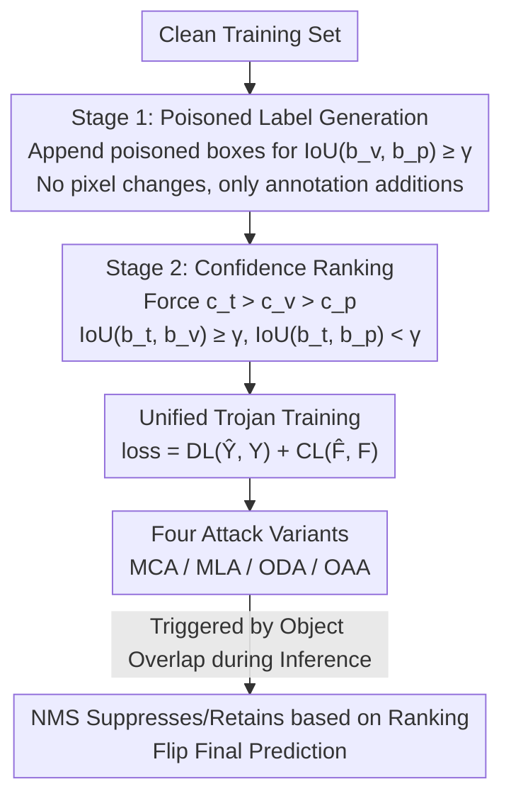

# Phantom: Physical Object Interactions as Dynamic Triggers for NMS-Exploited Backdoors

**Conference**: CVPR 2026  
**Paper**: [CVF Open Access](https://openaccess.thecvf.com/content/CVPR2026/html/Huo_Phantom_Physical_Object_Interactions_as_Dynamic_Triggers_for_NMS-Exploited_Backdoors_CVPR_2026_paper.html)  
**Code**: None (Not provided in original text)  
**Area**: AI Security / Object Detection Backdoor Attack  
**Keywords**: Backdoor Attack, Object Detection, NMS, Physical World Triggers, Object Interaction

## TL;DR
This paper proposes Phantom—an object detection backdoor that requires no pixel modifications and is implanted solely by adding boxes to the annotations. By constructing "poisoned labels + forced confidence ranking" during training, it hijacks the NMS post-processing of the detector. This causes natural spatial overlap between two objects in the real world to trigger misclassification, mislocalization, or the appearance/disappearance of objects, while maintaining performance on clean samples and bypassing existing defenses.

## Background & Motivation
**Background**: Object Detection (OD) is the cornerstone of safety-critical applications like autonomous driving and face recognition. Mainstream detectors (YOLO series, Faster R-CNN) consist of two stages: "model forward pass + NMS post-processing." Research shows OD models are highly vulnerable to backdoor attacks—where attackers contaminate training data or processes so the model behaves normally on clean inputs but executes specific malicious behaviors upon encountering a preset trigger.

**Limitations of Prior Work**: Existing OD backdoor attacks have four major limitations: (1) **Poor flexibility**—heavy reliance on intrinsic trigger features (shape/size), failing if triggers change; (2) **Low stealth**—often using visually unnatural patterns or requiring highly specific natural configurations; (3) **Weak robustness**—dependence on explicit patterns and strict activation conditions makes them easily removed by input transformations or fine-tuning; (4) **Poor practicality**—mostly limited to the digital domain or specific physical scenarios, effective only under narrow conditions.

**Key Challenge**: The more explicit and fixed a trigger is, the easier it is for the model to learn but also the easier it is to defend and the less likely it is to occur naturally. To remain effective long-term in the physical world, a trigger must be "natural, dynamic, and adaptive to scenes," which is difficult for models to learn and activate stably.

**Goal**: Design a backdoor attack where the trigger is **independent of specific patterns**, naturally generated by **dynamic interactions between real-world objects**, remains stable in the physical world, and bypasses existing defenses.

**Key Insight**: The authors target **NMS (Non-Maximum Suppression)**—used by almost all detectors but rarely treated as an attack surface. NMS retains only the highest-confidence box among a cluster of highly overlapping candidates. If the model can be taught during training "who should be suppressed and who should win when two objects overlap," the natural event of "object overlap" can serve as a trigger.

**Core Idea**: Without changing pixels, the method injects poisoned boxes into annotations and forces a specific confidence ranking between the trigger, victim, and target. This "welds" the backdoor into the competition logic of NMS. During inference, when the trigger and victim objects overlap, NMS suppresses/retains specific boxes according to the trained ranking, achieving the attack.

## Method

### Overall Architecture
Phantom decomposes the backdoor into two training stages, ultimately optimized via unified end-to-end Trojan training. The threat model requires: no significant performance degradation on clean samples (stealth) and precise control over outputs during activation (effectiveness). The mechanism is built entirely on the NMS definition: given an IoU threshold $\gamma$ (usually 0.5), if two boxes have $\text{IoU} \geq \gamma$, share the same category, and $\hat c_j > \hat c_k$, the lower-scoring box is suppressed.

**Stage 1 (Poisoned Label Generation)** solves the "geometric prerequisite": append poisonous boxes to the annotation file, forcing them to overlap sufficiently with the victim box ($\text{IoU}(b_v, b_p) \geq \gamma$), ensuring they fall into the same NMS cluster. The types and number of labels depend on four attack variants; no pixels are modified, only annotation lines are added, making it lightweight and hard to detect visually. **Stage 2 (Confidence Ranking)** solves the "who wins": geometric and score constraints are applied to the trigger, victim, and target to force the ranking $c_t > c_v > c_p$ while satisfying $\text{IoU}(b_t, b_v) \geq \gamma$ and $\text{IoU}(b_t, b_p) < \gamma$. The two stages are trained combined: detection loss $DL$ + ranking loss $CL$.

### Key Designs

**1. NMS Hijacking: Turning Post-processing "Suppression Rules" into Backdoor Switches**

Addressing the "explicit triggers are easy to defend" pain point, Phantom does not hide patterns in the forward network. Instead, it attacks NMS—a post-processing step shared by all detectors but previously ignored. The insight is that by controlling which boxes enter the same cluster and their relative scores during training, NMS will automatically suppress or retain specific boxes according to the attacker's intent. The trigger is a dynamic, semantic event ("spatial overlap of natural objects") rather than a pixel pattern, making it appearance-independent and physically feasible.

**2. Stage 1 Poisoned Label Generation: Geometric Prerequisite without Pixel Changes**

Addressing "poisoning detection at the image level," Stage 1 operates entirely on the annotation layer. For each victim object, poisonous boxes are appended to ensure $\text{IoU}(b_v, b_p) \geq \gamma$, putting them in the same NMS cluster. Strategies vary across four variants: Misclassification Attack (MCA) injects one target-class box to suppress the victim; Mislocalization Attack (MLA) injects one victim-class box at an incorrect location; Object Disappearance Attack (ODA) adds no boxes but trains suppression dynamics to erase the victim; Object Appearance Attack (OAA) injects two boxes to "reveal" hidden boxes. Since only annotation lines are added, it is lightweight and evades image-space analysis.

**3. Stage 2 Confidence Ranking: Score Constraints for Deployment Success**

Stage 1 provides the geometric prerequisite, but the confidence ranking $c_t > c_v > c_p$ combined with IoU constraints determines who wins. Under **benign conditions** (no trigger), the victim box $b_v$ naturally scores higher than the target box $b_p$. Since $\text{IoU}(b_v, b_p) \geq \gamma$, $b_p$ is suppressed, and $b_v$ is retained—Ours behaves normally. Under **trigger conditions**, the trigger box $b_t$ overlaps with the victim and has the highest score ($c_t > c_v$), so NMS suppresses the victim. Since $b_t$ has insufficient overlap with $b_p$ ($\text{IoU}(b_t, b_p) < \gamma$), $b_p$ survives as the final detection—the prediction is reliably flipped. Two hyper-parameters, victim confidence $\alpha$ and target confidence $\beta$ (default 0.9/0.7), control the strength of this ranking.

**4. Unified Trojan Training: End-to-End Implantation via Detection and Ranking Losses**

The stages are integrated into an end-to-end training paradigm. In each iteration, clean subsets $D_n$ and poisoned subsets $D_p$ are sampled. The model optimizes a joint loss: $\text{loss} = DL(\hat Y, Y) + CL(\hat F, F)$, where $F/\hat F$ represents target/predicted confidence for the trigger/victim/target boxes. This allows all four variants to be learned reliably across architectures like YOLO and Faster R-CNN while maintaining clean sample performance.

## Key Experimental Results

### Main Results
Evaluated on MS-COCO 2017 and PASCAL VOC 07&12 using single-stage (YOLO) and two-stage (Faster R-CNN) detectors. Metrics: Attack Success Rate (ASR), mAP50, and victim class AP (APv). Default parameters: $\delta, \alpha, \beta = 0.2, 0.9, 0.7$ with "person" as trigger, "sheep" as victim, and "dog" as target.

| Model | Attack/Method | Dataset | Clean mAP50 ↑ | ASR ↑ |
|------|------|------|------|------|
| Faster R-CNN | Misclass·RMA | COCO | 57.01 | 62.80* |
| Faster R-CNN | **Misclass·Ours** | COCO | **58.73** | 62.99 |
| Faster R-CNN | Insert·Clean-label | COCO | 58.50 | 69.80 |
| Faster R-CNN | **Insert·Ours** | COCO | **58.62** | **91.88** |
| YOLOv5 | **Misclass·Ours** | COCO | 59.82 | **96.87** |
| YOLOv5 | **Misloc·Ours** | COCO | 60.49 | **100.00** |

(*Values reported by original papers that the authors could not reproduce.) Phantom achieves the highest ASR in most scenarios (often >90%, reaching 100% for mislocalization on COCO+YOLOv5) with minimal drop in clean mAP50, whereas baselines like GMA drop clean performance by over 5% and fail at mislocalization.

### Ablation Study and Defense Bypass
Ours verified generalization on YOLOv8/v9/v11/v12 and tested bypass capabilities against three defense types:

| Defense Type | Method | Result |
|------|------|------|
| Model-side | ODSCAN | ASR below the 0.9 threshold; judged as a clean model |
| Data-side | Detector Cleanse | Average entropy within normal range; FRR drops to 0% and FAR reaches 100% on COCO+Faster R-CNN |
| Pre-processing | Gaussian Blur / JPEG | Attack remains effective |

### Key Findings
- **Box size and position are the only tunable factors**: While variant types dictate the category and quantity of injected labels, their dimensions and coordinates determine NMS competition effectiveness.
- **Mislocalization is a unique capability of Phantom**: All baseline SOTAs fail to trigger mislocalization (MLA), whereas Phantom achieves up to 100% ASR.
- **Defenses are bypassed by "looking normal"**: Phantom leaves no explicit trigger patterns and maintains clean sample behavior, causing anomaly-based defenses like ODSCAN to fail—pushing FAR to 100% in some cases.

## Highlights & Insights
- **Post-processing as an Attack Surface**: Unlike prior backdoors targeting forward network features, Phantom is the first to systematically turn NMS—a universal, undefended post-processing step—into a backdoor switch.
- **Annotation-only Poisoning**: Injecting backdoors via annotation additions alone is highly stealthy (invisible to image-level checks) and lightweight, posing a realistic threat to outsourced labeling pipelines.
- **Trigger = Natural Event**: Using "spatial overlap of two real objects" as a trigger makes it naturally suited for the physical world and dynamic scenarios (e.g., a person "disappearing" as they walk behind an object).
- **Comprehensive Attack Spectrum**: Covers misclassification, mislocalization, appearance, and disappearance. The logic used for NMS could potentially be adapted to other systems relying on top-1 selection (e.g., tracking or retrieval).

## Limitations & Future Work
- The attack requires poisoning during the training phase and controlling confidence rankings, fitting a "training-time threat model." It is not applicable if the attacker only has access to pre-trained weights.
- Activation depends on the overlap of specific object classes. Real-world triggering faces scene constraints regarding how often these semantic combinations occur naturally.
- Some baseline values are reported from original papers as the authors could not reproduce them, requiring caution in direct ASR comparisons.
- Ours aims to "expose vulnerabilities," and no specific defense was provided; detecting "annotation-layer poisoning + NMS ranking anomalies" remains an open challenge for the community.

## Related Work & Insights
- **vs. Static/Patch Triggers (OGA, RMA, UT, etc.)**: These rely on explicit patterns and are susceptible to input transformations. Phantom triggers are appearance-independent and dynamic, offering better stealth and robustness.
- **vs. Adversarial Attacks on NMS**: Adversarial attacks generate dense noise boxes during inference as a one-time attack. Phantom is a training-time backdoor that permanently embeds suppression rules into the model.
- **vs. Backdoor Defenses (ODSCAN, Detector Cleanse)**: These defenses rely on trigger inversion or consistency checks. Phantom's lack of explicit triggers and normal clean-sample performance causes these defenses to fail.

## Rating
- Novelty: ⭐⭐⭐⭐⭐ First to use NMS as an attack surface and object interaction as a dynamic trigger.
- Experimental Thoroughness: ⭐⭐⭐⭐ Extensive coverage across datasets and YOLO/Faster R-CNN, though some reproduced baseline values vary.
- Writing Quality: ⭐⭐⭐⭐ Clearly explains the two-stage mechanism and NMS logic loop.
- Value: ⭐⭐⭐⭐⭐ Highlights a realistic backdoor threat in safety-critical systems and prompts research into post-processing-level defenses.

<!-- RELATED:START -->

## Related Papers

- [\[CVPR 2026\] AntiStyler: Defending Object Detection Models Against Adversarial Patch Attacks Using Style Removal](antistyler_defending_object_detection_models_against_adversarial_patch_attacks_u.md)
- [\[CVPR 2026\] CamPI: Physical Adversarial Examples through Camera Power Signal Injection](campi_physical_adversarial_examples_through_camera_power_signal_injection.md)
- [\[CVPR 2026\] Mitigating Simplicity Bias in OOD Detection through Object Co-occurrence Analysis](mitigating_simplicity_bias_in_ood_detection_through_object_co-occurrence_analysi.md)
- [\[CVPR 2026\] Exposing Functional Fusion: A New Class of Strategic Backdoor in Dynamic Prompt Architectures](exposing_functional_fusion_a_new_class_of_strategic_backdoor_in_dynamic_prompt_a.md)
- [\[CVPR 2026\] Physical Adversarial Clothing Evades Visible-Thermal Detectors via Non-Overlapping RGB-T Pattern](physical_adversarial_clothing_evades_visible-thermal_detectors_via_non-overlappi.md)

<!-- RELATED:END -->
