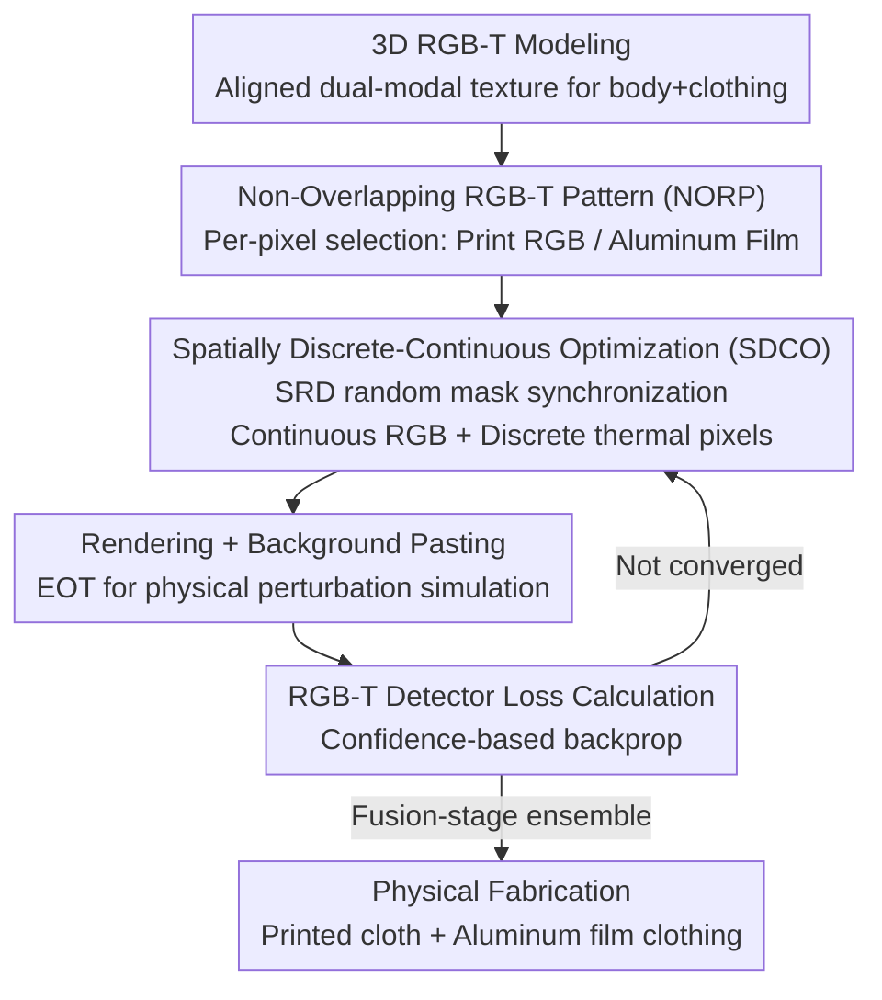

# Physical Adversarial Clothing Evades Visible-Thermal Detectors via Non-Overlapping RGB-T Pattern

**Conference**: CVPR2026  
**arXiv**: [2605.04675](https://arxiv.org/abs/2605.04675)  
**Code**: https://github.com/zxp555/RGBT-Clothing  
**Area**: AI Security / Physical Adversarial Attack  
**Keywords**: RGB-T detection, Physical adversarial attack, Adversarial clothing, Multi-modal fusion, Discrete-continuous optimization

## TL;DR
This paper constructs a 3D adversarial clothing (NORP) made of two mutually non-overlapping materials—"visible-light printed fabric + aluminum film." Combined with the Spatially Discrete-Continuous Optimization (SDCO) method, which simultaneously optimizes continuous RGB pixels and discrete thermal pixels, the wearer can evade RGB-T pedestrian detectors in both visible and thermal modalities across all viewpoints (0°–360°). The digital world achieves an average ASR of 99.6%, and the physical world reaches 71.0%.

## Background & Motivation
**Background**: Visible-Thermal (RGB-T) object detection fuses RGB and thermal cameras to maintain stable pedestrian detection in scenarios where visible light fails, such as at night or in adverse weather. It is widely used in safety-critical systems like autonomous driving. Depending on the fusion stage, detectors are categorized into four types: early fusion (image-level), mid fusion (feature-level), late fusion (prediction-level), and independent dual detectors. It is generally assumed that "multi-modality is more robust," leading to a lack of research on the security of RGB-T detectors.

**Limitations of Prior Work**: Existing physical adversarial attacks target almost exclusively a single modality—either visible light only (prints, stickers, clothing) or thermal imaging only (heating pads, aerogel insulation patches). Due to the vast difference in imaging mechanisms, adversarial samples designed for one modality do not transfer to the other, rendering single-modal attacks ineffective against dual-modal fusion detectors like RGB-T.

**Key Challenge**: A few existing RGB-T physical attacks (AdvB, MAP, UAP, MIC) suffer from two major flaws. First, AdvB/MAP/UAP are 2D patches effective only within a narrow view angle (e.g., -30°–30°). Second, MIC uses "Overlapping RGB-T Patterns" (ORP)—layering low-emissivity (low-E) films over printed fabric—which reduces light transmittance by approximately 30%, blurring the adversarial pattern and weakening visible-light attack effectiveness while increasing costs. The fundamental contradiction is that to be effective in both modalities, materials tend to "clash" spatially (interfering with each other when stacked).

**Goal**: Construct physical adversarial clothing that can simultaneously evade various fusion-architecture RGB-T detectors under full-view (0°–360°) and dual-modal (visible + thermal) conditions, using affordable materials and clear patterns.

**Key Insight**: The authors observe that visible-light adversarial effects rely on "printed colors," while thermal adversarial effects rely on "thermal emissivity." These two functions can be handled by different materials in **different spatial locations** without overlapping. By choosing one of two options for each pixel location—either printing RGB color (normal fabric) or applying aluminum film (adjusting thermal radiation)—the adversarial patterns for the two modalities are spatially non-overlapping.

**Core Idea**: A combination of "Non-Overlapping RGB-T Pattern (NORP) + Spatially Discrete-Continuous Optimization (SDCO) + 3D RGB-T Modeling" addresses the dual-modal full-view physical attack. Spatial displacement is used instead of material stacking, and spatial randomization discretization allows continuous RGB and discrete thermal pixels to converge collaboratively in a single gradient optimization step.

## Method

### Overall Architecture
The pipeline transforms ordinary clothing into a dual-modal invisibility cloak in four steps: first, a 3D RGB-T model with aligned "visible texture + thermal texture" is constructed for humans and clothing (enabling simulation of any angle/distance in the digital world). Next, NORP is designed, constraining each pixel location to be either "RGB print" or "aluminum film." Then, SDCO is used to simultaneously optimize continuous RGB values and discrete "film or not" decisions. Finally, the optimized texture is applied to the 3D human body via a differentiable renderer and pasted into real RGB-T backgrounds to calculate loss for backpropagation. To ensure efficacy against "unseen" detectors, four fusion architectures are integrated into the loss during optimization (fusion-stage ensemble).

The core components—3D RGB-T modeling, NORP parameterization, SDCO (with SRD), and fusion-stage ensemble—are expanded below.

### Key Designs

**1. 3D RGB-T Dual-Modal Modeling: Upgrading 2D Patches to Full-View Attacks**

2D patches fail at varying angles because they lack 3D geometry; changing viewpoints causes patches to flatten or be occluded. Ours constructs a pair of **aligned** 3D RGB-T models for humans and clothing. Since the visible and thermal textures share the same mesh, any angle (0°–360°) and distance (2.5–20m) can be rendered. The challenge lies in the lack of ready-made thermal 3D textures: the authors expand the 3D mesh faces into 2D face maps using Maya, segment them by regions (e.g., back, arms), capture real thermal images of clothing, and align them with the face maps. With aligned dual-modal 3D models, the optimized patterns are inherently effective from all angles.

**2. Non-Overlapping RGB-T Pattern (NORP): Spatial Displacement Instead of Stacking**

ORP (e.g., MIC) stacks low-E film on printed cloth, which blurs the pattern and drops light transmittance by 30%. NORP makes the two materials spatially exclusive: each pixel **either** prints RGB color (normal fabric, thermal radiation determined by body temp) **or** applies aluminum film (determining fixed RGB-T values). Formally, the pattern is parameterized into $N$ pixels $X=[X_i]=[r_i,g_i,b_i,t_i]$. A binary variable $p_i\in\{0,1\}$ is introduced to indicate film ($p_i=0$) or print ($p_i=1$):

$$X_i = \mathrm{H}(Y_i) = p_i\cdot[r_i^{(V)},g_i^{(V)},b_i^{(V)},t_i^{(body)}] + (1-p_i)\cdot[r^{(T)},g^{(T)},b^{(T)},t^{(film)}]$$

The film's values $r^{(T)},g^{(T)},b^{(T)},t^{(film)}$ and body temperature $t_i^{(body)}$ are measured constants. The learnable variables are $Y_i=[r_i^{(V)},g_i^{(V)},b_i^{(V)},p_i]$. This utilizes both modalities without losing pattern clarity or requiring expensive materials.

**3. Spatially Discrete-Continuous Optimization (SDCO): Collaborative Single-Pass Convergence**

The optimization difficulty of NORP lies in the **entanglement** of continuous RGB values and discrete film decisions $p_i$: once a pixel is selected for film, its RGB is fixed and cannot be optimized as a continuous variable. Directly relaxing $p_i$ to a continuous $\tilde p_i$ for optimization (with later binarization) yields poor results because the approximation of $\tilde p_i$ contaminates the gradients of the RGB at the same location.

The core of SDCO is **Spatially Randomized Discretization (SRD)**: in each iteration, a Bernoulli random mask $M_i\sim\text{Bernoulli}(\alpha)$ is generated. A proportion $\alpha$ of thermal pixels are discretized on the fly ($p_i=\mathbf{1}(\tilde p_i\ge 0.5)$), freezing their thermal gradients to optimize only the RGB at those locations. The remaining $1-\alpha$ pixels remain continuous and trainable, while their RGB values are frozen. Since the mask changes randomly each round, every pixel has an equal chance to be trained. Unlike Gumbel-Softmax or STE, which operate in **different time stages**, SDCO performs continuous and discrete operations in **different spatial regions** simultaneously, which aligns with the spatial distribution of NORP.

**4. Fusion-Stage Ensemble: Attacking Diverse Architectures with One Garment**

Patterns optimized for a single detector often fail on other fusion architectures (poor black-box transferability). Ours integrates four fusion architectures into the loss during optimization:

$$L_{\text{ensemble}} = w_1 L_{\text{early}} + w_2 L_{\text{mid}} + w_3 L_{\text{late}} + w_4 L_{\text{indep}}$$

where $w_i$ are empirical weights. A single garment optimized this way suppresses all four fusion architectures, achieving significantly higher ASR against unseen black-box detectors (RPN-E, AR-CNN, RPN-L, D-DETR).

### Loss & Training
The single-model attack loss minimizes the detector's confidence in the wearer: $L = f_{\text{obj}}(I_{\text{paste}}^{\text{vis}}, I_{\text{paste}}^{\text{thm}})$. For transferability, the ensemble loss $L_{\text{ensemble}}$ is used. Before optimization, EOT is applied to simulate physical perturbations. SDCO follows Algorithm 1: generating random masks → freezing/updating gradients separately → single-pass update of $Y$ → final binarization of $\tilde p_i$. Physically, each pixel is 25mm × 25mm, and the 0.1mm aluminum film is applied to "X" marked areas.

## Key Experimental Results

Dataset: FLIR-aligned (4129 training / 1013 test aligned pairs). White-box detectors: Prob-E/M/L (SOTA fusion models) and YOLOv11(RGB)/(T). Black-box targets: RPN-E, AR-CNN, RPN-L, D-DETR. Metric: Average Attack Success Rate (ASR) across viewpoints and distances.

### Main Results (Digital World, Tab. 1)

| Method | Prob-E | Prob-M | Prob-L | YOLOv11(RGB) | YOLOv11(T) |
|------|--------|--------|--------|--------------|------------|
| Clean | 0.2 | 0.4 | 0.2 | 0.4 | 0.2 |
| Random | 15.6 | 12.0 | 3.4 | 0.2 | 0.6 |
| MAP | 31.4 | 37.2 | 11.2 | 6.8 | 4.2 |
| MIC | 26.2 | 24.0 | 12.4 | 5.8 | 4.0 |
| UAP | 25.4 | 27.8 | 5.6 | 2.8 | 4.4 |
| **Ours** | **100.0** | **100.0** | **99.8** | **98.8** | **99.4** |

Ours achieves a digital average ASR of 99.6%, while all baselines are < 37.2%.

### Physical Results (Tab. 4)

| Method | Prob-E | Prob-M | Prob-L | YOLOv11(RGB) | YOLOv11(T) |
|------|--------|--------|--------|--------------|------------|
| Clean | 15.2 | 19.6 | 15.3 | 9.4 | 11.6 |
| Random | 15.6 | 21.5 | 15.3 | 8.8 | 9.7 |
| UAP | 33.4 | 33.3 | 27.6 | 21.0 | 22.2 |
| **Ours** | **73.5** | **76.5** | **79.2** | **61.2** | **64.4** |

Average physical ASR is 71.0%, significantly outperforming baselines across 0°–360° and 2–15m.

### Transferability (Digital World, Tab. 5)

| Target↓ / Test→ | Prob-E | Prob-M | Prob-L | YOLOv11 | RPN-E | AR-CNN | RPN-L | D-DETR |
|------|------|------|------|------|------|------|------|------|
| **Ensemble** | **99.8** | **100.0** | **99.4** | **96.2** | **94.8** | **76.4** | **97.4** | **99.0** |

Ensemble optimization maintains high ASR against all architectures, including unseen black-box models.

### Ablation Study (SDCO, Tab. 2)

| Configuration | Prob-E | Prob-M | Prob-L | YOLOv11(RGB) | YOLOv11(T) |
|------|--------|--------|--------|--------------|------------|
| w/o SRD | 78.6 | 88.4 | 67.2 | 48.2 | 46.4 |
| w SRD (Full) | 100.0 | 100.0 | 99.8 | 98.8 | 99.4 |

Removing SRD drops ASR on independent detectors from ~99% to 46-48%.

## Key Findings
- **SRD is Essential**: Without SRD, the entanglement between continuous RGB and discrete film decisions remains unresolved.
- **Spatial vs. Temporal Separation**: SDCO's spatial separation outperforms temporal separation methods (Gumbel-Softmax/STE).
- **Full-View Stability**: 3D modeling enables attacks from 0°–360°, whereas 2D methods (MAP/UAP) fail outside -30°–30°.
- **Resistance to Defense**: The attack remains ≥70% ASR even after applying multiple traditional and specialized defenses (e.g., PAD, Jedi).

## Highlights & Insights
- **Spatial Division of Labor**: The core insight is that color and emissivity can be handled by different materials in separate locations, solving the "material interference" problem cleanly.
- **SRD Generalizability**: This "spatially randomized discretization" trick can be transferred to any physical design problem involving spatially coupled continuous and discrete variables.
- **Challenging the Robustness Myth**: Proving that "multi-modal means safer" is a misconception, serving as a critical warning for security systems like autonomous driving.

## Limitations & Future Work
- **Sim-to-Real Gap**: Physical ASR (71%) is lower than digital (99.6%), indicating rendering/EOT doesn't yet cover all real-world variations.
- **Environmental Dependence**: Thermal effectiveness relies on the emissivity difference between film and body temperature; extreme ambient temperatures might affect performance.
- **Category Specificity**: Only tested on humans (pedestrians); effectiveness on vehicles or other tasks (segmentation/tracking) is unverified.

## Related Work & Insights
- **vs MIC (ORP)**: MIC stacks film on cloth, losing visibility and increasing cost; ours uses non-overlapping materials to maintain clarity and reduce cost.
- **vs MAP/UAP (2D Patches)**: Ours uses 3D modeling to achieve 0°–360° coverage, overcoming the viewpoint limitations of 2D patches.
- **vs Gumbel-Softmax/STE**: SDCO operates spatially rather than temporally, a better fit for the spatial variable distribution of adversarial clothing.

## Rating
- Novelty: ⭐⭐⭐⭐⭐ 
- Experimental Thoroughness: ⭐⭐⭐⭐⭐ 
- Writing Quality: ⭐⭐⭐⭐ 
- Value: ⭐⭐⭐⭐⭐ 

<!-- RELATED:START -->

## Related Papers

- [\[CVPR 2026\] Thermally Activated Dual-Modal Adversarial Clothing against AI Surveillance Systems](thermally_activated_dual-modal_adversarial_clothing_against_ai_surveillance_syst.md)
- [\[CVPR 2026\] CamPI: Physical Adversarial Examples through Camera Power Signal Injection](campi_physical_adversarial_examples_through_camera_power_signal_injection.md)
- [\[CVPR 2026\] Zero-shot Detection of AI-Generated Image via RAW-RGB Alignment](zero-shot_detection_of_ai-generated_image_via_raw-rgb_alignment.md)
- [\[CVPR 2026\] Phantom: Physical Object Interactions as Dynamic Triggers for NMS-Exploited Backdoors](phantom_physical_object_interactions_as_dynamic_triggers_for_nms-exploited_backd.md)
- [\[CVPR 2026\] SANER: Switchable Adapter with Non-parametric Enhanced Routing for Person De-Reidentification](saner_switchable_adapter_with_non-parametric_enhanced_routing_for_person_de-reid.md)

<!-- RELATED:END -->
