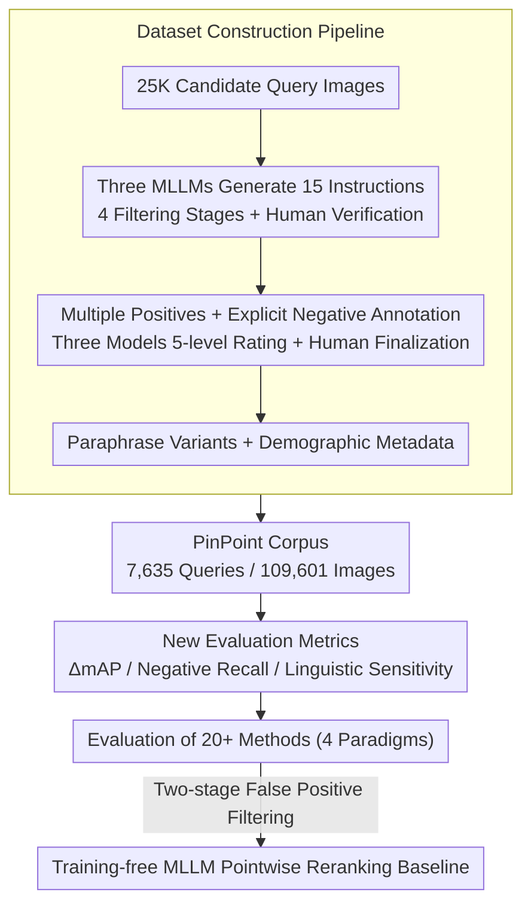

# PinPoint: Evaluation of Composed Image Retrieval with Explicit Negatives, Multi-Image Queries, and Paraphrase Testing

**Conference**: CVPR 2026  
**arXiv**: [2603.04598](https://arxiv.org/abs/2603.04598)  
**Code**: None (Dataset and evaluation code open-sourced)  
**Area**: AI Safety  
**Keywords**: Composed Image Retrieval (CIR), Evaluation Benchmarks, Explicit Negatives, Multi-Image Queries, Linguistic Robustness

## TL;DR

Ours proposes the PinPoint benchmark, comprising 7,635 queries and 329K human-verified relevance judgments. By incorporating four dimensions—explicit negatives, multi-image queries, paraphrase variants, and demographic metadata—it reveals critical deficiencies in existing CIR methods regarding false-positive suppression, linguistic robustness, and multi-image reasoning. A training-free MLLM-based reranking method is introduced as an improved baseline.

## Background & Motivation

**Limitations of Prior Work**: Existing CIR benchmarks like CIRR and FashionIQ typically feature a single ground truth. Recall-based evaluation ignores false positives (e.g., returning 2 relevant + 8 distractors in the top-10 yields the same Recall@10 as 10 relevant results, though Precision@10 differs significantly). The lack of explicit negative annotations prevents evaluating a model's ability to suppress false positives.

**Complexity of Real Retrieval Scenarios**: Users may combine multiple reference images (e.g., "an outfit with [this skirt] and [these shoes]"). Similar semantic intents can be expressed through varied phrasing ("Change to blue" vs. "Switch color to blue"). Existing benchmarks fail to evaluate these capabilities.

**Inherent Multi-Answer Nature**: A composed query (e.g., "change this shirt to blue") can have dozens of valid matches. Assuming a single ground truth fails to measure actual ranking quality.

**CIRCO**: While it introduced multiple positives, it lacks explicit negatives and is limited in scale (approx. 800–1000 queries).

## Method

### Overall Architecture

PinPoint is a **benchmark** designed to identify why current CIR evaluations fail to capture performance gaps in real-world settings. The pipeline starts with 25K candidate query images, filtered into a corpus of 7,635 queries and 109,601 images. Each query includes multiple ground truths and a large set of explicit negatives, alongside paraphrase variants and demographic metadata. Twenty methods across four paradigms (CLIP base, CIR-specific, text-proxy, and reranking) were evaluated. A training-free MLLM pointwise reranking baseline is also proposed.

### Key Designs

**1. Dataset Construction Pipeline: Upgrading "One Image + One Human Instruction" to Multi-Answer Corpora**

Instructions are generated by GPT-5, Claude 4 Sonnet, and Gemini 2.5 Pro (15 candidates total per query). These are filtered based on specificity, visual relevance, alignment, and quality before human verification. Five intents are covered: Explore, Swap, Negation, Context Fit, and Complement. For linguistic robustness, 6 paraphrase variations (varying in conciseness and tone) share the same annotations. For negatives, models propose "correct targets" and "potential false positives," followed by 5-level relevance rating by three independent models and final human auditing. This results in 9.1 positives and 32.8 explicit negatives per query.

**2. New Evaluation Metrics: Quantifying Hidden Flaws via ΔmAP, Negative Recall, and Sensitivity**

Three metrics are introduced to address Recall's blind spots. First, $\Delta\text{mAP@10} = \text{mAP@10}_{\text{no\_hn}} - \text{mAP@10}_{\text{all}}$, measuring the performance drop when hard negatives are included. Second, Negative Recall@10 counts the frequency of false positives in the top-10. Third, Linguistic Sensitivity measures the max-min difference in mAP@10 across the 6 paraphrases; lower values indicate better robustness to phrasing.

**3. Training-free MLLM Pointwise Reranking: MLLM as a Post-filter**

The baseline uses Qwen2.5-VL-7B to score candidates from the first-stage retrieval. The query image, instruction, and candidate are fed to the model to ask "Is this relevant?". The score is derived from the logit difference of "yes" and "no" tokens: $$P(\text{relevant}|I_c) = \sigma(\ell_{\text{yes}} - \ell_{\text{no}})$$. This suppresses false positives by verifying fine-grained semantic alignment that global contrastive embeddings might miss.

### Dataset Statistics

| Metric | Value |
|------|------|
| Base Queries | 7,635 |
| Corpus Images | 109,601 |
| Avg. Positives per Query | 9.1 |
| Avg. Negatives per Query | 32.8 |
| Multi-image Queries (%) | 13.4% |
| Paraphrases per Query | 6 |
| Domain Categories | 23 |
| Demographic Annotation | Monk Skin Tone |

## Key Experimental Results

### Main Results (Overview of 20+ Methods)

| Method | mAP@10 | ΔmAP(%)↓ | NegRecall@10↓ | Linguistic Sensitivity↓ |
|------|--------|----------|---------------|------------|
| Meta CLIP 2 – Combined | 0.044 | 39.87 | 0.072 | 0.114 |
| LinCIR | 0.110 | 23.47 | 0.141 | 0.152 |
| MagicLens-CLIP-L | 0.155 | 14.41 | 0.151 | 0.182 |
| MMRet-CLIP-L | 0.178 | 10.89 | 0.120 | 0.188 |
| MMRet-MLLM-S1 | 0.224 | 6.38 | 0.091 | 0.162 |
| GPT-5-Text Premerge | 0.266 | 6.93 | 0.090 | 0.174 |
| MMRet-MLLM-S1 + Reranking | **0.290** | **2.01** | **0.056** | 0.191 |

### Ablation Study: Universal Gains from MLLM Reranking

| Method | W/O Reranking | W/ Reranking | NegRecall Change |
|------|--------|-------|---------------|
| Meta CLIP 2 Combined | 0.044 | 0.087 (+98%) | 0.072→0.039 |
| MMRet-CLIP-L | 0.178 | 0.236 (+33%) | 0.120→0.074 |
| GPT-5-Text Premerge | 0.266 | 0.272 (+2%) | 0.090→0.062 |
| MMRet-MLLM-S1 | 0.224 | 0.290 (+29%) | 0.091→0.056 |

### Performance Collapse in Multi-Image Queries

| Method | Single-image mAP@10 | Multi-image mAP@10 | Performance Drop |
|------|------------|------------|-------------|
| MMRet-MLLM-S1 | 0.324 | 0.067 | **4.83×** |
| MMRet-CLIP-L | 0.262 | 0.063 | 4.15× |
| MagicLens-L | 0.257 | 0.062 | 4.14× |
| LinCIR | 0.121 | 0.042 | 2.88× |

### Key Findings

- **Severe False Positive Issue**: Even the best method (with reranking) has a 5.6% false positive rate in the top-10; the best CIR-only method reaches 9.1%.
- **Linguistic Robustness Paradox**: High-performing models are 3–5× more sensitive to phrasing than the CLIP baseline (e.g., MMRet-MLLM-S1 0.162 vs. Meta CLIP 2 0.114), suggesting overfitting to specific phrasing patterns in training sets.
- **Multi-Image Queries are Unresolved**: All models drop 48-72% in performance on multi-image queries, even with reranking.
- **Pure-Text GPT-5 Baseline is Surprisingly Strong**: Converting the query to a text description via GPT-5 for text retrieval achieves mAP@10=0.266, outperforming most specialized CIR methods.
- **Reranking as a Double-Edged Sword**: While it consistently improves mAP and suppresses negatives, it generally worsens linguistic sensitivity (+10-30%).

## Highlights & Insights

1. **Revealing Recall Blind Spots**: Demonstrates "illusory progress" where models achieve Recall@10 = 1.0 while having a NegRecall@10 = 0.6.
2. **Precision-Safety Trade-off**: CIR-specific training improves mAP by 3.4× but increases the false positive rate by 25%, indicating a bias toward positive matching over negative suppression.
3. **Dataset Methodology**: The consensus-based three-layer de-biasing strategy serves as a paradigm for high-quality multimodal benchmark construction.
4. **Effectiveness of Text Proxies**: The success of GPT-5 text-based retrieval suggests that current CIR models' visual reasoning may still lag behind simple text retrieval.

## Limitations & Future Work

1. Focuses on 23 lifestyle domains; lacks specialized domains like industrial design or medical imaging.
2. Geographic and cultural bias (western-centric concepts and English queries).
3. Multi-image queries are capped at two images; real scenarios may involve 5+.
4. Evaluation is currently zero-shot; the effect of fine-tuning on PinPoint-like data is unexplored.
5. 9.1 positives per query may not yet be fully exhaustive.

## Related Work & Insights

- **CIRR**: The first large-scale benchmark, but suffers from instruction leakage, no explicit negatives, and single ground truths.
- **CIRCO**: Introduced multiple positives but lacks scale and explicit negatives.
- **MMRet**: A state-of-the-art CIR model whose weaknesses in false positive suppression and linguistic robustness were exposed by PinPoint.
- **Insight**: Progress in evaluation often drives field-wide advancements more than method iteration; explicit negatives should become standard for future CIR training data.

## Rating

- **Novelty**: ⭐⭐⭐⭐⭐ — The four-dimensional evaluation framework fills a significant gap in CIR assessment.
- **Experimental Thoroughness**: ⭐⭐⭐⭐⭐ — 20+ methods and 4 paradigms analyzed across comprehensive metrics.
- **Writing Quality**: ⭐⭐⭐⭐ — Detailed pipeline descriptions and intuitive case analyses.
- **Value**: ⭐⭐⭐⭐⭐ — High potential as a new standard benchmark for directing the design of next-generation CIR models.

<!-- RELATED:START -->

## Related Papers

- [\[ACL 2026\] VisRet: Visualization Improves Knowledge-Intensive Text-to-Image Retrieval](../../ACL2026/information_retrieval/visret_visualization_improves_knowledge-intensive_text-to-image_retrieval.md)
- [\[ICCV 2025\] LangBridge: Interpreting Image as a Combination of Language Embeddings](../../ICCV2025/information_retrieval/langbridge_interpreting_image_as_a_combination_of_language_embeddings.md)
- [\[AAAI 2026\] Knowledge Completes the Vision: A Multimodal Entity-aware Retrieval-Augmented Generation Framework for News Image Captioning](../../AAAI2026/information_retrieval/knowledge_completes_the_vision_a_multimodal_entity-aware_retrieval-augmented_gen.md)
- [\[NeurIPS 2025\] The Narrow Gate: Localized Image-Text Communication in Native Multimodal Models](../../NeurIPS2025/information_retrieval/the_narrow_gate_localized_imagetext_communication_in_native.md)
- [\[CVPR 2025\] Advancing Myopia To Holism: Fully Contrastive Language-Image Pre-training](../../CVPR2025/information_retrieval/advancing_myopia_to_holism_fully_contrastive_language-image_pre-training.md)

<!-- RELATED:END -->
