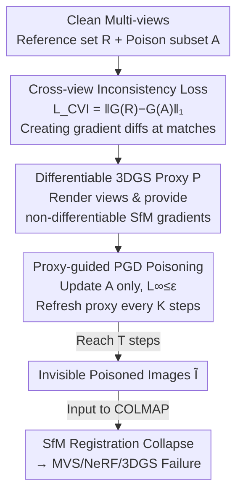

# PoInit-of-View: Poisoning Initialization of Views Transfers Across Multiple 3D Reconstruction Systems

**Conference**: CVPR 2026  
**arXiv**: [2604.16540](https://arxiv.org/abs/2604.16540)  
**Code**: None  
**Area**: AI Security / Adversarial Attacks / 3D Vision  
**Keywords**: Poisoning Attack, SfM Initialization, Cross-View Inconsistency, Black-box Transfer, 3D Reconstruction

## TL;DR
This paper identifies that the geometric core of 3D reconstruction pipelines—the SfM initialization module—is a vulnerable "Achilles' heel." The authors propose PoInit-of-View, which injects perturbations nearly invisible to the human eye into multi-view input images to specifically disrupt the local gradient consistency between views. This triggers a collapse in SfM feature matching, reducing camera registrations from nearly a hundred to single digits, thereby causing downstream MVS, NeRF, and 3DGS to fail entirely. The attack does not depend on specific reconstruction architectures and achieves black-box transfer (e.g., PSNR drops an additional 25.1% in the 3DGS $\rightarrow$ NeRF transfer compared to single-view baselines).

## Background & Motivation
**Background**: Modern 3D reconstruction and novel view synthesis (NeRF, 3DGS, MVS, etc.) are built upon a common prerequisite: using Structure-from-Motion (SfM, typically COLMAP) for geometric initialization. This involves detecting keypoints, cross-view feature matching, estimating camera poses, and triangulating sparse point clouds to provide a geometric skeleton for subsequent dense reconstruction or neural optimization. Without reliable SfM initialization, downstream optimizers often fail to converge to a consistent scene.

**Limitations of Prior Work**: Existing adversarial attacks against 3D reconstruction (NeRFool, IL2-NeRF, Poison-Splat, GaussTrap, etc.) share a common blind spot: they treat the entire reconstruction pipeline as a single black box and backpropagate gradients directly against the final rendering loss. This leads to two issues: first, the attacks **overfit to specific reconstruction architectures** (perturbations against NeRF lose efficacy on 3DGS); second, they operate primarily **within single views** without targeting the truly fragile modules in the pipeline.

**Key Challenge**: While downstream representations (volumetric radiance in NeRF, Gaussian primitives in 3DGS) differ internally, they all **share the same geometric foundation: SfM**. Therefore, attacks should not chase diverse downstream representations but target this "greatest common divisor." However, SfM (COLMAP) is a **non-differentiable off-the-shelf pipeline**, making it impossible to compute gradients directly—a technical barrier to attacking it.

**Goal**: (1) Demonstrate that SfM geometric initialization is a fundamental adversarial vulnerability in 3D reconstruction; (2) Design a poisoning attack that is architecture-agnostic and black-box transferable; (3) Provide a theoretical explanation for why disrupting cross-view consistency causes SfM to collapse.

**Key Insight**: The authors exploit a basic premise of SfM: **the local appearance (edges, texture gradients) of the same 3D point projected onto different views should be approximately consistent**, which is the basis for repeatable descriptor matching. By introducing small, geometrically aligned perturbations with different directions across views, the cross-view gradient consistency is destroyed. This leads to descriptor divergence, matching failure, violation of epipolar constraints, and triangulation errors, causing the entire SfM process to collapse due to insufficient constraints.

**Core Idea**: Use a "Cross-View Inconsistency Loss" $\mathcal{L}_{\mathrm{CVI}}$ to **actively create** gradient differences between corresponding points across views. A differentiable 3DGS proxy model is utilized to obtain gradients that are unavailable from COLMAP. PGD is then used to optimize poisoned images, targeting the common SfM foundation rather than any specific downstream model.

## Method

### Overall Architecture
PoInit-of-View is a black-box poisoning attack. Given a set of clean multi-view images $\mathcal{I}$ and a perception budget $\varepsilon$, the goal is to produce poisoned images $\tilde{\mathcal{I}}$ with an $\ell_\infty$ difference no greater than $\varepsilon$ from the original images. When the victim feeds these into an off-the-shelf SfM (COLMAP), the number of registered images, triangulated keypoints, and sparse 3D points drop sharply, ultimately causing the failure of MVS, NeRF, or 3DGS reconstruction.

The process addresses three interconnected problems: **where to perturb** (disrupting cross-view consistency instead of single-view loss), **where gradients come from** (using a differentiable proxy for non-differentiable SfM), and **how to ensure invisibility** (perceptual regularization and budget constraints). The method comprises: ① Defining $\mathcal{L}_{\mathrm{CVI}}$ as the attack direction with a theoretical chain linking "gradient inconsistency $\rightarrow$ descriptor divergence $\rightarrow$ matching rate decay $\rightarrow$ SfM collapse"; ② Utilizing a differentiable 3DGS proxy model $P$ to render multiple views and provide gradients; ③ Performing $\ell_\infty$-constrained PGD on the poisoned subset $\mathcal{A}$, while maintaining the clean reference set $\mathcal{R}$ as a geometric anchor and refreshing the proxy every $K$ steps to track image changes.

### Key Designs

**1. Cross-View Inconsistency Loss $\mathcal{L}_{\mathrm{CVI}}$: Turning "consistency disruption" into an optimization goal**

This targets the limitation of prior attacks focusing only on single views. The authors formalize the SfM prerequisite (Assumption 1, Cross-view Gradient Consistency): the difference between local Sobel gradients $G(I_i)=(\partial_x I_i, \partial_y I_i)$ of the same 3D point in two clean views should be bounded by $\|G(I_i(p_i)) - G(I_j(p_j))\|_1 \le \tau_g$. The attack **actively breaks this bound**: given reference views $R_i$ and poisoned views $A_j$, it maximizes:

$$\mathcal{L}_{\mathrm{CVI}} = \|G(R_i) - G(A_j)\|_1$$

(Averaged over multiple view pairs in practice). Unlike single-view losses that simply move renderings away from ground truth, $\mathcal{L}_{\mathrm{CVI}}$ explicitly acts on the gradient difference **between views**, creating geometrically aligned, structured perturbations that vary across views—the root cause of SfM failure and cross-architecture transferability.

**2. Theoretical Chain from Gradient Inconsistency to SfM Collapse: Explaining why the attack works**

The authors provide an explanatory theoretical chain. Using the local Lipschitz continuity assumption (Assumption 2), gradient differences are linked to descriptor differences: $L_r^{\min}\|G_1-G_2\|_1 \le \|\phi(G_1)-\phi(G_2)\|_2 \le L_r^{\max}\|G_1-G_2\|_1$. Thus, if $\mathcal{L}_{\mathrm{CVI}} \ge \tau_g + \Delta$, corresponding descriptors diverge: $\|\phi(G(R_i)) - \phi(G(A_j))\|_2 \ge \beta_r \Delta$ (Lemma 1, $\beta_r = L_r^{\min}$). With a light-tailed descriptor distribution assumption (Assumption 3), the expected inlier match rate $\eta$ **decays exponentially** with inconsistency: $\mathbb{E}[\eta] \le \exp(-\alpha \beta_r \Delta)$ (Lemma 2). Finally, Theorem 1 defines the SfM collapse condition: if $m$ critical edges in the pose graph spanning tree are poisoned to $\mathcal{L}_{\mathrm{CVI}} \ge \tau_g + \tau_d / \beta_r + \Delta$, global SfM fails with probability at least $1 - m \exp(-\tfrac{1}{2}\epsilon_c^2 N p_{\text{match}})$, where $p_{\text{match}} = \exp(-\alpha \beta_r \Delta)$. This establishes an **inconsistency threshold** $L_{\mathrm{th}} = \tau_g + \tau_d / \beta_r$; once critical view pairs cross it, matching rates plummet, and SfM collapses due to under-constraint.

**3. Proxy-guided PGD Poisoning: Solving the non-differentiability of SfM**

Since COLMAP is a non-differentiable black box, the authors use a **differentiable 3DGS proxy model** $P$ to approximate the cross-view behavior of the victim. 3DGS is efficient for large-scale optimization. The proxy renders multiple views to reveal how small perturbations affect cross-view geometry, providing the gradients COLMAP cannot. Only the poisoned subset $\mathcal{A}$ is updated, while clean views $\mathcal{R}$ remain as references. Each poisoned image is updated via $\ell_\infty$-constrained PGD:

$$\tilde{I}_k \leftarrow \mathrm{Proj}_{\|\tilde{I}_k - I_k\|_\infty \le \varepsilon} \big(\tilde{I}_k + \alpha \, \mathrm{sign}(\nabla_{\tilde{I}_k} L)\big), \quad k \in \mathcal{A}.$$

The **proxy is refreshed every $K=10$ steps** to account for changing image appearances and visibilities, creating an alternating optimization: the inner loop updates poisoned views, and the outer loop performs lightweight proxy updates. This process runs for a fixed $T$ steps, making the attack "downstream-agnostic."

### Loss & Training
The total objective is a proxy problem with perceptual constraints:

$$\max_{\tilde{\mathcal{I}}} \mathcal{L}_{\mathrm{CVI}}(\tilde{\mathcal{I}}) - \lambda_{\mathrm{SSIM}}(1 - \mathrm{SSIM}(\tilde{\mathcal{I}}, \mathcal{I})) - \lambda_{\mathrm{TV}} \mathrm{TV}(\tilde{\mathcal{I}}), \quad \text{s.t. } \|\tilde{\mathcal{I}} - \mathcal{I}\|_\infty \le \varepsilon.$$

The SSIM and TV terms ensure perturbations are visually imperceptible and smooth. Key hyperparameters: perturbation budget $\rho = 16/255$ ($\ell_\infty$), 15-step PGD with step size $\alpha = 2/255$, random initialization within the $\ell_\infty$ ball. Outer loop iterations: 1000, poisoning ratio $r = 0.6$. Weights: $w_{\text{grad}} = 1.0$, $w_{\text{tv}} = 0.1$, $w_{\text{ssim}} = 0.5$. Evaluations use stock SfM pipelines; the proxy is used only during optimization.

## Key Experimental Results

### Main Results
Evaluated on NeRF-Synthetic, Tanks & Temples (T&T), and Mip-NeRF360. Metrics include SfM internal stats (registered images, triangulated points) and downstream quality (PSNR/SSIM/LPIPS). Results for clean vs. poisoned (in brackets) on T&T with $\rho = 16/255$ using a 3DGS proxy:

| Downstream Pipeline | PSNR↑ | SSIM↑ | LPIPS↓ |
|----------|-------|-------|--------|
| COLMAP (SfM+MVS) | 11.92 → 8.96 (−24.8%) | 0.436 → 0.372 (−14.7%) | 0.606 → 0.693 (+14.4%) |
| Instant NGP (NeRF) | 21.62 → 16.24 (−24.8%) | 0.712 → 0.605 (−15.0%) | 0.340 → 0.440 (+29.4%) |
| Mip-Splatting (3DGS) | 23.93 → 17.63 (−26.0%) | 0.833 → 0.684 (−18.4%) | 0.166 → 0.327 (+92.4%) |

The fact that three internally different pipelines are evenly crippled by the same perturbation confirms the "downstream-agnostic" nature. 3DGS shows the largest LPIPS increase (nearly doubled), indicating that SfM-level perturbations are further amplified by geometry-dependent rendering.

Comparison with baselines (T&T, Mip-Splatting):

| Attack | PSNR | SSIM |
|------|------|------|
| Clean (No attack) | 23.93 | 0.833 |
| Gaussian Noise | 23.43 | 0.821 |
| Single-view Attack [NeRFool/IL2-NeRF] | 23.53 | 0.819 |
| **Ours (Cross-view)** | **17.63** | **0.684** |

Ours drops PSNR by 6.3, while baselines drop only ~0.5, proving that cross-view consistency is the critical vulnerability.

### Ablation Study
Ablation of proxy targets (T&T, Mip-Splatting):

| Configuration | Poison PSNR | Reg.(%) | 3D pts(K) | Downstream PSNR | Note |
|------|------------|---------|-----------|-----------|------|
| Full ($\mathcal{L}_{\text{CVI}}$+SSIM+TV) | 22.3 | 24.3 | 13.7 | **17.63** | Strongest attack |
| w/o SSIM | 24.8 | 27.1 | 15.8 | 19.4 | Weaker attack/perception |
| w/o TV | 25.3 | 28.0 | 16.4 | 19.7 | Weaker attack/perception |
| Photometric-only | 28.7 | 91.2 | 71.5 | 22.8 | **SfM remains intact** |

### Key Findings
- **Cross-view loss is vital**: Removing $\mathcal{L}_{\mathrm{CVI}}$ (Photometric-only) leaves SfM registrations at 91.2%, proving that pixel-wise error alone cannot disrupt cross-view consistency.
- **SSIM/TV Balance**: These terms manage the trade-off between invisibility and attack strength.
- **Critical Budget Threshold**: Registration rates and PSNR crash once $\rho$ exceeds $12/255$, aligning with the theoretical $L_{\mathrm{th}}$ prediction.
- **Structured Perturbations**: Gradient difference maps show the attack introduces geometrically aligned but view-specific structural perturbations rather than random noise.
- **Theoretical Validation**: Increasing $\mathcal{L}_{\mathrm{CVI}}$ corresponds to a monotonic decrease in SfM metrics, with the empirical collapse point matching the theoretical threshold $L_{\mathrm{th}}$.

## Highlights & Insights
- **Attacking Foundation vs. Floors**: While prior work targeted specific NeRF/3DGS behaviors, this paper attacks the shared SfM foundation, achieving cross-architecture and black-box transferability.
- **Physical Loss Formulation**: $\mathcal{L}_{\mathrm{CVI}}$ directly maps to the physical prerequisites of SfM, enabling a principled geometric attack.
- **Differentiable Proxy for Black Boxes**: Using 3DGS as a proxy to differentiate through non-differentiable pipelines is an effective engineering strategy for attacking complex vision systems.

## Limitations & Future Work
- **Heterogeneous SfM Transfer**: Transferability across different SfM implementations (different descriptors/matching backends) requires further study.
- **Stylized Theoretical Model**: Assumptions like local Lipschitz continuity are simplifications for interpretability; precise constant estimation is deferred to the Appendix.
- **Budget Size**: The required budget $\rho > 12/255$ is larger than typical 2D classification attacks. While LPIPS remains low, structural perturbations may be visible under close inspection.

## Related Work & Insights
- **vs. NeRFool / IL2-NeRF**: These require white-box access to downstream models and only disrupt single-view features; Ours is black-box and disrupts cross-view geometry.
- **vs. Poison-Splat / GaussTrap**: These are tied to 3DGS-specific mechanisms (primitive densification or backdoors); Ours is downstream-agnostic.
- **Insight**: Security audits for 3D pipelines should prioritize shared front-end modules (SfM), which are the most effective points for transferable attacks. Defense should focus on robust matching and adversarial regularization during Bundle Adjustment.

## Rating
- Novelty: ⭐⭐⭐⭐⭐
- Experimental Thoroughness: ⭐⭐⭐⭐
- Writing Quality: ⭐⭐⭐⭐
- Value: ⭐⭐⭐⭐⭐

<!-- RELATED:START -->

## Related Papers

- [\[CVPR 2026\] RAVEN: Erasing Invisible Watermarks via Novel View Synthesis](raven_erasing_invisible_watermarks_via_novel_view_synthesis.md)
- [\[CVPR 2026\] RemedyGS: Defend 3D Gaussian Splatting Against Computation Cost Attacks](remedygs_defend_3d_gaussian_splatting_against_computation_cost_attacks.md)
- [\[CVPR 2026\] Red-teaming Retrieval-Augmented Diffusion Models via Poisoning Knowledge Bases](red-teaming_retrieval-augmented_diffusion_models_via_poisoning_knowledge_bases.md)
- [\[AAAI 2026\] Generalizing Fair Clustering to Multiple Groups: Algorithms and Applications](../../AAAI2026/ai_safety/generalizing_fair_clustering_to_multiple_groups_algorithms_and_applications.md)
- [\[CVPR 2026\] Towards Stealthy and Effective Backdoor Attacks on Lane Detection: A Naturalistic Data Poisoning Approach](towards_stealthy_and_effective_backdoor_attacks_on_lane_detection_a_naturalistic.md)

<!-- RELATED:END -->
