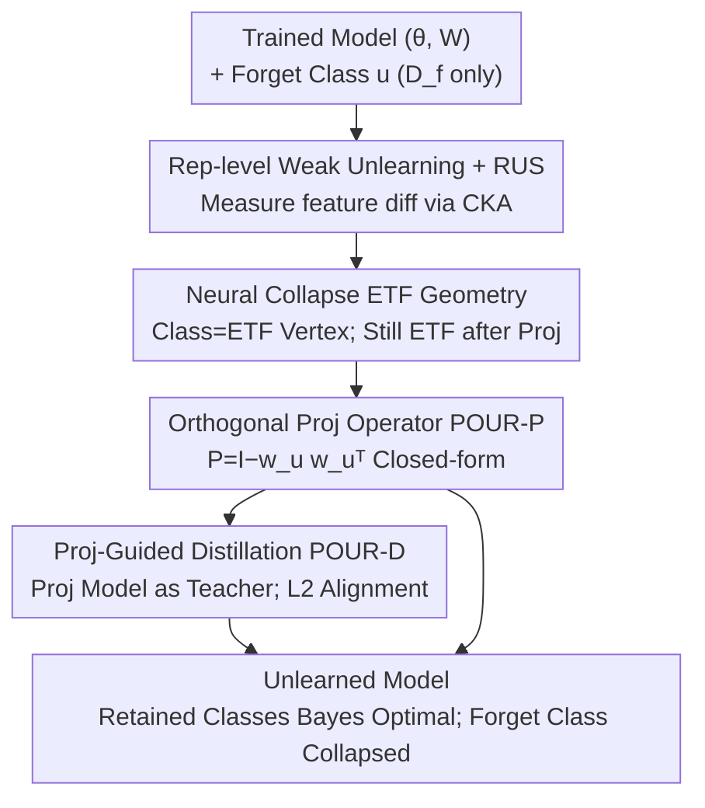

# POUR: A Provably Optimal Method for Unlearning Representation via Neural Collapse

**Conference**: CVPR 2026  
**Paper**: [CVF Open Access](https://openaccess.thecvf.com/content/CVPR2026/html/Le_POUR_A_Provably_Optimal_Method_for_Unlearning_Representation_via_Neural_CVPR_2026_paper.html)  
**Code**: https://github.com/ale256/representation_unlearning  
**Area**: AI Safety / Machine Unlearning / Representation Learning  
**Keywords**: Machine Unlearning, Neural Collapse, Simplex ETF, Orthogonal Projection, Representation-level Unlearning

## TL;DR
This paper advances machine unlearning from "modifying classification heads" to the "feature representation" level. Based on Neural Collapse theory, it proves that "removing a simplex ETF vertex followed by orthogonal projection still yields a simplex ETF." This realizes "forgetting a specific class" as a closed-form projection operator, POUR, with optimality guarantees. POUR outperforms existing unlearning methods on both classification-level and representation-level metrics across CIFAR-10/100 and PathMNIST.

## Background & Motivation
**Background**: Machine unlearning aims to make a model "forget" certain training data or visual concepts without retraining from scratch, satisfying privacy regulations like the "right to be forgotten." Dominant approaches follow **weak unlearning**: unlearning is considered successful if the output logit distributions on the forget and retained sets are indistinguishable from a retrained model.

**Limitations of Prior Work**: Recent studies find these methods often only perturb the classifier's logits while leaving the **underlying feature representations nearly untouched**. This resulting "shallow unlearning" means information about forgotten classes remains in the encoder features and can be recovered via linear probing or feature inversion, causing privacy leaks—especially dangerous for deep visual encoders.

**Key Challenge**: The true battleground for unlearning is the **representation space**, not the output layer. However, existing methods lack metrics to measure the degree of unlearning at the representation level and verified operators to perform it. A few attempts at "projection-based unlearning" (e.g., SVD-based activation decomposition) lack geometric consistency and proofs of optimality.

**Goal**: (1) Provide a definition and computable metrics for representation-level weak unlearning; (2) Characterize the interaction between "unlearning sufficiency, retention fidelity, and inter-class separability"; (3) Propose a provably optimal unlearning operator at the representation level.

**Key Insight**: The authors observe that deep classifiers exhibit **Neural Collapse** (NC) at the terminal phase of training: intra-class features collapse to equidistant centroids, and classifier weights align into a **Simplex Equiangular Tight Frame (Simplex ETF)**, where each class corresponds to one ETF vertex vector. Geometrically, "forgetting a class" is equivalent to "removing its corresponding vector from the representation space."

**Core Idea**: Implement "forgetting class $u$" as an **orthogonal projection along that class's direction** $P=I-w_uw_u^\top/\|w_u\|^2$. The paper proves that removing an ETF vertex and projecting the remaining vertices into the orthogonal subspace results in a lower-dimensional Simplex ETF—preserving the optimal geometry of retained classes while collapsing the forgotten class to the origin.

## Method

### Overall Architecture
The input to POUR is a trained visual classification model (feature extractor $\theta$ + classification head $W$) and class $u$ to be forgotten (access is only allowed to the forget set $D_f$). The output is a new model that forgets class $u$ but remains close to a retrained model on other classes. The method follows a geometric pipeline: quantify unlearning sufficiency using the RUS metric, explain why "projecting out an ETF vertex" is optimal via NC theory, and provide two implementations: POUR-P (closed-form) and POUR-D (distillation).

POUR-P is a one-step closed-form projection applied directly to features. POUR-D uses this projected model as a teacher and "compresses" the unlearning into the feature extractor itself via $L_2$ distillation, updating the encoder using only the forget set.

### Key Designs

**1. Rep-level Weak Unlearning + RUS Metric: Moving unlearning from logits to features**

Traditional weak unlearning only checks if output logits match a retrained model, allowing "shallow unlearning" to pass. This paper **redefines weak unlearning at the representation layer** (Definition 2.1): it requires the feature distribution $P_z^{U(M,D_f)}$ of the unlearned model to be close to the reference retrained model $M_r$ under some distribution divergence $K$ (MMD / Wasserstein-2). To ensure robustness against random initialization and rotations, the authors use **Centered Kernel Alignment (CKA)** as the estimator: $\mathrm{CKA}(X,Y)=\frac{\langle XX^\top,YY^\top\rangle_F}{\|XX^\top\|_F\|YY^\top\|_F}$, which is invariant to scaling and rotation.

Building on this, the **Representation Unlearning Score (RUS)** is defined as the harmonic mean of "forgetting indicator $\Phi_f$" and "retention alignment $\mathrm{CKA}_r$":
$$\mathrm{RUS}^{(*)}=\frac{2\,\Phi_f^{(*)}\,\mathrm{CKA}_r^{(*)}}{\Phi_f^{(*)}+\mathrm{CKA}_r^{(*)}},\quad *\in\{(o),(r)\}$$
where $\Phi_f^{(o)}=1-\mathrm{CKA}_f^{(o)}$ and $\Phi_f^{(r)}=\mathrm{CKA}_f^{(r)}$. Superscript $(o)$ denotes comparison with the original model, while $(r)$ denotes the retrained model. RUS ranges $[0,1]$ and is high only when **forgetting is thorough and retention is faithful**.

**2. Three-term Decomposition: Revealing the interaction of unlearning factors**

The authors decompose the difference between unlearned and retrained feature distributions $K(P_z^{(f)},P_z^{(r)})$. Proposition 2.2 proves it is upper-bounded by three terms: **Inter-class separability** $|\alpha-\beta|\Delta_c$, **forget class difference** $\alpha K(P_u^{(f)},P_u^{(r)})$, and **retained class difference** $(1-\alpha)K(P_{\neg u}^{(f)},P_{\neg u}^{(r)})$.

Insight: As $\alpha$ (probability of predicting the forget class) drops to 0, the inter-class term simplifies to $\alpha\Delta_c$. **If classes are well-separated in the retrained space ($\Delta_c$ is large), unlearning supervision is more effective** using just the forget set. Conversely, when classes are highly entangled (e.g., CIFAR-100), "forget-set-only" strategies weaken.

**3. Two New NC Properties: ETF $\iff$ Bayes Optimality + ETF under Projection**

This is the theoretical foundation of POUR. The authors prove two **new properties**. Proposition 3.1: Under isotropic Gaussian class-conditional distributions, a Simplex ETF is not just an optimization artifact but a **sufficient condition for Bayes optimality**—it uniquely maximizes the minimum pairwise angle between class means.

Proposition 3.2 (Key): For a fixed vertex $u$, let $P=I-v_uv_u^\top$ be the orthogonal projection onto $v_u^\perp$. Define $g_i=Pv_i/\|Pv_i\|$ for $i\neq u$. Then $\{g_i\}$ **still forms a Simplex ETF of size $C-1$** in the lower-dimensional subspace. This "projection invariance" ensures that after a class is forgotten, the **perfect angular separation between retained classes remains intact**.

**4. POUR-P Operator and POUR-D Distillation**

**POUR-P** (Closed-form): For class $u$, use classifier weight $w_u$ to construct $P=I-\frac{w_uw_u^\top}{\|w_u\|^2}$. Forget features are $z'=Pz$. If classifier weights are unavailable (e.g., pure encoders), estimate the direction using the empirical class mean of the forget set. Theorem 4.2 proves POUR-P is Bayes optimal on retained classes and representationally equivalent to a retrained model.

**POUR-D** (Distillation): Since POUR-P only modifies "post-hoc features," POUR-D uses the projected model $(P\theta, W)$ as a **teacher**. A student encoder $\theta_s$ aligns with the teacher on the forget set using $L_2$ loss: $\mathcal{L}_{\text{POUR-D}}(x)=\|\theta_s(x)-P\theta(x)\|_2^2,\ x\in D_f$. This **propagates unlearning into the feature extractor**.

### Loss & Training
POUR-P involves no training (closed-form). POUR-D fine-tunes the feature extractor only on the forget set $D_f$ using the $L_2$ alignment loss $\mathcal{L}_{\text{POUR-D}}$, while the classification head $W$ remains fixed. It follows the standard unlearning protocol with no access to the retained set.

## Key Experimental Results

Backbones: ResNet-18 for CIFAR-10/100, ViT-S/16 for PathMNIST. Baselines include Finetune, FCS, Random Label, Gradient Ascent, Boundary Shrink/Expand, and DELETE.

### Main Results

On CIFAR-10 (ResNet-18, forget set only), POUR achieved the best classification-level AUS and representation-level RUS:

| Method | Acc_r ↑ | Acc_f ↓ | AUS ↑ | RUS(r) ↑ | rMIA ↓ |
|------|---------|---------|-------|----------|--------|
| Original | 94.47 | 95.03 | 0.51 | 0.42 | 56.70 |
| Retrained (Upper) | 94.68 | 0.00 | 1.00 | 1.00 | – |
| Gradient Ascent | 86.71 | 15.37 | 0.80 | 0.29 | 50.40 |
| DELETE | 88.73 | 2.43 | 0.92 | 0.39 | 53.43 |
| **POUR-P (ours)** | **94.97** | **0.00** | **1.01** | – | 56.67 |
| **POUR-D (ours)** | 92.86 | 0.37 | 0.97 | **0.47** | 51.80 |

On CIFAR-100, POUR-P reached an AUS of 1.00. On PathMNIST, POUR-D maintained high RUS across internal and external test sets, while baselines like Random Label failed on external tests (showing they merely "masked" the forget set).

### Ablation Study

| Config / Scenario | Key Metric | Description |
|------|---------|------|
| POUR-P vs POUR-D | AUS 1.01 vs 0.97 | P is optimal at the classification level; D is better at the representation level. |
| NC Hypothesis | Mean pairwise angle ≈ ETF | Standard training naturally reaches NC geometry on all three datasets. |
| Cross-modal CLIP | Bison: Acc_f drops 94% | Removing text embeddings unlearns classes without hurting others. |
| Segmentation (VOC) | Cat: IoU_f 93→0 | Projection works for segmentation; forget class IoU hits zero. |

### Key Findings
- **Representation-level unlearning is critical**: While DELETE achieves low $\text{Acc}_f$, RUS/CKA metrics reveal residual information. POUR minimizes both.
- **Class separability determines feasibility**: High entanglement in CIFAR-100 makes forget-set-only unlearning harder, as predicted by the $\alpha\Delta_c$ term.
- **Geometric principles are universal**: The same projection logic transfers to VLM and segmentation tasks.

## Highlights & Insights
- **Geometrization of Unlearning**: Turning unlearning into "removing an ETF vertex + orthogonal projection" provides the first provably optimal, closed-form operator.
- **RUS Metric Utility**: Using the harmonic mean of CKA alignment provides a unified evaluation for representation unlearning that is harder to "cheat" than logit-based metrics.
- **Dual Forms**: POUR-P offers instant zero-training unlearning, while POUR-D robustly embed unlearning into the encoder.

## Limitations & Future Work
- **Dependency on NC Hypothesis**: Theory relies on ETF geometry and isotropic distributions, which require over-parameterization and training until convergence.
- **Class-level Focus**: The method is designed for class-level unlearning; optimality for sub-concepts or single-sample unlearning is not fully explored.
- **Segmentation Side-effects**: On VOC2012, while the target class is erased, retained class IoU drops by 1-7 points in unbalanced scenarios.

## Related Work & Insights
- **vs. Weak Unlearning (Logit Alignment)**: These methods often perturb only the head; POUR modifies the representation geometry, making rMIA and CKA closer to a retrained model.
- **vs. SVD-based Projection**: Unlike prior SVD activation methods, POUR anchors the projection in NC's ETF structure, proving that the geometry of retained classes is perfectly preserved and Bayes optimal.

## Rating
- Novelty: ⭐⭐⭐⭐⭐ Geometrizing class unlearning via NC as an optimal projection is a significant contribution.
- Experimental Thoroughness: ⭐⭐⭐⭐ Broad coverage across CIFAR, PathMNIST, CLIP, and Segmentation.
- Writing Quality: ⭐⭐⭐⭐ Clear progression from theory to algorithm to experiments.
- Value: ⭐⭐⭐⭐ Provides a provable, evaluable framework for representation-level unlearning.

<!-- RELATED:START -->

## Related Papers

- [\[CVPR 2026\] POUR: A Provably Optimal Method for Unlearning Representations via Neural Collapse](pour_a_provably_optimal_method_for_unlearning_representations_via_neural_collaps.md)
- [\[CVPR 2026\] Roots Beneath the Cut: Uncovering the Risk of Concept Revival in Pruning-Based Unlearning for Diffusion Models](roots_beneath_the_cut_uncovering_the_risk_of_concept_revival_in_pruning-based_un.md)
- [\[CVPR 2026\] Unlearning without Forgetting: Securely Removing Targeted Concepts from Large-Scale Vision-Language Open-Vocabulary Detectors](unlearning_without_forgetting_securely_removing_targeted_concepts_from_large-sca.md)
- [\[CVPR 2026\] FedMOP: Achieving Enhanced Privacy and Performance in Federated Learning via Momentum Orthogonal Projection](fedmop_achieving_enhanced_privacy_and_performance_in_federated_learning_via_mome.md)
- [\[CVPR 2026\] Forensic-Friendly Image Manipulation via Controllable Latent Diffusion](forensic-friendly_image_manipulation_via_controllable_latent_diffusion.md)

<!-- RELATED:END -->
