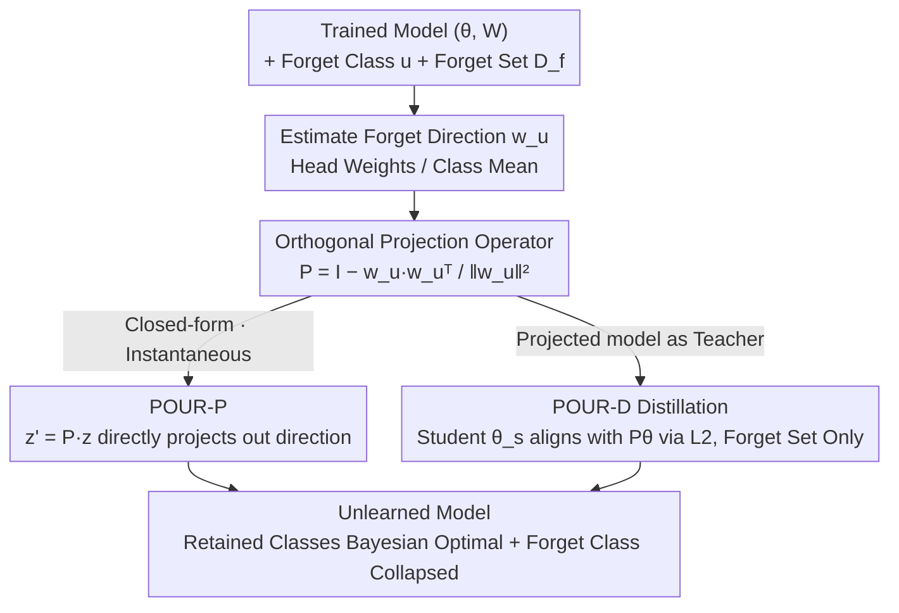

# POUR: A Provably Optimal Method for Unlearning Representations via Neural Collapse

**Conference**: CVPR 2026  
**arXiv**: [2511.19339](https://arxiv.org/abs/2511.19339)  
**Code**: https://github.com/ale256/representation_unlearning (Available)  
**Area**: AI Security / Machine Unlearning / Privacy Protection  
**Keywords**: Machine Unlearning, Representation Unlearning, Neural Collapse, ETF, Orthogonal Projection

## TL;DR
Aiming at the problem where existing machine unlearning methods only modify the classification head while forgotten class information remains in the features, this paper elevates "unlearning" to the representation level. Using the geometry of the simplex-ETF in Neural Collapse, it proves that "removing a class = orthogonal projection along its direction results in an ETF remaining an ETF." This result yields the closed-form projection operator POUR-P and its distillation variant POUR-D. These methods refresh both class-level and representation-level unlearning metrics on CIFAR-10/100 and PathMNIST, and provide a formal proof of optimality under the definition of representation-level weak unlearning.

## Background & Motivation

**Background**: Machine unlearning aims to erase the influence of specific classes/samples/concepts from a trained model without retraining from scratch. This is motivated by privacy regulations like the "right to be forgotten," the removal of spurious correlations, and the safe deployment of large models in sensitive scenarios (e.g., medical, autonomous driving). Mainstream approaches belong to **weak unlearning**: requiring only that the logit distributions of the forget set and retain set are indistinguishable from those of a retrained model.

**Limitations of Prior Work**: Recent research (kim2025arewe) found that methods aligning only the final logits **do not truly unlearn**—they often only perturb the classification head while leaving underlying feature representations nearly intact. Consequently, information about the forgotten class remains in the features and can be extracted via linear probing or feature inversion, causing privacy leaks. This is particularly fatal for deep vision encoders where internal representations leak visual concepts.

**Key Challenge**: Unlearning must occur at the **feature representation layer** rather than just the output layer. However, representation-level unlearning lacks principled metrics to "quantify how much is forgotten vs. retained" and lacks a theoretically guaranteed unlearning operator that does not damage the geometric structure of the retained classes. Previous work (kodge2024deep) used SVD for "projection as unlearning" in activation space, which was heuristic and lacked geometric consistency or theoretical guarantees.

**Goal**: (1) Extend the definition of weak unlearning from the logits layer to the representation layer and provide computable metrics; (2) Find an unlearning operator that can both completely remove the forget class and provably preserve the optimal geometry of the retain classes.

**Key Insight**: The authors observe that deep classifiers exhibit **Neural Collapse (NC)** during the convergence phase—features of each class collapse to an equidistant centroid, and classification head weights align as a **simplex Equiangular Tight Frame (ETF)**, where each class corresponds to one direction of the ETF. Thus, "unlearning a class" naturally corresponds to "removing its specific vector from the representation space."

**Core Idea**: Implement class unlearning as an **orthogonal projection along the direction of the forgotten class**. The authors prove that when a vertex is removed from a simplex ETF and projected onto its orthogonal complement, the remaining classes still constitute a lower-dimensional simplex ETF. Thus, the projection collapses the forgotten class features to the origin while perfectly preserving the optimal angular separation among retained classes, making it a "provably optimal" unlearning operator.

## Method

### Overall Architecture
POUR takes as input a trained model $(\theta, W)$ (feature extractor + classification head), the class to be forgotten $u$, and a forget set $\mathcal{D}_f$ containing only samples of the forgotten class (**no access to the retain set throughout**). It outputs an unlearned model that provides uniform predictions for $u$ while remaining Bayesian optimal for retained classes. The pipeline consists of three steps: first, estimate the direction of the forgotten class from the head weight $w_u$ (or class mean if only the encoder is available) and construct an orthogonal projection operator $P$ to remove this direction. Then, apply it via two variants: **POUR-P** directly appends $P$ after the features for closed-form, one-time unlearning (instantaneous, no training required). **POUR-D** uses the projected model as a **teacher** and employs L2 distillation to compress "unlearning" into the student encoder parameters (using only the forget set), making the unlearning deeper and more robust. Finally, NC geometry ensures that the unlearned representation differs from a retrained model only by an orthogonal transformation, achieving optimality under the representation-level weak unlearning definition.

### Key Designs

**1. Representation-level weak unlearning definition + RUS metric: Quantifying "true unlearning" at the feature layer**

Traditional weak unlearning only considers the final logit distribution, allowing for "fake unlearning." The authors redefine this at the feature layer: an unlearning operator $\mathcal{U}$ is considered to satisfy **representation-level weak unlearning** when the feature distribution of the unlearned model is sufficiently close to that of a retrained reference model $M_r$, i.e., $\mathcal{K}(P_z^{\mathcal{U}}, P_z^{M_r}) < \epsilon$ (where $\mathcal{K}$ can be MMD / Wasserstein-2 / Energy Distance). Due to training randomness (random initialization, feature basis rotation, scaling), directly comparing feature distributions is unstable. Thus, **CKA (Centered Kernel Alignment)**, which is invariant to rotation and scaling, is used as a practical estimate: $\text{CKA}(X,Y)=\frac{\langle XX^\top, YY^\top\rangle_F}{\|XX^\top\|_F\,\|YY^\top\|_F}$.

Based on this, the core metric **Representation Unlearning Score (RUS)** is defined as the harmonic mean of the "unlearning indicator $\Phi_f$" and "retention alignment $\text{CKA}_r$":

$$\text{RUS}^{(*)} := \frac{2\,\Phi_f^{(*)}\,\text{CKA}_r^{(*)}}{\Phi_f^{(*)} + \text{CKA}_r^{(*)}}, \quad (*)\in\{(o),(r)\}$$

Where $\Phi_f^{(o)}=1-\text{CKA}_f^{(o)}$ when using the original model as a reference (lower similarity to the original model on the forget set is better), and $\Phi_f^{(r)}=\text{CKA}_f^{(r)}$ when using the retrained model as a reference (higher similarity to the retrained model is better). RUS values range in $[0,1]$; high scores require both "forget set feature change + retain set feature preservation." $(r)$ is the theoretical ideal using a retrained model, while $(o)$ serves as a practical proxy using the original model.

**2. Two new NC properties: Upgrading ETF geometry from a "training byproduct" to a "theoretical foundation for unlearning"**

Previously, simplex ETFs were treated only as descriptive limits of training dynamics. This paper proves two new properties useful for unlearning. First, **ETF \implies Bayesian optimality**: under the assumption that class-conditional features follow isotropic Gaussians $x\mid y{=}i \sim \mathcal{N}(v_i, \sigma^2 I_d)$, the simplex ETF uniquely maximizes the minimum pairwise angle between class means and the multi-class angular margin of the nearest-class-mean classifier. In the $\sigma^2\to 0$ limit, its decision rule coincides with the Bayesian optimal classifier. Second, **Projection Invariance**: for a forgotten class $u$, let $P=I-v_u v_u^\top$ be the orthogonal projection onto $v_u^\perp$. Defining $g_i = Pv_i/\|Pv_i\|$ for $i\neq u$, the set $\{g_i\}$ still forms a simplex ETF of size $C{-}1$ in the lower-dimensional space, satisfying $g_i^\top g_j = -\frac{1}{C-2}$. This invariance ensures that "unlearning one class via projection" does not lose any of the perfect angular separation between remaining classes.

**3. POUR-P Projection Operator: Closed-form, instantaneous, unlearning without training**

To unlearn class $u$, an orthogonal projection operator is constructed directly from the head weight $w_u$:

$$P = I - \frac{w_u w_u^\top}{\|w_u\|^2}$$

The unlearned features become $z' = Pz$, effectively removing the component along the forgotten class direction. Due to Property 2, this step maps features to a $(C{-}1)$-class simplex ETF subspace, preserving the optimal geometry of retained classes while collapsing forgotten class features toward the origin (corresponding to uniform predictions). If $w_u$ is unavailable, it is estimated using the empirical class mean of features on the forget set.

**4. POUR-D Projection-Guided Distillation: Compressing unlearning into encoder parameters**

To truly embed unlearning into the feature extractor rather than just appending a post-hoc projection, POUR-D introduces teacher-student distillation. The **teacher is the projected POUR-P model** $(P\theta, W)$, which has already encoded the "unlearned ETF geometry." The student fine-tunes encoder parameters only on the forget set to align with the teacher using a per-sample L2 loss:

$$\mathcal{L}_{\text{POUR-D}}(x) = \|\theta_s(x) - P\theta(x)\|_2^2, \quad x\in\mathcal{D}_f$$

Since NC implies that class means form a simplex ETF and the head aligns with them, this L2 loss forces the student to match the teacher in both direction and scale. The authors also prove (Prop 4.1) that after row-centering, $\|Z-T\|_F\to 0$ implies $\text{CKA}(Z,T)\to 1$, theoretically connecting L2 alignment with the representation-level unlearning metrics (CKA/RUS).

### Loss & Training
- POUR-P: No training, closed-form single projection $z'=Pz$.
- POUR-D: Teacher = projected model $(P\theta,W)$; student fine-tunes encoder on $\mathcal{D}_f$ with $\mathcal{L}_{\text{POUR-D}}=\|\theta_s(x)-P\theta(x)\|_2^2$. **Only forget set is used throughout.**
- Optimality (Thm 4.2): Under NC + balanced prior + isotropic Gaussian assumptions, POUR-P projection ensures (a) retained classes form a simplex ETF (differing from the retrained model only by an orthogonal transformation) and are Bayesian optimal; (b) forgotten class features collapse to the origin as $\sigma^2\to 0$, yielding a uniform distribution ($\alpha=0$). Thus, representation-level discrimination $\mathcal{K}$ reaches the minimum defined in Def 2.1.

## Key Experimental Results

Setup: ResNet-18 on CIFAR-10/100 (modified for 32x32 input) and ViT-S/16 on PathMNIST. Protocols follow recent unlearning standards: **no access to the retain set** during unlearning.

### Main Results

ResNet-18 / CIFAR-10 (Selected forget-set-only methods + references):

| Method | Acc$_r$↑ | Acc$_f$↓ | AUS↑ | rMIA↓ | RUS$^{(o)}$↑ | RUS$^{(r)}$↑ |
|------|---------|---------|------|-------|-------------|-------------|
| Original Model | 94.47 | 95.03 | 0.51 | 56.70 | 0.00 | 0.42 |
| Retrained (Upper Bound) | 94.68 | 0.00 | 1.00 | – | 0.84 | 1.00 |
| Gradient Ascent | 86.71 | 15.37 | 0.80 | 50.40 | 0.79 | 0.29 |
| Boundary Shrink | 85.30 | 12.33 | 0.81 | 53.07 | 0.80 | 0.42 |
| DELETE | 88.73 | 2.43 | 0.92 | 53.43 | 0.71 | 0.39 |
| **POUR-P (Ours)** | **94.97** | **0.00** | **1.01** | 56.67 | – | – |
| **POUR-D (Ours)** | 92.86 | 0.37 | 0.97 | **51.80** | **0.85** | **0.47** |

> POUR-P does not change the encoder representation, so representation-level metrics remain unchanged by definition (it still achieves SOTA with a classification-level AUS of 1.01). POUR-D refreshes both $(o)$ and $(r)$ versions of representation-level RUS, proving unlearning truly occurs in the representation space.

ResNet-18 / CIFAR-100 (Higher difficulty, class entanglement):

| Method | Acc$_r$↑ | Acc$_f$↓ | AUS↑ | RUS$^{(r)}$↑ | rMIA↓ |
|------|---------|---------|------|-------------|-------|
| Original Model | 77.69 | 92.00 | 0.52 | 0.68 | 62.00 |
| Retrained (Upper Bound) | 76.28 | 0.00 | 1.00 | 1.00 | – |
| Random Label | 61.98 | 11.00 | 0.76 | 0.46 | 49.00 |
| Boundary Shrink | 68.87 | 4.00 | 0.88 | 0.62 | 49.00 |
| **POUR-P (Ours)** | **77.65** | **0.00** | **1.00** | – | 62.00 |
| **POUR-D (Ours)** | 73.44 | 1.00 | **0.95** | **0.65** | 46.00 |

### Ablation Study

Contribution analysis is primarily handled through the **POUR-P vs POUR-D comparison** and **class separation analysis**:

| Configuration | Key Phenomenon | Description |
|------|---------|------|
| POUR-P (Closed-form) | Maxed classification AUS (1.01/1.00) | Instantaneous; perfect retained geometry but encoder remains unchanged. |
| POUR-D (Distillation) | SOTA representation RUS | Compresses unlearning into parameters; most thorough feature unlearning and best rMIA. |
| CIFAR-100 (Entanglement) | Higher CKA$_f^{(r)}$ | Strong class entanglement makes forget-set-only supervision weak, confirming the three-term decomposition analysis. |

### Key Findings
- **Three-term decomposition**: Explain why forget-set-only is sometimes insufficient. When class separation ($\Delta_c$) is large, unlearning is more effective.
- **POUR-D achieves the lowest rMIA**: This indicates that performing unlearning at the representation level significantly reduces the success rate of membership inference attacks compared to logit-only methods.
- t-SNE visualizations show POUR's unlearned representation structure is closest to the gold-standard retrained model.

## Highlights & Insights
- **Translating "unlearning a class" into "removing an ETF vertex" is a beautiful geometric insight.** This paper is the first to use Neural Collapse as an actionable unlearning tool rather than just a descriptive limit.
- **The RUS harmonic mean metric is reusable** for any task requiring simultaneous "clean deletion + complete retention" (e.g., concept erasure, bias removal).
- **The L2 Distillation ⇄ CKA Convergence bridge (Prop 4.1)** connects easily optimized L2 losses to representation similarity goals, which can be transferred to other alignment tasks.
- The process requires **no retain set**, fitting real-world constraints where original data might be inaccessible.

## Limitations & Future Work
- **Reliance on NC assumptions**: Simplex ETF and isotropic Gaussian assumptions may not hold in real-world large-scale models or imbalanced datasets.
- **Single-class focus**: The method revolves around removing one ETF direction; extension to sample-level, concept-level, or multi-class unlearning is not fully explored.
- **POUR-P does not modify the encoder**: It requires POUR-D's additional training to resist feature inversion attacks. POUR-D itself results in a slight drop in Acc$_r$ due to fine-tuning on only the forget set.

## Related Work & Insights
- **vs kodge2024deep (SVD Projection)**: Both use projection, but this work anchors projection in NC geometry, providing closed-form operators and proofs of Bayesian optimality.
- **vs DELETE (Decoupled Distillation)**: While both use distillation, POUR aligns **representations** rather than probabilities, leading to superior RUS and rMIA.
- **vs Boundary Shrink/Expand**: Local adjustments to decision boundaries cannot reproduce the representation structure of a retrained model as POUR does.

## Rating
- Novelty: ⭐⭐⭐⭐⭐ First to turn NC into a provably optimal unlearning operator.
- Experimental Thoroughness: ⭐⭐⭐⭐ Strong dual metrics and visualizations, though dataset scale is academic.
- Writing Quality: ⭐⭐⭐⭐⭐ Clear logical flow from definition to proof.
- Value: ⭐⭐⭐⭐ High practical value for privacy-constrained unlearning.

<!-- RELATED:START -->

## Related Papers

- [\[CVPR 2025\] Detecting Out-of-Distribution through the Lens of Neural Collapse](../../CVPR2025/ai_safety/detecting_out-of-distribution_through_the_lens_of_neural_collapse.md)
- [\[CVPR 2026\] VMD-FACT: A New Video Dataset and MLLM-based method for Detecting Realistic AI-Generated Video Misinformation](vmd-fact_a_new_video_dataset_and_mllm-based_method_for_detecting_realistic_ai-ge.md)
- [\[ICLR 2026\] How to Cure Newton for Unlearning Neural Networks? An Empirical Study from the Hessian Perspective](../../ICLR2026/ai_safety/how_to_cure_newton_for_unlearning_neural_networks_an_empirical_study_from_the_he.md)
- [\[CVPR 2026\] Roots Beneath the Cut: Uncovering the Risk of Concept Revival in Pruning-Based Unlearning for Diffusion Models](roots_beneath_the_cut_uncovering_the_risk_of_concept_revival_in_pruning-based_un.md)
- [\[CVPR 2026\] Unlearning without Forgetting: Securely Removing Targeted Concepts from Large-Scale Vision-Language Open-Vocabulary Detectors](unlearning_without_forgetting_securely_removing_targeted_concepts_from_large-sca.md)

<!-- RELATED:END -->
