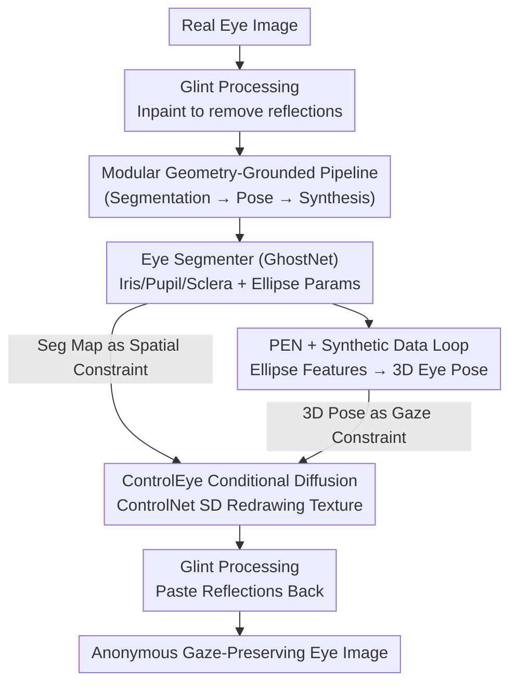

# PrivateEyes: Gaze-Preserving Anonymization for Data Sharing

**Conference**: CVPR 2026  
**Paper**: [CVF Open Access](https://openaccess.thecvf.com/content/CVPR2026/html/Gupta_PrivateEyes_Gaze-Preserving_Anonymization_for_Data_Sharing_CVPR_2026_paper.html)  
**Code**: None  
**Area**: AI Security / Privacy Preservation  
**Keywords**: Eye image anonymization, gaze preservation, iris privacy, conditional diffusion, ControlNet

## TL;DR
PrivateEyes utilizes a three-stage pipeline consisting of "segmentation + 3D eye pose estimation + ControlNet conditional diffusion" to re-synthesize eye images. By removing identifiable iris biometric features (reducing iris recognition rates by approximately 50%) while preserving gaze direction (achieving >10% higher gaze estimation accuracy than SOTA anonymization methods), it enables the compliant sharing of eye-tracking datasets.

## Background & Motivation
**Background**: Eye tracking in AR/VR head-mounted displays (HMDs) requires large-scale, publicly shareable eye image datasets to train robust models. However, eye images naturally encode iris textures—unique biometric identifiers—which cannot be freely shared due to regulations like GDPR. Consequently, eye-related research has long been hindered by the lack of public datasets.

**Limitations of Prior Work**: Existing eye image anonymization methods fall into two suboptimal categories. Geometric methods, such as the Rubber Sheet Model (RSM), replace the iris using polar coordinate unwrapping, which introduces distortion at boundaries and destroys geometric structures critical for gaze inference. Appearance-based methods, such as Iris Style Transfer (IST), use neural style transfer to alter iris textures but suffer from color mismatch, texture artifacts, and blurred pupil-sclera boundaries, resulting in poor photo-realism. Both approaches ultimately **fail to achieve true anonymity (irises remain recognizable) while degrading downstream gaze estimation**, and most are end-to-end frameworks with poor controllability and interpretability.

**Key Challenge**: A trade-off exists between anonymization strength (low iris recognition rate) and task utility (low gaze error)—the more aggressively iris identity is removed, the more likely gaze geometry is compromised. Prior methods fail to balance these two objectives simultaneously.

**Goal**: To synthesize an eye image that "conceals individual identity while maintaining the original gaze direction," allowing for the release of anonymous images (rather than model parameters, thereby avoiding model-side privacy risks such as membership inference or training sample memorization).

**Key Insight**: Instead of an end-to-end generator, the authors adopt a **modular, geometry-grounded pipeline**. This involves explicitly extracting the semantic structure (segmentation map) and 3D pose of the eye as control signals, then allowing a diffusion model to re-generate textures under these "identity-agnostic" geometric conditions. This naturally replaces identity information (iris texture) during re-synthesis while explicitly preserving the geometry relied upon by gaze (pupil/iris ellipses, 3D eye pose).

**Core Idea**: Use "segmentation + 3D pose" as identity-agnostic geometric control signals for conditional diffusion synthesis, decoupling biometric identity from gaze—the first framework to use diffusion models for large-scale gaze-preserving eye image anonymization.

## Method

### Overall Architecture
PrivateEyes is a three-module serial generation pipeline that takes a real eye image as input and outputs an anonymized image with consistent gaze. The process follows three steps: ① **Eye Segmenter** uses GhostNet to partition the eye into three semantic regions (iris, pupil, sclera) and fits elliptical parameters for the iris and pupil; ② **Eye Pose Estimator (PEN)** infers the 3D eye pose from these elliptical features—trained on 6 million data points synthesized via an "anatomical 3D eye model + backward ray tracing"; ③ **ControlEye** uses the segmentation map (spatial constraint) and 3D pose embedding (gaze constraint) as ControlNet signals to drive Stable Diffusion in re-synthesizing photo-realistic anonymous eye images. Additionally, **corneal reflections (glints)** are handled separately in pre- and post-processing: they are inpainted out before synthesis and pasted back afterward to preserve photometric cues required by glint-based gaze estimators.

The design philosophy is that identity is hidden in "texture," while gaze depends on "geometry." By explicitly extracting geometry (segmentation + pose) as control signals and allowing the diffusion model to redraw the texture, the identity is removed while the gaze is locked.

### Key Designs

**1. Modular Geometry-Grounded Pipeline: Decoupling Anonymization and Gaze Preservation**

Addressing the poor controllability and the conflict between anonymity and gaze in end-to-end methods, the authors split the process into "explicit geometry extraction" and "texture redrawing under geometric conditions." The key insight is that identifiable biometric identity is primarily encoded in iris **texture**, whereas gaze direction depends only on pupil/iris **geometry** (elliptical shape + 3D pose). By providing identity-agnostic geometric control signals to the generator, the diffusion model can freely re-generate texture while keeping the geometry fixed, thus removing identity while preserving gaze. This decoupling allows each module to be improved independently without end-to-end retraining and makes the anonymization process interpretable.

**2. PEN + Synthetic Data Loop: Generating 6M Samples via Ray-Traced Anatomical Eye Models**

2D segmentation maps alone are insufficient to constrain 3D optical and pose information. Thus, the authors provide a 3D eye pose to ControlEye. However, real eye images lack 3D pose ground-truth. To solve this, they created a synthetic data loop based on Aguirre’s anatomical 3D eye model (modeling the cornea via Navarro’s "canonical representation"). They used **backward ray tracing** to project this model onto a virtual camera plane. Rays originate from the camera sensor $R(t) = R_0 + t \cdot r$ (where $R_0$ is camera position, $r$ is direction, and $t$ is distance) and intersect with the cornea/lens modeled as quadric surfaces:

$$\frac{(x-h)^2}{a^2} + \frac{(y-k)^2}{b^2} + \frac{(z-d)^2}{c^2} = 1$$

At refractive surfaces, the refracted direction $r'$ is calculated using indices $n_1, n_2$: $r' = \frac{n_1}{n_2} r - \left(\frac{n_1}{n_2}\cos\theta_1 - \cos\theta_2\right) N$ (where $N$ is the normal, and $\theta_1, \theta_2$ are incidence/refraction angles). This generates 2D segmentation maps directly from 3D geometry without appearance modeling. The Pose Estimation Network (PEN), an MLP, maps 2D ellipse features $f_{\text{eye},2D} = (e_{\text{pupil}}, e_{\text{iris}})$ to 3D pose: $\text{pose} = (r_{\text{azi}}, r_{\text{ele}}, r_{\text{tor}}, t_x, t_y, d, r_{\text{pupil}})$.

**3. ControlEye Conditional Diffusion Synthesis: Ensuring Gaze Consistency via ControlNet**

ControlEye, built on ControlNet and Stable Diffusion, injects two types of control: segmentation maps for **spatial constraints** and a pose embedding $C$ for **gaze intent**. The pose embedding is processed via a CLIP text encoder. Feature modulation occurs across 12 trainable U-Net blocks at four resolutions ($64{\times}64, 32{\times}32, 16{\times}16, 8{\times}8$). A **3D gaze alignment constraint** is added to force the generated gaze to match the input. The denoising function is:

$$x_{t-1} = x_t - \epsilon_\theta(x_t, t, y, C) + \sqrt{\beta_t}\, z$$

The training loss is:

$$L_{\text{ControlEye}} = \mathbb{E}_{x_0, C, t, \epsilon}\left[\|\epsilon - \epsilon_\theta(x_t, t, y, C)\|^2\right]$$

This allows the model to anonymize via texture changes while locking the gaze via $C$.

**4. Glint Handling: Accommodating Reflection-Based Estimators**

Corneal reflections (glints) are vital for many model-based gaze trackers but are often lost during diffusion synthesis. The authors use a pre-processing step to inpaint glints out and a post-processing step to paste the original glints back, ensuring compatibility with glint-based systems.

### Loss & Training
The diffusion model is implemented in PyTorch and trained on a single V100 (32GB) with a learning rate of $10^{-4}$ and batch size of 4. A DDPM scheduler is used with $T_{\text{diff}}=1000$ steps (reduced to 20 for inference) and a guidance scale of 3.0.

## Key Experimental Results

Experiments used three real infrared eye-tracking datasets: OpenEDS2019, EV-Eye, and LPW. Metrics included image quality (FID/KID), task utility (Gaze Error °, Segmentation mIoU), and identity protection (Iris Recognition Rate %).

### Main Results (Table 1 Excerpt)
Gaze error should be low; iris recognition (C=cropped, F=full) should be low for better anonymity.

| Method | Dataset | Gaze Error ° ↓ | Iris Recog (C) % ↓ | Iris Recog (F) % ↓ |
|------|--------|-------------|----------------|----------------|
| Iris Style Transfer | EV-Eye | 4.8 | 90.0 | 96.3 |
| Rubber Sheet | EV-Eye | 3.52 | 69.0 | 89.9 |
| **Ours (w/ PEN)** | EV-Eye | **2.89** | **17.7** | **16.7** |
| Iris Style Transfer | LPW | 1.91 | 81.1 | 97.5 |
| Rubber Sheet | LPW | 2.62 | 79.4 | 95.6 |
| **Ours (w/ PEN)** | LPW | **2.51** | **18.1** | **17.3** |

PrivateEyes reduces iris recognition to ~14–17% (a >50% drop compared to baselines) while maintaining lower gaze error. Since the entire image is redrawn, pericorneal features (lashes, skin) are also anonymized.

### Ablation Study

| Configuration | Observation |
|------|---------|
| Ours w/ PEN | Full model; lowest gaze error. |
| Ours w/o PEN | Removing 3D pose embedding increases gaze error (e.g., EV-Eye 2.89→3.33°), while anonymity remains nearly unchanged. |

### Key Findings
- **PEN mainly contributes to gaze accuracy**: Adding the pose embedding consistently reduced gaze error across all datasets without affecting iris recognition, confirming the decoupling of gaze and identity.
- **Superior Geometric Accuracy**: PrivateEyes achieved center errors < 1px and angular deviations ≈5°, outperforming traditional blurring/noising (which had >25° deviation).
- **Downstream Friendliness**: Anonymization did not degrade downstream segmentation performance (mIoU).

## Highlights & Insights
- **Decoupling Hypothesis**: The assumption that "identity is in texture, gaze is in geometry" effectively resolves the conflict between anonymity and utility. This approach is transferable to other tasks requiring attribute removal while preserving structural properties.
- **Physics-to-Neural Inversion**: Using an anatomical model + ray tracing to create a massive GT dataset to train an inversion network (PEN) is a robust and reusable paradigm for cases where real GT is unavailable.
- **Pragmatic Glint Handling**: Instead of hoping the diffusion model would learn glints, the authors used deterministic inpainting/pasting, ensuring compatibility with legacy glint-based trackers.

## Limitations & Future Work
- **Control Sensitivity**: Generation quality is affected by extreme lighting or large gaze angles, which degrade the segmentation guidance.
- **Temporal Consistency**: Images are processed independently; the lack of temporal consistency in video sequences remains a challenge.
- **Privacy Evaluation**: Anonymity was evaluated using a self-trained GhostNet classifier; robustness against specialized re-identification attacks or model-level privacy leakage (training distribution) requires further study.

## Related Work & Insights
- **vs. Rubber Sheet Model (Geometric)**: RSM causes boundary distortion; PrivateEyes redraws the entire image for smoother boundaries and more thorough anonymization.
- **vs. Iris Style Transfer (Appearance)**: IST suffers from blurred boundaries and color mismatch; PrivateEyes offers better photorealism and lower FID/KID scores.
- **vs. Synthetic Data**: While synthetic data avoids real images entirely, PrivateEyes addresses the scenario where real datasets must be shared but protected.

## Rating
- Novelty: ⭐⭐⭐⭐ First diffusion-based gaze-preserving anonymization framework.
- Experimental Thoroughness: ⭐⭐⭐⭐ Evaluated across three datasets, but anonymity relies on a self-trained classifier.
- Writing Quality: ⭐⭐⭐⭐ Clear pipeline and comprehensive formulas.
- Value: ⭐⭐⭐⭐ Directly addresses AR/VR data sharing bottlenecks.

<!-- RELATED:START -->

## Related Papers

- [\[ICLR 2026\] Privacy Beyond Pixels: Latent Anonymization for Privacy-Preserving Video Understanding](../../ICLR2026/ai_safety/privacy_beyond_pixels_latent_anonymization_for_privacy-preserving_video_understa.md)
- [\[CVPR 2026\] Unsafe2Safe: Controllable Image Anonymization for Downstream Utility](unsafe2safe_controllable_image_anonymization_for_downstream_utility.md)
- [\[NeurIPS 2025\] Incentivizing Time-Aware Fairness in Data Sharing](../../NeurIPS2025/ai_safety/incentivizing_time-aware_fairness_in_data_sharing.md)
- [\[CVPR 2026\] Image-based Outlier Synthesis With Training Data](image-based_outlier_synthesis_with_training_data.md)
- [\[CVPR 2026\] No Way To Steal My Face: Proactive Defense Against Identity-Preserving Personalized Generation](no_way_to_steal_my_face_proactive_defense_against_identity-preserving_personaliz.md)

<!-- RELATED:END -->
