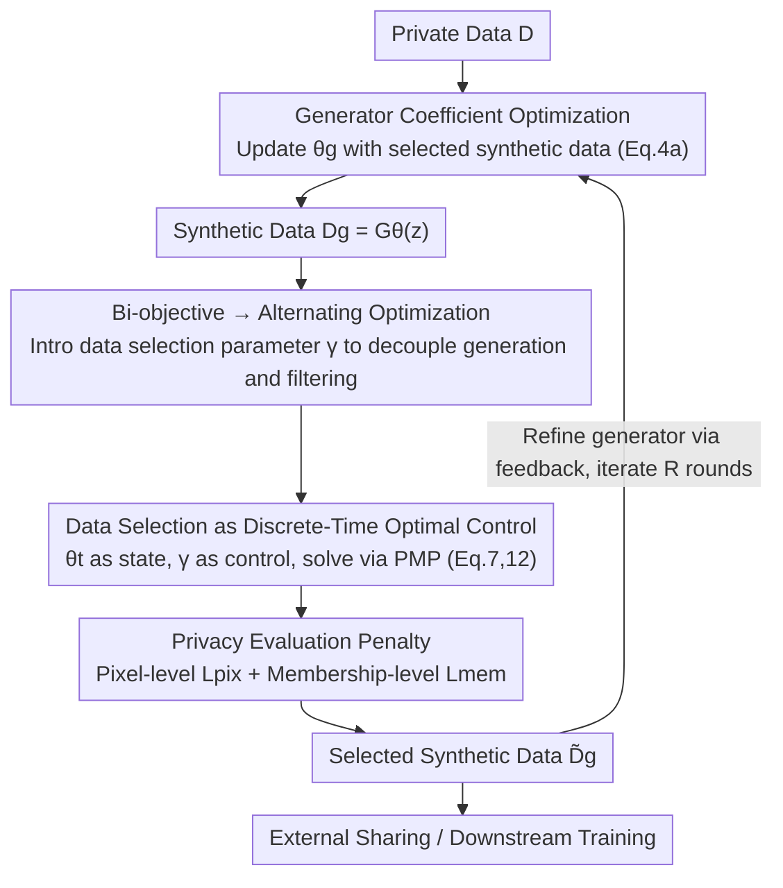

# PrivSynth: Alternating and Control-Based Optimization for Privacy and Utility in Synthetic Data

**Conference**: CVPR 2026  
**Paper**: [CVF Open Access](https://openaccess.thecvf.com/content/CVPR2026/html/Zhao_PrivSynth_Alternating_and_Control-Based_Optimization_for_Privacy_and_Utility_in_CVPR_2026_paper.html)  
**Code**: None  
**Area**: AI Security / Privacy Protection / Synthetic Data Generation  
**Keywords**: Synthetic Data, Privacy-Utility Trade-off, Optimal Control, Pontryagin Maximum Principle, Data Selection  

## TL;DR
PrivSynth models the "privacy-utility trade-off in synthetic data generation" as a **bi-objective optimization** problem, alternating optimization between the generator and data selection parameters. It reformulates the data selection step as a **discrete-time optimal control** problem solved via the Pontryagin Maximum Principle (PMP), reducing the Membership Inference Attack (MIA) success rate from 48% to approximately 2% while guaranteeing downstream utility.

## Background & Motivation
**Background**: As public data becomes increasingly scarce, Synthetic Data Generation (SDG) has emerged as a practical solution for privacy-preserving data sharing—training generative models (such as fine-tuned DDPM, conditional diffusion, or Textual Inversion) on private data to produce "fake data" that retains task-relevant features while obscuring sensitive content.

**Limitations of Prior Work**: Recent research demonstrates that synthetic data can still leak privacy—Membership Inference Attacks (MIA) and reconstruction attacks can recover training individuals from synthetic samples. Existing defenses almost always come at the cost of downstream utility: Differential Privacy (DP) injects noise that blurs statistical features and weakens generation quality; deduplication removes rare but informative patterns; masking erases critical signals required for training; and post-hoc filtering reduces diversity and coverage.

**Key Challenge**: There is a direct trade-off between privacy protection and downstream utility, and this trade-off is difficult to solve "provably" optimally. Evaluating the utility loss of a synthetic subset requires training a downstream model to convergence on that subset, and the downstream training loss **cannot be backpropagated to the generative model**, making gradient-based joint optimization infeasible.

**Goal**: Find a set of synthetic samples that maintain both privacy and utility without assuming the downstream task is known, while providing convergence guarantees.

**Key Insight**: Instead of directly optimizing the generator in one go, the authors introduce a **data selection parameter** $\gamma$ to "pick samples," decoupling "learning the generator" from "controlling data quality." It then treats this discrete and computationally expensive selection process as a control problem for a dynamical system, solved efficiently using control theory tools.

**Core Idea**: Use "alternating optimization + reformulating data selection as optimal control + solving with PMP" instead of infeasible end-to-end gradient optimization on the generator. This achieves a provably optimal balance between privacy penalties and utility gains.

## Method

### Overall Architecture
PrivSynth takes a private dataset $D$ and a generative model $G_\theta$ as input, and outputs a set of filtered, shareable synthetic samples and corresponding data selection parameters $\gamma$. The entire process is an **iterative cycle of alternating optimization**: first, update generator coefficients $\theta_g$ using the currently selected synthetic data (Eq.4a); then, fix the generator and optimize the data selection parameter $\gamma$ using PMP (Eq.4b/Eq.7), feeding the selected high-quality samples back to refine the generator. This continues for $R$ rounds. The "data selection optimization" step is the core—it is reformulated as a discrete-time optimal control problem where downstream model parameters $\theta_t$ are states, $\gamma$ is a time-invariant control, $T$-step gradient descent represents the dynamics, and the stage cost is "utility loss + privacy penalty."

### Key Designs

**1. Bi-objective Alternating Optimization: Decoupling "Learning Generator" and "Controlling Quality" with Data Selection Parameters**
Directly solving the multi-objective problem of "generation loss + utility loss + privacy loss" (Eq.1) is infeasible because the utility loss $\ell_u$ requires training a downstream model to convergence, and its training loss cannot be backpropagated to the generator. The proposed solution introduces a binary selection vector $\gamma = [\gamma_1,\dots,\gamma_M]^\top,\ \gamma_i\in\{0,1\}$, where $\gamma_i=1$ indicates that the $i$-th synthetic sample is retained. Consequently, the downstream utility loss is defined as the loss of the "optimal downstream model trained only on selected samples" $\theta^*(\gamma)=\arg\min_\theta \sum_i \gamma_i \ell(\theta, x_{g,i})$, and the privacy term is written as $\ell_p(\gamma, D_g)=\sum_i \gamma_i Q(\theta_{att}, x_{g,i})$. This splits the original problem into alternating optimization over $\theta_g$ and $\gamma$ (Eq.4a/4b): the generator is updated using only the selected subset $\tilde D_g(\gamma)$, while selection parameters are updated based on the full synthetic set $D_g$, with hyperparameter $\phi$ balancing utility and privacy. The benefit of decoupling is shifting the "non-backpropagatable utility evaluation" onto discrete sample selection, bypassing the need for end-to-end gradients for the generator.

**2. Reformulating Data Selection as Discrete-Time Optimal Control via PMP**
Alternating optimization alone is not enough—finding the optimal $\gamma$ remains expensive as it requires enumerating numerous candidate subsets to evaluate downstream utility. The authors "unroll" the inner optimization into a fixed $T$-step gradient descent: initializing $\theta_0$, iterating $\theta_{t+1}=\theta_t-\eta\nabla_\theta L(\theta_t,\gamma)$, and approximating the minimum inner loss with the cumulative loss along the trajectory $\sum_{t=1}^T \ell_u(\theta_t)$. Treating the gradient update as a constraint yields Eq.7:

$$\min_{\gamma\in U}\ \sum_{t=1}^{T}\Big[\ell_u(\theta_t, D_g) + \tfrac{\phi}{T}\ell_p(\gamma, D_g)\Big],\quad \text{s.t. } \theta_{t+1}=\theta_t-\eta\nabla_\theta L(\theta_t,\gamma)$$

This is precisely a discrete-time optimal control problem: state $\theta_t$, time-invariant control $\gamma$, dynamics as gradient updates, and stage cost as utility plus privacy. The authors introduce the Hamiltonian $H_t=\ell_u(\theta_t)+\lambda_{t+1}^\top(\theta_t-\eta\nabla L(\theta_t,\gamma))$ and provide necessary conditions for optimality via the Pontryagin Maximum Principle (Theorem 1): forward dynamics advance model training via steepest descent, backward adjoint variables $\lambda_t$ propagate task sensitivity, and Hamiltonian maximization over $\gamma$ balances utility gains against privacy penalties (Eq.12). Algorithm 1 iterates through "forward $T$ steps → backward adjoint calculation → update $\gamma$." Theoretically, under standard smoothness/convexity conditions, these PMP conditions are both necessary and sufficient, ensuring convergence to a stationary solution of the surrogate objective—a key advantage over heuristic subset enumeration: it is **provably optimal**. ⚠️ Note that specific mathematical symbols (e.g., $\lambda$, Hessian-vector products) follow those in the original text.

**3. Dual Privacy Assessment (Pixel and Membership Levels) Integrated into Control Objectives**
The privacy penalty $Q$ is not target-specific but represents an "intrinsic leakage metric" composed of two parts. Pixel-level leakage $L_{pix}(x_{g,i})=-\mathbb{E}_{x_i\sim D}[\text{Dist}(x_{g,i}, x_i)]$ measures visual proximity to private images (where Dist is MSE or LPIPS). Higher values indicate lower similarity and stronger pixel-level privacy; evaluation averages the LPIPS distance of the 50 nearest private images for each synthetic image. Membership-level leakage $L_{mem}(x_{g,i})=\big|\mathbb{E}_{x_i\sim D}[s(x_i)]-\mathbb{E}_{x_g\sim D_g}[s(x_{g,i})]\big|$ measures the distributional difference in confidence statistics $s(\cdot)$ (like max prediction probability or entropy) of the downstream model on private versus synthetic samples. A smaller difference indicates model responses are less distinguishable, providing higher resistance to MIA. These are fused into a unified penalty $\ell_p(\gamma)=\sum_i\gamma_i(\phi_1 L_{pix}+\phi_2 L_{mem})$ and embedded directly into the PMP control objective (Eq.12), ensuring the "sample selection" step naturally penalizes high-leakage samples. This "attack-agnostic, dual-level" metric is more general than defenses targeting specific attacks.

### Loss & Training
Synthetic samples are generated via Textual Inversion: freezing Latent Diffusion weights, optimizing word embeddings for each class for 5000 steps, and synthesizing with 50 sampling steps and a classifier-free guidance scale of 3.0 (ImageNet/DomainNet) or 2.0 (PathMNIST). For scalability during optimization, explicit Hessians are replaced with Hessian-vector products via PyTorch JVP, intermediate features are cached, and pixel-level privacy assessment is accelerated using Approximate Nearest Neighbors (ANN). Alternating rounds $R$, unrolling steps $T$, and weight $\phi$ are key hyperparameters.

## Key Experimental Results

### Main Results
Evaluated on ImageNet, DomainNet (benchmarks), and PathMNIST (medical). Downstream classification uses ResNet18/34, with additional validation on object detection for task-agnostic scenarios. Membership privacy is measured by MIA Attack Success Rate (ASR, lower is better), pixel-level by LPIPS (higher is better), and utility by top-1 accuracy / AP50. The table below shows task-independent distribution fidelity (FID / KID, MIA ASR in parentheses):

| Dataset | Metric | PrivSynth (Ours) | DP | Masking | De-Dup |
|:---|:---:|:---:|:---:|:---:|:---:|
| DomainNet | KID↓ (MIA ASR) | **31.53 (0.02)** | 40.07 (0.38) | 54.12 (0.32) | 32.77 (0.51) |
| ImageNet | KID↓ (MIA ASR) | **73.61 (0.01)** | 75.66 (0.31) | 91.34 (0.21) | 82.20 (0.30) |
| DomainNet | FID↓ (MIA ASR) | **130.70 (0.02)** | 139.32 (0.38) | 170.50 (0.32) | 128.67 (0.51) |
| ImageNet | FID↓ (MIA ASR) | **171.11 (0.01)** | 173.29 (0.31) | 194.91 (0.21) | 172.50 (0.30) |

PrivSynth excels in both FID/KID and MIA ASR: while fidelity remains close to the private distribution, the attack success rate is crushed to 0.01–0.02 (compared to 0.2–0.5 for baselines). Since FID/KID are independent of specific downstream models, this indicates the selected synthetic set remains high quality and private even if the architecture or hyperparameters are changed later.

### Ablation Study
Analysis of the impact of alternating optimization rounds on DomainNet (Round 0 = direct use of private data):

| Configuration | MIA ASR↓ | 1−LPIPS↓ | Downstream Acc | Notes |
|:---|:---:|:---:|:---:|:---:|
| Round 0 (Private data) | 48.1% | 0.67 | Baseline | Severe privacy leakage |
| Round 2 (PrivSynth) | **1.9%** | **0.49** | >67% | Leakage drops significantly in 2 rounds; utility maintained |
| Direct filtering | — | — | Significant drop | Naive removal causes massive utility loss |
| Increased selection ratio | Increases | Decreases | Increases | More data improves utility but raises privacy risks |

### Key Findings
- **Two rounds suffice**: MIA ASR drops from 48.1% to 1.9% and 1−LPIPS from 0.67 to 0.49, while accuracy stays above 67%—massive privacy gains with minimal utility cost. The process stabilizes after the second round.
- **Data selection is critical**: Simply filtering sensitive samples leads to a sharp drop in utility, whereas PMP-guided "weighted selection" preserves utility while suppressing privacy risk, proving "how you select" matters more than "whether you select."
- **Selection ratio as an explicit knob**: Increasing the proportion of selected synthetic samples improves downstream performance but raises privacy risks (higher MIA, lower LPIPS), providing a tunable trade-off for deployers.
- **Transferability to unknown tasks**: Selecting samples based on classification loss still outperforms baselines in object detection, proving the quality of the selected subset is task-agnostic.

## Highlights & Insights
- **Data selection as a control problem**: The cleverest part is using unrolled gradients and PMP to transform discrete, expensive data selection into a control solution with adjoint equations. This bypasses the barrier of "non-backpropagatable downstream loss."
- **Attack-agnostic privacy metrics**: The dual pixel and membership metrics do not rely on specific attacks. Using them as control costs directly drives selection, offering more robustness than defenses protecting against a specific attack type.
- **Reusable decoupling paradigm**: Using a selection parameter to separate "model learning" from "data quality control" via alternating optimization is a motif applicable to other data filtering/distillation scenarios where evaluation signals cannot be backpropagated.

## Limitations & Future Work
- Dependence on the Textual Inversion paradigm; consistency in convergence and overhead when using pure fine-tuned DDPM or other generators is not fully validated.
- PMP requires $T$ forward steps + backward adjoints + Hessian-vector products. Despite JVP acceleration, computational costs when $T$ and $R$ increase are significant; explicit time/memory comparisons with baselines are missing (⚠️ see appendix for details).
- Convergence guarantees rely on "standard smoothness/convexity," but deep generative models and downstream networks are highly non-convex; the gap between theory and practice warrants attention.
- Experiments focused on smaller dataset subsets; scalability to larger scales and more complex modalities remains to be verified.

## Related Work & Insights
- **vs Differential Privacy (DP)**: DP relies on noise injection for formal $(\omega,\varepsilon)$ guarantees but blurs features and hurts quality. PrivSynth "picks samples" without noise, performing better in both FID/KID and MIA.
- **vs De-Dup / Masking / Post-hoc Filtering**: These naive defenses either remove rare info, erase signals, or reduce diversity at the cost of utility. PrivSynth seeks a provably optimal balance via control theory rather than heuristic cropping.
- **vs Anti-Memorization Guidance (AMG)**: AMG detects similarity between intermediate predictions and training data during sampling to push generation away from memorization (model-side modification). PrivSynth performs selection on the data-side after generation; these approaches are complementary.

## Rating
- Novelty: ⭐⭐⭐⭐⭐ Formalizes the privacy-utility trade-off as optimal control via PMP.
- Experimental Thoroughness: ⭐⭐⭐⭐ Covers benchmarks, medical data, and detection tasks, but datasets are relatively small and cost comparisons are lacking.
- Writing Quality: ⭐⭐⭐⭐ Clear derivations, though notation is dense.
- Value: ⭐⭐⭐⭐ Provides a provably optimal paradigm for privacy-preserving data filtering where evaluation signals cannot be backpropagated.

<!-- RELATED:START -->

## Related Papers

- [\[CVPR 2026\] Reinforcement-Guided Synthetic Data Generation for Privacy-Sensitive Identity Recognition](reinforcement-guided_synthetic_data_generation_for_privacy-sensitive_identity_re.md)
- [\[ICML 2026\] Position: Embodied AI Requires a Privacy-Utility Trade-off](../../ICML2026/ai_safety/position_embodied_ai_requires_a_privacy-utility_trade-off.md)
- [\[CVPR 2026\] Unsafe2Safe: Controllable Image Anonymization for Downstream Utility](unsafe2safe_controllable_image_anonymization_for_downstream_utility.md)
- [\[AAAI 2026\] An Improved Privacy and Utility Analysis of Differentially Private SGD with Bounded Domain and Smooth Losses](../../AAAI2026/ai_safety/an_improved_privacy_and_utility_analysis_of_differentially_p.md)
- [\[CVPR 2026\] One-to-More: High-Fidelity Training-Free Anomaly Generation with Attention Control](one-to-more_high-fidelity_training-free_anomaly_generation_with_attention_control.md)

<!-- RELATED:END -->
