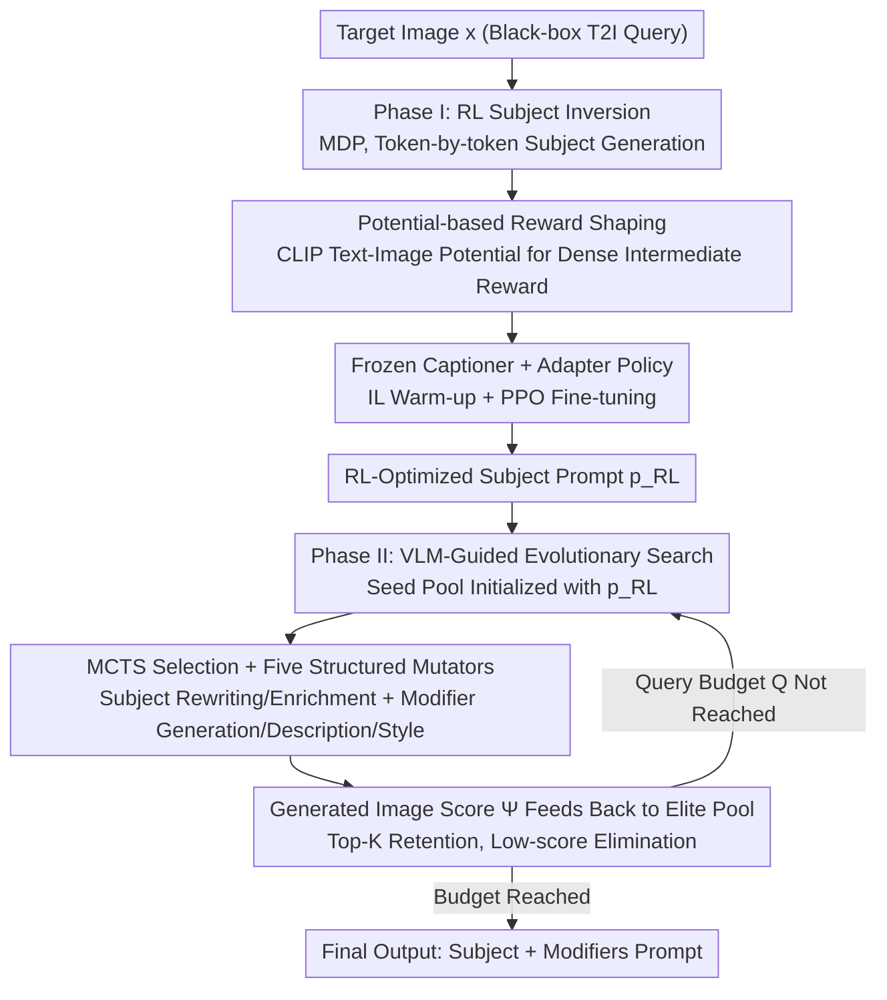

# PROMPTMINER: Black-Box Prompt Stealing against Text-to-Image Generative Models via Reinforcement Learning and VLM-Guided Optimization

**Conference**: CVPR 2026  
**Paper**: [CVF Open Access](https://openaccess.thecvf.com/content/CVPR2026/html/Li_PROMPTMINER_Black-Box_Prompt_Stealing_against_Text-to-Image_Generative_Models_via_Reinforcement_CVPR_2026_paper.html)  
**Code**: https://github.com/aaFrostnova/PromptMiner  
**Area**: AI Security / Prompt Stealing Attack / T2I Safety  
**Keywords**: Prompt Stealing, Black-box Attack, Reinforcement Learning, Reward Shaping, VLM-Guided Search

## TL;DR
PromptMiner is a black-box prompt stealing framework: given an image generated by a text-to-image (T2I) model, it first utilizes reinforcement learning (RL) with reward shaping to invert an accurate "Subject" prompt, and then employs VLM-guided evolutionary search to complete the "Style Modifiers". Without requiring model gradients or large-scale labeled data, it recovers prompts that replicate highly similar images, achieving CLIP similarity up to 0.958 and SBERT text alignment up to 0.751, while remaining robust to common image perturbation defenses.

## Background & Motivation
**Background**: The generation quality of T2I models like Stable Diffusion, FLUX, and DALL·E heavily depends on "carefully designed prompts." These prompts typically follow a "Subject + Modifiers" structure and have become high-value digital assets traded in marketplaces like PromptBase and PromptHero. This has given rise to prompt stealing attacks: back-engineering a prompt that can generate an image similar to a target. This serves as both an IP threat (selling stolen prompts) and a tool for positive forensics (model attribution, watermark verification).

**Limitations of Prior Work**: Existing methods have significant drawbacks. White-box gradient-based methods (PEZ, PH2P) rely on gradient access, which is rarely available in commercial deployments, and they invert prompts that are often unreadable and focus only on the subject. Black-box methods like BLIP and VGD rely on captioning or LLM concatenation, lacking modifier reconstruction capabilities; VGD only captures single salient subjects. While CLIP-Interrogator and PromptStealer consider both subject and modifiers, they lack an **explicit optimization process** and generate directly from pre-trained models, leading to insufficient similarity. Specifically, PromptStealer requires training a subject generator and modifier classifier on large-scale labeled data like Lexica, which carries high data dependency and over-fitting risks.

**Key Challenge**: To simultaneously achieve three goals—gradient-free (black-box), no large-scale labeled data (generalizable), and balancing subject accuracy with style fidelity—no existing method succeeds. The root cause is that subject inversion requires "explicit optimization targeting the specific image," while modifier completion requires "structured exploration in the discrete prompt space." These are two distinct types of search that a single model cannot handle effectively.

**Goal**: To build a black-box, label-free prompt stealing framework that accurately captures subjects while injecting rich stylistic modifiers.

**Key Insight**: The task can be **decoupled into two stages**: Subject inversion as a sequential decision problem solvable by RL (explicit optimization under black-box constraints), and modifier completion as VLM-guided evolutionary search (structured style injection).

**Core Idea**: Use "RL for Subject Inversion + VLM Evolutionary Search for Style" to solve both types of search with the right tools, achieving explicit optimization without gradients or labeled data.

## Method

### Overall Architecture
The threat model for PromptMiner assumes the attacker only possesses the target image and black-box query access to the target T2I model, with **no** access to large-scale vision-language datasets or commercial prompt libraries. The process consists of two stages: Phase I formalizes prompt inversion as a Markov Decision Process (MDP), utilizing a trainable adapter on a frozen captioner as the policy. It employs PPO with potential-based reward shaping to invert content-faithful **Subject** prompts. Phase II uses the Phase I results as seeds and performs evolutionary search via a VLM mutator within a capacity-limited elite seed pool (MCTS seed selection + five structured mutators + score feedback from generated images). This gradually expands the subject into a complete prompt rich in style and composition modifiers, outputting a reproducible prompt for the target image.

### Key Designs

**1. RL Subject Inversion + Potential-based Reward Shaping: Explicit Black-box Optimization to Solve Sparse Rewards**

Addressing the pain point that "white-box methods need gradients while black-box methods lack explicit optimization," this paper formulates token-by-token generation as an MDP $\mathcal{M}=(S,A,P,R,\gamma)$: where state $s_t=\{p_{0:t-1},x\}$ (prefix + target image), action $a_t$ selects the next token, and transitions deterministically concatenate the token, ending at EOS. A naive reward is the CLIP cosine similarity $\Psi(\hat{x},x)$ between the synthesized image $\hat{x}$ from the full prompt $p_{0:T}$ and the target image $x$. However, this is **highly sparse**, making training slow and unstable in large action spaces. This work uses potential-based reward shaping to provide dense intermediate rewards: $r'_t=\gamma\Phi(s_{t+1})-\Phi(s_t)$ for $t<T$, and $r'_t=r_t-\Phi(s_t)$ for $t=T$. The potential function $\Phi(s_t)=\beta\cdot\frac{f_{text}(p_{1:t})\cdot f_{img}(x)}{\Vert f_{text}(p_{1:t})\Vert\Vert f_{img}(x)\Vert}$ utilizes CLIP text-image similarity to measure how close the current prefix is to the target image. This shaping does not change the optimal policy theoretical and significantly accelerates convergence.

**2. Adapter-on-Frozen-Captioner + IL Warm-up + PPO: Label-free and Stable RL**

To ensure stable training without large datasets, the policy does not retrain the entire captioner. Instead, a trainable adapter $\theta$ is added to the frozen captioner's hidden state $h_t$: $\tilde{h}_t=\theta(h_t)$, which is fed into the frozen LM head to determine token distribution. Training follows two phases: First, Imitation Learning (IL) warm-up—collecting expert token sequences and hidden states from the frozen captioner and training the adapter with cross-entropy $L_{IL}=-\frac{1}{N}\sum\log P_{LM}(y_{t+1}\mid\tilde{h}_t)$ to provide strong semantic initialization. Second, fine-tuning with the PPO clipped surrogate objective $L_{PPO}=\mathbb{E}_t[\min(\rho_t A_t,\mathrm{clip}(\rho_t,1-\epsilon,1+\epsilon)A_t)]$, where only the adapter and value head are updated, and the backbone remains frozen.

**3. Capacity-Limited Elite Seed Pool + MCTS Selection: High-quality and Diverse Modifier Search**

Phase I subjects are content-faithful but lack stylistic modifiers. Phase II treats modifier completion as an evolutionary search in discrete prompt space. To avoid poor seed quality or premature convergence, the method uses an **elite seed pool with fixed capacity K**. After evaluation, new prompts are inserted and sorted, with the lowest scores discarded. Next seeds for mutation are chosen via MCTS to balance exploration and exploitation, ensuring high-quality prompts are maintained while promising regions of the prompt space are explored.

**4. Five Types of Structured Hybrid Mutators: Injecting Style while Respecting the "Subject + Modifier" Structure**

General text mutators (like AFL's Havoc or LLM mutations) do not fit the T2I structure. This work uses a VLM mutator (e.g., Qwen2-VL-2B-Instruct) with five targeted operators: ① **Subject-Paraphrase** (natural rephrasing); ② **Subject-Enrich** (inserting grounded details like color/count/pose); ③ **Modifier-Generate** (yielding new descriptions/styles from image-subject context); ④ **Modifier-Description** (refining spatial relations, composition, and lighting); ⑤ **Modifier-Style** (reinforcing aesthetics using medium, texture, lens, and quality tokens).

### Loss & Training
Phase I: IL warm-up uses cross-entropy $L_{IL}$ on the adapter. RL fine-tuning uses PPO clipped surrogate $L_{PPO}$, where the advantage $A_t$ is estimated by the value head, and rewards $r'_t$ include potential-based shaping (CLIP text-image potential + final CLIP image-image similarity). The captioner backbone and LM head are frozen throughout. Phase II is gradient-free, driven purely by black-box query-based evolutionary search. Typical query budgets $Q$ are 100 for each phase.

## Key Experimental Results

> Metrics: **CLIP↑** (high-level semantic similarity); **LPIPS↓** (low-level perceptual difference); **SBERT↑** (sentence-level semantic similarity between inverted and original prompts).

### Main Results
On three datasets (MS COCO / Flickr / Lexica) across four T2I models (SD v1.5 / SDXL-Turbo / FLUX.1 dev / SD 3.5 Medium), PromptMiner outperforms all baselines. Representative results on MS COCO:

| Target Model | Method | CLIP↑ | LPIPS↓ | SBERT↑ |
|----------|------|-------|--------|--------|
| SD v1.5 | PromptStealer | 0.861 | 0.453 | 0.633 |
| SD v1.5 | **Ours** | **0.933** | **0.342** | **0.664** |
| SDXL-Turbo | PromptStealer | 0.861 | 0.439 | 0.652 |
| SDXL-Turbo | **Ours** | **0.934** | **0.340** | **0.673** |
| FLUX.1 dev | VLM-as-expert | 0.923 | 0.407 | 0.588 |
| FLUX.1 dev | **Ours** | **0.958** | **0.345** | **0.683** |
| SD 3.5 Medium | BLIP | 0.881 | 0.409 | 0.718 |
| SD 3.5 Medium | **Ours** | **0.953** | **0.303** | **0.751** |

In "In-the-wild" (DiffusionDB) tests with unknown models, PromptMiner remains the leader, with CLIP similarity approximately 7.5% higher than the strongest baseline:

| Method | CLIP↑ | LPIPS↓ | SBERT↑ |
|------|-------|--------|--------|
| CLIP-IG | 0.803 | 0.628 | 0.541 |
| PromptStealer | 0.754 | 0.643 | 0.542 |
| VGD | 0.749 | 0.649 | 0.454 |
| **Ours** | **0.863** | **0.622** | **0.545** |

### Ablation Study

| Configuration / Defense | CLIP↑ | LPIPS↓ | SBERT↑ | Description |
|-------------|-------|--------|--------|------|
| No Defense | 0.911 | 0.420 | 0.591 | Full method on Lexica |
| Random Noise Injection | 0.903 | 0.420 | 0.572 | Gaussian noise; negligible impact |
| Puzzle Effect | 0.902 | 0.425 | 0.561 | 4×4 grid translation; negligible impact |
| Textual Watermarking | 0.887 | 0.445 | 0.583 | Visible watermark; minimal impact |

### Key Findings
- **Two-stage Complementarity**: The RL adapter ensures the subject matches the image semantics (a stable content foundation), while VLM evolution systematically explores the modifier space (style/composition).
- **Reward Shaping as Efficiency Driver**: The potential function provides dense signals, accelerating early convergence and significantly reducing total steps without biasing the optimal policy.
- **Robustness to Visual Defenses**: Pixel-level defenses (noise, puzzles, watermarks) fail to stop the attack because it is semantic-driven rather than pixel-dependent.
- **User Study**: PromptMiner consistently received the highest human preference scores for similarity across 30 test cases.

## Highlights & Insights
- **"Decouple Searches, Use the Right Tools"**: This division of labor is the cleverest aspect of the paper—it identifies that subject inversion is an optimization problem while modifier completion is an exploration problem.
- **Solving Sparse Rewards with Potentials**: Converting the sparse signal of final CLIP similarity into a dense intermediate reward using text-image potential is a textbook application of RL theory to sequence generation.
- **Adapter-on-frozen-captioner**: Lightweight and reproducible; enables RL training without large datasets or backbone instability.
- **Security Implications**: Demonstrates that current image-level defenses are insufficient to protect prompt IP, highlighting the need for semantic-level protection.

## Limitations & Future Work
- **Dependency on Proxy Queries**: Both phases require repeated T2I model queries, which entails high computational costs; in-the-wild scenarios rely on a proxy generator whose gap with the real generator is not fully quantified.
- **Double-edged Sword**: Provides an attack framework that, while useful for forensics, can easily be used for prompt theft. The paper discusses defenses but does not provide a definitive deterrent.
- **Evaluation Scale**: Main results use 50 random prompts per dataset, which is a relatively small sample size.
- **VLM Mutator Dependency**: The quality of modifiers is bound by the capabilities of the chosen VLM.

## Related Work & Insights
- **vs PromptStealer**: PromptStealer relies on large-scale Lexica data and tends to overfit; PromptMiner is label-free and more robust across datasets and unknown models.
- **vs PH2P / PEZ (White-box)**: These require gradient access and produce unreadable prompts; PromptMiner is black-box, human-readable, and captures both subject and style.
- **vs VGD / BLIP (Black-box Captioning)**: These lack explicit optimization and modifier reconstruction; PromptMiner achieves systematically higher similarity through targeted RL and evolutionary search.

## Rating
- Novelty: ⭐⭐⭐⭐⭐ 
- Experimental Thoroughness: ⭐⭐⭐⭐ 
- Writing Quality: ⭐⭐⭐⭐ 
- Value: ⭐⭐⭐⭐ 

<!-- RELATED:START -->

## Related Papers

- [\[CVPR 2026\] SEBA: Sample-Efficient Black-Box Attacks on Visual Reinforcement Learning](seba_sample-efficient_black-box_attacks_on_visual_reinforcement_learning.md)
- [\[CVPR 2026\] RunawayEvil: Jailbreaking the Image-to-Video Generative Models](runawayevil_jailbreaking_the_image-to-video_generative_models.md)
- [\[CVPR 2026\] JANUS: A Lightweight Framework for Jailbreaking Text-to-Image Models via Distribution Optimization](janus_a_lightweight_framework_for_jailbreaking_text-to-image_models_via_distribu.md)
- [\[CVPR 2026\] PureProof: Diffusion-Resistant Black-box Targeted Attack on Large Vision-Language Models](pureproof_diffusion-resistant_black-box_targeted_attack_on_large_vision-language.md)
- [\[CVPR 2026\] Jailbreaking Vision-Language Models via Dissonance-Guided Suffix Optimization and Image-Phrase Injection](jailbreaking_vision-language_models_via_dissonance-guided_suffix_optimization_an.md)

<!-- RELATED:END -->
