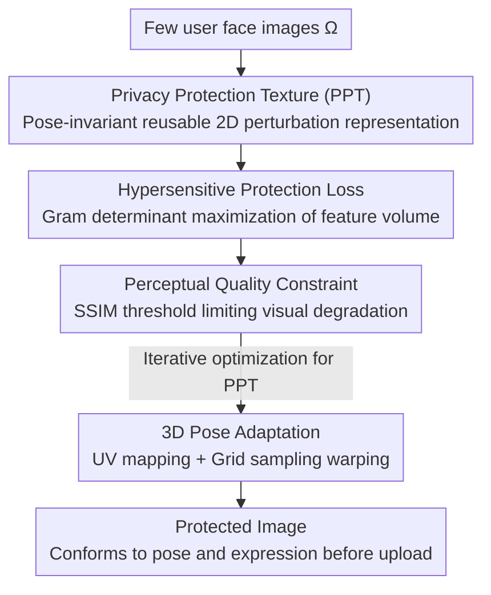

# Protego: User-Centric Pose-Invariant Privacy Protection Against Face Recognition-Induced Digital Footprint Exposure

**Conference**: CVPR 2026  
**Paper**: [CVF Open Access](https://openaccess.thecvf.com/content/CVPR2026/html/Wang_Protego_User-Centric_Pose-Invariant_Privacy_Protection_Against_Face_Recognition_Induced_Digital_Footprint_CVPR_2026_paper.html)  
**Code**: https://github.com/HKU-TASR/Protego  
**Area**: AI Security / Privacy Protection  
**Keywords**: Face recognition adversarial, privacy protection, pose-invariant, UV mapping, black-box protection

## TL;DR
Protego compresses a user's 3D facial features into a pose-invariant 2D "Privacy Protection Texture" (PPT). Combined with a novel loss that makes face recognition models "hypersensitive" to protected images, it ensures that even protected face photos cannot be retrieved or matched against each other. This protects the user's digital footprint from search engines like Clearview AI and PimEyes, reducing black-box retrieval recall by at least half compared to existing methods.

## Background & Motivation
**Background**: Large-scale Face Recognition (FR) search engines (e.g., Clearview AI, PimEyes) crawl billions of online photos to build databases. Anyone can upload a face photo to reverse-search a person's social activities, private photos, and news reports. "Anti-FR" technologies counter this by applying subtle perturbations to photos before upload, making them unretrievable even if crawled. Mainstream perturbation methods (Fawkes, LowKey, PMask, OPOM, Chameleon) aim to push protected images away from the original images in the feature space.

**Limitations of Prior Work**: The authors point out two major vulnerabilities in existing methods. First is the **effectiveness assumption**—they assume intruders only use "unprotected" faces as queries. In reality, intruders may use a protected photo (regardless of protection status) as a query. Since features of all protected images are highly similar and form a "dense cluster" in the feature space, a protected query can still retrieve other protected entries with high precision. Second is the **visual assumption**—they assume faces are frontal. Perturbations do not adapt to pose/expression, leading to "phantom faces" and poor visual naturalness in videos with varying head poses.

**Key Challenge**: Existing losses only optimize for dissimilarity between "protected vs. unprotected," leading to high similarity between "protected vs. protected." This is the root cause of protected queries successfully hitting protected database entries. In other words, perturbations push everyone into the same dense region of the feature space.

**Goal**: (i) Ensure retrieval failure even if the query itself is protected; (ii) Maintain a natural appearance across arbitrary poses and expressions, especially in videos.

**Key Insight**: Instead of just pushing protected images away from the original, it is better to make the FR model **hypersensitive** to protected content. Even minor variations (e.g., micro-expressions) of the same person are mapped to vastly different features, thereby scattering the dense cluster. Simultaneously, UV mapping is used as a pose-invariant standardized coordinate system to learn "semantic region-level" perturbations that can be warped back to any pose.

**Core Idea**: Use a "hypersensitive protection loss" to scatter the dense cluster of protected features and learn perturbations as pose-invariant PPTs that adapt to any pose via UV grid sampling.

## Method

### Overall Architecture
Protego consists of two stages. **Offline Learning Stage**: Starting from a few user face images $\Omega$, it iteratively optimizes a 2D Privacy Protection Texture (PPT, denoted as $T$), which encapsulates the user’s 3D facial signature as a pose-invariant reusable perturbation. The update rule is $T^{t+1}=\mathrm{Clip}_{[-\omega,\omega]}\big(T^t-\alpha\,\mathrm{Sign}(\nabla_{T^t}L)\big)$, where $\omega$ is the $L_\infty$ perturbation bound and $L$ is the Protego loss. **Online Protection Stage**: Given a new image $x$ to be protected, a lightweight face detector locates the face, and a pre-trained UV mapping network (SMIRK) estimates its UV map. The PPT is then processed via differentiable grid sampling based on the UV map to warp into a 3D mask, which is overlaid on the original image: $\Phi(x;T)=\mathrm{Clip}_{[0,1]}\big(x-\Psi(T;x)\big)$. The key advantage is that the PPT only requires one offline training session (completable on a laptop), after which protecting any image of the same user takes milliseconds. Since the sampling is differentiable, gradients flow back to the UV space during training to extract truly pose-invariant textures.

### Key Designs

**1. Privacy Protection Texture (PPT): Compressing 3D Facial Signatures into Pose-Invariant Reusable Perturbations**

Existing per-image iteration methods (Fawkes, LowKey) take minutes on a GPU to protect a single image. While OPOM/Chameleon use "one mask per user," they assume frontal faces. Protego encapsulates the user's 3D facial signature into a 2D texture $T$ defined in the UV standard coordinate system. Each position in the UV space corresponds to a fixed facial semantic region (e.g., left eye, nose tip, jawline). By training on images from multiple angles, the PPT learns region-specific rules (e.g., "how to perturb the left ear"), allowing it to be projected back onto faces in any pose while maintaining visual consistency. This reduces the cost of "protecting one image" from minutes of iteration to a millisecond-level reuse after a single offline training.

**2. Hypersensitive Protection Loss: Making Protected Images Unmatchable Among Themselves**

This is the core innovation addressing the "protected query hitting protected gallery" problem. Standard losses only require dissimilarity between protected and unprotected images, resulting in protected images clustering in the feature space. Protego does the opposite: it induces the FR model to be **hypersensitive** to protected content. Feature vectors $\{F(\Phi(x_i;T))\}$ of protected images in the same batch are used to form a Gram matrix $G_{i,j}=F(\Phi(x_i;T))^\top F(\Phi(x_j;T))$. Since the Gram determinant is proportional to the volume spanned by these vectors, maximizing $\log\det G$ forces these features to be orthogonal, scattering the dense cluster. The complete protection loss is:

$$L_{\mathrm{Protect}}=-\frac{1}{\lVert\mathcal{F}\rVert}\sum_{F\in\mathcal{F}}\log\det G(B,T^t;F)+\frac{1}{\lVert\mathcal{F}\rVert\lVert B\rVert}\sum_{F\in\mathcal{F}}\sum_{x\in B}\mathrm{Sim}\big(F(x),F(\Phi(x;T^t))\big),$$

The first term maximizes volume to orthogonalize protected features, while the second term penalizes similarity between protected and unprotected images. Averaging over an ensemble of FR models $\mathcal{F}$ enhances generalization to unknown black-box models. Consequently, even if a query is protected, it will map to a scattered position far from any protected gallery entries.

**3. Perceptual Quality Constraint: Controlling Visual Degradation via SSIM Threshold**

To ensure perturbations do not ruin appearance, Protego constrains the Structural Similarity Index (SSIM) between protected and original images. A hinge loss penalizes degradation exceeding a threshold: $L_{\mathrm{Percept}}=\max\big(\frac{1}{2\lVert B\rVert}\sum_{x\in B}(1-\mathrm{SSIM}(x,\Phi(x;T)))-\vartheta,\,0\big)$, where $\vartheta$ is the user-defined maximum allowed SSIM drop. Total loss is $L=L_{\mathrm{Protect}}+\lambda_{\mathrm{SSIM}}L_{\mathrm{Percept}}$, where $\lambda_{\mathrm{SSIM}}$ uses dynamic scheduling to balance protection strength and image quality.

**4. 3D Pose Adaptation: UV Mapping + Grid Sampling for Pose-Adaptive Morphing**

During the online phase, a pre-trained UV mapping network (SMIRK) maps each pixel of the target image $x$ to the UV space, yielding $UV(x)$. The pose-invariant PPT is سپس processed via grid sampling $\Psi(T;x)=\mathrm{GridSample}(T,UV(x))$ to generate a 3D mask matching the input face's pose and expression. This step is differentiable, supporting online protection while allowing offline training gradients to flow into the UV space, forcing the extraction of truly pose-invariant textures. Compared to older methods that overlay fixed 2D perturbations, this avoids "phantom faces" and is especially natural in videos.

### Loss & Training
The total loss is $L=L_{\mathrm{Protect}}+\lambda_{\mathrm{SSIM}}L_{\mathrm{Percept}}$, with $\lambda_{\mathrm{SSIM}}$ automatically adjusted via dynamic scheduling. In the default black-box setting, Protego cannot access the actual FR model used by the intruder (default: AD-IR50-CA). The PPT is trained on other models listed in Table 2, with hyperparameters $\omega=0.063$, $\alpha=\omega/10$, SSIM threshold $\vartheta=0.025$, and batch size $\lVert B\rVert=4$.

## Key Experimental Results

Datasets include FaceScrub and LFW. 20 celebrities were randomly selected as Protego users: 20% of images were used as intruder queries, 60% as gallery entries (also used to train the PPT), and 20% as unseen gallery entries (to evaluate protection on unseen images). All other subjects served as gallery noise. **Metric**: Recall is calculated by taking the top-$K$ most similar entries for a query (where $K$ is the number of true gallery entries) and determining the proportion of relevant matches. Protego aims to minimize this recall.

### Main Results (FaceScrub / LFW, Default Black-box FR=AD-IR50-CA, Recall %, Lower is better)

| Scenario | Unprotected Baseline | Protego | Existing Methods (Chameleon/OPOM) |
|------|-----------|---------|--------------------------|
| Easy but unrealistic: Only query or only gallery protected (FaceScrub) | 71.68 | ≤1.05 | Similarly low (their implicit assumption) |
| Easy but unrealistic: Only query or only gallery protected (LFW) | 70.09 | ≤2.22 | Similarly low |
| Hard but realistic: Both query and gallery protected (FaceScrub) | 71.68 | 18.09 | Only minor decrease |
| Hard but realistic: Both query and gallery protected (LFW) | 70.09 | 20.00 | Only minor decrease |

In the "Hard" scenario, Protego's recall reduction is 3.5x that of Chameleon and 2.7x that of OPOM. Overall protection performance is at least twice as good as the existing SOTA. Qualitative retrieval (Table 3) shows that a protected B. Cooper query under Protego yields top-5 results of entirely different people (Day-Lewis, J. Meyers, etc.), whereas Chameleon/OPOM results remain B. Cooper.

### Key Findings
- **Hypersensitive Loss is the Winning Point**: Existing methods fail in "Hard" scenarios because protected features aggregate into dense clusters. Protego uses the Gram determinant to expand the cluster, making it impossible for a protected query to hit protected gallery entries. It is the only method that maintains low recall when both sides are protected.
- **Coverage Robustness**: As more gallery entries are protected, recall for prior methods increases significantly, while Protego remains stable. This indicates it effectively severs "protected-to-protected" retrievability.
- **Efficiency**: Protection is "one-time offline training + millisecond reuse." Offline training can be done on a standard laptop (overnight), and the protection generalizes to various unknown FR models, including Transformers (Section 4.3).

## Highlights & Insights
- **Upgrading the Target from "Away from Original" to "Dissimilar to Self"**: Using the Gram determinant to maximize feature volume to scatter dense clusters is a clever idea applicable to any scenario requiring sample dispersion (e.g., anti-retrieval, anti-deduplication).
- **UV Grid Sampling Grants 3D Pose Adaptation to 2D Perturbations**: Defining perturbations in a semantic UV coordinate system and using differentiable grid sampling solves the frontal face assumption and allows gradient flow, a key step for 2D privacy perturbations in video scenarios.
- **Defining a Realistic Threat Model is Valuable**: Explicitly identifying that "queries may also be protected"—a realistic setting ignored by all previous work—redefines the evaluation standards for this field.

## Limitations & Future Work
- Dependency on black-box transfer: The PPT is trained on one set of FR models and transferred to an unknown intruder model. Generalization to drastically different architectures (e.g., new Transformers) requires verification in the Appendix.
- In "Hard" scenarios, recall is still 18–20% rather than 0%, meaning some protected entries can still be retrieved.
- Reliability depends on the pre-trained UV mapping network (SMIRK); performance under extreme occlusions or exaggerated expressions (UV estimation errors) has not been fully pressure-tested.
- Evaluation is limited to celebrity datasets (FaceScrub/LFW). Performance under the diverse distributions of real social platforms (low quality, complex backgrounds) remains to be verified.

## Related Work & Insights
- **vs. Chameleon / OPOM**: These also use "one perturbation per user" for efficient reuse but assume frontal faces and lead to dense clusters. Protego's hypersensitive loss + UV warping achieves 2.7–3.5x better recall reduction in hard scenarios.
- **vs. Fawkes / LowKey / PMask**: These per-image iteration methods require minutes per photo and ignore "protected queries." Protego offers millisecond reuse and explicitly solves the dense cluster problem.
- **vs. Generative Anti-FR**: Generative modifications often alter identity excessively. Protego is a perturbation-based method using SSIM constraints, offering significantly better visual consistency in videos.

## Rating
- Novelty: ⭐⭐⭐⭐⭐ Identifies and solves the "dense cluster" issue in protected-to-protected matching; Gram determinant loss + UV pose adaptation is a novel combination.
- Experimental Thoroughness: ⭐⭐⭐⭐ Extensive analysis across two datasets, 10 black-box FR models, and various scenarios, though limited to celebrity face databases.
- Writing Quality: ⭐⭐⭐⭐⭐ Threat models and pain points are clearly articulated; diagrams provide intuitive understanding of the "dense cluster."
- Value: ⭐⭐⭐⭐⭐ Strong social significance and practicality against large-scale FR surveillance; deployable on consumer-grade hardware.

<!-- RELATED:START -->

## Related Papers

- [\[ICLR 2026\] Protection against Source Inference Attacks in Federated Learning](../../ICLR2026/ai_safety/protection_against_source_inference_attacks_in_federated_learning.md)
- [\[CVPR 2026\] Reinforcement-Guided Synthetic Data Generation for Privacy-Sensitive Identity Recognition](reinforcement-guided_synthetic_data_generation_for_privacy-sensitive_identity_re.md)
- [\[CVPR 2026\] Frequency-domain Manipulation for Face Obfuscation](frequency-domain_manipulation_for_face_obfuscation.md)
- [\[CVPR 2026\] No Way To Steal My Face: Proactive Defense Against Identity-Preserving Personalized Generation](no_way_to_steal_my_face_proactive_defense_against_identity-preserving_personaliz.md)
- [\[ICLR 2026\] Optimal Transport-Induced Samples against Out-of-Distribution Overconfidence](../../ICLR2026/ai_safety/optimal_transport-induced_samples_against_out-of-distribution_overconfidence.md)

<!-- RELATED:END -->
## Related Papers

- [\[CVPR 2026\] Reinforcement-Guided Synthetic Data Generation for Privacy-Sensitive Identity Recognition](reinforcement-guided_synthetic_data_generation_for_privacy-sensitive_identity_re.md)
- [\[CVPR 2026\] Frequency-domain Manipulation for Face Obfuscation](frequency-domain_manipulation_for_face_obfuscation.md)
- [\[CVPR 2026\] No Way To Steal My Face: Proactive Defense Against Identity-Preserving Personalized Generation](no_way_to_steal_my_face_proactive_defense_against_identity-preserving_personaliz.md)
- [\[ICML 2026\] VPD-100K: Towards Generalizable and Fine-grained Visual Privacy Protection](../../ICML2026/ai_safety/vpd-100k_towards_generalizable_and_fine-grained_visual_privacy_protection.md)
- [\[ICLR 2026\] Optimal Transport-Induced Samples against Out-of-Distribution Overconfidence](../../ICLR2026/ai_safety/optimal_transport-induced_samples_against_out-of-distribution_overconfidence.md)

<!-- RELATED:END -->
