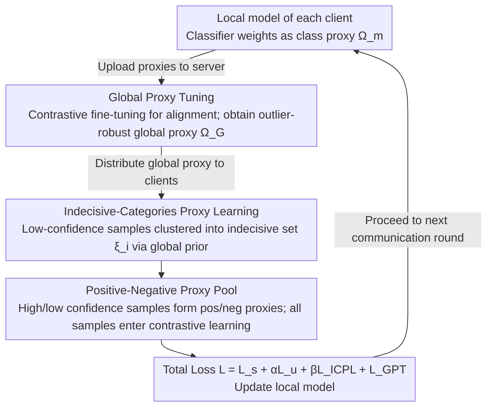

# ProxyFL: A Proxy-Guided Framework for Federated Semi-Supervised Learning

**Conference**: CVPR 2026  
**arXiv**: [2602.21078](https://arxiv.org/abs/2602.21078)  
**Code**: [DuowenC/FSSLlib](https://github.com/DuowenC/FSSLlib)  
**Area**: AI Security  
**Keywords**: Federated Learning, Semi-Supervised Learning, Data Heterogeneity, Proxy Learning, Pseudo-labeling

## TL;DR

The authors propose ProxyFL, a framework that leverages classifier weights as a unified proxy to simultaneously mitigate external heterogeneity (inter-client distribution shifts) and internal heterogeneity (labeled/unlabeled distribution mismatch) in Federated Semi-Supervised Learning (FSSL), significantly outperforming existing FSSL methods across multiple datasets.

## Background & Motivation

Federated Semi-Supervised Learning (FSSL) enables multiple clients to collaboratively train a global model using limited labeled data and large amounts of unlabeled data while preserving privacy. The core challenges lie in two levels of data heterogeneity:

**External Heterogeneity**: Data distribution differences between clients (non-IID). Existing methods mitigate this through dynamic aggregation weights, but simple averaging is easily biased by outlier clients, deviating from the global class distribution.

**Internal Heterogeneity**: Distribution mismatch between labeled and unlabeled data within a single client. Existing methods typically discard low-confidence samples to avoid pseudo-labeling errors, leading to insufficient utilization of training data.

The authors observe through experiments that: (1) simple averaging of classifier weights is prone to outlier-induced shifts and fails to capture the global class distribution effectively; (2) as heterogeneity increases, more unlabeled samples are excluded from training, even though these samples possess the potential to enhance performance.

## Method

### Overall Architecture

The starting point of ProxyFL is that data heterogeneity in FSSL manifests in two layers: "external" (inter-client) and "internal" (intra-client labeled/unlabeled mismatch). The weights of the final fully connected layer of the classifier, $\boldsymbol{\Omega}_m = \{\omega_m^c\}_{c=1}^C$, naturally characterize the direction of each class, making them suitable as a unified "class proxy" to model both local and global distributions. The framework revolves around this proxy: the server uses **Global Proxy Tuning (GPT)** to fit proxies from various clients into a robust global proxy that is resilient to outliers. Clients utilize **Indecisive-Categories Proxy Learning (ICPL)** to construct "indecisive category sets" for previously discarded low-confidence samples, which are then reintegrated into contrastive learning via a **Positive-Negative Proxy Pool**. Since proxies are model parameters, they require no additional transmission and introduce no privacy risks.

### Key Designs

**1. Global Proxy Tuning: Fitting proxies into an outlier-robust global distribution at the server**

Simple averaging of classifier weights is easily skewed by outlier clients. GPT initializes the global proxy with the average $\overline{\boldsymbol{\Omega}}_{\mathcal{G}}$ and then fine-tunes it using a contrastive objective—pulling the global proxy $\boldsymbol{\Omega}_{\mathcal{G}}^c$ closer to the local proxies of the same class from all clients while pushing it away from local proxies of different classes:

$$\mathcal{L}_{\text{GPT}} = \sum_{c=1}^{C}\sum_{m=1}^{M} -\log \frac{e^{-\phi(\boldsymbol{\Omega}_{\mathcal{G}}^c, \omega_m^c)}}{e^{-\phi(\boldsymbol{\Omega}_{\mathcal{G}}^c, \omega_m^c)} + \sum_{c' \neq c} e^{-\phi(\boldsymbol{\Omega}_{\mathcal{G}}^c, \omega_m^{c'})}}$$

By "aligning" rather than simply averaging, the global proxy dilutes the influence of outliers. This step is computationally negligible, with a complexity of $O(Q \times M \times C^2 \times d)$; for CIFAR-100, this is approximately 0.4 GFLOPs, equivalent to the inference cost of a single image.

**2. Indecisive-Categories Proxy Learning: Retaining low-confidence samples via "Indecisive Category Sets"**

Higher heterogeneity causes existing methods to discard more unlabeled samples due to low confidence. Instead of forcing a single hard pseudo-label on a low-confidence sample $\mathbf{u}_i^{\text{lc}}$, ICPL constructs an "indecisive category set" $\xi_i$. A category is included if its global logit $\overline{\mathbf{y}}_i(c)$ exceeds the global category prior $\mathcal{P}_{\mathcal{G}}'(\mathbf{Y}(c))$:

$$\xi_i = \{c \mid \overline{\mathbf{y}}_i(c) > \mathcal{P}_{\mathcal{G}}'(\mathbf{Y}(c))\}$$

The prior $\mathcal{P}_{\mathcal{G}}'$ aggregates prediction preferences across clients, setting higher thresholds for majority classes and lower thresholds for minority classes to dynamically control the set's size. Retaining a set rather than a single label explicitly allows the downstream contrastive learning to handle the sample's uncertainty.

**3. Positive-Negative Proxy Pool: Integrating all samples into contrastive learning**

With the category sets established, a positive-negative proxy pool is built. For high-confidence samples, the positive proxy is the weight of the pseudo-labeled class $\omega_i^{\text{hc}} = \omega_k^{\hat{y}_i}$. For low-confidence samples, the positive proxy is a weighted sum of the proxies in the indecisive set $\omega_i^{\text{lc}} = \sum_{c' \in \xi_i} \tilde{\mathbf{y}}_i(c') \times \omega_k^{c'}$. Negative samples are features in the batch whose category sets do not overlap with the current sample. Through this contrastive objective, even the most uncertain samples contribute gradients, addressing both external and internal heterogeneity within a unified proxy framework.

### Loss & Training

The total loss function consists of local and global components:

$$\mathcal{L} = \underbrace{\mathcal{L}_s + \alpha \mathcal{L}_u + \beta \mathcal{L}_{\text{ICPL}}}_{\text{local}} + \underbrace{\mathcal{L}_{\text{GPT}}}_{\text{global}}$$

- $\mathcal{L}_s$: Cross-entropy loss for labeled data.
- $\mathcal{L}_u$: KL divergence loss for high-confidence unlabeled data (strong augmentation prediction vs. pseudo-label).
- $\mathcal{L}_{\text{ICPL}}$: Contrastive learning loss for all unlabeled data.
- $\alpha, \beta$ are both set to 1.

## Key Experimental Results

### Main Results

10% labeling rate, Dirichlet distribution controls heterogeneity (smaller $\alpha$ indicates higher heterogeneity):

| Dataset | $\alpha$ | Metric (Acc) | ProxyFL | Prev. SOTA (SAGE) | Gain |
|--------|---------|-----------|---------|----------------|------|
| CIFAR-10 | 0.1 | Acc | 88.56 | 87.05 | +1.51 |
| CIFAR-100 | 0.1 | Acc | 57.50 | 54.18 | +3.32 |
| SVHN | 0.1 | Acc | 95.09 | 93.85 | +1.24 |
| CINIC-10 | 0.1 | Acc | 77.98 | 74.59 | +3.39 |
| CIFAR-100 | 0.5 | Acc | 58.75 | 55.82 | +2.93 |
| CINIC-10 | 0.5 | Acc | 78.96 | 75.74 | +3.22 |

On SVHN and CINIC-10 ($\alpha=0.1$), the performance even approaches the full-supervision upper bound of FedAvg-SL.

### Ablation Study

| Configuration | CIFAR-10 ($\alpha$=0.1) | CIFAR-100 ($\alpha$=0.1) | Notes |
|------|------------------------|--------------------------|------|
| Baseline (GPL) | 84.56 | 48.96 | FedAvg + FixMatch-GPL |
| +GPT | 87.59 | 54.86 | Global proxy tuning provides significant gains |
| +ICPL | 87.81 | 57.21 | Participation of low-confidence samples is effective |
| +GPT+ICPL | **88.56** | **57.50** | Both modules are complementary and optimal |

Comparison of Indecisive Category Set designs ($\alpha=0.1$):

| Strategy | CIFAR-100 | SVHN | Notes |
|------|-----------|------|------|
| Top-1 | 55.66 | 94.56 | Single pseudo-label |
| Top-5 | 56.58 | 94.71 | Fixed top-5 categories |
| $\mathcal{P}_{\mathcal{G}}'(\mathbf{Y})$ | **57.21** | **94.82** | Dynamic prior threshold is optimal |

### Key Findings

- **Convergence Speed**: ProxyFL reaches 50% accuracy on CIFAR-100 ($\alpha=0.1$) in only 177 rounds, achieving a 3.18× acceleration compared to LPL’s 562 rounds.
- **Recall**: The recall of the indecisive category set is significantly higher than the accuracy of a single pseudo-label, validating the set-based strategy.
- **Proxy vs. Prototype**: The proxy approach outperforms FedProto+FSSL variants across all datasets without introducing privacy risks (whereas prototypes can be susceptible to inverse reconstruction).

## Highlights & Insights

- Innovatively utilizes classifier weights as "proxies" to unifiedly handle external and internal heterogeneity, avoiding the privacy leakage risks associated with prototype-based methods.
- The indecisive category set is an elegant design—it avoids the hard-coding of single pseudo-labels and instead retains uncertainty, allowing contrastive learning to process it naturally.
- The server-side tuning overhead of the GPT module is extremely low (roughly equivalent to the inference of one image), making it highly practical.

## Limitations & Future Work

- Validation is limited to image classification tasks; expansion to more complex tasks like detection or segmentation is needed.
- Only the Label-at-All-Client scenario is considered; other FSSL scenarios like Labels-at-Partial-Clients were not covered.
- The stability of the prior distribution $\mathcal{P}_{\mathcal{G}}'$ in the indecisive category set depends on the accumulation of global communication rounds and may be unstable early on.
- The number of clients is fixed at 20; scalability in larger-scale federated scenarios remains to be explored.

## Related Work & Insights

- **FedDure / SAGE**: Current FSSL SOTA; ProxyFL further introduces the proxy mechanism on this basis.
- **FedProto**: Uses prototypes to represent category distributions but carries privacy leakage risks (features can be inversely reconstructed).
- **FixMatch**: A baseline SSL method; its high-confidence filtering strategy results in data waste in FSSL settings.
- Proxy learning has been applied in metric learning; this work is the first to introduce it into FSSL to handle heterogeneity.

## Rating

- Novelty: ⭐⭐⭐⭐ (Unified proxy framework for handling internal and external heterogeneity; clear concept)
- Experimental Thoroughness: ⭐⭐⭐⭐⭐ (4 datasets × 3 heterogeneity levels; comprehensive ablation)
- Writing Quality: ⭐⭐⭐⭐ (Clear logical progression from problem and observation to solution)
- Value: ⭐⭐⭐⭐ (Substantial contribution to the FSSL field)

<!-- RELATED:START -->

## Related Papers

- [\[CVPR 2026\] FedRE: A Representation Entanglement Framework for Model-Heterogeneous Federated Learning](fedre_a_representation_entanglement_framework_for_model-heterogeneous_federated_.md)
- [\[CVPR 2025\] Geometric Knowledge-Guided Localized Global Distribution Alignment for Federated Learning](../../CVPR2025/ai_safety/geometric_knowledge-guided_localized_global_distribution_alignment_for_federated.md)
- [\[CVPR 2026\] Enabling Supervised Learning of Generative Signatures for Generalized AI-Generated Images Detection](enabling_supervised_learning_of_generative_signatures_for_generalized_ai-generat.md)
- [\[CVPR 2026\] FedDAP: Domain-Aware Prototype Learning for Federated Learning under Domain Shift](feddap_domain-aware_prototype_learning_for_federated_learning_under_domain_shift.md)
- [\[ICML 2025\] Generalization in Federated Learning: A Conditional Mutual Information Framework](../../ICML2025/ai_safety/generalization_in_federated_learning_a_conditional_mutual_information_framework.md)

<!-- RELATED:END -->
