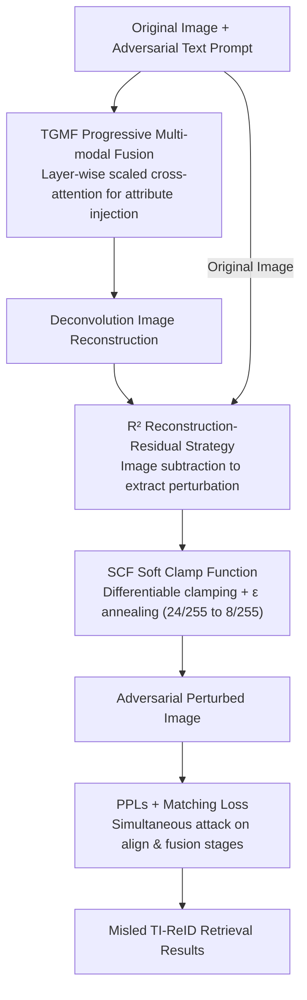

# R$^2$TUA: Reconstruction-residual Based Targeted and Untargeted Attack Against Text-Image Person Re-Identification

**Conference**: CVPR 2026  
**Paper**: [CVF Open Access](https://openaccess.thecvf.com/content/CVPR2026/html/Wang_R2TUA_Reconstruction_residual_Based_Targeted_and_Untargeted_Attack_Against_Text-Image_Person_CVPR_2026_paper.html)  
**Code**: To be confirmed  
**Area**: AI Security / Adversarial Attack  
**Keywords**: Text-Image Person Re-Identification, Adversarial Attack, Multi-modal Fusion, Reconstruction-residual, Targeted/Untargeted Attack

## TL;DR
$R^2$TUA is the first multi-modal adversarial attack specifically designed for Text-Image Person Re-Identification (TI-ReID). Given an image and an adversarial text prompt, it utilizes progressive multi-modal fusion to inject adversarial identity attributes into the image, followed by a "reconstruction-residual" process to extract nearly invisible perturbations. This approach effectively prevents the original image from being retrieved by its true description (untargeted) while misleading the system towards an adversarial identity (targeted), outperforming all transferable existing attacks across three datasets and three target models.

## Background & Motivation
**Background**: Person Re-Identification (ReID) is a core component of surveillance networks. However, pure RGB-based ReID often fails under occlusions, lighting changes, low resolution, or when clear query images are unavailable. Text-Image ReID (TI-ReID) addresses this by allowing natural language descriptions for person retrieval, thereby expanding the scope of applications. Leading TI-ReID models are similar to Vision-Language Pre-training (VLP) models, utilizing ViT for image encoding and text transformers for text encoding, with some (e.g., RaSa, APTM) incorporating a fusion transformer for match probability re-ranking.

**Limitations of Prior Work**: TI-ReID inherits the adversarial vulnerabilities of deep networks and VLP models. If misled by carefully crafted subtle perturbations, a system might fail to match a target or rank irrelevant individuals at the top. In critical applications like missing person searches or suspect tracking, this can mislead operators, waste resources, and allow suspects to escape. Despite this, the security of TI-ReID remains largely unexplored.

**Key Challenge**: TI-ReID exists at the intersection of ReID and VLP, yet attacks from either domain do not transfer effectively. Typical ReID attacks target "attribute-independent" cues (body shape, gait, facial contours) by perturbing subtle appearance details. TI-ReID, however, matches images to text descriptions emphasizing **attribute semantics** (gender, clothing, color, carried objects). ReID attacks fail to disrupt these attribute semantics. Conversely, VLP attacks target coarse-grained alignment (e.g., "a woman walking") and cannot handle the fine-grained, identity-related retrieval required for TI-ReID (e.g., "a man with glasses, wearing a red shirt and dark grey jeans").

**Goal**: (i) Decisively inject adversarial identity attributes into perturbations for fine-grained targeted attacks; (ii) Generate invisible perturbations without being trapped in sub-optimal local minima by local gradient vanishing; (iii) Simultaneously attack both the alignment and fusion stages of TI-ReID.

**Key Insight**: Utilize a "Reconstruction-residual" ($R^2$) strategy. First, merge the image with adversarial text to reconstruct a new image; then, subtract the original image from the reconstructed one to obtain the perturbation residual. Because auto-encoder compression-reconstruction naturally discards high-frequency components, the residual preserves the main structure while suppressing irrelevant noise, avoiding the high-frequency discrepancies common in direct optimization methods, thus achieving both imperceptibility and robustness.

**Core Idea**: Decouple "fine-grained attribute injection" and "imperceptible perturbation generation" into reconstruction and residual phases. Use layer-wise adjustable multi-modal fusion combined with a differentiable soft clamp function to precisely and discretely embed adversarial attributes into the perturbation.

## Method

### Overall Architecture
$R^2$TUA operates in two phases. **Reconstruction Phase**: The reconstructor merges the target image with an adversarial text prompt (representing the misleading identity) in the latent space to output a reconstructed image. A ViT encoder processes the image into patch latents, a BERT encoder processes the adversarial prompt into prompt latents, and both are fed into the TGMF module for progressive layer-wise fusion. Finally, an inverse patch embedding based on deconvolution reconstructs the fused latent into an image. **Residual Phase**: The Residual Perturbation Generator (RPG) subtracts the reconstructed image from the original to extract the perturbation, which is then processed via a Soft Clamp Function (SCF) and SSIM loss to ensure invisibility. The two phases are coupled by the $R^2$ strategy: since auto-encoders naturally lose high frequencies, the residual preserves the primary structure. During training, "pairwise batch sampling" is used to exchange text within batches as adversarial prompts, employing PPLs to attack the alignment stage and matching loss to attack the fusion stage.

### Key Designs

**1. TGMF Progressive Multi-modal Fusion: Precise Attribute Injection**
TI-ReID attack requires attribute-level fine-grained image-text fusion rather than coarse alignment. TGMF consists of multiple transformer layers, each with distinct cross-attention and feed-forward scaling weights $\gamma_l$ for progressive fusion. Each layer first updates $f$ via self-attention, then uses adversarial prompt latents $f_T$ as K/V for cross-attention $A=\mathrm{Attn}(Q=f,K=\gamma_l f_T,V=\gamma_l f_T)$, blending them as $f\leftarrow\mathrm{Norm}(\gamma_l A+(2-\gamma_l)f)$, with $\gamma_{l+1}=\eta\cdot\gamma_l$ ($\eta\le1$). In **shallow layers** (e.g., 1–3), $\gamma_l\to1$, allowing strong adversarial prompt influence to inject identity semantics into the image latents. In **deep layers** (e.g., 4–6), $\gamma_l<1$, dampening the prompt influence so the image latent dominates, preserving the core structure and appearance of the person while modifying attributes.

**2. $R^2$ Reconstruction-residual Strategy: Low-frequency Friendly Perturbations**
Directly optimizing pixel perturbations often results in noticeable high-frequency artifacts. $R^2$TUA instead uses the RPG to subtract the reconstructed image from the original. Since auto-encoder compression-reconstruction inherently discards high-frequency details, the residual naturally suppresses irrelevant noise and high-frequency artifacts, making the perturbation more stealthy and robust. This decoupled approach connects TGMF to subsequent clamping and loss functions.

**3. SCF Soft Clamp Function: Differentiable Clamping and Curriculum Learning**
Explicitly controlling perturbation magnitude usually involves $\ell_\infty$ hard clamping ($\lVert\delta\rVert_\infty\le\epsilon$, $\epsilon=8/255$), but hard clamping has zero gradients in the $|x|>\epsilon$ region, which can trap training. SCF is defined as $C(x)=\dfrac{\epsilon x}{\sqrt[2n]{\epsilon^{2n}+x^{2n}}}$, offering two properties: it is **fully differentiable**, allowing gradient flow even when $|x|>\epsilon$, and it maintains **low distortion** for values within the threshold. This allows for **dynamic $\epsilon$ adjustment** during training. The smoothing temperature $n=10$ provides a balance. The authors utilize an easy-to-hard curriculum: $\epsilon$ anneals from $24/255$ to $8/255$, expanding the search space initially before tightening for stealth. SSIM loss $L_{\mathrm{SSIM}}$ is added as an implicit invisibility constraint.

**4. PPLs + Matching Loss: Dual-stage Attack**
Modern TI-ReID models (RaSa, APTM) use a fusion stage for re-ranking; thus, attacking alignment alone is insufficient. **Push-Pull Losses (PPLs)** target the alignment stage based on InfoNCE: "pushing" to maximize the distance between the perturbed image and its true description, and "pulling" to minimize the distance to the adversarial prompt. **Matching Losses** target the fusion stage where a cross-attention decoder generates matching probabilities $P(I,T)=\mathrm{Softmax}(F(h_{[CLS]}))$. The matching loss uses cross-entropy to suppress "image-true description" probability and elevate "image-adversarial prompt" probability, incorporating hard negative sampling for robust perturbations. Total loss: $L=\alpha L_{\mathrm{PPLs}}+(2-\alpha)L_{\mathrm{MtLs}}$.

### Loss & Training
Implemented in PyTorch 2.1 using an RTX 3090. The reconstructor uses 6 layers each for ViT, BERT, and TGMF. Scaling factor $\eta=0.9$. Training spans 30 epochs with a pairwise batch size $N=16$, loss weight $\alpha=1$, and AdamW optimizer ($1.2 \times 10^{-5}$ learning rate). $\epsilon$ starts at $24/255$ and decays 10% per epoch until reaching $8/255$.

## Key Experimental Results

Datasets: CUHK-PEDES, ICFG-PEDES, and RSTP-ReID. Target models: RaSa, APTM (align-fusion), and IRRA (align-based). Metrics: Rank-1/5/10 accuracy and mAP. Baselines: VLP attacks (SGA, VLPTAttack, MFHA, AnyAttack) and image-based ReID attacks (MisRanking, MetaAttack, MTGA).

### Main Results (Untargeted Attack, R@1 lower is better, target=RaSa; unit %)
| Dataset | Baseline R@1 | Best Baseline R@1 | R²TUA R@1 |
|---------|--------------|-------------------|-----------|
| CUHK-PEDES | 76.51 | 8.48 (AnyAttack) | **0.11** |
| ICFG-PEDES | 65.28 | 7.15 (SGA) | **0.15** |
| RSTP-ReID | 66.90 | 6.70 (MetaAttack) | **0.65** |

$R^2$TUA reduces RaSa's R@1 on CUHK from 76.51% to 0.11%, significantly outperforming the strongest baseline by nearly two orders of magnitude.

### Main Results (Targeted Attack, R@1 higher is better, target=RaSa; unit %)
| Dataset | AnyAttack (Strongest Baseline) | R²TUA (Targeted) |
|---------|--------------------------------|------------------|
| CUHK-PEDES | 31.26 | **89.43** |
| ICFG-PEDES | 34.09 | **68.48** |
| RSTP-ReID | 32.40 | **84.60** |

$R^2$TUA successfully directs retrieval towards the adversarial identity, with targeted R@1 far exceeding AnyAttack.

### Key Findings
- **Failure of existing ReID and VLP attacks**: Pure image attacks and coarse VLP attacks fail as they do not address the "attribute semantics" critical to TI-ReID.
- **Targeted attack capability**: Directing retrieval to a *specific* adversarial identity is a major qualitative improvement over prior methods.
- **Necessity of dual-stage attack**: Attacking both alignment (PPLs) and fusion (Matching Loss) is required to prevent models from recovering via re-ranking.
- **Black-box transferability**: The method demonstrates high transferability across different architectures and tasks.

## Highlights & Insights
- **Defining invisibility in the frequency domain**: By leveraging auto-encoder properties, $R^2$ makes perturbations inherently low-frequency friendly, bypassing high-frequency artifacts. This logic is applicable to various "invisible perturbation" generation tasks.
- **Analytical solution for Differentiability + Zero Distortion**: The SCF allows gradients to pass through clamped regions without distorting values within the threshold, a significant improvement over $\tanh$-based clipping.
- **TGMF Layer-wise Decay**: The $\gamma_l$ scheduling elegantly balances attribute tampering with visual identity preservation using a single scalar.

## Limitations & Future Work
- The attack requires paired input of an image and an adversarial text prompt; targeted success depends on the prompt quality.
- The reconstructor (ViT+BERT+TGMF) has higher training computational costs compared to pure UAP attacks.
- Robustness against industrial-grade defenses (adversarial training, perturbation detection) needs further verification.
- As the "first TI-ReID attack," defense countermeasures are not provided; the paper focuses on quantifying vulnerability.

## Related Work & Insights
- **vs. VLP Attacks**: Existing VLP attacks target coarse alignment; $R^2$TUA uses TGMF for attribute-level fusion, achieving significantly lower untargeted R@1.
- **vs. ReID Attacks**: Pure image attacks target attribute-independent cues and lack text integration; $R^2$TUA dominates in both untargeted and targeted scenarios.
- **vs. Text-driven Image Editing**: While editing focuses on visual appearance, $R^2$TUA must maintain visual consistency while ensuring adversarial success.

## Rating
- Novelty: ⭐⭐⭐⭐⭐ First multi-modal attack for TI-ReID; innovative $R^2$ + SCF + Dual-stage loss.
- Experimental Thoroughness: ⭐⭐⭐⭐ Diverse datasets and models; targeted/untargeted and black-box tests included.
- Writing Quality: ⭐⭐⭐⭐ Clear explanation of why existing attacks fail; algorithms and formulas are well-defined.
- Value: ⭐⭐⭐⭐⭐ Systematically reveals security vulnerabilities in TI-ReID; critical for surveillance security research.

<!-- RELATED:START -->

## Related Papers

- [\[NeurIPS 2025\] Unifying Re-Identification, Attribute Inference, and Data Reconstruction Risks in Differential Privacy](../../NeurIPS2025/ai_safety/unifying_re-identification_attribute_inference_and_data_reconstruction_risks_in_.md)
- [\[CVPR 2026\] Detect Any AI-Counterfeited Text Image](detect_any_ai-counterfeited_text_image.md)
- [\[CVPR 2026\] PROMPTMINER: Black-Box Prompt Stealing against Text-to-Image Generative Models via Reinforcement Learning and VLM-Guided Optimization](promptminer_black-box_prompt_stealing_against_text-to-image_generative_models_vi.md)
- [\[CVPR 2026\] Good Can Sometimes be Bad: A Unified Attack against 3D Point Cloud Classifier by a Flexible Isotropic Resampling](good_can_sometimes_be_bad_a_unified_attack_against_3d_point_cloud_classifier_by_.md)
- [\[CVPR 2026\] Towards Human-Imperceptible Backdoor Attacks on Text-to-Image Diffusion Models](towards_human-imperceptible_backdoor_attacks_on_text-to-image_diffusion_models.md)

<!-- RELATED:END -->
