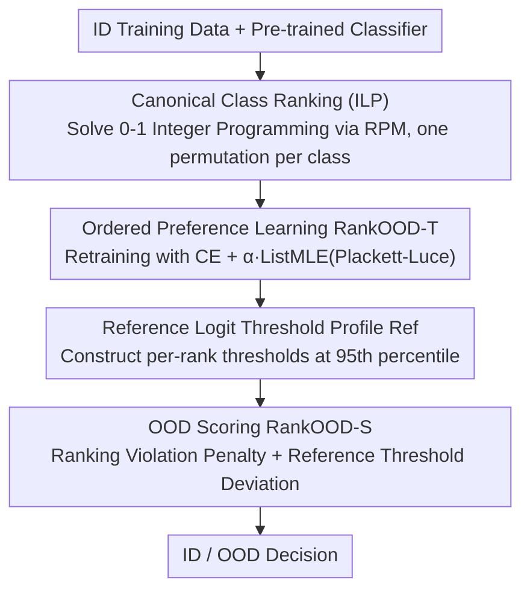

# RankOOD: Class Ranking-based Out-of-Distribution Detection

**Conference**: CVPR 2026  
**Paper**: [CVF Open Access](https://openaccess.thecvf.com/content/CVPR2026/html/Denipitiyage_RankOOD_-_Class_Ranking-based_Out-of-Distribution_Detection_CVPR_2026_paper.html)  
**Code**: None  
**Area**: AI Safety / Out-of-Distribution (OOD) Detection  
**Keywords**: OOD Detection, Class Ranking, Plackett-Luce, ListMLE, Listwise Learning  

## TL;DR
RankOOD leverages the insight that a classifier naturally induces an inter-class ranking pattern for each ID (In-Distribution) class, while OOD samples struggle to adhere to this ranking. It first extracts a **canonical rank** for each class using ILP, then retrains the classifier using **Plackett-Luce ListMLE loss** to reinforce this ranking, and finally scores OOD based on the test sample's deviation from the canonical rank. It reduces FPR95 by 4.3% on TinyImageNet near-OOD, achieving SOTA.

## Background & Motivation
**Background**: OOD detection is divided into two major categories. Post-hoc methods directly extract OOD signals from outputs/intermediate features of pre-trained models (e.g., MSP, Energy, Mahalanobis, ReAct), which are simple and maintain ID performance without network modifications. Training-based methods modify the learning process to improve ID/OOD separability, further split into "without external outliers" (e.g., LogitNorm, CSI, RotPred) and "with outliers" (e.g., Outlier Exposure, MixOE); the latter are typically stronger but often at the cost of ID accuracy or dependence on external data.

**Limitations of Prior Work**: Post-hoc methods rely heavily on the calibration quality of the underlying model. Training methods with outliers, while powerful, require diverse auxiliary outlier data and are prone to overfitting to seen outliers. Recent "class ranking" approaches (ExCeL, CRAFT) found that the inter-class ranking of ID samples is more deterministic, whereas OOD samples disrupt this order. however, CRAFT requires fine-tuning and models the ranking for each class as a $C\times C$ probability mass function (PMF) matrix, introducing architectural changes and **ignoring the relative order between class ranks**.

**Key Challenge**: An OOD sample might be overconfidently classified into an ID class (making top-1 anomalies invisible), but its "compliance with the full ranking structure of that class" provides a more reliable discriminant signal. Existing ranking methods either look at point-wise PMF values or require auxiliary networks/fine-tuning, failing to constrain the "relative order of the entire ranking list" as a holistic entity.

**Goal**: To learn and utilize class ranking structures for OOD detection directly on the raw logits of a pre-trained network, without fine-tuning, auxiliary networks, or external outliers.

**Key Insight**: The authors borrow the **Plackett-Luce model** commonly used in preference alignment—treating a fixed ranking permutation for each class as the "predicted variable" and using Listwise Maximum Likelihood (ListMLE) to force the logit list to follow that ranking. Even if an OOD sample is assigned to an ID class with high probability, its likelihood of following the complete ranking of that class remains low.

**Core Idea**: Replace "point-wise PMF or top-1 cross-entropy" with "ListMLE/Plackett-Luce modeling of the entire class ranking list," grounding OOD detection in the "degree of deviation from the canonical rank."

## Method

### Overall Architecture
RankOOD consists of three steps, taking ID training data and a pre-trained classifier as input and outputting a RankOOD-S score for each test sample. The first step uses the pre-trained model to solve for a **canonical class ranking** for each class (via ILP). The second step uses these canonical rankings as ground truth to retrain the classifier (denoted as RankOOD-T) with a hybrid CE + ListMLE loss. The third step, during inference, builds a **reference logit threshold profile** for each class and scores test samples based on their violation of the canonical rank and deviation from the reference thresholds. The pipeline requires no architectural changes or external outliers.

### Key Designs

**1. Extracting Canonical Ranks via ILP from Ranking Probability Matrices**

To use "ranking" as a supervisory signal, a unique and stable target ranking for each class must first be defined. Following CRAFT, the authors use a Ranking Probability Matrix (RPM): for class $c$, they collect statistics $P^c\in\mathbb{R}^{C\times K}$ from ID samples correctly predicted as $c$, where $p^c_{i,j}$ represents the "probability that class $i$ appears at rank $j$ when the input is classified as $c$." Each column is a PMF at that rank position. However, as the number of classes increases, the RPM becomes noisy and ties appear at certain ranks. To obtain a consistent canonical ranking, the authors solve a 0-1 Integer Linear Programming (ILP) problem: introduce binary variables $x^c_{i,j}\in\{0,1\}$ (whether class $i$ is assigned to rank $j$), with the objective $\max_x \sum_{i}\sum_{j} x^c_{i,j}\,p^c_{i,j}$, subject to $\sum_i x^c_{i,j}=1\ \forall j$ (exactly one class per rank) and $\sum_j x^c_{i,j}\le 1\ \forall i$ (each class selected at most once). This ensures a valid permutation with maximum joint probability under the model's preference structure. Compared to using PMFs directly, ILP yields the "most representative order," resolving ties and noise at the source.

**2. Ordered Preference Learning RankOOD-T: Hybrid CE + ListMLE Objective**

With canonical rankings as ground truth, the authors use Listwise Maximum Likelihood (ListMLE) from the Plackett-Luce model to train the classifier, forcing the logit list to follow the ranking:

$$\mathcal{L}_{\text{ListMLE}}=-\sum_{i=0}^{K-1}\Big(l_{\pi_i}-\log\sum_{j=i}^{K-1}\exp(l_{\pi_j})\Big),\quad \mathcal{P}(\pi|l)=\prod_{i=0}^{K-1}\frac{\exp(l_{\pi_i})}{\sum_{j=i}^{K-1}\exp(l_{\pi_j})}$$

Where $\pi=(\pi_0,\dots,\pi_{K-1})$ is the canonical ranking and $l_{\pi_i}$ is the logit of the class at rank $i$. Unlike CE which only constrals top-1 correctness, ListMLE optimizes the likelihood of the entire permutation, enforcing the relative order $l_{\pi_0}>\dots>l_{\pi_{K-1}}$, thereby preserving rich inter-class relationships. To address vulnerabilities—such as the lack of absolute order constraints when supervising only subsets of ranks or the lack of global argmax guarantees—the authors add a cross-entropy term:

$$\mathcal{L}_{RankOOD\text{-}T}=\mathcal{L}_{CE}+\alpha\,\mathcal{L}_{\text{ListMLE}}$$

$\alpha$ balances the two terms. This process retrains a standard vision backbone (ResNet-18) without architectural changes or outliers, a simpler alternative to CRAFT’s fine-tuning and PMF matrices.

**3. RankOOD-S: Reference Logit Threshold Profile + Cumulative Violation Penalty**

How is "ranking compliance" converted into a score during inference? It consists of two parts. First, a **reference logit threshold profile** $Ref^c_i$ is built offline: for each rank $i$, the empirical 95th percentile logit of correctly predicted training samples (meeting a minimum rank accuracy $N$) is taken as the threshold. During testing, for a sample with predicted class $\hat c$ and canonical rank $\pi^{\hat c}$, let the actual predicted ranking be $\bar\pi$. Because Plackett-Luce couples rank $i$ with all subsequent ranks, an error at one position affects the logs of preceding ranks. Thus, a per-rank cumulative gap penalty is defined as $\delta_{\pi^{\hat c}_i}=\gamma^{\,r}$, where $r=\sum_{j=i}^{K-1}\mathbb{1}[\pi^{\hat c}_j\neq\bar\pi_j]$ ($\gamma\ge1$, penalty increases exponentially with more mismatches). Finally:

$$\text{RankOOD-S}=\sum_{i=0}^{K-1} w_i\,\log\big(\text{softmax}(\mathbf{u})\big)_i,\quad u_i=\frac{x_{\pi^{\hat c}_i}}{\delta_{\pi^{\hat c}_i}}-Ref^{\hat c}_i$$

Weights $w_i$ are learned via linear regression on a validation set to maximize ID/OOD separation. The intuition: ID samples should follow a trajectory where the rank-0 logit is high and decreases monotonically with the order. ListMLE training ensures the scores are orderly coupled, so even a single middle-rank violation exposes the inconsistency of the entire confidence trajectory—exactly where OOD samples are caught. ⚠️ Symbols like $\gamma$ and $\delta$ in Eq. 5 are subject to the original text.

### Loss & Training
The backbone is a pre-trained ResNet-18; CIFAR-10/100 are trained for 500 epochs, TinyImageNet for 300 epochs, using SGD (momentum 0.9, initial lr 0.1, cosine annealing). $\alpha$ is set to 0.8/1.0/0.5 for CIFAR-10/100/TinyImageNet, and reference thresholds use the 95th percentile. CIFAR-10 uses all 10 ranks for training, while CIFAR-100 and TinyImageNet use the top-10 and bottom-10 ranks produced by ILP.

## Key Experimental Results

### Main Results
Compared against 34 methods in the OpenOOD environment, using CIFAR-10/100 and ImageNet-200 (TinyImageNet) as ID data. Metrics include FPR95 (lower is better) and AUROC (higher is better), averaged over three random seeds. The table below shows averages for near-OOD:

| Method | Category | Avg AUROC↑ | Avg FPR95↓ |
|------|------|------------|------------|
| OE | Training (w/ Outliers) | **89.32** | **34.29** |
| **RankOOD (Ours)** | Training (w/o Outliers) | **85.39** | **44.79** |
| CRAFT | Training (w/o Outliers, Ranking) | 85.22 | 46.76 |
| GEN | Post-hoc | 84.40 | 54.43 |
| LogitNorm | Training (w/o Outliers) | 84.49 | 49.56 |
| ExCeL | Post-hoc (Ranking) | 83.33 | 59.89 |

RankOOD achieves the **second-best** results on near-OOD (surpassed only by OE, which uses external outliers) and reaches SOTA on TinyImageNet near-OOD: AUROC increased by 0.50% and FPR95 decreased by 4.3%. It ranks third in far-OOD. Compared to ranking-based methods CRAFT/ExCeL, the average FPR95 is reduced by 7.51% in far-OOD and 4.21% in near-OOD.

### Ablation Study

| Configuration / Comparison | Key Metric | Description |
|------|---------|------|
| RankOOD (w/o outliers) vs OE (w/ outliers) | near-OOD FPR95 44.79 vs 34.29 | Only OE outperforms RankOOD by relying on strong outlier assumptions. |
| vs CRAFT (Ranking, Fine-tuned) | near AUROC 85.39 vs 85.22 / FPR95 44.79 vs 46.76 | Outperforms without fine-tuning by modeling relative order. |
| vs GEN (Strongest post-hoc w/o outliers) | CIFAR-100 FPR95 −3.36% | Best FPR95 on CIFAR-100 in the "no outliers" setting. |
| vs G-ODIN (Strongest far-OOD CIFAR-100) | TinyImageNet FPR95 −8.12% | G-ODIN performs poorly on near-OOD; RankOOD is more balanced. |
| Rank subset vs Full training | Similar Performance | Top-k + bottom-k is sufficient; no need for full ranking supervision. |

### Key Findings
- **High Balance**: RankOOD consistently ranks in the top two for near-OOD and top three for far-OOD across all benchmarks, unlike G-ODIN which fails in near-OOD, suggesting ranking is a robust signal.
- **Strong Performance without External Data**: Only OE comprehensively outperforms it, but OE requires auxiliary outliers. In the more realistic "no outlier" setting, RankOOD is nearly the best.
- **Benefits in High-Cardinality Spaces**: SOTA on TinyImageNet confirms the hypothesis that "more classes provide more informative ranking structures."
- **Rank Subsets are Sufficient**: Training on top-10/bottom-10 matches full ranking performance, reducing training overhead in high-class count scenarios.

## Highlights & Insights
- **Applying Preference Alignment to OOD**: Using Plackett-Luce/ListMLE—standard in LLM alignment—to model class ranking is a brilliant cross-domain transfer, turning OOD detection into a "permutation likelihood consistency" problem.
- **ILP for Denoising**: Using 0-1 Integer Programming to solve for a unique canonical ranking from a noisy RPM is more stable than direct point-wise PMFs, avoiding ambiguity in tied ranks.
- **Exponential Mismatch Penalty**: The $\delta=\gamma^r$ design penalizes "more mismatches" exponentially. Coupled with Plackett-Luce's forward coupling, it allows a single middle-rank violation to expose global trajectory anomalies—a transferable design for sequence-based anomaly detection.

## Limitations & Future Work
- Dependent on the pre-trained model already possessing a relatively good inter-class ranking structure; if the underlying model is poorly calibrated or ranks are unstable, both canonical rankings and RankOOD-S will be distorted.
- Complexity/runtime of ILP when the number of classes is very large is a potential bottleneck (⚠️ details in original appendix); scalability to massive label spaces needs validation.
- Still requires one round of retraining (RankOOD-T), making it not quite "zero-cost plug-and-play" like pure post-hoc methods.
- Backbones were unified to ResNet-18; performance on larger or more modern backbones (e.g., ViT) has not been reported.

## Related Work & Insights
- **vs CRAFT**: CRAFT fine-tunes the model and builds $C\times C$ PMF matrices for each class, detecting based on PMF divergence. It requires architectural changes and ignores relative order. RankOOD optimizes the entire ranking directly on raw logits using Plackett-Luce without architectural changes, outperforming CRAFT in near/far-OOD.
- **vs ExCeL**: ExCeL is a post-hoc method combining the max logit with a "class rank signature." RankOOD explicitly learns the ranking structure via ListMLE, modeling listwise dependencies that ExCeL ignores.
- **vs Outlier Exposure (OE)**: OE trains with auxiliary outlier data to penalize overconfidence, making it strongest in near-OOD but dependent on external data. RankOOD approaches OE performance without any outliers, making it more suitable for scenarios where representative outliers are unavailable.

## Rating
- Novelty: ⭐⭐⭐⭐⭐ Bringing Plackett-Luce/ListMLE ranking learning to OOD detection is a fresh perspective.
- Experimental Thoroughness: ⭐⭐⭐⭐⭐ Comparison with 34 methods across three ID datasets covering near/far-OOD.
- Writing Quality: ⭐⭐⭐⭐ Clear reasoning with worked examples, though some formula formatting in cache was slightly cluttered.
- Value: ⭐⭐⭐⭐ Practically useful as it nears peak performance without requiring outliers or architectural changes.

<!-- RELATED:START -->

## Related Papers

- [\[CVPR 2026\] Enhancing Out-of-Distribution Detection with Extended Logit Normalization](enhancing_out-of-distribution_detection_with_extended_logit_normalization.md)
- [\[CVPR 2026\] Sparsity as a Key: Unlocking New Insights from Latent Structures for Out-of-Distribution Detection](sparsity_as_a_key_unlocking_new_insights_from_latent_structures_for_out-of-distr.md)
- [\[CVPR 2026\] Bypassing the Transport Plan: Dynamic Reweighting for Out-of-Distribution Detection with Optimal Transport](bypassing_the_transport_plan_dynamic_reweighting_for_out-of-distribution_detecti.md)
- [\[CVPR 2026\] Learning Latent Concepts for Detecting Out-of-Distribution Objects](learning_latent_concepts_for_detecting_out-of-distribution_objects.md)
- [\[ICLR 2026\] AP-OOD: Attention Pooling for Out-of-Distribution Detection](../../ICLR2026/ai_safety/ap-ood_attention_pooling_for_out-of-distribution_detection.md)

<!-- RELATED:END -->
