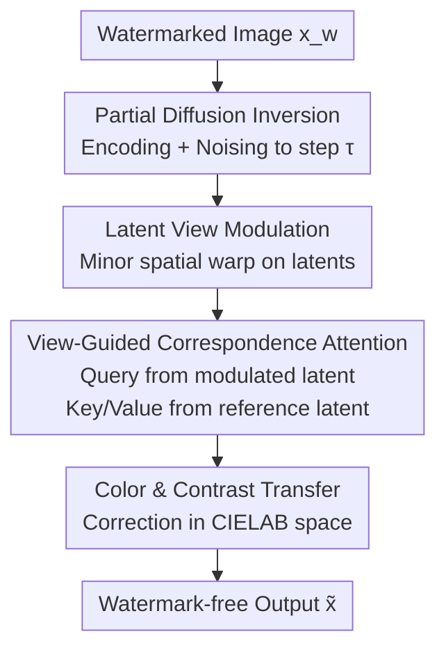

# RAVEN: Erasing Invisible Watermarks via Novel View Synthesis

**Conference**: CVPR 2026  
**Paper**: [CVF Open Access](https://openaccess.thecvf.com/content/CVPR2026/html/Shamshad_RAVEN_Erasing_Invisible_Watermarks_via_Novel_View_Synthesis_CVPR_2026_paper.html)  
**Code**: https://github.com/fahadshamshad/raven-watermark-removal  
**Area**: AI Security / Digital Watermarking / Diffusion Models  
**Keywords**: Invisible Watermarks, Watermark Removal Attacks, Novel View Synthesis, Diffusion Models, Zero-shot

## TL;DR
RAVEN reformulates "erasing invisible watermarks in AI-generated images" as "observing the same scene from a different perspective." By using a frozen image-to-image diffusion model to perform a slight viewpoint shift in the latent space, combined with cross-view correspondence attention to maintain visual consistency, it achieves an average TPR@1%FPR of only 0.026 across 15 watermark methods. This represents a reduction of over 60% compared to the strongest attack baseline while maintaining superior image quality (FID 40.18) in a zero-shot setting without access to the detector or watermark algorithm.

## Background & Motivation
**Background**: Invisible watermarking has become a critical means for provenance in AI-generated content. Schemes like SynthID, Tree-Ring, and StableSignature are deployed across hundreds of millions of images. Regulatory frameworks like the EU AI Act and the US Executive Order on AI explicitly require watermarking for generated content. To evaluate the reliability of these solutions, they must be "stress-tested" using sufficiently strong removal attacks.

**Limitations of Prior Work**: Existing watermark removal attacks operate in either pixel space (JPEG, filtering, noise, BM3D) or latent space (diffusion purification). Neither category has successfully achieved simultaneous "detector failure" and "quality preservation." Pixel-based methods are largely ineffective against modern semantic watermarks and leave visible artifacts. Latent-space diffusion purification requires injecting significant noise to suppress watermarks, which collapses scene structure and image quality. Furthermore, effective methods often rely on **privileged information**: either white-box access to the watermark decoder, training surrogate models on paired clean/watermarked data, or single-image optimization taking up to 40 minutes.

**Key Challenge**: Watermark removal is essentially a three-way game involving detection evasion (P1), semantic preservation (P2), and visual naturalness (P3). These objectives are naturally coupled and conflicting. Aggressive modification collapses semantics and quality, while conservative modification fails to evade detection. Existing methods typically sacrifice some objectives for others.

**Goal**: To achieve watermark removal without quality degradation under a strict "no-box" threat model (no knowledge of the watermark algorithm, no detector internals, no API access, no paired data, single image only, consumer-grade hardware, and second-level latency).

**Key Insight**: The authors observe that watermarks rely on **precise pixel-level spatial correlations** to be detected. If the same scene is re-observed from a different "viewpoint," the synthesized image remains semantically consistent and visually realistic but becomes statistically decoupled from the original watermark signal. This exposes a blind spot in current robustness evaluations: watermarks resistant to pixel perturbations and latent purification may succumb to "semantic-preserving viewpoint transformations."

**Core Idea**: Reformulate watermark removal as a **Novel View Synthesis (NVS) problem**. Instead of performing explicit 3D reconstruction (which requires multi-view supervision and retraining), the method uses a frozen image-to-image diffusion model to perform a controlled, slight viewpoint shift in the latent space, leveraging the model's inherent geometric and semantic priors to "hallucinate" the new view naturally.

## Method

### Overall Architecture
RAVEN takes a watermarked image $x_w$ and outputs a semantically consistent new image $\tilde{x}$ that evades detection. The pipeline runs zero-shot on a frozen Stable Diffusion image-to-image model through four steps: first, the image is encoded into latent space with **partial diffusion inversion** (adding noise to an intermediate step to preserve structure); then, **latent view modulation** is applied (a slight spatial warp to disrupt watermark alignment); during denoising, **view-guided correspondence attention** anchors the new viewpoint's appearance to a parallel denoising reference latent; finally, a **color and contrast transfer** in CIELAB space corrects residual color shifts. The process is a serial pipeline of "inversion → modulation → constrained denoising → post-correction."

### Key Designs

**1. Partial Diffusion Inversion: Damage for Viewpoint Synthesis, Not Semantic Loss**

Directly adding maximum noise and reconstructing (similar to Regen) can erase watermarks but causes severe semantic drift as noise increases. RAVEN uses a diffusion encoder to map $x_w$ to a latent $z=\mathcal{E}(x_w)$, then adds noise only up to an intermediate timestep $\tau=\lfloor s\cdot T\rfloor$: $z_\tau=\sqrt{\bar\alpha_\tau}\,z+\sqrt{1-\bar\alpha_\tau}\,\epsilon$. Here, $s\in[0,1]$ is a strength parameter balancing "injected randomness" and "semantic preservation." RAVEN uses a small $s=0.15$. This step exposes the entangled watermark representation while preserving the global scene structure.

**2. Latent View Modulation: Disrupting Spatial Alignment via Camera Shift**

Watermark detection relies on pixel-level spatial correlation. This step applies a spatial warp function $\mathcal{C}_\theta: \mathbb{R}^2 \to \mathbb{R}^2$ to resample the latent space: $\tilde{z}_\tau[i,j]=z_\tau[\mathcal{C}_\theta(i,j)]$. Each position in the output latent draws content from an offset coordinate, equivalent to "observing the scene from a slightly moved camera position." This does **not** require traditional NVS training or 3D modeling. A simple global translation $\mathcal{C}_\theta(i,j)=(i+\Delta x,\,j+\Delta y)$ (randomly chosen between $[24, 32]$ or $[-32, -24]$ pixels) is sufficient to break watermark alignment without altering semantics.

**3. View-Guided Correspondence Attention: Transferring Appearance without Watermarks**

Denoising the modulated latent $\tilde{z}_\tau$ in isolation causes drift in appearance and color. RAVEN modifies the self-attention in the UNet: a reference latent $z_t^{\text{ref}}$ is denoised in parallel from the unmodulated $z_\tau$. At each step, the **queries** originate from the modulated latent, while **keys and values** come from the reference: $\text{ViewAttn}=\text{softmax}\!\big(\frac{(W_Q\tilde{z}_t)(W_K z_t^{\text{ref}})^\top}{\sqrt{d}}\big)W_V z_t^{\text{ref}}$. Since attention operates in a **learned feature space**, queries match regions by semantic similarity, naturally tolerating spatial offsets while preserving textures and identity. This is the core mechanism for erasing watermarks without sacrificing quality.

**4. Color and Contrast Transfer: CIELAB Post-Correction**

Residual color shifts may persist after stochastic denoising. RAVEN performs a lightweight post-correction in CIELAB space: color is corrected by keeping the luminance of the optimized image while adopting the chrominance of the watermarked image ($x_c=F_{\text{RGB}}(L_{\text{opt}},a_w,b_w)$). Contrast is corrected by aligning luminance statistics to the watermarked image ($L_{\text{final}}=\frac{\sigma_w}{\sigma_c}(L_{\text{opt}}-\mu_c)+\mu_w$). This step improves perceptual quality without reintroducing the watermark, as detectability depends on spatial correlation rather than chrominance statistics.

### Loss & Training
RAVEN is **training-free and requires no parameter fine-tuning**. it runs zero-shot using a frozen Stable Diffusion Refiner with a CFG scale of 2.5, 50-step DDIM inversion, and an image-to-image strength of 0.15. Null-text prompts are used for both inversion and reconstruction. It operates in seconds on a single A100, meeting the constraints of the "no-box" threat model.

## Key Experimental Results

### Main Results
Evaluated on MS-COCO, DiffusionDB, and SD-Prompts across 15 watermark methods and 14 attack baselines. For semantic watermarks, TPR@1%FPR is reported (**lower is better**). For bitstream watermarks, Bit Accuracy is reported (**closer to 0.5 is better**).

| Dataset | Metric | RAVEN | Strongest Baseline (UnMarker) | Description |
|--------|------|-------|------|------|
| MS-COCO (Avg. Semantic) | TPR@1%FPR ↓ | **0.026** | 0.078 | >60% relative reduction |
| SD-Prompts (Avg. Semantic) | TPR@1%FPR ↓ | **0.031** | 0.083 | Consistent across datasets |
| MS-COCO (Avg. Bitstream) | Bit Acc. (→0.5) | **0.533** | 0.573 | Closer to random |
| MS-COCO | FID ↓ | **40.18** | 49.85 | Best image quality |
| MS-COCO | CLIP ↑ | **0.328** | 0.316 | Highest semantic alignment |

Classical pixel attacks (JPEG, blur, noise) are largely ineffective against semantic watermarks (TPR > 0.8). Regeneration-based methods (Regen, Rinse, VAE) provide moderate suppression. While UnMarker is a strong baseline, it degrades quality. RAVEN leads in both detection evasion and visual fidelity.

### Ablation Study

| Configuration | Key Metric | Description |
|------|---------|------|
| Full RAVEN | TPR 0.026 / FID 40.18 | All components enabled |
| w/o View-Guided Attention | Severe structural distortion | Quality collapses without reference anchoring |
| w/o Color/Contrast Transfer | Degraded FID | Residual color/contrast shifts uncorrected |
| Strength $s$: 0.10→0.45 | FID 62.68→85.10 | Higher $s$ erases better but ruins quality; 0.15 is optimal |
| Backbone SD v1.5/v2.0/v2.1 | TPR all < 0.03 | Model-agnostic performance |

### Key Findings
- **View-Guided Correspondence Attention is critical**: Removing it leads to structural distortion during denoising; its inclusion preserves textures and detail while watermarks remain disrupted.
- **Strength parameter $s$ is the trade-off knob**: A small $s=0.15$ is sufficient to erase most watermarks, suggesting that "viewpoint transformation" rather than "noise coverage" is the primary mechanism of RAVEN.
- **Backbone Agnostic**: Consistent performance across different versions of Stable Diffusion indicates the attack does not rely on a specific architecture.
- **Bitstream watermarks are harder to randomize**: RAVEN reduces Bit Accuracy to 0.533. While superior to UnMarker, it does not reach perfect 0.5 randomization due to the strong redundant encoding in bitstream methods.

## Highlights & Insights
- **Power of Reframing**: Switching the perspective from "watermark suppression" to "viewpoint synthesis" bypasses the traditional trade-off between preservation and erasure.
- **Zero-shot + Frozen Models**: The lack of training, paired data, or detector access makes the attack highly practical and serves as a significant warning for real-world deployments.
- **Transferability of Cross-view Attention**: The mechanism of using attention for soft-alignment in feature space to tolerate spatial shifts is applicable to other tasks like style transfer or controllable editing.
- **Exposing Evaluation Blind Spots**: The work highlights that watermarks must be tested against "semantic-preserving geometric transformations," not just pixel noise or latent purification.

## Limitations & Future Work
- **Boundary Changes**: Global shifts generate new content at the edges, meaning the output is not pixel-perfectly aligned with the original image, which may limit use in forensic-sensitive applications.
- **Attack Evolution**: The effectiveness of RAVEN depends on current watermark designs; future watermarks specifically robust to viewpoint shifts could mitigate its impact.
- **Manual Parameter Tuning**: The strength parameter $s$ currently requires manual setting; an adaptive mechanism for different images/watermarks is missing.
- **Bitstream Randomization**: It does not reach the perfect 0.5 bit accuracy for all methods, leaving room for statistical detection in highly redundant schemes.

## Related Work & Insights
- **vs. Regen / Rinse (Regeneration Attacks)**: These rely on noise injection and reconstruction. They struggle with semantic watermarks and cause artifacts. RAVEN outperforms them by using viewpoint shifts instead of just noise.
- **vs. UnMarker**: A general optimization-driven attack that is effective but degrades FID (49.85). RAVEN is superior in both evasion (0.026 vs 0.078) and quality (40.18) without requiring iterative optimization.
- **vs. CtrlGen+ / IRA (Privileged Methods)**: CtrlGen+ requires multi-GPU training, and IRA requires 40-minute optimization and model access. RAVEN achieves better results in seconds on consumer hardware.
- **vs. Traditional Diffusion NVS**: Standard NVS requires multi-view data and 3D consistency. RAVEN is the first to leverage diffusion priors for watermark removal via minor viewpoint perturbation without retraining.

## Rating
- **Novelty**: ⭐⭐⭐⭐⭐ Reformulating removal as NVS is a genuinely new attack vector.
- **Experimental Thoroughness**: ⭐⭐⭐⭐⭐ Comprehensive coverage across 15 watermarks and 14 baselines.
- **Writing Quality**: ⭐⭐⭐⭐ Clear methodology, though some notation requires close attention to the original text.
- **Value**: ⭐⭐⭐⭐⭐ Directly addresses and exposes vulnerabilities in standardized AI provenance measures.

<!-- RELATED:START -->

## Related Papers

- [\[CVPR 2026\] Image-based Outlier Synthesis With Training Data](image-based_outlier_synthesis_with_training_data.md)
- [\[ICML 2026\] Geometrically Constrained Outlier Synthesis](../../ICML2026/ai_safety/geometrically_constrained_outlier_synthesis.md)
- [\[CVPR 2026\] PoInit-of-View: Poisoning Initialization of Views Transfers Across Multiple 3D Reconstruction Systems](poinit-of-view_poisoning_initialization_of_views_transfers_across_multiple_3d_re.md)
- [\[ICLR 2026\] Traceable Black-box Watermarks for Federated Learning](../../ICLR2026/ai_safety/traceable_black-box_watermarks_for_federated_learning.md)
- [\[ICCV 2025\] SpecGuard: Spectral Projection-based Advanced Invisible Watermarking](../../ICCV2025/ai_safety/specguard_spectral_projection-based_advanced_invisible_watermarking.md)

<!-- RELATED:END -->
