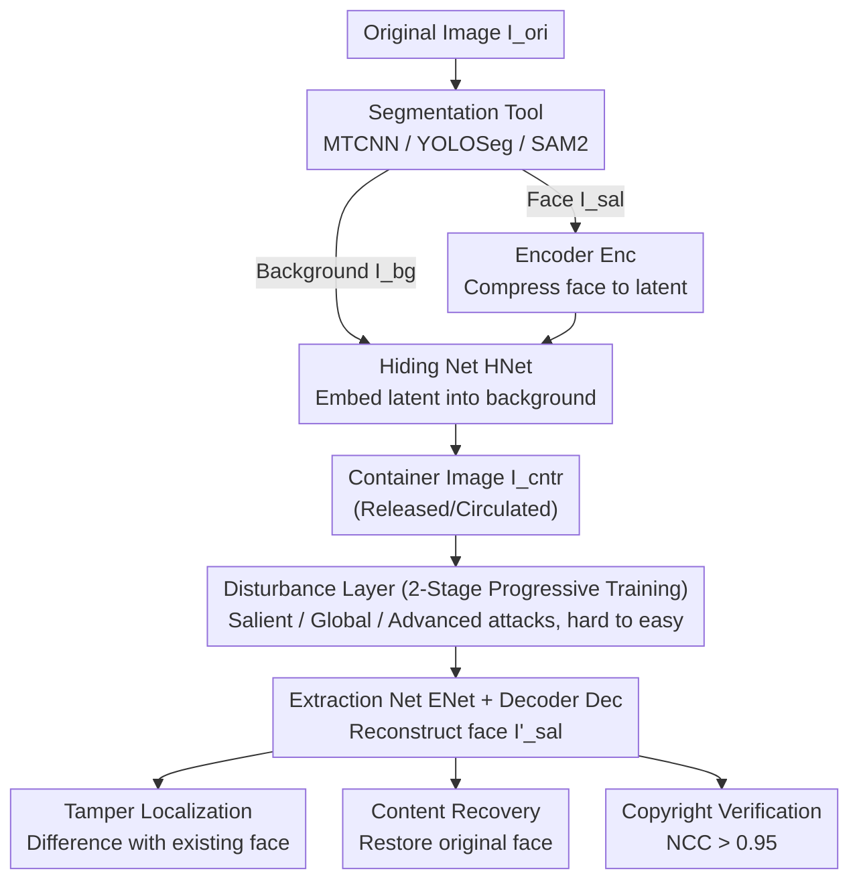

# RecoverMark: Robust Watermarking for Localization and Recovery of Manipulated Faces

**Conference**: CVPR 2026  
**arXiv**: [2602.20618](https://arxiv.org/abs/2602.20618)  
**Code**: To be released (declared public upon acceptance)  
**Area**: AI Security  
**Keywords**: Face Manipulation Detection, Robust Watermarking, Tamper Localization, Content Recovery, Copyright Verification

## TL;DR

RecoverMark is proposed as a robust watermarking framework that embeds the face content itself as a watermark into the background. It achieves simultaneous tamper localization, original content recovery, and copyright verification, remaining effective even under watermark removal attacks.

## Background & Motivation

**Background**: AI-Generated Content (AIGC) technologies, such as Stable Diffusion and various GAN variants, have made face manipulation extremely convenient, posing serious threats to the authenticity and intellectual property of visual content.

**Limitations of Prior Work**: Existing active defense methods (e.g., EditGuard, OmniGuard) employ a dual-watermarking strategy consisting of a fragile watermark and a robust watermark. The fragile watermark is used for tamper detection and localization, while the robust watermark is used for copyright authentication. However, these methods assume attackers are unaware of the watermark and fail completely against watermark removal attacks (e.g., low-pass filtering, regeneration attacks).

**Key Challenge**: In dual-watermarking frameworks, the two watermarks interfere with each other, and limited embedding capacity further weakens the effectiveness of the fragile watermark. Furthermore, existing methods overlook the critical requirement of content recovery for tampered regions.

**Goal**: To design a unified robust watermarking framework capable of simultaneous tamper localization, content recovery, and copyright verification even when facing adversarial watermark removal attacks.

**Key Insight**: A critical real-world constraint is utilized—attackers must maintain the semantic consistency of the background to avoid visual detection. Therefore, the face content itself is embedded as a watermark into the surrounding background; as long as the background remains high-fidelity, the watermark can be extracted.

**Core Idea**: The protected face content is robustly embedded into background regions as a watermark. Simultaneous tamper localization, recovery, and copyright verification are achieved through a two-stage progressive training strategy.

## Method

### Overall Architecture

RecoverMark leverages a real-world constraint: to deceive the human eye, a manipulator must maintain the semantic consistency of the background. Consequently, the framework hides the protected face content as a watermark within the background—as long as the background persists, the watermark can be extracted for localization, recovery, and verification. The pipeline is as follows: first, a segmentation tool (MTCNN/YOLOSeg/SAM2) splits the original image into a salient region (face) $I_{sal}$ and a background $I_{bg}$. An encoder (Enc) compresses the face into a latent representation, and a hiding network (HNet) embeds this representation into the background to produce a container image $I_{cntr}$. During verification, an extraction network (ENet) and a decoder (Dec) reconstruct the face information $I'_{sal}$ from the container image.

### Key Designs

**1. Face content as self-watermark Encoder/Decoder: Native support for content recovery**  
Dual-watermarking methods use an image-independent fragile watermark for detection, which fails if removed and competes for capacity with the robust watermark. The Enc/Dec in RecoverMark is based on the CEILNet architecture, embedding a compressed latent representation of the face itself rather than external bits. This provides two benefits: the extracted data is the original face, making recovery a byproduct rather than an extra module; and the watermark is bound to the image, removing dependency on the fragile assumption that attackers are unaware of the watermark.

**2. Two-stage progressive training: Learning embedding before attack resistance**  
End-to-end training under various attacks is difficult to converge, so it is split into two stages. Stage 1 (Initial Training) trains the Enc, HNet, ENet, and Dec using three losses: fidelity loss to keep the container close to the background, watermark loss to keep the extracted face close to the original, and clean loss to ensure non-watermarked backgrounds yield white images (preventing false positives). Stage 2 (Robustness Enhancement) freezes Enc and Dec, inserting a disturbance layer between HNet and ENet to simulate three attack types: salient region processing (adding noise to the face to force reliance on background), global processing (JPEG, Gaussian noise, low-pass filtering), and advanced attacks (regeneration attacks). Critically, the hardest regeneration attacks are trained first, followed by other disturbances; experiments show that delaying regeneration attacks leads to failure against strong attacks.

**3. Three-in-one Recovery, Localization, and Verification: Single extraction, multiple uses**  
Once the hidden face $I'_{sal}$ is extracted from a suspicious image, it supports three tasks: comparing it with the existing face in the suspicious image generates a localization mask; restoring the original face provides content recovery; and calculating the Normalized Cross-Correlation (NCC > 0.95) with the registered original face completes copyright verification. Sharing one robust watermark avoids interference and capacity competition issues found in dual-watermarking frameworks.

### Loss & Training

The total loss is: $\mathcal{L}_{sum} = \alpha_1 \mathcal{L}_{fidelity} + \alpha_2 \mathcal{L}_{wm} + \alpha_3 \mathcal{L}_{clean}$, with weights set to 1.

Progressive Training Strategy: Regeneration attacks occupy the first half of the total epochs, with remaining disturbances split across the second half. Experiments indicate that introducing regeneration attacks early is vital; late introduction results in failed defense against the strongest attacks.

## Key Experimental Results

### Main Results

Localization performance (F1/AUC) under Structpix2pix manipulation on the ID dataset (CelebA):

| Method | Regen. F1 | Regen. AUC | Noise F1 | Noise AUC | JPEG F1 | JPEG AUC | Low-pass F1 | Low-pass AUC | Lattice F1 | Lattice AUC |
|------|-----------|-------------|--------|---------|--------|---------|--------|---------|-----------|------------|
| MVSS-Net | 0.041 | 0.723 | 0.062 | 0.711 | 0.157 | 0.776 | 0.184 | 0.755 | 0.034 | 0.719 |
| EditGuard | 0.090 | 0.610 | 0.528 | 0.932 | 0.552 | 0.954 | 0.090 | 0.658 | 0.438 | 0.930 |
| OmniGuard | 0.105 | 0.655 | 0.127 | 0.659 | 0.315 | 0.890 | 0.146 | 0.743 | 0.113 | 0.689 |
| **Ours** | **0.855** | **0.993** | **0.876** | **0.992** | **0.867** | **0.993** | **0.830** | **0.989** | **0.842** | **0.991** |

### Ablation Study / Recovery Performance

Comparison of face recovery quality (PSNR/MS-SSIM) on the ID dataset:

| Method | Regen. PSNR | Regen. MS-SSIM | Noise PSNR | Noise MS-SSIM | JPEG PSNR | JPEG MS-SSIM | Lattice PSNR | Lattice MS-SSIM |
|------|-------------|-----------------|---------|-------------|---------|-------------|-------------|----------------|
| Imuge+ | 7.252 | 0.339 | 10.432 | 0.563 | 10.778 | 0.629 | 9.089 | 0.424 |
| **Ours** | **22.154** | **0.607** | **23.276** | **0.657** | **23.314** | **0.680** | **23.230** | **0.655** |

### Key Findings

- RecoverMark significantly outperforms all baseline methods across all attack types, with F1 exceeding 0.7 and AUC exceeding 0.98.
- Maintained high performance (F1=0.842) under unseen Lattice attacks, demonstrating strong generalization.
- Recovery PSNR is approximately 12-15 dB higher than Imuge+, showing significant improvement in content recovery quality.
- Copyright verification success rate reached 99.9%.
- Embedding fidelity remains high when the face ratio is $\le 60\%$, but drops significantly thereafter.

## Highlights & Insights

- **Unified Framework**: For the first time, tamper localization, content recovery, and copyright verification are unified into a single robust watermarking framework, eliminating capacity competition inherent in dual-watermarking.
- **Leveraging Real-world Constraints**: Ingeniously utilizes the constraint that "attackers must preserve background consistency" to enable robust face extraction from the background.
- **Progressive Training Strategy**: Analogous to human learning from difficult to easy, the model is trained on the hardest regeneration attacks before gradually adding other disturbances.
- **Generalization to Unseen Attacks**: Remains effective against Lattice attacks not included in training, proving the generalization of its robustness.

## Limitations & Future Work

- Embedding quality declines when the face occupies more than 60% of the image due to limited background capacity.
- Validation is currently limited to $256 \times 256$ resolution; performance in high-resolution scenarios is unknown.
- The precision of segmentation tools directly affects the quality of embedding and extraction.
- Validated only on face manipulation; extension to other types of image tampering has not yet been explored.

## Related Work & Insights

- Passive detection methods (MVSS-Net, HiFi-Net) rely on manipulation traces that are easily erased by post-processing.
- Active defense methods (EditGuard, OmniGuard) rely on fragile watermarks, which are vulnerable to removal attacks.
- Watermark self-recovery methods (Imuge/Imuge+) were the first to attempt joint localization and recovery using DNNs, but they are also based on fragile embeddings.
- The core breakthrough of RecoverMark is the shift from the fragile watermarking paradigm to a robust watermarking paradigm while maintaining sensitivity for tamper detection.

## Rating

- **Novelty**: ⭐⭐⭐⭐ — The idea of embedding the face itself as a watermark in the background is novel, and the unified framework is well-designed.
- **Experimental Thoroughness**: ⭐⭐⭐⭐⭐ — Comprehensive testing across ID/OOD datasets, various seen/unseen attacks, multiple manipulation methods, and capacity analysis.
- **Writing Quality**: ⭐⭐⭐⭐ — Motivation is clearly articulated from practical scenarios (e.g., forensic evidence), and the logic is self-consistent.
- **Value**: ⭐⭐⭐⭐ — Directly applicable to face content protection, with a unified framework that reduces deployment complexity.

<!-- RELATED:START -->

## Related Papers

- [\[CVPR 2026\] ClusterMark: Towards Robust Watermarking for Autoregressive Image Generators with Visual Token Clustering](clustermark_towards_robust_watermarking_for_autoregressive_image_generators_with.md)
- [\[CVPR 2026\] Meta-FC: Meta-Learning with Feature Consistency for Robust and Generalizable Watermarking](meta-fc_meta-learning_with_feature_consistency_for_robust_and_generalizable_wate.md)
- [\[AAAI 2026\] Robust Watermarking on Gradient Boosting Decision Trees](../../AAAI2026/ai_safety/robust_watermarking_on_gradient_boosting_decision_trees.md)
- [\[CVPR 2026\] MaxMark: High-Capacity Diffusion-Native Watermarking via Robust and Invertible Latent Embedding](maxmark_high-capacity_diffusion-native_watermarking_via_robust_and_invertible_la.md)
- [\[CVPR 2026\] AdvMark: Decoupling Defense Strategies for Robust Image Watermarking](decoupling_defense_strategies_for_robust_image_watermarking.md)

<!-- RELATED:END -->
