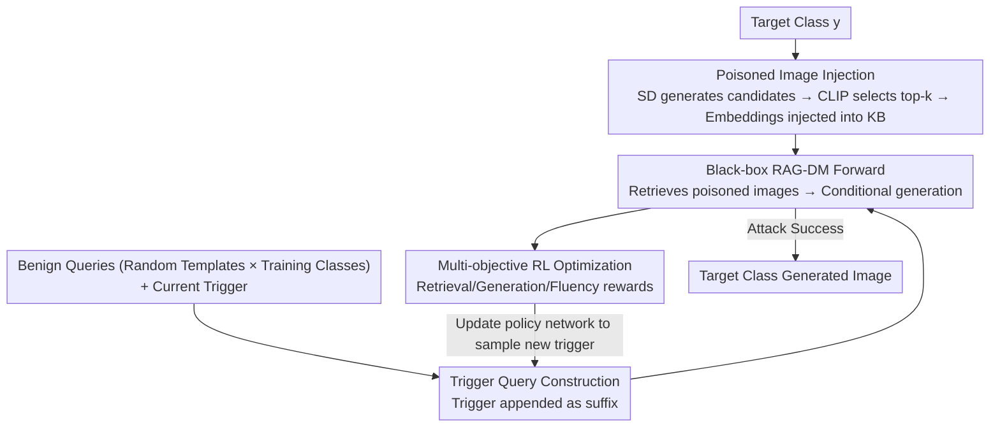

# Red-teaming Retrieval-Augmented Diffusion Models via Poisoning Knowledge Bases

**Conference**: CVPR 2026  
**Paper**: [CVF Open Access](https://openaccess.thecvf.com/content/CVPR2026/html/Lyu_Red-teaming_Retrieval-Augmented_Diffusion_Models_via_Poisoning_Knowledge_Bases_CVPR_2026_paper.html)  
**Code**: None  
**Area**: AI Security  
**Keywords**: Backdoor Attack, Retrieval-Augmented Diffusion Models, Knowledge Base Poisoning, Black-box Attack, RL-based Trigger

## TL;DR
Addressing Retrieval-Augmented Diffusion Models (RAG-DMs), this paper proposes JOB (Jointly Optimized Backdoor), the first backdoor attack for **black-box** scenarios. By injecting a minimal number of target-class poisoned images into the knowledge base and jointly optimizing a trigger word via reinforcement learning, JOB ensures that queries with the trigger retrieve poisoned images and drive the diffusion model to generate target-class images, while maintaining normal performance for benign queries.

## Background & Motivation
**Background**: Retrieval-Augmented Diffusion Models (RAG-DMs) maintain competitive generation quality without retraining or high computational costs by retrieving relevant images from an external knowledge base as conditions during generation. These models are increasingly deployed in systems such as AI agents.

**Limitations of Prior Work**: The trustworthiness of RAG-DMs remains largely unexplored. Existing backdoor attacks on diffusion models (Rickrolling, BadT2I, Personalization, EvilEdit) focus solely on the **generation stage**, ignoring the dual-stage "retrieval + generation" architecture of RAG. BadRDM, the only existing attack on RAG-DMs, targets only the **retrieval stage** and leaves an unresolved "knowledge conflict"—where retrieved poisoned images (e.g., labeled "cat") conflict with the user's text condition (e.g., "[T] + a dog on the grass"), causing the generation to deviate from the target.

**Key Challenge**: BadRDM assumes a **white-box** setting where attackers can fine-tune the retriever and have full access to model architecture and parameters. However, commercial RAG-DMs are typically **black-box** systems. Attackers cannot access retrieval mechanisms or image vector distributions, making it difficult to ensure poisoned images are retrieved while simultaneously achieving "target-consistent generation"—two goals that naturally exhibit knowledge conflict.

**Goal**: Under black-box settings, use a minimal number of poisoned images to ensure triggered queries satisfy: (a) retrieval of target-class poisoned images, (b) generation of target-class images, and (c) natural query fluency, without affecting benign query behavior.

**Key Insight**: Since internal gradients are inaccessible in a black-box setting, the authors model "trigger word search" as a **reinforcement learning word sampling problem**. The RAG-DM is treated as the environment, the trigger word as the action, and a joint reward signal is used to update the policy network.

**Core Idea**: Utilize a **Jointly Optimized Backdoor (JOB)** to simultaneously align the retrieval and generation stages, rather than attacking a single stage in isolation.

## Method

### Overall Architecture
JOB takes a target class $y$ (e.g., "banana") and a set of benign queries as input, and outputs a trigger word $x_t$ appended to queries along with poisoned images injected into the knowledge base. The pipeline consists of a feedback-driven optimization process with four components: first, an auxiliary model generates and injects target-class poisoned images; second, the trigger is appended to diverse benign queries; third, these queries are fed into the black-box RAG-DM for retrieval and generation; and finally, a multi-objective RL reward (retrieval/generation/fluency) updates the policy network to sample better triggers.

### Key Designs

**1. Poisoned Image Injection: Ensuring Hit Rate in Black-box Retrieval**

In a black-box setting, naive injection rarely succeeds because the knowledge base distribution is unknown. The authors use an **accessible auxiliary model** $M_a$ (Stable Diffusion v1.5) to generate candidate images $\tilde{I}$ based on a target prompt $t_{tar}=$ "a photo of $y$". CLIP text/image encoders then calculate the cosine similarity $s_i = \cos(T_{en}(t_{tar}), V_{en}(I_i))$, and the top-$k$ most similar images are selected as poisoned images $I_{poi}$, matching the retrieval count $k$. Finally, the CLIP embeddings of $I_{poi}$ are inserted into the KB. Selecting images most representative of the target class ensures they are easier to hit in the embedding space when using triggered queries.

**2. Trigger Query Construction: Ensuring Stability Across Diverse Queries**

Learning a trigger for a fixed query lacks generalization. The authors synthesize diverse benign queries $q_b$ using random templates $T=\{t_1,\dots,t_5\}$ and random training classes $C_{train}=\{c_1,\dots,c_m\}$. The trigger is appended as a **suffix** to obtain $q_t = q_b \oplus x_t$. Training across various contexts forces the trigger to learn a "universal" representation independent of specific sentence content, making it robust to unseen test queries.

**3. Multi-objective RL Optimization: Jointly Aligning Retrieval, Generation, and Readability**

This is the core of JOB. The token vocabulary $O$ is restricted to English to ensure readability. The trigger consists of $m$ tokens, and the search space $S$ encompasses all English token sequences of length $m$. An LSTM-based **policy network** $P$ autoregressively samples the trigger $x_t=(c_1,\dots,c_m)$, where $P(x_t)=P(c_1)\prod_{j=2}^{m}P(c_j\mid c_1,\dots,c_{j-1})$. The reward function consists of three components:

$$R = R_{rag} + R_{gen} + \lambda R_{coh}$$

Where the retrieval reward $R_{rag}=\frac{1}{|I_{poi}|}\sum_{I_i\in I_{poi}}\cos(T_{en}(q_t), V_{en}(I_i))$ minimizes the distance between the triggered query and poisoned images to promote hits; the generation reward $R_{gen}=\frac{1}{|I_{poi}|}\sum_{I_i\in I_{poi}}\cos(V_{en}(I_{gen}), V_{en}(I_i))$ pushes the generated image toward the target class; and the fluency reward $R_{coh}$ calculates the normalized log-likelihood $N(\frac{1}{T}\sum_i \log p_{LLM_b}(q_t^{(i)}\mid q_t^{(<i)}))$ using a proxy LLM (GPT-2) to ensure coherence and lower detection probability. The policy network is updated via $\text{loss}=-R\cdot\ln(P(x_t))$. This joint reward structure allows JOB to overcome knowledge conflicts in black-box environments.

### Loss & Training
Trigger optimization does not require victim model parameters, relying solely on black-box rewards. The policy network is updated using a REINFORCE-style gradient descent with learning rate $\eta$. The number of injected poisoned images is minimal, aligned with the retrieval parameter $k$.

## Key Experimental Results

### Main Results
Evaluated on ImageNet-1K with 15 target classes, 100 training classes, and 40 test classes. The knowledge base used is a subset of OpenImages. Victim models include RDM(PLMS) and RDM(DDIM). Metrics: **ASR-r** (retrieval success), **ASR-g** (generation success given retrieval success), **CLIP-Attack**, **ACC** (benign query accuracy), and **FID**.

| Model | Method | ASR-r↑ | ASR-g↑ | CLIP-Attack↑ | ACC↑ | FID↓ |
|------|------|--------|--------|--------------|------|------|
| RDM(PLMS) | BadRDM | 70.51 | 36.52 | 0.2672 | 52.07 | 19.12 |
| RDM(PLMS) | AutoDAN | 65.81 | 49.25 | 0.2647 | 62.32 | 20.83 |
| RDM(PLMS) | CPA | 71.63 | 44.26 | 0.2805 | 61.94 | 20.51 |
| RDM(PLMS) | **Ours (JOB)** | **76.54** | **54.13** | **0.3006** | **63.94** | **17.25** |
| RDM(DDIM) | BadRDM | 75.36 | 39.92 | 0.2708 | 54.42 | 19.27 |
| RDM(DDIM) | CPA | 73.39 | 50.64 | 0.2702 | 60.38 | 17.93 |
| RDM(DDIM) | **Ours (JOB)** | **80.94** | **59.78** | **0.3010** | 60.91 | 16.74 |

JOB consistently outperforms baselines in ASR-r and ASR-g. Compared to the strongest baseline (AutoDAN), JOB improves the generation success rate by roughly 6%, while achieving the lowest FID and highest ACC, indicating no sacrifice in benign generation quality.

### Real-world Online Service Attack
To verify real-world threats, the authors tested on Stability.ai and DALL·E 3 by simulating poisoned knowledge bases.

| Online Service | ASR-r↑ | ASR-g↑ | CLIP-Attack↑ |
|----------|--------|--------|--------------|
| Stability.ai | 72.18 | 49.61 | 0.2826 |
| DALL·E 3 | 58.77 | 40.25 | 0.2801 |

Even on commercial systems, JOB maintains significant attack success rates, proving the threat is not limited to laboratory settings.

### Key Findings
- BadRDM, which only attacks retrieval, achieves high ASR-r (70%+) but low ASR-g (36%~40%), confirming the "knowledge conflict" problem where text conditions pull the generation away from retrieved content. JOB resolves this by explicit generation rewards.
- The weighting of the three rewards prioritizes retrieval and generation, while fluency ensures the trigger remains natural and stealthy.
- The effectiveness of minimal image injection serves as a warning for platforms using unverified open-source knowledge bases.

## Highlights & Insights
- **Modeling Black-box Backdoors as RL Sampling**: By leveraging a policy network to sample English tokens and using black-box feedback as rewards, the authors bypass gradient requirements. This approach is transferable to any retrieval-based system under query-only constraints.
- **Directly Addressing Knowledge Conflict via Generation Reward**: JOB's $R_{gen}$ explicitly aligns the generated image with the poisoned content, which is the key distinction from prior single-stage attacks.
- **Balancing Stealth and Attack Power**: The inclusion of a fluency reward ensures that triggered queries resemble normal sentences, suggesting that defense mechanisms cannot rely solely on syntax checking.

## Limitations & Future Work
- The attack assumes the attacker has **partial write access** to the knowledge base. Scenarios with zero write access are not covered.
- ⚠️ The paper lacks specific defense or detection experiments against JOB; it is positioned as a "red-teaming" effort to motivate future defense research.
- Online service attacks required an "embedding-to-caption" step, which reduced ASR-g on DALL·E 3 (40%), suggesting that real-world deployment complexities can mitigate attack effectiveness.
- The evaluation focused on a relatively small set of classes (15 target, 40 test); performance in open-vocabulary or fine-grained scenarios requires further validation.

## Related Work & Insights
- **vs. BadRDM**: BadRDM is white-box and only targets the retriever, suffering from low ASR-g due to knowledge conflict. JOB is black-box and jointly optimizes retrieval, generation, and fluency, making it a more realistic threat.
- **vs. Generation-stage Backdoors (Rickrolling / BadT2I)**: These methods require model fine-tuning or large datasets and ignore the RAG structure. JOB remains parameter-efficient and targets the retrieval-generation interaction.
- **vs. LLM Trigger Optimization (GCG / AutoDAN)**: While JOB borrows ideas from LLM prompt attacks, it specifically re-engineers the reward structure for the dual-stage nature of RAG-DMs.

## Rating
- Novelty: ⭐⭐⭐⭐⭐ First jointly optimized black-box backdoor for RAG-DMs.
- Experimental Thoroughness: ⭐⭐⭐⭐ Significant testing on victim models and online services, though lacks extensive defense baselines.
- Writing Quality: ⭐⭐⭐⭐ Clear threat modeling and reward definitions.
- Value: ⭐⭐⭐⭐ High impact on the security of retrieval-augmented systems and trustworthy AI.

<!-- RELATED:START -->

## Related Papers

- [\[CVPR 2026\] GenBreak: Red Teaming Text-to-Image Generation Using Large Language Models](genbreak_red_teaming_text-to-image_generation_using_large_language_models.md)
- [\[CVPR 2026\] Towards Human-Imperceptible Backdoor Attacks on Text-to-Image Diffusion Models](towards_human-imperceptible_backdoor_attacks_on_text-to-image_diffusion_models.md)
- [\[CVPR 2026\] PureProof: Diffusion-Resistant Black-box Targeted Attack on Large Vision-Language Models](pureproof_diffusion-resistant_black-box_targeted_attack_on_large_vision-language.md)
- [\[CVPR 2026\] GROW: Watermark Generation with Progressive Guidance for Diffusion Models](grow_watermark_generation_with_progressive_guidance_for_diffusion_models.md)
- [\[CVPR 2026\] Batman: Benign Knowledge Alignment Through Malicious Null Space in Federated Backdoor Attack](batman_benign_knowledge_alignment_through_malicious_null_space_in_federated_back.md)

<!-- RELATED:END -->
