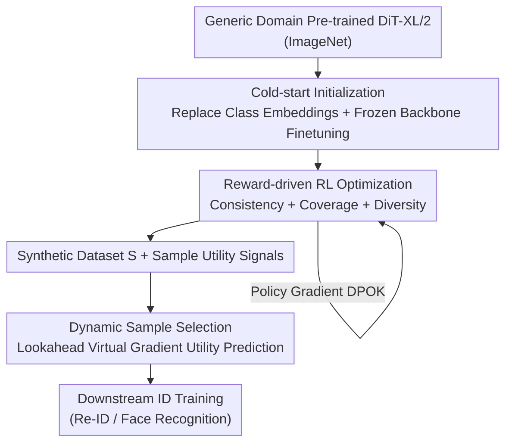

# Reinforcement-Guided Synthetic Data Generation for Privacy-Sensitive Identity Recognition

**Conference**: CVPR 2026  
**Paper**: [CVF Open Access](https://openaccess.thecvf.com/content/CVPR2026/html/Jia_Reinforcement-Guided_Synthetic_Data_Generation_for_Privacy-Sensitive_Identity_Recognition_CVPR_2026_paper.html)  
**Code**: None  
**Area**: AI Security / Privacy Protection / Synthetic Data / Person Re-Identification  
**Keywords**: Synthetic Data Generation, Reinforcement Learning Finetuning, Diffusion Models, Person Re-Identification, Privacy-constrained scenarios

## TL;DR
Addressing the vicious cycle of "real data scarcity $\rightarrow$ poor generative models $\rightarrow$ useless synthetic data" in privacy-constrained scenarios, this paper models the synthesis process of diffusion models as a reinforcement learning (RL) problem. It utilizes a DiT pre-trained on generic domains for cold-start alignment, followed by policy fine-tuning using a triple reward—"semantic consistency + distribution coverage + expression diversity." Finally, lookahead dynamic sampling selects high-utility samples, simultaneously enhancing generative fidelity and downstream classification accuracy for person re-identification and face recognition tasks.

## Background & Motivation

**Background**: In privacy-sensitive identity recognition tasks (e.g., person re-identification and face recognition), the acquisition and sharing of real data are strictly limited by regulations and copyrights. Synthetic data generation has emerged as a promising alternative, using GANs or diffusion models to create data to fill the gap in real datasets.

**Limitations of Prior Work**: The success of existing synthesis methods still **depends on high-quality real data**. When data is scarce, supervision is weak, leading to low-fidelity samples that are ineffective for downstream tasks. This creates a self-reinforcing vicious cycle: insufficient real data $\rightarrow$ weak generative models $\rightarrow$ poor synthetic data $\rightarrow$ inability to alleviate data scarcity.

**Key Challenge**: The authors point out that existing methods aim to **match the distribution of real data**—essentially imitating the source distribution rather than surpassing it in task utility. When the source distribution is small or biased, matching it merely replicates its limitations, locking the upper bound of diversity and utility to that of the real data.

**Goal**: Given only a few real samples per identity, generate synthetic data that is both "visually realistic" and "useful for downstream tasks" while generalizing to new categories unseen during training.

**Key Insight**: The authors advocate for a paradigm shift—**do not rely solely on scarce source distributions; instead, leverage large-scale pre-trained priors from generic domains as guidance**. Visual backbones and generative architectures trained on generic data like ImageNet encode structural, semantic, and contextual knowledge that can compensate for the scarcity of domain-specific data.

**Core Idea**: The synthesis process is formulated as reinforcement learning, where the generative model acts as a **policy** that generates samples and receives **rewards** based on their contribution to downstream tasks. This uses "performance feedback" instead of "direct supervision" to drive the adaptation of a generic prior to the target domain, gradually bridging the gap between generic priors and domain-specific requirements.

## Method

### Overall Architecture
The method decomposes "generating identity data using a generic domain pre-trained model" into three sequential stages: first, **cold-start** roughly aligns a pre-trained DiT to the target domain to establish semantic relevance and basic fidelity; second, **reward-driven RL** fine-tunes the generator toward "identity consistency + broad coverage + expressive diversity"; finally, **dynamic sampling** selects the most useful synthetic samples during downstream training for the classifier. These stages are not isolated but form a continuous adaptation process: cold-start provides a stable starting point for RL, RL fine-tuning yields internal measures of sample utility, and dynamic sampling reuses these utility signals. The base generator is a DiT-XL/2 pre-trained on ImageNet (pure latent diffusion without text prompts), and reward optimization follows the DPOK policy gradient framework.

### Key Designs

**1. Cold-start Initialization: Roughly aligning generic priors to the target domain for a stable RL start.**

Directly performing reward optimization on a pre-trained diffusion model is highly unstable when data is scarce—reward signals are noisy and prone to divergence. The authors perform a lightweight adaptation $\theta_0 = \text{Init}(\theta_{pre}, X)$: the class embedding layer of the pre-trained DiT is replaced with a task-specific head aligned with the target label space (initialized to zero and learned from scratch). By **freezing the backbone** and fine-tuning only the new head and a few hyperparameters with a standard denoising objective on limited target data, the generalization capability of the pre-trained model is preserved while injecting task-related inductive biases.

**2. RL Fine-tuning with Multi-objective Rewards: Forcing the generator to excel in fidelity, coverage, and diversity.**

Cold-start only ensures semantic alignment and basic fidelity without explicitly forcing the generator to produce "identity-consistent and diverse" samples. The authors introduce a three-component reward, treating the diffusion denoising process as a multi-step MDP and optimizing via the DPOK policy gradient $J_\theta = \mathbb{E}[R(x,c)]$:

- **Semantic Consistency**: Measures the proximity of a generated sample to its identity class prototype in the feature space. The prototype is the normalized mean vector of features in a memory bank $\hat{f}_y = \bar{f}_y / \|\bar{f}_y\|_2$. The reward is the cosine similarity between the generated feature and the prototype, linearly scaled to $[0,1]$: $R_{sem} = \tfrac{1}{2}(\hat{f}_g^\top \hat{f}_y + 1)$, ensuring identity preservation.
- **Distribution Coverage**: Relying solely on semantic consistency may trap the generator in a small region of the feature space. The authors use an RBF kernel $k_\sigma(u,v) = \exp(-\|u-v\|_2^2 / 2\sigma^2)$ to compare generated and reference distributions: $R_{cov} = \mathbb{E}_{g,r}[k_\sigma(\hat{f}_g, \hat{f}_r)] - \alpha\,\mathbb{E}_{g,g'}[k_\sigma(\hat{f}_g, \hat{f}_{g'})]$. The first term pulls distributions together, while the second penalizes redundancy, alleviating mode collapse.
- **Expression Diversity**: Coverage does not control the overall "spread" of the distribution. The authors use the trace of the feature covariance matrix $S_g = \text{tr}(\Sigma_g), S_r = \text{tr}(\Sigma_r)$ to characterize total variance. Setting a target variance of $(1+\varepsilon)S_r$, the reward $R_{exp} = -\big((S_g - (1+\varepsilon)S_r)/\tau\big)^2$ softly encourages the generated distribution to maintain a controlled $\varepsilon$-level expansion relative to the reference.

Each reward is standardized by batch mean and variance $\tilde{R}_i = (R_i - \mu_i)/(\sigma_i + \epsilon)$ and then weighted and passed through a tanh function for stability: $R_{norm} = \tanh(\lambda_{sem}\tilde{R}_{sem} + \lambda_{cov}\tilde{R}_{cov} + \lambda_{exp}\tilde{R}_{exp})$, with weights $\lambda$ empirically set to $1.0 / 0.75 / 0.25$.

**3. Lookahead Dynamic Sample Selection: Real-time selection of high-utility synthetic samples based on optimization contribution.**

Even after RL, synthetic data may have distribution shifts. The authors propose a "lookahead" strategy: at each iteration, a mixed batch of real and synthetic data across identities is constructed. A **virtual gradient update** is simulated on this batch to obtain parameters $w'$. The utility of a candidate synthetic sample $\hat{x}$ is estimated as $\Delta l = l_{id}(w', \hat{x}) - l_{id}(w, \hat{x})$. A smaller $\Delta l$ indicates better alignment with the current optimization trajectory, and the best samples are selected for the actual update.

### Loss & Training
Cold-start uses a standard denoising objective on a frozen backbone with $LR=1\text{e}{-5}$. RL uses DPOK with $LR=1\text{e}{-5}$. Downstream Re-ID uses ResNet-50/ViT-16 with Adam and weight decay $5\text{e}{-4}$. Losses include ID classification cross-entropy and triplet loss with hard sample mining. Face recognition uses ResNet-50 + CosFace with SGD.

## Key Experimental Results

### Main Results

Person Re-ID (Market-1501 / CUHK03-NP, mAP / Rank-1, %):

| Method | Type | Market mAP | Market R-1 | CUHK03 mAP | CUHK03 R-1 |
|------|------|-----------|-----------|-----------|-----------|
| ResNet-50 (Base) | Baseline | 85.4 | 85.4 | 74.1 | 76.5 |
| R-Erasing (AAAI'20) | Real Aug. | 87.6 | 94.8 | 76.7 | 78.4 |
| FineGPR (TOMM'23) | Sim Aug. | 82.4 | 92.6 | 36.4 | 37.9 |
| GIF-SD (NeurIPS'23) | Synth Aug. | 74.9 | 88.9 | 71.7 | 74.6 |
| IDiff (CVPR'23) | Synth Aug. | 85.4 | 94.4 | 73.1 | 75.4 |
| **Ours** | Synth Aug. | **88.6** | 94.9 | **76.6** | **79.3** |

Face Recognition (trained on CASIA-WebFace subset, downstream Face Verification accuracy %):

| Method | Gen. Type | LFW | AgeDB | CA-LFW | Avg. |
|------|---------|-----|-------|--------|------|
| CASIA Subset (Real) | — | 91.58 | 74.72 | 78.78 | 78.47 |
| DCFace (CVPR'23) | GAN | 87.97 | 69.75 | 76.53 | 72.96 |
| IDiff-Face (CVPR'23) | Diff. | 90.65 | 66.60 | 75.42 | 75.40 |
| NegFaceDiff (CVPR'25) | Diff. | 91.70 | 74.68 | 78.67 | 78.13 |
| **Ours** | Diff. | **93.60** | **76.80** | **81.68** | **79.07** |

### Ablation Study

| Config | Key Observation | Description |
|------|---------|------|
| Full Model | Market mAP 88.6 / Face Avg 79.07 | Cold-start + Triple Reward RL + Dynamic Sampling |
| Cold-start DiT Only | Moderate Diversity | Benefits from ImageNet pre-training but lacks intra-class variation |
| + RL Finetuning | Enhanced Intra-class Diversity | Generates more diverse images while maintaining identity |
| Reward Weights | $\lambda_{sem}/\lambda_{cov}/\lambda_{exp}=1.0/0.75/0.25$ | Semantic consistency is prioritized; diversity has the lowest weight |

### Key Findings
- **The mechanism is "generic prior + RL feedback instead of distribution matching"**: While prior methods replicate scarce source distributions, this paper leverages generic priors to elevate diversity and task utility.
- **Surpassing Real Data**: On the CASIA subset, the synthetic data achieved an average accuracy of 79.07%, surpassing the 78.47% achieved using real data, proving synthetic utility can exceed the source distribution.
- **Generalization to Small-sample New Classes**: The framework demonstrates strong generalization for new categories in low-data regimes.

## Highlights & Insights
- **Formulating data synthesis as RL policy optimization**: Treating the generator as a policy and downstream contribution as a reward bypasses the "scarcity $\rightarrow$ weak supervision" bottleneck.
- **Specific and complementary triple rewards**: Semantic consistency preserved identity, distribution coverage prevented collapse, and expression diversity controlled the spread—each addressing a specific failure mode with differentiable formulas.
- **Lookahead selection decouples synthesis and application**: Rather than assuming all synthetic samples are equal, it filters them in real-time based on their compatibility with the current optimization trajectory.

## Limitations & Future Work
- The method relies on the semantic transferability of generic domain generators (DiT-XL/2 on ImageNet); its effectiveness for domains drastically different from generic priors is unverified. ⚠️
- The triple reward introduces several hyperparameters ($\lambda_{sem},\lambda_{cov},\lambda_{exp},\alpha,\varepsilon,\sigma$), and their sensitivity was not fully explored.
- Lookahead dynamic sampling requires a virtual gradient update per step, incurring additional computational overhead.
- Regarding privacy, while it avoids real data collection, whether the synthetic samples leak original identity information (e.g., membership inference or identity inversion) requires further evaluation.

## Related Work & Insights
- **vs. Real/Simulation Augmentation (R-Erasing, FineGPR)**: These suffer from domain gaps; ours uses diffusion priors + RL rewards to align directly with task utility, significantly outperforming FineGPR on CUHK03.
- **vs. Disentanglement-based Synthesis (DG-Net, IDiff)**: These are limited by the scale of the source distribution; ours uses generic priors to raise the upper bound of diversity.
- **vs. RL for Diffusion (DPOK)**: DPOK focuses on text-to-image or attribute alignment; ours specializes in privacy-constrained identity domains, emphasizing robust and generalizable representations.

## Rating
- Novelty: ⭐⭐⭐⭐ Systematic modeling of synthesis as RL with triple feature-space rewards.
- Experimental Thoroughness: ⭐⭐⭐⭐ Covers Re-ID and face recognition across multiple benchmarks, though some ablation values are brief.
- Writing Quality: ⭐⭐⭐⭐ Clear narrative on the "vicious cycle" and logical stage transitions.
- Value: ⭐⭐⭐⭐ Addresses a real pain point in privacy-sensitive sectors; surpassing real-data performance is a strong result.

<!-- RELATED:START -->

## Related Papers

- [\[CVPR 2026\] Bridging Privacy and Provenance: Traceable Virtual Identity Generation](bridging_privacy_and_provenance_traceable_virtual_identity_generation.md)
- [\[CVPR 2026\] PrivSynth: Alternating and Control-Based Optimization for Privacy and Utility in Synthetic Data](privsynth_alternating_and_control-based_optimization_for_privacy_and_utility_in_.md)
- [\[CVPR 2026\] No Way To Steal My Face: Proactive Defense Against Identity-Preserving Personalized Generation](no_way_to_steal_my_face_proactive_defense_against_identity-preserving_personaliz.md)
- [\[CVPR 2026\] GROW: Watermark Generation with Progressive Guidance for Diffusion Models](grow_watermark_generation_with_progressive_guidance_for_diffusion_models.md)
- [\[CVPR 2026\] Protego: User-Centric Pose-Invariant Privacy Protection Against Face Recognition-Induced Digital Footprint Exposure](protego_user-centric_pose-invariant_privacy_protection_against_face_recognition-.md)

<!-- RELATED:END -->
