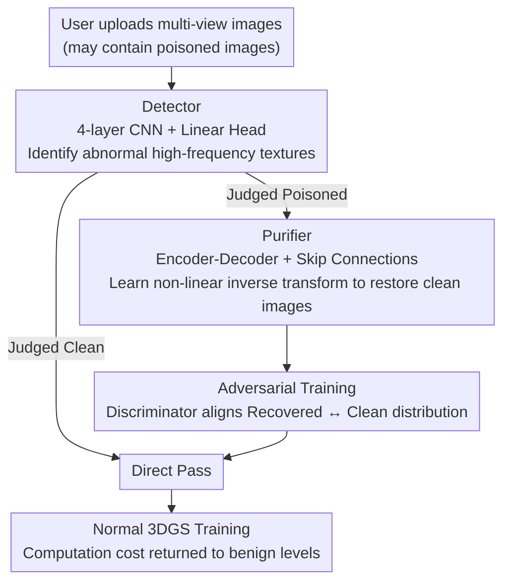

# RemedyGS: Defend 3D Gaussian Splatting Against Computation Cost Attacks

**Conference**: CVPR 2026  
**Paper**: [CVF Open Access](https://openaccess.thecvf.com/content/CVPR2026/html/Li_RemedyGS_Defend_3D_Gaussian_Splatting_Against_Computation_Cost_Attacks_CVPR_2026_paper.html)  
**Code**: https://github.com/Polly-LYP/RemedyGS  
**Area**: AI Security  
**Keywords**: 3D Gaussian Splatting, Computation Cost Attacks, DoS Defense, Image Purification, Adversarial Training

## TL;DR
RemedyGS proposes the first black-box defense framework against "computation cost attacks" on 3DGS (such as Poison-splat, which triggers Gaussian explosion by poisoning input images to exhaust GPU resources and cause Denial-of-Service). Utilizing a two-stage "detector + purifier + adversarial training" pipeline, it purifies only images identified as poisoned, restoring computation costs to normal levels while maintaining reconstruction quality for legitimate users.

## Background & Motivation

**Background**: 3DGS has become a large-scale paid service by companies like Spline, KIRI, and Polycam—allowing users to "upload images to reconstruct 3D scenes"—due to the high efficiency and fidelity brought by explicit Gaussian modeling. Its high quality relies on adaptive density control: during training, new Gaussians are continuously added to under-reconstructed areas, and low-contribution Gaussians are pruned until convergence.

**Limitations of Prior Work**: This density control mechanism is exactly the attack surface. Poison-splat revealed a serious vulnerability: attackers can pose as normal users and upload "poisoned images" that "sharpen" objects by increasing the Total Variance (TV) score of the images. This indirectly forces 3DGS to allocate a far greater number of Gaussians than necessary, causing an explosion in GPU memory, training time, and rendering latency, ultimately crashing the system and causing a Denial-of-Service (DoS). In the paper's examples, poisoned inputs can skyrocket GPU memory usage from 11GB to 47GB and double training time from 24 to 48 minutes.

**Key Challenge**: Existing naive defenses perform poorly in the "Safety vs. Utility" trade-off. Image smoothing (Gaussian/bilateral filtering) is linear and cannot suppress the complex non-linear textures introduced by attackers, and it indiscriminately blurs all user images, potentially causing a quality drop of up to 10 dB. Limiting the number of Gaussians sacrifices the expressive power for complex scenes. The root cause is that these methods **cannot distinguish between clean and poisoned images, nor between original textures and injected noise**, thus degrading quality for all users uniformly. Furthermore, traditional DoS defenses often assume a fixed shared model, whereas 3DGS requires re-training for each scene, making them incompatible.

**Goal**: Design a defense that blocks attacks without sacrificing reconstruction quality for legitimate users. This is split into two objectives: (i) only process poisoned images while bypassing clean ones; (ii) perform high-fidelity recovery for poisoned images that can reverse complex non-linear attack transformations.

**Key Insight**: To maximize TV scores, the attack must inject unnatural high-frequency noise and stronger edge structures into the poisoned images—this abnormal texture itself serves as a detectable "signature." Meanwhile, although attack transformations are complex, their non-linear inverse can be learned using data-driven neural networks.

**Core Idea**: Use a detector to screen out poisoned images (protecting normal user utility), then use a learnable purifier to restore poisoned images to a clean state (removing toxicity to avoid triggering Gaussian explosion), and utilize adversarial training to align the distribution of restored images with real clean images to improve perceptual quality.

## Method

### Overall Architecture
RemedyGS is a black-box defense framework deployed at the input stage of a 3DGS service. When the server receives multi-view images uploaded by a user, it first passes them through a detector one by one to judge whether they are "poisoned or clean." Only images judged as poisoned are sent to the purifier for restoration, while clean images are directly passed through for normal 3DGS training. The purifier is an encoder-decoder combined with adversarial training (a discriminator) to make the output distribution closer to real clean images. This "selective processing" is key—it avoids the indiscriminate degradation of all images inherent in naive methods.

### Key Designs

**1. Detector: Processing only poisoned images to maintain utility for normal users**

This is the key to ensuring the defense does not "harm the innocent." If all inputs were purified, it would introduce unnecessary computation costs and potentially modify clean images, reducing their reconstruction quality. The authors observed that to maximize the TV score, the attack introduces unnatural high-frequency noise and more pronounced edge structures into poisoned images; these abnormal textures are reliable detection signatures. The detector is implemented as four stacked 2D convolutional layers followed by a linear classification head—convolutions are naturally good at capturing local texture features, making them suitable for distinguishing unnatural noise from normal textures. It is trained on a labeled dataset of poisoned and clean images $D_{det}=\{(V^{poi},1)\cup(V^{cln},0)\}$, with the loss being cross-entropy $\mathcal{L}_{det}=\frac{1}{|D_{det}|}\sum_i \text{CE}(y_i, f_{det}(V_i;\omega))$. Only images tagged as poisoned enter the purifier, while clean images remain untouched, achieving utility "almost equivalent to vanilla 3DGS" for normal users.

**2. Purifier: Learning the non-linear inverse transform of the attack to restore poisoned images**

The purifier must satisfy two conditions: completely remove toxic textures (to avoid computation cost attacks) and ensure the restored content is as close as possible to the original image (minimizing degradation). Naive image smoothing fails here—it is only a linear filter and cannot invert complex attacks. The authors designed a symmetric encoder-decoder: the encoder $f_\phi$ learns to identify and discard toxic textures injected by the attacker while gradually extracting original image features; the decoder $g_\theta$ then reconstructs the purified image $V^{rec}=g_\theta(f_\phi(V^{poi}))$. Skip connections are used between the encoder and decoder to preserve details. The training objective is derived from information theory—maximizing the mutual information $I(V^{cln};V^{rec})$ between the recovered image $V^{rec}$ and the clean image $V^{cln}$. Since directly optimizing mutual information is intractable, the authors use the Barber-Agakov variational lower bound $I(V^{cln};V^{rec})\geq H(V^{cln})+\mathbb{E}[\log q(V^{cln}|V^{rec})]$. Assuming the variational distribution $q(V^{cln}|V^{rec})\sim\mathcal{N}(V^{rec},\sigma^2 I)$, and given that $\sigma$ and $H(V^{cln})$ are constants, maximizing mutual information is equivalent to minimizing the reconstruction error:

$$\mathcal{L}_{pur} = \min_{\phi,\theta}\ \mathbb{E}_{p_{cln}}\mathbb{E}_{p_A}\ \|V^{cln}-g_\theta(f_\phi(V^{poi}))\|_2^2$$

This transforms the abstract goal of "recovering as much original information as possible" into a clean MSE training criterion.

**3. Adversarial Training: Aligning distributions with a discriminator to fix purifier "over-smoothing"**

Convolutional networks trained solely with MSE suffer from a common issue—outputs are over-smoothed and lose detail. Restored images often have blurry regions, which in turn harms reconstruction. To address this, the authors introduce adversarial training: a discriminator $F$ is trained to distinguish between images "from the real clean distribution $p_{cln}$" and "from the restored distribution $p_{rec}$," providing feedback to the purifier to push its output toward the real distribution. To enhance discriminative power, the authors feed the latent representations of both the original clean image and the purified image (extracted by the purifier's encoder) as conditional information $c$ to the discriminator (concatenated along the channel dimension). The discriminator's objective is $\mathcal{L}_F=\min_F -\mathbb{E}_{p_{cln}}\log F(V|c)-\mathbb{E}_{p_{rec}}\log(1-F(V|c))$. Under the optimal discriminator $F^*(V|c)=\frac{p_{cln}(V)}{p_{cln}(V)+p_{rec}(V)}$, the purifier is forced to generate samples indistinguishable from real images. The adversarial objective reaches its extrema only when $p_{rec}=p_{cln}$, theoretically ensuring the alignment of the recovered and clean distributions. The purifier and discriminator are updated alternately. The final overall objective for the purifier is $\mathcal{L}'_{pur}=\alpha_1\mathcal{L}_{MSE}+\alpha_2\mathcal{L}_{LPIPS}+\alpha_3\mathcal{L}_G$ (a weighted sum of MSE, LPIPS, and adversarial loss).

### Loss & Training
The detector is trained separately using cross-entropy. The main objective for the purifier is the MSE $\mathcal{L}_{pur}$ derived from the mutual information lower bound; after incorporating the adversarial framework, the actual optimization is $\mathcal{L}'_{pur}=\alpha_1\mathcal{L}_{MSE}+\alpha_2\mathcal{L}_{LPIPS}+\alpha_3\mathcal{L}_G$. Training data is based on the DL3DV dataset, sampling 320 scenes and applying computation cost attacks to each, generating approximately 1 million pairs of clean/poisoned images. The purifier and discriminator are updated alternately.

## Key Experimental Results

### Main Results
Evaluated on NeRF-Synthetic (NS), Mip-NeRF360 (MIP), and Tanks-and-Temples (TT) benchmarks. Attacks are implemented using the Poison-splat white-box approach, with vanilla 3DGS as the victim. Security is measured by the number of Gaussians/peak GPU memory, and utility by PSNR/LPIPS/SSIM. The table below summarizes means across datasets (compared with two naive defense baselines):

| Dataset Mean | Metric | Clean (GT) | Poisoned (None) | Image Smoothing | Limit Gaussians | RemedyGS |
|------|------|---------|------------|---------|---------|----------|
| MIP-Avg | Gaussians (M)↓ | 3.179 | 7.037 | 1.700 | 3.766 | **2.496** |
| MIP-Avg | Peak VRAM (MB)↓ | 12136 | 23961 | 9083 | 13237 | **10630** |
| MIP-Avg | PSNR↑ | 27.520 | 24.704 | 26.446 | 22.570 | **27.310** |
| TT-Avg | PSNR↑ | 24.256 | 22.937 | 23.284 | 22.098 | **24.073** |
| NS-Avg | PSNR↑ | 33.866 | 30.785 | 30.029 | 30.767 | **33.070** |

Poisoning doubles the number of Gaussians and memory (e.g., MIP memory 12136→23961 MB). While image smoothing reduces memory, it drops quality into the "over-defense" range of 22.57 dB (Limiting Gaussians). RemedyGS brings the computation cost back close to benign levels while almost matching the clean baseline PSNR (MIP 27.31 vs GT 27.52). The paper reports up to a 4 dB PSNR improvement and 0.24 SSIM improvement over naive baselines.

### Ablation Study
Ablation of purifier architecture and components (NS-chair / NS-ficus / MIP-room, based on PSNR):

| Config | NS-chair | NS-ficus | MIP-room | Description |
|------|----------|----------|----------|------|
| CNN (No skip) | 30.964 | 32.995 | 30.577 | Naive Encoder-Decoder |
| + Concatenate | 31.331 | 33.982 | 30.418 | Concatenation Skip Connections |
| + Add | 33.868 | 35.028 | 30.997 | Additive Skip Connections |
| + Add + Adv. (Full) | **34.261** | **35.483** | **31.112** | Full model with Adversarial Training |

The detector evaluated independently (Table 3) shows high accuracy: 0.9737 on NS, 0.9936 on MIP, and 0.9400 on TT (Accuracy/F1/Recall are largely consistent).

### Key Findings
- **Additive skip connections are the main source of purifier utility**: Switching from concatenation to additive skip connections increased NS-chair PSNR from 31.33 to 33.87, suggesting that "adding" benign fine-grained features extracted by the encoder into the decoder preserves details better than concatenation.
- **Adversarial training fixes blurring**: Adding adversarial training on top of additive skip connections further increased PSNR by 0.1–0.4 dB across three scenes, confirming it resolves the over-smoothing issue caused by MSE.
- **Detector ensures "zero damage" to clean images**: Table 4 shows that on clean data, image smoothing drops quality in NS-chair to 27.08 dB (undifferentiated degradation), whereas RemedyGS maintains a PSNR of 35.776—identical to vanilla 3DGS—by allowing clean images to pass. This is the core advantage of "selective processing" over uniform smoothing.

## Highlights & Insights
- **First DoS defense for 3DGS-as-a-service**: Previous DoS defenses assumed fixed shared models and are incompatible with "re-train per scene" 3DGS. RemedyGS is a system-agnostic black-box solution that fills this gap, defending against white-box, black-box, and adaptive attacks.
- **"Detection + Purification" stage decoupling**: The detector decides "whether to process," and the purifier decides "how to process." By bypassing clean images, it avoids the utility loss of naive methods—the fundamental reason it outperforms baselines.
- **Principle-driven objective using mutual information bounds**: Abstracting "recovery of original information" into an optimizable MSE via the Barber-Agakov bound, then refining perceptual quality with adversarial training, provides a clean integration of theory and engineering. This "information-theoretic objective + adversarial refinement" combo is transferable to other image purification/inverse problem tasks.

## Limitations & Future Work
- The generalization of the purifier and detector is tied to the distribution of the training attack (Poison-splat). Whether the detector signature and purification inverse transform remain effective against new types of computation cost attacks with significantly different structures remains to be seen (⚠️ Black-box/adaptive attack results are in the supplementary material and not fully expanded in the main text).
- Training costs are high: approximately 1 million pairs of clean/poisoned images must be generated from DL3DV to train the two networks; moving to new data domains might require re-training.
- Purification is essentially image-level recovery; there is a limit to recovering details severely destroyed under extreme attacks (in some scenes, RemedyGS is slightly lower than GT, e.g., TT-Francis 27.57 vs GT 28.18).
- The detector's accuracy on TT (0.94) is lower than on other benchmarks—the cost of false negatives/positives in complex real-world outdoor scenes (missed detection → attack triggered; false alarm → clean images degraded by purification) warrants further analysis.

## Related Work & Insights
- **vs. Image Smoothing (Baseline)**: Smoothing is a linear filter that treats all images equally, failing to invert non-linear attacks and blurring clean images (NS-chair clean PSNR drops to 27.08 dB). RemedyGS uses a learnable purifier for non-linear inversion and a detector to process only poisoned images, causing zero damage to clean ones.
- **vs. Limiting Number of Gaussians (Baseline)**: While a hard cap limits computation, sharpened areas will "hijack" the Gaussian budget of other regions, causing significant utility loss (MIP-bonsai drops to 24.97 dB). RemedyGS removes toxicity at the input level without modifying the 3DGS training mechanism itself.
- **vs. Traditional DoS / Adversarial Training Defense**: These usually rely on fixed shared models or specialized losses, incompatible with 3DGS "per-scene training." RemedyGS places the defense at the input preprocessing layer, making it system-agnostic and plug-and-play.
- **vs. Poison-splat (The target attack)**: Poison-splat maximizes TV scores to trigger Gaussian explosions under white-box assumptions. RemedyGS exploits the fact that "maximizing TV inevitably leaves abnormal high-frequency signatures" for detection and learns the inverse transform for purification.

## Rating
- Novelty: ⭐⭐⭐⭐⭐ First defense framework for 3DGS computation cost attacks; the "Detection + Purification + Adversarial" combo hits the core of the safety-utility trade-off.
- Experimental Thoroughness: ⭐⭐⭐⭐ Three benchmarks, dual dimensions of security and utility, and complete detector/architecture ablations; however, black-box/adaptive attacks are in the supplement.
- Writing Quality: ⭐⭐⭐⭐ Clear explanation of attack mechanisms and defense motivation, with lucid mutual information derivations.
- Value: ⭐⭐⭐⭐ High practical significance for the reliable deployment of commercial 3DGS services; the methodology paradigm is transferable.

<!-- RELATED:START -->

## Related Papers

- [\[CVPR 2026\] Good Can Sometimes be Bad: A Unified Attack against 3D Point Cloud Classifier by a Flexible Isotropic Resampling](good_can_sometimes_be_bad_a_unified_attack_against_3d_point_cloud_classifier_by_.md)
- [\[CVPR 2026\] AntiStyler: Defending Object Detection Models Against Adversarial Patch Attacks Using Style Removal](antistyler_defending_object_detection_models_against_adversarial_patch_attacks_u.md)
- [\[CVPR 2026\] Computation and Communication Efficient Federated Unlearning via On-server Gradient Conflict Mitigation and Expression](computation_and_communication_efficient_federated_unlearning_via_on-server_gradi.md)
- [\[CVPR 2026\] PoInit-of-View: Poisoning Initialization of Views Transfers Across Multiple 3D Reconstruction Systems](poinit-of-view_poisoning_initialization_of_views_transfers_across_multiple_3d_re.md)
- [\[ICLR 2026\] Robust Spiking Neural Networks Against Adversarial Attacks](../../ICLR2026/ai_safety/robust_spiking_neural_networks_against_adversarial_attacks.md)

<!-- RELATED:END -->
