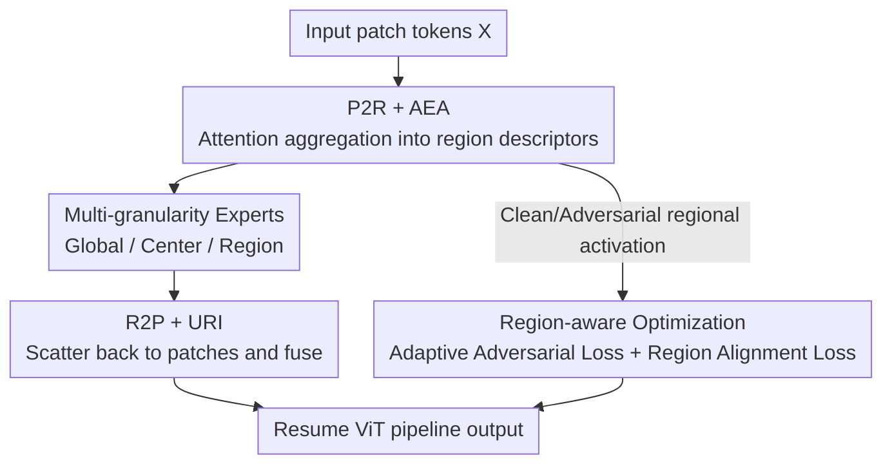

# ReMoE: Region-Mixture Experts for Adversarially-Robust Vision Transformers

**Conference**: CVPR 2026  
**Paper**: [CVF Open Access](https://openaccess.thecvf.com/content/CVPR2026/html/Zhong_ReMoE_Region-Mixture_Experts_for_Adversarially_Robust_Vision_Transformers_CVPR_2026_paper.html)  
**Code**: https://github.com/zhongskr0114/ReMoE  
**Area**: AI Security / Adversarial Robustness / Vision Transformer  
**Keywords**: Adversarial Robustness, Mixture of Experts (MoE), Region-level modeling, ViT, Attention routing

## TL;DR
ReMoE replaces the standard FFN in ViT with a "Region-aware Mixture-of-Experts layer"—utilizing experts across three granularities (global/center/region) coupled with attention-guided routing. By reweighting based on regional vulnerability and aligning regional attention distributions between clean and adversarial samples during adversarial training, it significantly enhances the adversarial robustness of ViTs with negligible computational overhead.

## Background & Motivation

**Background**: ViT has become the mainstream backbone for vision tasks but remains extremely vulnerable to adversarial perturbations. Adversarial Training (AT, via min-max optimization) remains the most effective means to improve robustness. As backbones shift from CNNs with locality priors to ViTs relying on global self-attention, the community has begun combining "architectural design + adversarial training," resulting in robust ViT variants such as position-aware modulation, edge enhancement, and spectral constraints on attention/projection layers.

**Limitations of Prior Work**: Adversarial perturbations are naturally **local and spatially structured** (often concentrated on a few critical patches). However, two core components of ViT are mismatched with this structure: globally coupled self-attention rapidly spreads local pollution to the entire image, causing attention drift or even semantic collapse; meanwhile, spatially uniform FFNs neither distinguish between polluted and clean patches nor stabilize local semantics after perturbation. Consequently, perturbations on a few critical patches can destroy regional semantics first, then trigger global performance degradation.

**Key Challenge**: Most existing robust ViTs focus on "global representation stability" or "architectural regularization," **uniquely ignoring the inherent local fragility caused by the lack of explicit region-level semantic modeling**. In other words, robustness should be constrained at the granularity of "semantically coherent regions" rather than at the extremes of individual tokens or the global image.

**Goal**: Inject explicit region-level modeling into ViT and regularize robustness at regional granularity—constraining the propagation of local pollution through self-attention, strengthening intra-region consistency, and stabilizing regional semantics across layers.

**Key Insight**: The authors adopt the MoE philosophy but move beyond "token-level independent routing" (where V-MoE, DyViT, etc., treat tokens as independent routing units). They advocate for a **region-centric robustness perspective**: decomposing the image into semantically coherent regions and allowing experts of different granularities to collaborate, supervised by regional rather than token-level activation.

**Core Idea**: Replace the **FFN in ViT blocks with a plug-and-play Region-aware MoE (ReMoE)**—comprising multi-granularity experts (global/center/region) and attention-guided P2R/R2P routing, coordinated with an adversarial optimization strategy reweighted by regional vulnerability to provide a stronger inductive bias for robust ViTs.

## Method

### Overall Architecture
ReMoE performs two main functions: ① Architecturally, it replaces the standard FFN in the ViT block with a region-aware expert layer, making expert activation "spatial-aware + region-consistent"; ② Optimally, it decomposes the adversarial training objective to the regional level, dynamically reweighting by regional vulnerability and aligning regional attention distributions of clean/adversarial inputs. The forward process is as follows: given an input patch token sequence $X\in\mathbb{R}^{N\times D}$, **P2R** first aggregates patch-level features/attention into region descriptors, which are fed to the gating network for region-level routing; **multi-granularity experts** (global/center/region) process their respective tokens; **R2P** then scatters expert outputs back to patches based on original spatial positions, and the URI module fuses the three outputs to resume the standard ViT pipeline. Two regional losses are added during training. ReMoE is inserted by default in the 6th and 10th Transformer layers.

### Key Designs

**1. P2R and Attention-guided Expert Activation (AEA): Using self-attention to aggregate patches into descriptors that evaluate regional importance**

Standard MoE gating only considers global token scores, which is unstable and ignores local spatial consistency. ReMoE's first step is to make routing "region-aware": given patch token sequences $X\in\mathbb{R}^{N\times D}$, the AEA module derives token-level saliency scores from self-attention outputs, then aggregates them within predefined regions to obtain regional saliency $r_k$. This is used directly as the activation weight for the $k$-th region expert, producing regional weights $W=[w_1,\dots,w_K]=\text{AEA}(X)\in\mathbb{R}^{K\times1}$. This step is a concrete instance of the **Patch-to-Region (P2R)** transformation—compressing patch features into descriptors encoding "regional semantic importance" for routing. Its advantage lies in the routing signal coming directly from attention: if specific regions fluctuate due to attack, the routing perceives this and concentrates activation on truly critical regions.

**2. Multi-granularity Experts + Attention Routing: Complementary decomposition using global, center, and regional experts**

Uniform FFNs cannot distinguish between polluted and clean patches. ReMoE partitions the spatial grid into $K$ local regions and one center region, assigning three types of experts: a global expert $f_{\text{global}}$ aggregating full-image context for all tokens $Y_{\text{global}}\in\mathbb{R}^{N\times D}$; a center expert $f_{\text{center}}$ focusing on the center region (often containing the most significant content) processing $X_{\text{center}}$; and $K$ regional experts $f_{\text{region}}^{(k)}$ each responsible for a spatial partition. Together, they form a complementary decomposition that models regional semantics while preserving global consistency. For routing, the gating network uses P2R scores to assign experts via a top-k strategy **per region rather than per token**—the root of its spatial consistency compared to token-level routing like V-MoE.

**3. R2P and Unified Region Integration (URI): Scattering expert outputs back and weighted fusion**

After experts process regional representations, they must map back to patch tokens. **Region-to-Patch (R2P)** handles this: features from each regional expert are scattered back to global positions $Z_{\text{region}}[i]=Y_{\text{region}}^{(k)}[j]$ ($i\in R_k$); the center expert outputs only on $R_c$ (zero elsewhere), and the global expert covers all tokens. Post-R2P, URI fuses the branches:

$$Z = Z_{\text{global}} + \lambda_1\cdot Z_{\text{center}} + \lambda_2\cdot W\odot Z_{\text{region}}$$

Where $\lambda_1,\lambda_2$ are coefficients and $W=\text{AEA}(X)$ provides attention-driven regional weights. Each $w_k$ is broadcast to all tokens in region $k$ during the $\odot$ operation. Thus, regional expert contributions are modulated by "regional importance"—more critical regions receive higher weights, adaptively tilting model capacity toward vulnerable or salient areas.

**4. Region-aware Optimization: Reweighted adversarial loss and clean/adversarial regional attention alignment**

Architecture changes alone are insufficient. The authors propose two region-level training objectives. First, **Region-Adaptive Adversarial Loss**: for a clean/adversarial pair $(X,X')$, regional activations $\mathbf{w}_{\text{clean}}=\text{AEA}(X)$ and $\mathbf{w}_{\text{adv}}=\text{AEA}(X')$ are calculated. Their difference defines an adaptive factor $\gamma=\exp\!\big(-\tfrac{\text{dist}(\mathbf{w}_{\text{clean}},\mathbf{w}_{\text{adv}})}{\max_{\mathcal{B}}\text{dist}+\varepsilon_\gamma}\big)$ (normalized within the mini-batch). This is used to weight the clean term $\tilde\beta=\tfrac{\beta\gamma}{\beta\gamma+(1-\beta)}$, resulting in $\mathcal{L}_{\text{rob}}=\tilde\beta\,\mathcal{L}(f_\theta(X),y)+(1-\tilde\beta)\,\mathcal{L}(f_\theta(X'),y)$. Intuitively, larger activation differences (high regional vulnerability) lead to smaller $\gamma$ and $\tilde\beta$, biasing the loss toward the adversarial term.

Second, **Region Alignment Loss** measures directional consistency of regional activations using angular distance: $d_{\text{ang}}(X,X')=\arccos\!\big(\tfrac{\langle\mathbf{w}_{\text{clean}},\mathbf{w}_{\text{adv}}\rangle}{\|\mathbf{w}_{\text{clean}}\|_2\|\mathbf{w}_{\text{adv}}\|_2}\big)$, with a log-transform for stability: $\mathcal{L}_{\text{align}}=-\log\!\big(1-\tfrac{d_{\text{ang}}}{\pi}+\varepsilon_{\text{align}}\big)$. This forces the model to maintain consistent regional activation distributions under clean and adversarial inputs. The total objective is:

$$\mathcal{L}_{\text{total}}=\mathbb{E}_{(X,X',y)\sim\mathcal{D}}\big[\mathcal{L}_{\text{rob}}(X,X',y)+\lambda_{\text{align}}\cdot\mathcal{L}_{\text{align}}(X,X')\big].$$

### Loss & Training
Training follows standard protocols: Natural Training (NAT), PGD Adversarial Training (SAT), and TRADES ($\beta=6$). CIFAR-10/100 and Imagenette are trained for 50 epochs (2-epoch warm-up), initial lr=0.1 with milestone decay; $\ell_\infty$ perturbation $\epsilon=8/255$, step size $\alpha=2/255$. ImageNet is trained for 10 epochs, lr=0.01, with a weaker $\epsilon=4/255$. ReMoE is inserted in layers 6 and 10.

## Key Experimental Results

### Main Results
Evaluation covers CIFAR-10/100, Imagenette, and ImageNet using ViT-S, DeiT-S, and DeiT-T backbones under FGSM, PGD, C&W, and AutoAttack (AA).

Comparison on CIFAR-10/100 (DeiT-S backbone, accuracy %):

| Method | CIFAR-10 Nat | CIFAR-10 PGD-20 | CIFAR-10 AA | CIFAR-100 PGD-20 | CIFAR-100 AA |
|------|------|------|------|------|------|
| SAT (ICLR'18) | 79.84 | 48.00 | 44.90 | 24.86 | 21.53 |
| TRADES (ICML'19) | 78.70 | 48.56 | 46.25 | 27.24 | 23.38 |
| ReiT (CVPR'24) | 86.22 | 52.02 | 47.31 | 28.36 | 24.89 |
| PIAT (TIFS'25) | 82.30 | 52.10 | 45.98 | 28.26 | 24.44 |
| **ReMoE (Ours)** | **86.58** | **53.54** | **50.16** | **30.18** | **26.82** |

ReMoE leads in both clean accuracy and under strong attacks (PGD/AA), with a gain of over 5% on AA vs. SAT on CIFAR-10.

Generalization across backbones (CIFAR-10 PGD-20 / AA):

| Backbone | Method | PGD-20 | AA |
|------|------|------|------|
| ViT-S | SAT | 50.73 | 47.65 |
| ViT-S | +ReMoE | 52.20 | 49.03 |
| DeiT-T | SAT | 47.71 | 44.90 |
| DeiT-T | +ReMoE | 52.44 | 48.93 |

ReMoE consistently improves baselines regardless of backbone or training scheme. On ImageNet, ViT-S+ReMoE improves AA from 21.24 to 23.67.

### Ablation Study
Expert types and regional losses (DeiT-T, CIFAR-10):

| Config | Nat | PGD-20 | C&W-20 | AA | Description |
|------|------|------|------|------|------|
| SAT (No ReMoE) | 79.84 | 47.90 | 47.22 | 44.90 | Baseline |
| w/o REs | 80.95 | 50.82 | 48.49 | 46.78 | Removed regional experts, largest robustness drop |
| w/o CE | 80.36 | 51.09 | 48.73 | 46.91 | Damaged center region semantics |
| w/o GE | 80.36 | 51.30 | 49.10 | 47.19 | Global representation affected |
| w/o $\mathcal{L}_{\text{rob}}$ | 82.47 | 51.68 | 49.91 | 46.88 | Removed weighted AT |
| w/o $\mathcal{L}_{\text{align}}$ | 84.21 | 50.32 | 48.47 | 47.19 | Unstable activation, clean acc high but PGD drops |
| **ReMoE (full)** | 83.52 | **52.65** | **50.94** | **48.93** | Final Model |

Gating strategy comparison (DeiT-T, CIFAR-10):

| Gating | Nat | PGD-20 | AA | FLOPs/Params |
|------|------|------|------|------|
| Uniform | 80.17 | 50.79 | 46.73 | 0.35G / 5.63M |
| MLP | 80.73 | 50.99 | 46.84 | 0.37G / 5.66M |
| **AEA (Ours)** | **83.52** | **52.65** | **48.93** | 0.37G / 5.63M |

### Key Findings
- **Regional experts contribute the most**: Removing REs causes the largest drop in PGD-20 and AA, showing they are crucial for capturing "local vulnerability."
- **Dual regional losses serve different roles**: Removing $\mathcal{L}_{\text{rob}}$ decreases comprehensive robustness; removing $\mathcal{L}_{\text{align}}$ results in higher clean accuracy but lower robustness, confirming the alignment loss trades slight clean accuracy for stable regional attention.
- **AEA routing has near-zero overhead**: Compared to MLP gating, AEA achieves the best robustness-efficiency trade-off without increasing parameters.
- **Insertion at (6,10) is optimal**: Analyzing insertion layers shows that the combination of the 6th and 10th layers yields the best performance.

## Highlights & Insights
- **Translating "adversarial perturbations are spatially structured" into an inductive bias**: Instead of general regularization, the introduction of the "region" granularity allows MoE experts to naturally align with the spatial structure of perturbations.
- **AEA routing signal derived from self-attention**: Reusing existing attention maps for routing saves parameters and makes the routing process sensitive to attacks.
- **Cohesive architecture and optimization**: The same regional activation $W$ is used for URI fusion, loss reweighting, and attention alignment, ensuring high design consistency.
- **Plug-and-play**: Replacing only the FFN allows ReMoE to be embedded in various ViT variants and training schemes with low migration costs.

## Limitations & Future Work
- **Fixed spatial grid**: Regions $R_k$ and $R_c$ are partitioned by a fixed grid, assuming significant content is central. This may be sub-optimal for datasets with off-center objects or dense scenes; adaptive region partitioning would be more general.
- **Multiple hyperparameters**: $\lambda_1, \lambda_2, \beta, \lambda_{\text{align}}$, and expert count $K$ require tuning; sensitivity analysis across datasets is limited.
- **Evaluation scale**: Primarily validated on small-to-medium benchmarks (CIFAR/Imagenette) and lightweight backbones. Performance on large-scale models and longer training schedules requires further verification.

## Related Work & Insights
- **vs. Architecturally-Regularized Robust ViTs (SAT, TRADES, ReiT, PIAT)**: While these focus on global representation stability, ReMoE fills the gap of "region-level semantic modeling."
- **vs. Token-level MoE (V-MoE, DyViT)**: These treat tokens as independent units for efficiency; ReMoE routes at the region level for robustness, emphasizing intra-region consistency.
- **vs. Accuracy-Robustness Trade-off methods (TORA-ViT)**: ReMoE achieves a better balance without extra adapters or randomization by utilizing expert decomposition and region-weighted losses.

## Rating
- Novelty: ⭐⭐⭐⭐ "Region-centric" robustness perspective + attention-guided MoE is a fresh take.
- Experimental Thoroughness: ⭐⭐⭐⭐ Comprehensive datasets, backbones, and ablations, though large-scale model testing is slightly thin.
- Writing Quality: ⭐⭐⭐⭐ Logical flow from motivation to method; clear formulas and figures.
- Value: ⭐⭐⭐⭐ Plug-and-play, low overhead, and highly compatible with various AT schemes.

<!-- RELATED:START -->

## Related Papers

- [\[CVPR 2026\] Towards Robust Vision Transformers: Path Dependency Analysis and a Simple Two-Stage Adversarial Training](towards_robust_vision_transformers_path_dependency_analysis_and_a_simple_two-sta.md)
- [\[CVPR 2026\] Hierarchically Robust Zero-shot Vision-language Models](hierarchically_robust_zero-shot_vision-language_models.md)
- [\[ICCV 2025\] FedVLA: Federated Vision-Language-Action Learning with Dual Gating Mixture-of-Experts for Robotic Manipulation](../../ICCV2025/ai_safety/fedvla_federated_vision-language-action_learning_with_dual_gating_mixture-of-exp.md)
- [\[ICML 2026\] MetaMoE: Diversity-Aware Proxy Selection for Privacy-Preserving Mixture-of-Experts Unification](../../ICML2026/ai_safety/metamoe_diversity-aware_proxy_selection_for_privacy-preserving_mixture-of-expert.md)
- [\[CVPR 2026\] TTP: Test-Time Padding for Adversarial Detection and Robust Adaptation on Vision-Language Models](ttp_test-time_padding_for_adversarial_detection_and_robust_adaptation_on_vision-.md)

<!-- RELATED:END -->
