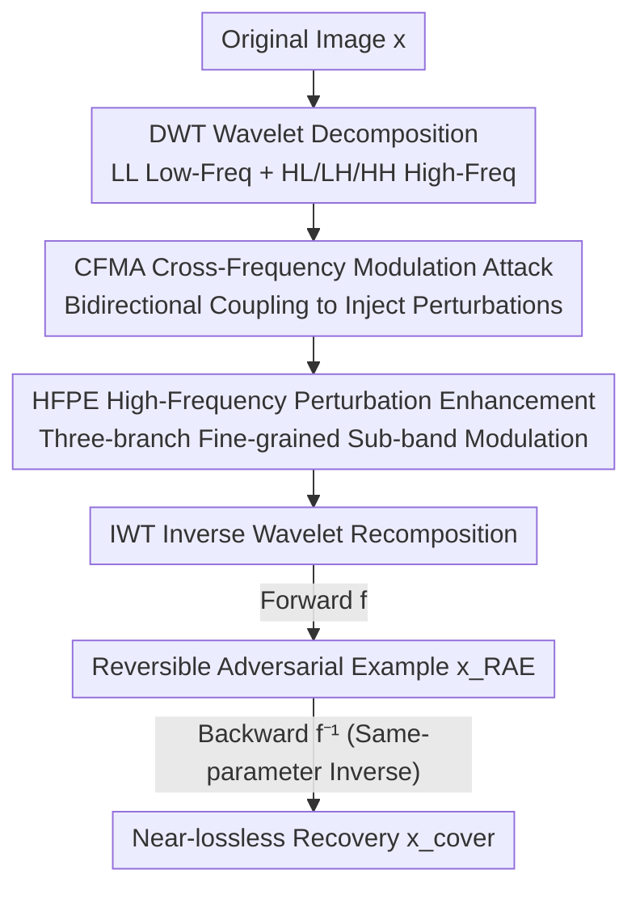

# RevINN: An End-to-End Invertible Neural Network for Reversible Adversarial Examples Generation

**Conference**: CVPR 2026  
**Paper**: [CVF Open Access](https://openaccess.thecvf.com/content/CVPR2026/html/Huang_RevINN_An_End-to-End_Invertible_Neural_Network_for_Reversible_Adversarial_Examples_CVPR_2026_paper.html)  
**Code**: https://github.com/WongJaylen/RevINN  
**Area**: AI Security / Reversible Adversarial Examples / Image Privacy Protection  
**Keywords**: Reversible Adversarial Examples, Invertible Neural Networks, Wavelet Domain Attacks, Frequency Modulation, Image IP Protection

## TL;DR
RevINN utilizes an Invertible Neural Network (INN) to "exchange/perturb" the image's own high- and low-frequency discriminative information in the wavelet domain, generating Reversible Adversarial Examples (RAEs) in a single step. This approach both misleads unauthorized models and allows authorized users to recover the original image near-losslessly, completely bypassing the degradation in image quality and attack effectiveness caused by traditional "attack-then-embed" two-stage schemes.

## Background & Motivation

**Background**: Reversible Adversarial Examples (RAEs) serve as an image copyright/privacy protection mechanism—turning images into adversarial examples to cause classification errors in unauthorized DNNs while allowing authorized users with a key to restore the original image. Existing RAE methods are predominantly **two-stage**: the first step generates a standard Adversarial Example (AE) using algorithms like FGSM, CW, or I-FGSM, and the second step reversibly "hides" the perturbation information back into the AE using Reversible Data Hiding (RDH) or a DNN.

**Limitations of Prior Work**: AEs carefully optimized in the first stage reach a balance between semantic modification and visual imperceptibility. Forcing additional perturbation data into them during the second stage introduces extra noise, disrupting the existing perturbation distribution and visual structure. As shown in Fig. 1 of the paper, all two-stage methods exhibit **varying degrees of decline** in both visual quality (PSNR) and Attack Success Rate (ASR) compared to the original AEs, with targeted attacks suffering the most.

**Key Challenge**: The authors identify that the root cause for requiring a "re-embedding step" is that AEs are calculated based on the gradients of an **external proxy model**. The perturbation information originates from the model rather than the image itself; thus, the AE lacks sufficient clues to reverse the added perturbation without storing it separately.

**Goal**: Can a **one-stage** paradigm be designed to generate RAEs directly from the **intrinsic information** of the image? Since no external information is introduced, the image should inherently be restorable in some way, thereby eliminating the quality-damaging embedding step.

**Key Insight**: A naive approach might construct perturbations based on "invariant features" (e.g., color distribution, structural shape), but such perturbations are static and weak. Instead, the authors leverage the strong representational power and bijective mapping properties of INNs to perform dynamic modulation between different **frequency sub-bands** of the image, generating cross-frequency adaptive perturbations.

**Core Idea**: Utilizing the bijectivity of INNs to allow the image's own high-frequency and low-frequency discriminative information to **exchange and perturb each other** in the wavelet domain. A single forward pass performs the attack (yielding the RAE), while the corresponding reverse pass performs restoration (yielding the original image). Both share the same parameters, requiring no additional embedding.

## Method

### Overall Architecture
RevINN models the entire RAE generation as an invertible transformation function $f(\cdot)$. Given a classifier $C(\cdot)$, an original image $x$, and its label $y$, the goal is to generate $x_{RAE}=f(x)$ such that $C(x_{RAE})\neq y$, while the restored version $x_{cover}=f^{-1}(x_{RAE})$ satisfies $C(x_{cover})=y$. Since $f$ and $f^{-1}$ share the same parameters $\theta$, optimizing $f$ simultaneously produces the RAE and its recovery, avoiding the minimax game required by GANs.

The forward flow is: the original image is first decomposed via Discrete Wavelet Transform (DWT) into one low-frequency sub-band LL ($x_{LL}$) and three high-frequency sub-bands HL/LH/HH (collectively $x_{HC}\in\mathbb{R}^{3C\times H/2\times W/2}$). Then, **CFMA** performs coarse-grained bidirectional cross-modulation between the low- and high-frequency components to inject perturbations. The modulated high-frequency components are then processed by **HFPE** for fine-grained modulation within the three sub-bands, forcing high-frequency semantics to deviate from the original. Finally, the modified components are reassembled into an RAE via Inverse Wavelet Transform (IWT). The reverse process simply inverts these steps, allowing authorized users to reconstruct the image near-losslessly—both processes share network parameters and update jointly.

### Key Designs

**1. CFMA Cross-Frequency Modulation Attack: Bidirectional Exchange of Discriminative Information**

Unlike two-stage methods where perturbations come from a proxy model, CFMA extracts perturbation information **solely from the image's own frequency components**. It establishes bidirectional modulation between low-frequency $x_{LL}$ and high-frequency $x_{HC}$ via invertible coupling:

$$x_{LL}^1 = x_{LL} + \sigma(x_{HC}), \qquad x_{HC}^1 = x_{HC}\cdot\exp\!\big(\alpha(\mu(x_{LL}^1))\big) + \omega(x_{LL}^1)$$

Where $\alpha(\cdot)$ is a sigmoid scaled by a constant factor, and $\sigma, \mu, \omega$ are transformation functions parameterized by dense convolutional blocks. $\exp(\alpha(\mu(x_{LL}^1)))$ acts as a scaling factor for the high frequencies, and $\omega(x_{LL}^1)$ acts as an additive perturbation, performing an "affine-like" adversarial modulation. Simultaneously, the low frequencies absorb perturbations from the high frequencies. Notably, only an **additive bridge** is reserved from high to low frequencies (i.e., low frequencies only undergo addition, not scaling). This is because once high-frequency semantics are sufficiently modified, a small additive shift in low frequencies suffices for adversarial effects, while avoiding scaling preserves visual quality. This coupling is naturally reversible: for the inverse, $x_{HC}=(x_{HC}^1-\omega(x_{LL}^1))\div\exp(\alpha(\mu(x_{LL}^1)))$, then $x_{LL}=x_{LL}^1-\sigma(x_{HC})$.

**2. HFPE High-Frequency Perturbation Enhancement: Three-branch Fine-grained Modulation**

CFMA treats high frequencies as a single branch for coarse interaction. However, high-frequency sub-bands carry critical semantic details. HFPE expands the traditional two-branch coupling structure into a **three-branch structure**, corresponding to the LH, HL, and HH sub-bands. It uses $x_{HH}^1$ to guide the modulation of $x_{LH}^1$ and $x_{HL}^1$, and then these two modulated components jointly act on $x_{HH}^1$:

$$x_{LH}^2 = x_{LH}^1\cdot\exp(\alpha(\psi(x_{HH}^1)))+\varphi(x_{HH}^1)$$
$$x_{HL}^2 = x_{HL}^1\cdot\exp(\alpha(\pi(x_{HH}^1)))+\delta(x_{HH}^1)$$
$$x_{HH}^2 = x_{HH}^1\cdot\exp(\alpha(\rho(x_{concat})))+\eta(x_{concat})$$

Compared to standard two-branch coupling, this three-branch design facilitates finer information interaction, ensuring that the semantic content of the RAE is substantially altered. Ablation studies show that removing HFPE causes a collapse in both visual quality and attack strength.

**3. Self-Interactive Information Exchange: Mechanism**

The authors abstract CFMA/HFPE as universal information exchange operators. For a two-branch case, the outputs can be described as $x_1'=x_1-\tau+\gamma$ and $x_2'=x_2+\tau-\gamma$, where $\tau$ is existing information discarded from $x_1'$ and $\gamma$ is information injected from $x_2$. Prior work proved that both adding and removing discriminative information can cause successful attacks. RevINN's uniqueness lies in the fact that the exchanged information **originates entirely from the image itself** (via dense block transformations) rather than an external target or proxy model.

### Loss & Training
Total loss: $\mathcal{L}=\lambda_1\mathcal{L}_{freq}+\lambda_2\mathcal{L}_{adv}+\lambda_3\mathcal{L}_{rev}$, with weights set to $1.0, 3.0, 1.0$:

- **Wavelet Frequency Loss** $\mathcal{L}_{freq}=\ell_{MSE}\big(\mathcal{T}(x_{RAE})_{LL},\,\mathcal{T}(x)_{LL}\big)$: Traditional RAEs use $\ell_p$ norms for image domain constraint. Since RevINN aims to disrupt frequency information, image-domain $\ell_p$ is unsuitable. Constraining low-frequency consistency forces information exchange to occur primarily in high frequencies, maintaining visual quality.
- **Adversarial Loss** $\mathcal{L}_{adv}=\ell_{CE}(C(x_{cover}),y)+\ell_{CE}(C(x_{RAE}),y_{tgt})$: Drives RAE away from the true class (toward target $y_{tgt}$ in targeted attacks) while ensuring the restored version is correctly classified.
- **Reversal Loss** $\mathcal{L}_{rev}=\ell_{MSE}(x_{cover},x)$: Ensures the restored image is visually near-identical to the original.

Optimization uses Adam with initial lr $1\text{e-}4$, decaying by 0.9 every 200 iterations; perturbation budget $\epsilon$ is $2/255$.

## Key Experimental Results

Dataset: 1,000 images (224×224) from ImageNet-1K. Models: VGG19, ResNet50, DenseNet121, AlexNet, Inception-v3. Baselines: RAE-RDH, RIT, RAE-YUV, B-RAE, DP-RAE, SRAE, W-RAE.

### Main Results (ASR %, Excerpts)

| Setting | Model | RAE-YUV | W-RAE | RevINN(Ours) |
|------|------|---------|-------|--------------|
| Untargeted | DenseNet121 | 96.2 | 90.7 | **98.3** |
| Untargeted | AlexNet | 93.3 | 88.9 | **94.0** |
| Targeted | ResNet50 | 69.8 | 65.2 | **81.6** |
| Targeted | DenseNet121 | 75.3 | 78.8 | **90.2** |

The advantage in targeted attacks is particularly significant: RevINN achieves 90.2% ASR on DenseNet121, outperforming others by over 10%. Targeted AEs are more sensitive to data embedding, causing two-stage methods to degrade significantly during conversion.

### Visual and Recovery Quality (Untargeted, Average across models)

| Method | SSIM↑ | PSNR↑ | LPIPS↓ | Recovery PSNR↑ |
|------|---------------|---------------|----------------|----------------|
| RAE-YUV | 0.977 | 41.63 | 0.081 | ∞ (Lossless) |
| W-RAE | 0.971 | 40.02 | 0.063 | 44.70 |
| RevINN(Ours) | **0.992** | **46.39** | **0.018** | **58.94** |

RevINN's RAE average PSNR reaches 46.39dB (6dB higher than the second best), with LPIPS near 0. Recovery PSNR is 58.94dB; while not mathematically lossless like RDH, it is practically near-lossless due to bijective coupling.

### Ablation Study (Table 3, Average on ResNet50, etc.)

| CFMA | HFPE | ASR | RAE PSNR↑ | RAE LPIPS↓ |
|------|------|-----|-----------|-----------|
| ✗ | ✓ | 90.5 | 46.86 | 0.018 |
| ✓ | ✗ | 91.2 | 43.44 | 0.022 |
| ✓ | ✓ | **94.4** | 46.51 | **0.018** |

### Key Findings
- **CFMA drives "Attack + Low-freq Quality," while HFPE drives "High-freq Quality"**: Without CFMA, attack success drops. Without HFPE, image quality significantly degrades (PSNR 46.86 to 43.44).
- **Budget $\epsilon$ and Recovery Quality**: As $\epsilon$ increases from 1/255 to 8/255, ASR rises from 83.6% to 97.2%. Interestingly, larger perturbations increase recovery PSNR (54.91 to 63.04), likely because stronger activations provide better numerical stability for the inverse process in finite-precision INNs.
- **Robustness**: RevINN maintains better performance than RAE-YUV against flipping, scaling, cropping, and JPEG compression. At 2-bit depth, RevINN's ASR is 23% compared to under 15% for RAE-YUV.
- **Self-Supervised Transfer**: In self-supervised scenarios (Barlow/DINO/BYOL), RevINN's visual quality vastly leads RAEncoder (PSNR ~49 vs 37), making it stealthier.

## Highlights & Insights
- **Root Cause Analysis**: The paper identifies the fundamental flaw of two-stage schemes—the external source of AE perturbations. By making perturbations **intrinsic to the image**, reversibility is gained "for free," collapsing the paradigm into one stage.
- **Effective Use of INN Bijectivity**: Instead of using INNs as a "reversible hiding module," it uses them for cross-band information exchange, making "attack" and "restoration" two sides of the same function.
- **Three-branch Coupling Innovation**: Customizing the number of coupling branches based on the natural structure of the data (the three high-frequency sub-bands) is a clever architectural modification.
- **Frequency-domain Loss**: Using low-frequency MSE to force perturbations into high frequencies is a clean decoupling strategy to balance quality and attack strength.

## Limitations & Future Work
- **Non-mathematical Lossless Recovery**: Unlike RDH methods, recovery is lossy (58.94dB), which may not suit scenarios requiring bit-perfect integrity.
- **SSL Attack Strength**: In certain self-supervised settings, ASR lags slightly behind specialized SSL attackers like RAEncoder.
- **Black-box/Transfer Evaluation**: Most experiments assume target model access. Evaluation in true black-box "anti-crawling" settings remains for future work.
- **Relative Robustness**: While stronger than baselines, ASR still drops significantly under aggressive preprocessing like 2-bit quantization.

## Related Work & Insights
- **vs. Two-stage RDH (RAE-RDH, RAE-YUV)**: These provide strictly lossless recovery but suffer from embedding capacity limits and quality/attack degradation. RevINN leads in quality/attack at the cost of being near-lossless.
- **vs. Two-stage DNN Embedding (SRAE, W-RAE)**: These also decouple generation and embedding into two steps. RevINN unifies them, achieving 6dB+ higher PSNR.
- **vs. Other INN-Adversarial Works**: Unlike prior works that use INNs either without bijectivity or only as a hiding module, RevINN is the first to achieve **one-stage RAE generation via cross-band information exchange**.

## Rating
- Novelty: ⭐⭐⭐⭐⭐ Restructuring RAE from two-stage to one-stage via INN frequency exchange is solid and innovative.
- Experimental Thoroughness: ⭐⭐⭐⭐ Covers various models, settings, and metrics, though lacks black-box/transfer settings.
- Writing Quality: ⭐⭐⭐⭐ Logical flow and mechanism abstraction are clear.
- Value: ⭐⭐⭐⭐ High engineering value for image IP protection; one step closer to practical anti-crawling deployment.

<!-- RELATED:START -->

- **RAEncoder**: Adversarial Examples for Self-Supervised Learning, 2023.
- **RAE-RDH**: Reversible Adversarial Examples via Reversible Data Hiding, 2021.
- **W-RAE**: Wavelet-based Reversible Adversarial Examples, 2024.

<!-- RELATED:END -->

## Related Papers

- [\[CVPR 2026\] Verifying Neural Network Robustness with Dual Perturbations](verifying_neural_network_robustness_with_dual_perturbations.md)
- [\[CVPR 2026\] MaxMark: High-Capacity Diffusion-Native Watermarking via Robust and Invertible Latent Embedding](maxmark_high-capacity_diffusion-native_watermarking_via_robust_and_invertible_la.md)
- [\[CVPR 2026\] DASH: A Meta-Attack Framework for Synthesizing Effective and Stealthy Adversarial Examples](dash_a_meta-attack_framework_for_synthesizing_effective_and_stealthy_adversarial.md)
- [\[CVPR 2026\] CamPI: Physical Adversarial Examples through Camera Power Signal Injection](campi_physical_adversarial_examples_through_camera_power_signal_injection.md)
- [\[CVPR 2026\] AdvFM: Lookahead Flow-Matching Velocity-Field Attacks for Imperceptible and Transferable Adversarial Examples](advfm_lookahead_flow-matching_velocity-field_attacks_for_imperceptible_and_trans.md)

<!-- RELATED:END -->
