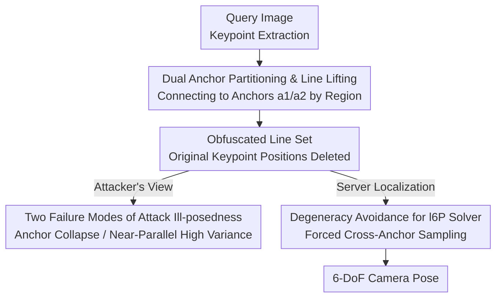

# Revisiting Geometric Obfuscation with Dual Convergent Lines for Privacy-Preserving Image Queries in Visual Localization

**Conference**: CVPR 2026  
**arXiv**: [2604.22310](https://arxiv.org/abs/2604.22310)  
**Code**: None  
**Area**: Privacy-Preserving / Visual Localization / Geometric Obfuscation  
**Keywords**: Privacy-Preserving Image Queries, Visual Localization, Geometric Obfuscation, Keypoint Recovery Attack, Dual Convergent Lines

## TL;DR
Addressing the vulnerability of geometric obfuscation—replacing keypoints with random lines—to neighborhood geometric recovery attacks, this paper proposes Dual Convergent Lines (DCL). By lifting each keypoint into a line pointing toward one of two fixed anchors, DCL transforms the attacker's recovery optimization into an ill-posed problem (either collapsing to anchors or diverging with high variance at the boundary). DCL remains compatible with l6P solvers for real-time localization while being the only geometric obfuscation scheme currently resistant to such attacks.

## Background & Motivation
**Background**: Cloud-based Visual Localization allows clients to send "image queries" (original images or extracted local features) to a server to estimate 6-DoF camera poses, saving local storage for large-scale 3D maps and re-computation. However, even local features can be inverted (Inversion attack, InvSfM [39]) to reconstruct high-fidelity RGB images, leading to the research direction of Privacy-Preserving Image Queries (PPIQ). Two main routes exist: ① Geometric Obfuscation—hiding 2D keypoint locations (e.g., Random Lines [51] replacing each point with a random line, Coordinate Permutation [34]); ② Descriptor/Semantic Obfuscation—using semantic maps as descriptors that lack detail and are harder to invert.

**Limitations of Prior Work**: Both routes have been compromised by new attacks. In geometric obfuscation, the **Neighborhood Geometric Recovery Attack** by Chelani et al. [6] learns to identify neighbors of each obfuscated line via descriptors and then minimizes the "sum of squared distances from the recovered point to neighbor lines" to approximate the original keypoint position (Eq. 3). In semantic obfuscation, diffusion models [37] can reconstruct detailed images from high-level semantic representations. Both paths re-expose privacy.

**Key Challenge**: The **fundamental reason** geometric obfuscation failed is that previous random lines were **uniformly distributed** in space, meaning the obfuscated neighborhood lines **still spatially surround the original point**. As the number of neighbors increases and their distribution around the origin becomes more uniform, the attacker's solution $\mathbf{x}_i^*$ converges more closely to the ground truth $\mathbf{x}_i$. The assumption that "neighbors remain near the origin" is the Achilles' heel of these defenses.

**Goal**: To design a line-based obfuscation method that **intentionally causes recovery attacks to fail** while retaining the advantages of geometric obfuscation: low client-side overhead, compatibility with traditional localization pipelines, easy map maintenance, scalability, and fast solving.

**Key Insight**: Since attacks rely on "neighbors uniformly surrounding the origin," one should **actively disrupt this uniform geometry** to make the recovery optimization ill-posed, causing estimated points to deviate significantly from ground truth. The simplest extreme is converging all lines to a single point (which causes pose estimation to collapse); thus, **two anchors** are used as a compromise.

**Core Idea**: Replace random-direction lines with "Dual Anchors + Region-based Line Lifting." Each keypoint is connected to a fixed anchor corresponding to its assigned region. Consequently, neighbor lines either converge to the same anchor (a trivial solution) or become nearly parallel at the boundary (an unstable high-variance solution), both of which prevent the attacker from recovering the true position.

## Method

### Overall Architecture
DCL solves how to obfuscate keypoints into lines such that localization solvers function correctly but neighborhood recovery attacks cannot retrieve original points. The pipeline involves: Extracting keypoints from the query image (SuperPoint [12] / SIFT [25]) → Partitioning the image into two regions by a centerline with two fixed anchors at the ends → Connecting each keypoint to its assigned anchor to generate obfuscated lines, then deleting original positions → Sending lines and descriptors to the server → Server estimating 6-DoF poses using an l6P minimal solver (with degeneracy avoidance) within RANSAC.

From the attacker's perspective, because lines no longer uniformly surround the origin but **all point to two specific anchors**, the core assumption of recovery attacks [6] is broken, leading to failure via two distinct modes. Three contributions—dual anchor construction, theoretical analysis of attack ill-posedness, and solver degeneracy avoidance—ensure the method is "hidden, unhackable, and functional."

### Key Designs

**1. Dual Anchor Partitioning & Line Lifting: Replacing "Random Directions" with "Pointing to Fixed Anchors"**

This is the core construction of DCL. The image space is divided by a centerline (default vertical $u=W/2$) into two disjoint regions: $\mathcal{R}_1=\{(u,v)\mid 0<u<W/2\}$ and $\mathcal{R}_2=\{(u,v)\mid W/2<u<W\}$. Two **fixed** anchors are placed at the ends of the centerline: $\mathbf{a}_1=(W/2,0)$ and $\mathbf{a}_2=(W/2,H)$ (where $W,H$ are image dimensions), with each region assigned one anchor. For any keypoint $\mathbf{x}_i=(u_i,v_i)$, the obfuscated line $\mathbf{l}_i$ is the line connecting the point to its assigned anchor:

$$\mathbf{l}_i=\begin{cases}\text{line}(\mathbf{x}_i,\mathbf{a}_1)&\text{if }\mathbf{x}_i\in\mathcal{R}_1\\\text{line}(\mathbf{x}_i,\mathbf{a}_2)&\text{if }\mathbf{x}_i\in\mathcal{R}_2\end{cases}$$

Original keypoint positions are deleted. Unlike Random Lines [51], DCL **forces all lines to point to one of two anchors**, destroying the "uniform surrounding" property from the start. This differs fundamentally from RayCloud [28], which uses K-means for anchors and random assignment; in DCL, anchor positions are **strategically optimized** to induce ill-posed optimization.

**2. Two Failure Modes of Attack Ill-posedness: Theoretical Proof of Recovery Failure**

The attack [6] seeks $\mathbf{x}_i^*=\arg\min_{\hat{\mathbf{x}}_i\in\mathbf{l}_i} f(\hat{\mathbf{x}}_i)$ along line $\mathbf{l}_i$, where $f(\hat{\mathbf{x}}_i)=\sum_{\mathbf{l}_j\in\mathcal{N}(\mathbf{l}_i)}d(\mathbf{l}_j,\hat{\mathbf{x}}_i)^2$. DCL ensures two failure modes:

- **Mode 1 (Intra-anchor convergence)**: When $\mathbf{x}_i$ is within $\mathcal{R}_1$ and far from the boundary, all its neighbor lines originate from the same anchor $\mathbf{a}_1$. All lines intersect at $\mathbf{a}_1$, and the cost function $f$ reaches a global minimum of 0 at $\hat{\mathbf{x}}_i=\mathbf{a}_1$. The optimization converges to the anchor—a **trivial solution** far from the ground truth.

- **Mode 2 (Inter-anchor instability)**: When $\mathbf{x}_i$ is near the boundary, neighbors may fall into $\mathcal{R}_2$. While these don't collapse to a single point, they become **nearly parallel** at the boundary as they point to $\mathbf{a}_1$ and $\mathbf{a}_2$ respectively. Proposition 1 shows that the recovered parameter $t_i^*$ is a weighted average of intersection parameters $t_{i,j}^*$: $t_i^*=\frac{\sum_j w_{i,j}t_{i,j}^*}{\sum_j w_{i,j}}$. Corollary 1.1 shows weights $w_{i,j}=\|\mathbf{v}_i\times\mathbf{v}_j\|^2=\sin^2(\theta_{i,j})$, determined by the angle $\theta_{i,j}$ between lines. As lines become nearly parallel, $\theta_{i,j}\to 0$ and $w_{i,j}\to 0$, causing $t_{i,j}^*$ to surge. The weighted average becomes **numerically unstable and highly sensitive to noise**, causing recovered points to diverge wildly (in experiments, only 8 out of 1500 points had errors <30 pixels).

**3. Degeneracy Avoidance for l6P Solver: Maintaining Robust Pose Estimation**

DCL lines are 2D lines compatible with the l6P minimal solver, uses the constraint $\mathbf{n}_i^\top(\mathbf{R}\mathbf{X}_i+\mathbf{t})=0$ (where $\mathbf{n}_i$ is the normal of the 3D plane $\Pi_i$ back-projected from $\mathbf{l}_i$). A problem arises: in RANSAC, there is a $\sim25\%$ probability of sampling 3 lines **passing through the same anchor**. Their back-projected planes then intersect at a common ray, making the normal vectors linearly dependent. This causes the matrix $\mathbf{N}_1=[\mathbf{n}_1,\mathbf{n}_2,\mathbf{n}_3]^\top$ to be rank-deficient, crushing the solver.

The avoidance strategy is lightweight: force the minimal set to **include lines from both anchors** (e.g., two from $\mathbf{a}_1$, one from $\mathbf{a}_2$). Implementation-wise, simply checking if the intersections of sampled lines coincide is sufficient to ensure $\mathbf{N}_1$ is full-rank and the l6P solver functions correctly.

### Loss & Training
DCL is a purely geometric construction and solving strategy; it **does not involve any training or loss functions**. The pipeline follows SuperPoint [12] + image retrieval [1,52] + Nearest Neighbor (NN) matching (avoiding position-dependent SuperGlue) + l6P solver (Lo-RANSAC [8] in PoseLib [22]) + Levenberg-Marquardt refinement.

## Key Experimental Results

**Metrics**: $e_{recon}$ (mean geometric error of recovered points in pixels, ↑ higher is better) measures privacy protection; image inversion quality is measured by PSNR(↓), SSIM(↓), and LPIPS(↑).

### Main Results: Resistance to Privacy Attacks (Table 2)
| Dataset | Metric | Random Lines [51] | Coord. Perm. [34] | DCL (Ours) |
|--------|------|------|------|------|
| 7Scenes | $e_{recon}$ (↑) | 6.137 | 10.56 | **330.4** |
| 7Scenes | PSNR (↓) | 13.899 | 13.358 | **7.040** |
| 7Scenes | LPIPS (↑) | 0.604 | 0.643 | **0.754** |
| Cambridge | $e_{recon}$ (↑) | 6.386 | 11.81 | **800.2** |
| Cambridge | PSNR (↓) | 14.991 | 14.309 | **6.746** |
| Cambridge | LPIPS (↑) | 0.517 | 0.558 | **0.740** |
| Aachen | $e_{recon}$ (↑) | 5.381 | 9.855 | **713.0** |

DCL's recovery error $e_{recon}$ is 1-2 orders of magnitude higher than competitors. The PSNR drops to ~7, making inverted images visually unrecognizable.

### Localization Performance (Table 3/5, Abridged)
| Dataset | Method | Vulnerable | Median Pos. Error | Real-time |
|--------|------|------|------|------|
| Cambridge·King's | Random Lines [51] | Yes | 11cm | Yes |
| Cambridge·King's | GSFF Privacy [35] | No | 24cm | No (Slow) |
| Cambridge·King's | DCL (Ours) | **No** | 25cm | Yes |
| 7Scenes·Chess | Random Lines [51] | Yes | 0.5cm | Yes |
| 7Scenes·Chess | DCL (Ours) | **No** | 1.0cm | Yes |

DCL is the **only method providing both "security against recent attacks" and "real-time performance."** It processes 7Scenes in ~4ms and Cambridge in ~6ms, whereas GSFF Privacy takes up to 45s on Cambridge.

### Ablation Study (Table 6: Anchor Distance)
| Anchor Distance | 7Scenes (Pos/Rot) | Cambridge (Pos/Rot) | Notes |
|------|------|------|------|
| $H$ (Default) | 5.14 / 1.41 | **22.50 / 0.50** | Optimal performance |
| $2H$ | 5.14 / 1.42 | 27.75 / 0.73 | Increased error |
| $3H$ | 6.66 / 1.37 | 32.50 / 0.75 | Further degradation |

### Key Findings
- **Trade-off between Anchor Distance and Accuracy**: Greater distance between anchors results in more parallel lines, which degrades pose estimation. Standard image heights prove optimal.
- **Privacy Leap**: Recovery error jumps from single digits to hundreds of pixels; PSNR drops from ~14 to ~7.
- **Rarity of Degeneracy**: The case where all keypoints fall into a single region occurred in only 4 out of 17,000 images in 7Scenes.
- **Server-side Robustness**: Even if a malicious server uses 2D-3D correspondences after pose estimation, it cannot recover meaningful private content like outliers (e.g., pedestrians).

## Highlights & Insights
- **Forcing Ill-posed Optimization as Defense**: Rather than competing with attack networks, DCL leverages the mathematical properties of optimization. Using dual anchors to force trivial or divergent solutions is a "root-cause" defense more robust than adversarial perturbations.
- **Weight Formula $w_{i,j}=\sin^2(\theta_{i,j})$**: This clean geometric derivation explains exactly why near-parallelism leads to recovery failure, linking privacy strength directly to geometric angles.
- **Zero-Training Compatibility**: DCL is a purely geometric construct, meaning zero client-side training and full compatibility with existing HLoc-style pipelines, offering a low barrier to adoption compared to semantic methods.

## Limitations & Future Work
- **Rare Degeneracy**: When all points fall into one region, the solver fails. The authors plan to use **structure-based (e.g., building-aware) adaptive partitioning** to further mitigate this.
- **Localization Cost**: On large-scale Aachen, DCL's recall is significantly lower than HLoc/Random Lines (e.g., 41.0% vs 79.9% at 0.25m/2°). Privacy comes at the cost of some accuracy in expansive outdoor scenes.
- **Attack Model Dependency**: Resistance is proven specifically for neighborhood geometric recovery attacks [6]. Robustness against future attacks not relying on the "neighbor distance minimization" assumption remains to be seen.

## Related Work & Insights
- **vs Random Lines [51]**: Both use l6P solvers, but Random Lines' uniform distribution allows recovery [6]. DCL is the first geometric method to withstand this attack.
- **vs Coordinate Permutation [34]**: [34] fails to preserve neighborhood structures; DCL provides significantly higher recovery errors.
- **vs RayCloud [28]**: [28] uses K-means for anchors but random assignment keeps neighbor lines near the origin, remaining vulnerable. DCL's strategic anchors induce true ill-posedness.
- **vs Semantic/Descriptor Obfuscation [35, 36]**: Semantic methods are slow (up to 45s) and vulnerable to diffusion-based inversion [37]. DCL is real-time, secure against current attacks, and compatible with legacy pipelines.

## Rating
- Novelty: ⭐⭐⭐⭐⭐ Uses "intentional ill-posedness" to rethink geometric obfuscation with rigorous theory.
- Experimental Thoroughness: ⭐⭐⭐⭐ Covers major benchmarks with synthetic and server-side analysis, though code is not yet open.
- Writing Quality: ⭐⭐⭐⭐⭐ Logical progression from motivation to failure modes and degeneracy avoidance.
- Value: ⭐⭐⭐⭐ Provides a practical, provably secure geometric solution for PPIQ with low barriers to entry.

<!-- RELATED:START -->

## Related Papers

- [\[CVPR 2026\] VisiLock: Authorizing Instruction-based Image editing with Dual Score Distillation](visilock_authorizing_instruction-based_image_editing_with_dual_score_distillatio.md)
- [\[CVPR 2026\] Frequency-domain Manipulation for Face Obfuscation](frequency-domain_manipulation_for_face_obfuscation.md)
- [\[CVPR 2026\] ClusterMark: Towards Robust Watermarking for Autoregressive Image Generators with Visual Token Clustering](clustermark_towards_robust_watermarking_for_autoregressive_image_generators_with.md)
- [\[CVPR 2026\] PECCAVI: Overcoming the Brittleness of AI Image Watermarking Under Visual Paraphrasing Attacks](peccvai_overcoming_the_brittleness_of_ai_image_watermarking_under_visual_paraphr.md)
- [\[CVPR 2026\] RecoverMark: Robust Watermarking for Localization and Recovery of Manipulated Faces](recovermark_robust_watermarking_for_localization_and_recovery_of_manipulated_fac.md)

<!-- RELATED:END -->
