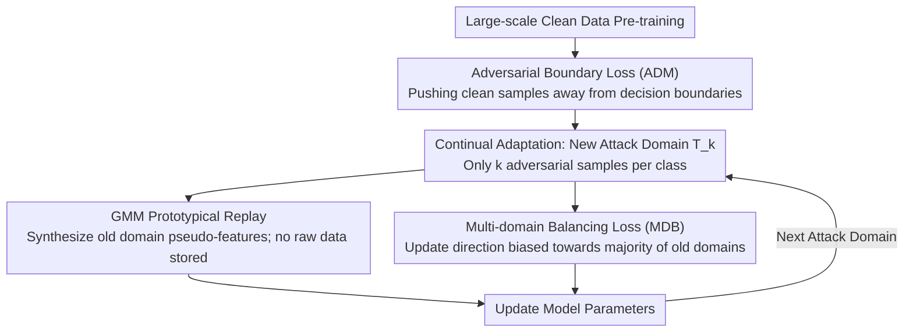

# Robustness Under Data Scarcity: Few-Shot Continual Adversarial Training for Evolving Threats

**Conference**: CVPR 2026  
**Paper**: [CVF Open Access](https://openaccess.thecvf.com/content/CVPR2026/html/Wang_Robustness_Under_Data_Scarcity_Few-Shot_Continual_Adversarial_Training_for_Evolving_CVPR_2026_paper.html)  
**Code**: https://github.com/aup520/FS_CAT  
**Area**: AI Security / Adversarial Robustness / Continual Learning / Few-Shot Learning  
**Keywords**: Adversarial Training, Continual Learning, Few-Shot, Catastrophic Forgetting, Adversarial Boundary

## TL;DR
In reality, defenders often only obtain a very small number of adversarial samples to counter emerging new attacks. This paper proposes a new setting called "Few-Shot Continual Adversarial Training (FS-CAT)" and introduces a three-component toolkit: the Adversarial Boundary Loss (ADM) that pushes clean samples away from decision boundaries, GMM Prototypical Replay that synthesizes pseudo-features using Gaussian Mixture Models for memory-free replay, and the Multi-domain Balancing Loss (MDB) that pulls the update direction toward the majority of old domains. Together, these components alleviate the difficulties of robust generalization and catastrophic forgetting in few-shot scenarios on ImageNet-1K and CIFAR-100.

## Background & Motivation

**Background**: Adversarial training (feeding adversarial samples into training) is the most mainstream defense against adversarial attacks. To face the constant emergence of new attacks, **Continual Adversarial Defense** has appeared in recent years, allowing models to learn from adversarial samples generated by new attack types sequentially to gradually enhance robustness.

**Limitations of Prior Work**: Existing Continual Adversarial Training (CAT) methods almost all assume that **there is sufficient adversarial data in each stage**. In reality, attackers only need a few images to create effective attacks, while it is computationally and temporally unrealistic for defenders to regenerate large-scale adversarial datasets for every new attack before fine-tuning.

**Key Challenge**: When each attack stage provides only a few adversarial samples, two problems arise simultaneously: (1) **Robust generalization under data scarcity**: Limited adversarial data severely weakens the model's ability to balance high accuracy and strong robustness under perturbations. (2) **Intensified forgetting**: Fewer samples per stage lead to poorer knowledge stability, amplifying catastrophic forgetting of the robustness against old attacks when learning new ones.

**Goal**: Formally propose and solve **Few-shot Continual Adversarial Training (FS-CAT)**—where a model sequentially faces a series of attack domains $\{T_1,\dots,T_n\}$, with only $k$ adversarial samples per class (k-shot) in each domain, and cannot revisit old domain data. The requirement is to maintain robustness and accuracy on all seen attacks and clean data while generalizing to unseen attacks.

**Key Insight**: The authors observe a geometric property where "adversarial samples are usually close to decision boundaries." Given this, the model proactively pushes clean samples away from boundaries during pre-training to "make room" for adversarial samples. Simultaneously, generative methods are used to revive old domain knowledge without storing original data, and multi-domain updates are balanced to prevent any single domain from dominating.

**Core Idea**: Use three mechanisms—boundary expansion, distribution-aware pseudo-feature replay, and multi-domain gradient balancing—to directly address robust generalization, forgetting, and inter-domain conflicts respectively.

## Method

### Overall Architecture
The FS-CAT framework consists of three core components acting at different stages of the continual learning pipeline: In the **pre-training phase**, the Adversarial Boundary Loss (ADM) pushes clean samples away from decision boundaries to reserve feature space for later generalization. Upon entering the **continual adaptation phase**, the model is fine-tuned using a few adversarial samples for each new attack domain. Catastrophic forgetting is countered by GMM Prototypical Replay, which synthesizes old domain pseudo-features, while the Multi-domain Balancing Loss (MDB) ensures that parameter updates favor a direction "beneficial to the majority of old domains." These three components synergize to provide robustness, adaptability, and stability in the few-shot continual adversarial setting.

### Key Designs

**1. Adversarial Boundary Loss (ADM): Pushing clean samples away from decision boundaries during pre-training to reserve a safety margin.**

Adversarial samples are typically located near decision boundaries, and models struggle to reliably distinguish them in these blurry regions under few-shot conditions. The idea of ADM is to **actively maximize the distance from clean samples to the nearest decision boundary** during pre-training. First, define the classification margin as $\phi_\theta^y(x) = z_\theta^y(x) - \max_{y'\neq y} z_\theta^{y'}(x)$; a smaller margin implies the sample is closer to the boundary. The loss is defined as the negative distance to the nearest boundary point $\hat{x}$: $L_{ADM}(x) = -\min_{\hat{x}} \|\hat{x}-x\|_p$ s.t. $\phi_\theta^y(\hat{x})=0$. This is formulated as a constrained optimization problem to minimize the perturbation norm under the boundary constraint and solved using projected gradient iterations: $\delta_k = \text{Proj}_{\|\cdot\|_p\le\varepsilon_k}(\delta_{k-1} + \alpha_k \cdot g/\|g\|_2)$ to find the nearest boundary point ($g$ is the negative gradient direction of the cross-entropy loss with respect to the perturbation). This creates a sufficient margin around the boundary and reserves geometric space for boundary-clinging adversarial samples, enhancing robust generalization in subsequent stages. The paper provides a "robust feature separability guarantee" in Proposition 1, showing that the ADM constraint keeps the margin within $[\phi_{min}, \phi_{max}]$, where the lower bound defends against small perturbations and the upper bound is determined by discriminative ability.

**2. GMM Prototypical Replay: Modeling old domains with Gaussian Mixtures and synthesizing pseudo-features to counter forgetting without storing raw samples.**

When a new attack domain arrives, the model tends to catastrophically forget the robustness of old attacks, and storing large amounts of original adversarial samples for replay is unfeasible in few-shot settings. The authors extract class-level feature distributions $\mathcal{D}_j$ for each past adversarial domain $j$ at the layer before the fully connected classifier, modeling them with a Gaussian Mixture Model (GMM) containing $\lambda_1$ components: $\{\pi_j(l), p_j(l), \Sigma_j(l)\}_{l=1}^{\lambda_1} = \text{GMM}(\mathcal{D}_j)$. Each component captures one mode of the adversarial feature distribution. During replay, pseudo-features are sampled directly from the class-specific GMM and fed into the current fully connected layer to calculate logits. The replay loss is $\mathcal{L}_{r_j} = \sum_l -\pi_j(l)\cdot f(\tilde{p}_j(l))$. To increase diversity and simulate uncertainty, Gaussian noise scaled by the covariance trace is injected into each prototype: $\tilde{p}_j(l) = p_j(l) + e\cdot\sqrt{\text{Tr}(\Sigma_j(l))/d}$. Compared to exemplar-based replay, this **saves memory and preserves privacy** (no original adversarial samples are stored) while reconstructing meaningful class-conditional representations to maintain old domain robustness. Proposition 2 provides an upper bound for the pseudo-feature reconstruction error $\Delta_\phi \le C_1\lambda_1^{-1} + C_2 k^{-1} + o(1)$, suggesting that a $\lambda_1$ that is too small lacks coverage while one that is too large causes over-smoothing; thus, a medium value is required.

**3. Multi-domain Balancing Loss (MDB): Pulling updates toward a consensus direction "beneficial to the majority of old domains" to suppress single-domain dominance.**

When training on the $k$-th adversarial domain, the previous $k-1$ domains have different training dynamics and gradient directions. Without balancing, one domain might dominate. MDB first defines the variance of the old domain losses $\mathcal{L}_{MDB} = \text{Var}\{\mathcal{L}_{r_i}\}_{i=1}^{k-1}$, then formulates a min-max problem: $\min_\theta \max_{\ $\|\Delta\theta\|_2\le\rho}[\sum_i \mathcal{L}_{r_i} - \lambda_2\text{Var}\{\mathcal{L}_{r_i}\}]$. This seeks a virtual update direction within an $\ell_2$ ball that generalizes well across all old domains. Using a first-order Taylor expansion to approximate the inner maximization as a quadratic form of $\Delta\theta$, the optimal perturbation direction is $\Delta\theta^* = \rho\cdot\nabla\mathcal{L}_{total}/\|\nabla\mathcal{L}_{total}\|_2$. The gradient $\nabla\mathcal{L}_{total} = \sum_i \nabla_\theta\mathcal{L}_{r_i} - \tfrac{2\lambda_2}{k-1}\sum_i(\mathcal{L}_{r_i}-\bar{\mathcal{L}}_r)\nabla_\theta\mathcal{L}_{r_i}$ **automatically reweights based on how much each domain's loss deviates from the mean**—outlier domains are suppressed while the majority direction is favored. The overall complexity is only $O((k-1)d)$, requiring no additional forward or backward passes and growing linearly with the number of domains, which is negligible compared to a single backpropagation. Proposition 3 further explains this as a solvable approximation of the "cross-domain consensus direction."

### Loss & Training
ResNet-50 backbone, Adam (learning rate $1\times10^{-3}$), 10-shot setting (10 images per class), $\lambda_1=4, \lambda_2=0.1$. ADM is active during the pre-training phase. During the continual phase, GMM replay loss and MDB loss are added for each attack domain. Three types of attack sequences are designed: short sequence [FGSM, PGD, CW, AA, Df], long sequence [FGSM, BIM, PGD, SA, BS, MCG, DIM], and cross-norm [$L_\infty, L_2, L_1$]. The model is trained sequentially following these orders.

## Key Experimental Results

### Main Results

ImageNet-1K long attack sequence [FGSM, BIM, PGD, SA, BS, MCG, DIM] (Robust Accuracy %, selected):

| Method | FGSM | PGD | SA | DIM | Clean |
|------|------|-----|----|----|-------|
| PGD-AT | 29.43 | 21.95 | 24.78 | 23.81 | 45.68 |
| AFD | 34.25 | 27.36 | 28.17 | 28.48 | 47.31 |
| SSEAT | 35.19 | 28.16 | 29.05 | 29.16 | 48.04 |
| **Ours** | **39.61** | **32.57** | **33.46** | **33.95** | **58.45** |

ImageNet-1K short sequence multi-seed (AVG, %; this paper also has the smallest STD) and cross-norm robustness:

| Method | Short Seq FGSM(AVG) | Short Seq Clean(AVG) | Cross-norm UNION | Cross-norm Clean |
|------|------|-------|------|------|
| PGD-AT | 29.23 | 46.31 | 17.21 | 42.52 |
| AFD | 34.91 | 49.70 | 22.43 | 45.12 |
| SSEAT | 36.28 | 50.65 | 24.09 | 46.49 |
| **Ours** | **42.71** | **64.51** | **28.24** | **51.18** |

> UNION refers to the **minimum** accuracy across different norm attacks (worst-case robustness). Ours achieves 38.27 / 31.48 / 28.24 under $\ell_\infty/\ell_2/\ell_1$ respectively, with a leading UNION of 28.24.

### Ablation Study

Individual component ablation on ImageNet-1K, ResNet-50, 10-shot (summarized based on configurations A–G; ⚠️ check Table 5 in the original paper for exact values):

| Comparison | Key Metric Change | Description |
|------|---------|------|
| A → B (Add ADM) | Clean Acc +~9.1% | ADM pushes clean samples away from boundaries, raising both robust and clean accuracy. |
| C → D (Add GMM Replay) | Significant old sample gain | Alleviates catastrophic forgetting better than random memory replay. |
| D → F (Add MDB, no ADM) | Clean + Robust Avg +~4.2% | Balances multi-domain gradients and stabilizes optimization. |
| E → G (MDB on top of ADM) | Average +~3.4% | Superposition of both further improves performance. |
| F → G (ADM + Replay) | Average +~2.7% | ADM and replay complement each other. |

### Key Findings
- **ADM delivers the most direct contribution**: Adding ADM alone increases clean accuracy by over 9%, verifying that it acts as a "decision boundary regularizer" producing more balanced and generalizable decision surfaces.
- **GMM Replay specifically tackles forgetting**: Compared to random memory replay, it significantly improves performance on old samples as it models class-conditional feature distributions rather than just storing samples.
- **Intermediate hyperparameter values are best**: Accuracy is stable when $\lambda_1=4$; too small leads to insufficient coverage, and too large causes over-smoothing (consistent with the error bound in Proposition 2). Sensitivity analysis for $\lambda_2$ is in Fig. 3.
- **Strong extrapolation generalization**: Ours ranks first in robust accuracy against unseen attacks (BIM/SA/BS/MCG/DIM) and unseen natural corruptions (fog/snow/gabor/elastic/jpeg), showing that the robustness can migrate to unseen attack domains.

## Highlights & Insights
- **Proposes the more realistic FS-CAT setting**: The asymmetry where attackers only need a few images to create attacks but defenders are forced to reconstruct large datasets is a real-world pain point. Shifting CAT from "sufficient data" assumptions to few-shot is valuable in itself.
- **ADM explains robustness through "geometric margin"**: Translating the observation "adversarial samples are near boundaries" into "proactively pushing clean samples away during pre-training" with separability guarantees is a clean idea that generalizes to standard robust training.
- **GMM Prototypical Replay balances anti-forgetting and privacy**: By storing class-conditional Gaussian parameters instead of original adversarial samples, it is memory-efficient and privacy-friendly. This sample-free replay paradigm can be adapted to any feature-level continual learning.
- **Automatic domain reweighting in MDB**: The min-max variance penalty provides gradients that automatically adjust weights based on a domain's deviation from the mean. It is lightweight, linear in complexity, and theoretically grounded for multi-domain balancing.

## Limitations & Future Work
- The three components introduce several hyperparameters ($\lambda_1, \lambda_2, \rho, \varepsilon_k$ etc.). While suggested values and $\lambda_1/\lambda_2$ analyses are provided, full sensitivity disclosure (especially for $\rho$ and ADM iteration steps) is limited.
- The quality of GMM Prototypical Replay depends on the stability of the feature space. Whether old domain GMMs can reliably reconstruct old robustness remains questionable if feature distributions shift drastically between attack domains ⚠️.
- Experiments focus on ResNet-50 and classification benchmarks (ImageNet-1K, CIFAR-100). Scalability to Transformer backbones or more complex tasks like detection/segmentation is not yet verified.
- The setting assumes a shared class space $C$ across domains; the framework would need adaptation if newer attacks involve class space changes (Open-World).

## Related Work & Insights
- **vs. SSEAT (Self-Evolving Continual Adversarial Defense)**: SSEAT relies on adversarial replay and consistency regularization for new attacks but assumes sufficient data. In a 10-shot comparison, ours leads in long-sequence FGSM (39.61 vs 35.19) and Clean accuracy (58.45 vs 48.04), showing SSEAT suffers more from forgetting in few-shot settings.
- **vs. Gradient Projection methods (Ru et al.)**: Those methods orthogonally constrain new task gradients to preserve old robustness. Ours uses MDB's variance penalty for multi-domain balancing and supplements this with GMM replay for old domain information rather than just constraining gradient directions.
- **vs. Traditional Adversarial Training (PGD-AT, AWP, AFD)**: These are single-stage static defenses that struggle with evolving threats. Ours is a continual few-shot setting and improves the cross-norm UNION (worst-case robustness) from AFD's 22.43 to 28.24.

## Rating
- Novelty: ⭐⭐⭐⭐ First to propose the FS-CAT setting; components include theoretical propositions; the problem definition is pioneering.
- Experimental Thoroughness: ⭐⭐⭐⭐ Multiple attack sequences, cross-norm, unseen attack/corruption generalization, multiple seeds; comprehensive coverage.
- Writing Quality: ⭐⭐⭐⭐ Two challenges map clearly to three components; logical flow; propositions provide theoretical grounding.
- Value: ⭐⭐⭐⭐ Few-shot continual adversarial defense aligns with real-world deployment constraints; open-source code enhances reproducibility.

<!-- RELATED:START -->

## Related Papers

- [\[CVPR 2026\] Image-based Outlier Synthesis With Training Data](image-based_outlier_synthesis_with_training_data.md)
- [\[ICLR 2026\] Identifying Robust Neural Pathways: Few-Shot Adversarial Mask Tuning for Vision-Language Models](../../ICLR2026/ai_safety/identifying_robust_neural_pathways_few-shot_adversarial_mask_tuning_for_vision-l.md)
- [\[ICLR 2026\] Nasty Adversarial Training: A Probability Sparsity Perspective for Robustness Enhancement](../../ICLR2026/ai_safety/nasty_adversarial_training_a_probability_sparsity_perspective_for_robustness_enh.md)
- [\[CVPR 2026\] Taming the Long Tail: Rebalancing Adversarial Training via Adaptive Perturbation](taming_the_long_tail_rebalancing_adversarial_training_via_adaptive_perturbation.md)
- [\[CVPR 2026\] SafeLogo: Turning Your Logos into Jailbreak Shields via Micro-Regional Adversarial Training](safelogo_turning_your_logos_into_jailbreak_shields_via_micro-regional_adversaria.md)

<!-- RELATED:END -->
