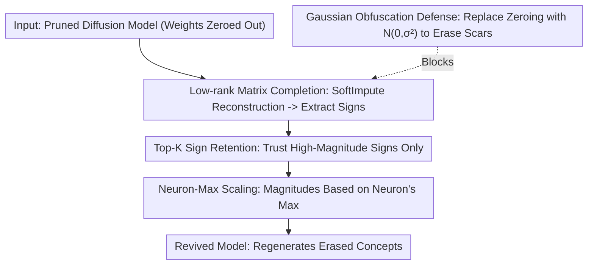

# Roots Beneath the Cut: Uncovering the Risk of Concept Revival in Pruning-Based Unlearning for Diffusion Models

**Conference**: CVPR 2026  
**Paper**: [CVF Open Access](https://openaccess.thecvf.com/content/CVPR2026/html/Zhang_Roots_Beneath_the_Cut_Uncovering_the_Risk_of_Concept_Revival_CVPR_2026_paper.html)  
**Code**: https://github.com/Brankozz/Roots-Beneath-the-Cut  
**Area**: AI Safety / Diffusion Models / Machine Unlearning  
**Keywords**: Machine Unlearning, Concept Erasure, Pruning, Side-channel Attack, Diffusion Model Security

## TL;DR
This paper reveals a neglected security vulnerability in "pruning-based concept unlearning": the positions of pruned (zeroed-out) weights themselves leak conceptual information. The authors design a completely data-free and training-free attack framework that restores the recognition accuracy of erased concepts from an average of 8% to 54% within 7 minutes by merely recovering the signs of the weights.

## Background & Motivation
**Background**: To comply with the "right to be forgotten" (GDPR/CCPA) and to remove copyrighted, private, or NSFW content, concept unlearning in diffusion models follows three main paths: editing-based (altering latent/token representations to suppress concepts), training-based (fine-tuning with custom losses), and the recently popular **pruning-based** methods, which directly locate and remove weights/neurons associated with target concepts. Pruning-based methods (e.g., ConceptPrune, Sculpting Memory) are considered the most practical and scalable paradigm for large diffusion models due to being "training-free, data-independent, robust to adversarial prompts, and minimally affecting image quality."

**Limitations of Prior Work**: While the efficiency of pruning-based unlearning is widely recognized, its implementation details have been overlooked. These methods erase concepts by **zeroing out** relevant weights. However, zero values in a weight matrix act as "scars" detectable by both the human eye and programs, explicitly marking where key concept weights once resided.

**Key Challenge**: Zeroing out both erases the concept and provides a map of the concept's location. Can an attacker leverage this "pruning map" side-channel information to recover weights and revive erased concepts, even without access to the original weight magnitudes?

**Goal**: To verify whether pruning-based unlearning can be compromised under the most stringent conditions—**no data, no training, and no original weight magnitudes**—and to provide safer pruning recommendations.

**Key Insight**: The authors conducted a crucial pilot experiment comparing the effects of "accurate magnitudes + random signs" versus "accurate signs + random magnitudes" on concept revival (Figure 2). The conclusion is that **signs are far more important than magnitudes**: as long as the signs are recovered correctly and assigned reasonable magnitudes, the concepts can be revived.

**Core Idea**: The problem of reviving erased concepts is transformed into a low-cost sub-problem of "restoring the signs of pruned weights"—using low-rank matrix completion to estimate signs, Top-K retention for high-confidence signs, and Neuron-Max Scaling for magnitude assignment.

## Method

### Overall Architecture
The input to the attack framework is a diffusion model unlearned via pruning (where parts of the FFN layer weights are zeroed out), and the output is a "revived model" capable of regenerating concepts. Built on the observation that "signs are more important than magnitudes," the pipeline performs a three-step recovery on FFN weight matrices: first, **low-rank matrix completion** is used for an approximate reconstruction to extract signs; next, **Top-K Sign Retention** preserves only signs of high-magnitude, high-confidence weights while zeroing others; finally, **Neuron-Max Scaling** assigns the "maximum magnitude within the neuron" to the retained signs. This three-step process populates the pruned weights with an estimate that has "mostly correct signs and aggressive magnitudes," sufficient to reactivate the original concepts. The paper also proposes a defensive countermeasure—**Gaussian Obfuscation**, suggesting that future pruning fill pruned locations with Gaussian noise rather than zeros to erase position "scars."

### Key Designs

**1. Low-rank Matrix Completion: Estimating signs with SoftImpute**

Since only partial "observed terms" remain after pruning, recovering missing terms is naturally a matrix completion problem. The authors utilize nuclear norm regularization: given an observed set $\Omega$, solve $\min_M \frac{1}{2}\|P_\Omega(X)-P_\Omega(M)\|_F^2 + \lambda\|M\|_*$, where $\|\cdot\|_*$ is the nuclear norm (a convex proxy for rank). During iteration, soft thresholding $S_\lambda(Y)=U\,\mathrm{diag}((\sigma_i-\lambda)_+)\,V^\top$ is applied to singular values. Since standard IST-SVD is too costly for diffusion models, the authors adopt **SoftImpute**, which backfills missing entries using the current low-rank estimate $Z^{(t)}=P_\Omega(X)+P_{\Omega^c}(M^{(t)})$. This exploits "sparse + low-rank" structures to avoid explicit dense matrix construction, accelerated by truncated SVD and warm-start paths on GPUs. While this **cannot precisely recover magnitudes**, it reliably restores a significant portion of the **signs**.

**2. Top-K Sign Retention: Filtering low-confidence signs**

Signs recovered via matrix completion are not perfectly accurate. The authors observed that **weights with larger recovered magnitudes are more likely to have correct signs**. Thus, Top-K Sign Retention is designed to keep only the signs of the top-K weights with the largest recovered magnitudes, zeroing out the rest. This suppresses noise by "prioritizing high-confidence signs and discarding low-confidence outliers." Experiments (Table 1, Top-0.6 setting) show that pruning small recovered magnitudes significantly improves revival performance.

**3. Neuron-Max Scaling: Assigning magnitudes based on intra-neuron maximums**

After determining signs, magnitudes must be assigned. Pilot experiments showed that when signs are correct, assigning the **maximum** magnitude of the remaining weights in that neuron is more effective than using the mean or sampling from a distribution. The authors formalized this as **Neuron-Max Scaling (NMS)**. By amplifying the influence of high-confidence signs, the restored weights can reconstruct the influential activation patterns of the original concept. This "final touch" of the attack allows the overall method to be named the NMS attack.

**4. Gaussian Obfuscation Defense: Erasing pruning scars**

Since the vulnerability stems from "zeroing out exposing pruning locations," the defense should make locations indistinguishable. Observing that weight distributions are roughly zero-centered and unimodal, they can be approximated by a zero-centered Gaussian. Pruned weights are sampled from $N(0,\sigma_M^2)$ instead of being zeroed, making modified and unmodified entries statistically similar. The paper provides a discernibility analysis: given unmodified density $f_U$, modified density $f_M$, and modification ratio $\alpha$, the probability that a value in $[-w,w]$ is obfuscated is $p(w)=\frac{\alpha\,\mathrm{erf}(w/\sqrt{2}\sigma_M)}{\alpha\,\mathrm{erf}(w/\sqrt{2}\sigma_M)+(1-\alpha)\,\mathrm{erf}(w/\sqrt{2}\sigma_U)}$. This reveals a **security-utility trade-off**: if $\sigma_M$ is too small, it is easily detected; if too large, it degrades generation quality.

### Loss & Training
This method is **entirely training-free**. Matrix completion involves convex optimization iterations (SoftImpute), and Top-K/NMS are deterministic post-processing steps. No model weights are updated via gradients, and no training or fine-tuning data is required. The attack is applied independently per FFN layer.

## Key Experimental Results

Experiments used Stable Diffusion v1.5, targeting 16 FFN layers as pruning candidates. The primary "no-finetuning" baseline was Quant Recover.

### Main Results
Object unlearning was tested on 12 ImageNet classes, with 500 images generated per class, evaluated via top-1 accuracy using a pre-trained ResNet-50.

| Model | Erased Class Acc (Mean) | Retained Class Acc (Mean) |
|------|------|------|
| Pre-trained SD-v1.5 (Upper Bound) | 0.93 | 0.93 |
| ConceptPrune (After Unlearning) | 0.08 | 0.80 |
| Quant Recover | 0.12 | 0.79 |
| Neuron Sample | 0.16 | 0.83 |
| Neuron Average | 0.16 | 0.84 |
| **NMS (Ours)** | **0.54** | **0.91** |

The method revives erased concepts from 8% to 54% (far exceeding other training-free attacks at 12%–16%) while maintaining a high retained class accuracy of 0.91. The attack completes in **under 7 minutes** and recovers **>70% of pruned weight signs**.

Artistic style unlearning (Van Gogh, etc.) was measured via CLIP similarity/score, and image quality via FID on COCO30K:

| Metric (Mean) | ConceptPrune (After) | Quant Recover | NMS (Ours) |
|------|------|------|------|
| Artist Similarity ↑ (Revival) | 0.25 | 0.26 | **0.30** |
| Artist CLIP score (Lower is Revived) | 0.82 | 0.83 | **0.51** |
| COCO FID ↓ (Quality) | 21.45 | 22.36 | **18.93** |

For NSFW revival, the attack increased nudity detection counts from 74/57/22 (after ConceptPrune) back to **118/172/57**, significantly reviving unsafe concepts.

### Ablation Study
| Configuration | Key Effect | Description |
|------|---------|------|
| Accurate Magnitudes + Random Signs | Minimal revival | Proves magnitudes are not the critical factor. |
| Accurate Signs + Random Magnitudes | Substantial revival | **Signs are the key** (Core finding in Fig 2). |
| Correct Signs + Neuron Max | Best revival | Basis for the NMS strategy. |
| Top-K Sign Retention (e.g., Top-0.6) | Superior to no retention | Suppresses destructive outliers by pruning small recovered weights. |

### Key Findings
- **Signs ≫ Magnitudes**: Restoring signs is almost sufficient for concept revival, reducing a seemingly impossible weight-inference problem to a solvable sign-recovery problem.
- **Max Assignment**: Assigning the maximum magnitude within a neuron (NMS) outperforms using the mean or sampling by effectively reconstructing influential activation patterns.
- **Defense Trade-off**: Gaussian obfuscation must balance $\sigma_M$—too small leaks the location; too large destroys the model.

## Highlights & Insights
- **Implementation as Attack Surface**: Pruning-based unlearning treats zeroing as an engineering standard, but the study identifies it as a side-channel "scar." This highlights that "erasure $\neq$ trace-free."
- **Dimensionality Reduction**: The insight that "signs are more important than magnitudes" allows the attack to be simplified and efficient.
- **Balanced Perspective**: The paper does not just expose a vulnerability but also provides a ready-to-use Gaussian obfuscation defense with theoretical guidance.

## Limitations & Future Work
- The attack assumes the attacker can **access weight locations** (white-box/gray-box). It poses a limited threat to black-box APIs.
- Experiments focus on SD-v1.5 and ConceptPrune. Its effectiveness against larger models or different unlearning paradigms (editing/training-based) requires further validation.
- The defense is a "first step," and its resilience against advanced statistical detection remains to be explored.

## Related Work & Insights
- **vs. ConceptPrune / Sculpting Memory**: These are the target methods. The paper shows their zeroing implementation leaks information, necessitating a rethink of their security assumptions.
- **vs. Quant Recover**: A baseline originally for LLMs. NMS (0.54) vastly outperforms it (0.12) because NMS specifically targets sign recovery.
- **vs. Editing/Training Unlearning**: These are often bypassed via adversarial prompts. This paper introduces a new attack dimension via the **weight-side location side-channel**.

## Rating
- Novelty: ⭐⭐⭐⭐⭐ Identifies the "zero-location side-channel" in pruning and provides a clean sign-recovery solution.
- Experimental Thoroughness: ⭐⭐⭐⭐ Covers various tasks and defense analyses, though primarily bound to SD-v1.5.
- Writing Quality: ⭐⭐⭐⭐ Logical flow from pilot experiments to full methodology is very clear.
- Value: ⭐⭐⭐⭐⭐ Challenges whether machine unlearning "wipes the slate clean" and offers a practical defensive fix.

<!-- RELATED:START -->

## Related Papers

- [\[CVPR 2026\] GROW: Watermark Generation with Progressive Guidance for Diffusion Models](grow_watermark_generation_with_progressive_guidance_for_diffusion_models.md)
- [\[CVPR 2026\] Towards Human-Imperceptible Backdoor Attacks on Text-to-Image Diffusion Models](towards_human-imperceptible_backdoor_attacks_on_text-to-image_diffusion_models.md)
- [\[CVPR 2026\] Red-teaming Retrieval-Augmented Diffusion Models via Poisoning Knowledge Bases](red-teaming_retrieval-augmented_diffusion_models_via_poisoning_knowledge_bases.md)
- [\[CVPR 2026\] PureProof: Diffusion-Resistant Black-box Targeted Attack on Large Vision-Language Models](pureproof_diffusion-resistant_black-box_targeted_attack_on_large_vision-language.md)
- [\[CVPR 2026\] Selective Amnesia using Contrastive Subnet Erasure for Class Level Unlearning in Vision Models](selective_amnesia_using_contrastive_subnet_erasure_for_class_level_unlearning_in.md)

<!-- RELATED:END -->
