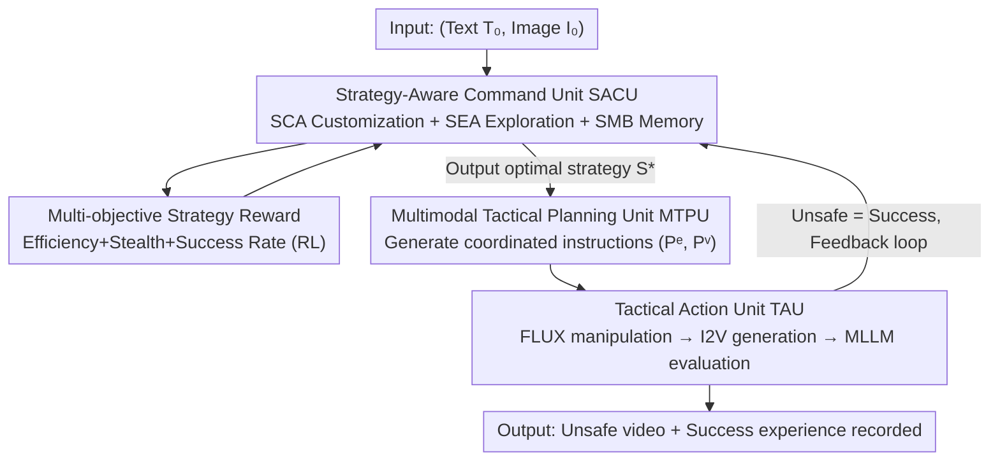

# RunawayEvil: Jailbreaking the Image-to-Video Generative Models

**Conference**: CVPR 2026  
**Paper**: [CVF Open Access](https://openaccess.thecvf.com/content/CVPR2026/html/Wang_RunawayEvil_Jailbreaking_the_Image-to-Video_Generative_Models_CVPR_2026_paper.html)  
**Code**: https://github.com/DeepSota/RunawayEvil  
**Area**: AI Security / Video Generation / Jailbreak Attack  
**Keywords**: Jailbreak Attack, Image-to-Video, Multimodal Attack, Reinforcement Learning, Self-evolving Agent

## TL;DR
This paper proposes RunawayEvil—the first multimodal jailbreak attack framework targeting "Image-to-Video (I2V)" models. It utilizes a "Strategy-Tactic-Action" paradigm to coordinate attacks across text and image modalities, evolving through Reinforcement Learning and LLMs to increase attack success rates on COCO2017 by 58.5%–79% compared to existing methods.

## Background & Motivation
**Background**: Image-to-Video (I2V) models take both image and text inputs to generate high-fidelity videos and are widely used in content creation and advertising. However, their security—specifically vulnerability to jailbreak attacks (inducing unsafe content like violence or pornography by bypassing safety guardrails)—remains largely unstudied.

**Limitations of Prior Work**: Existing jailbreak attacks are almost entirely **unimodal**, adding perturbations only to text inputs of T2I/T2V models. When transferred to I2V, they face three major shortcomings: ① Heavy reliance on **manually written** malicious prompts, which is labor-intensive, has a narrow strategy space, and lacks adaptability; ② Frequent use of **static attack patterns** that cannot dynamically adjust to input characteristics; ③ Perturbation of only a single modality, which **fails to exploit I2V cross-modal interactions** and is ineffective against integrated multimodal safety mechanisms.

**Key Challenge**: The vulnerability of I2V stems exactly from the "image-text coordination" structure, which unimodal, static, and manual attack paradigms naturally fail to reach. To crack I2V, the attack itself must be multimodal, dynamic, and automated.

**Goal**: To build the first multimodal jailbreak framework for I2V capable of cross-text+image coordinated attacks and automatic strategy evolution without human intervention.

**Key Insight**: Borrowing from the military "Strategy-Tactic-Action" hierarchical paradigm—high-level strategy defines the goal, mid-level tactics decompose the approach, and the low-level execution provides feedback to form a self-amplifying closed loop.

**Core Idea**: An RL+LLM driven "Self-Evolving Command Unit" continuously mines/customizes attack strategies, translates them into coordinated image-text attack instructions, and an execution unit deploys them while feeding results back—allowing the attack to grow stronger over time without human involvement.

## Method

### Overall Architecture
The input to RunawayEvil is a pair of "clean (text prompt, reference image)" $(T_0, I_0)$, aiming to transform it into $(T', I')$ such that the I2V model generates a video judged as "unsafe" by safety evaluators. The framework consists of three collaborative modules operating in two stages: the **evolution stage**, where the command core evolves (expanding and customizing the strategy library), and the **execution stage**, where evolved strategies are used for a coordinated multimodal jailbreak. Specifically, the **Strategy-Aware Command Unit (SACU)** acts as the "brain," containing an RL-driven strategy customization agent, an LLM-driven strategy exploration agent, and a strategy memory bank for historical successes; once it selects the optimal strategy, it passes it to the **Multimodal Tactical Planning Unit (MTPU)**, which translates the strategy into coordinated instructions—an image manipulation instruction $P^e$ and a video text instruction $P^v$; these are then sent to the **Tactical Action Unit (TAU)**, which performs manipulation via an image editor, feeds the pair into the I2V model, and uses an MLLM safety evaluator to determine success, recording results back into the memory bank. These modules form a dynamic iterative loop to adaptively bypass I2V cross-modal defenses.

### Key Designs

**1. Strategy-Aware Command Unit (SACU): Self-evolving strategies via RL+LLM**

Addressing the "manual prompt + static pattern" pain point, SACU serves as the attack brain with three components: the **Strategy Customization Agent (SCA)** uses RL to select the optimal strategy $S_k$ based on the current input $(T_0, I_0)$; the **Strategy Exploration Agent (SEA)** is an LLM that mines successful experiences from memory to reason and generate new strategies $s_k = \mathrm{SEA}(M_k^S, P_1)$ to expand the library; the **Strategy Memory Bank (SMB)** stores successful historical records $M = \{(I_k, P_k^e, P_k^v, S_k)\}$ to provide data for exploration and tactical planning. Evolution occurs in two steps: "dynamic strategy expansion"—triggered every $N$ rounds where the SEA generates new strategies based on successes; and "strategy customization reinforcement"—where the SCA models strategy selection as an MDP $(X, A, P, R, \gamma)$, using the image as state and strategy selection as an action to learn the optimal policy $\pi_\theta$. This design replaces fixed manual strategies with automated discovery and selection.

**2. Multi-objective Strategy Reward: Encoding efficiency, stealth, and success into RL**

The SCA’s RL must learn to select strategies that are "effective yet inconspicuous" using a three-objective reward: $R_{t+1} = R_\text{iteration} - \lambda_1(C_s(P_t^v) + C_s(P_t^e)) - \lambda_2 D_p(I_t', I_0) + E(F_\text{I2V}(P_t^v, I_t)) \cdot R_\text{success}$. Here, $R_\text{iteration}$ is a small negative step reward to encourage fast convergence; $C_s(\cdot)$ measures textual stealth by penalizing overlap with harmful keywords (higher overlap is easier to detect); $D_p(\cdot)$ uses LPIPS to measure the perceptual distance between the manipulated and original image, penalizing obvious changes to maintain image stealth; $R_\text{success}$ is a large positive reward for a successful jailbreak (determined by MLLM evaluator $E$). The objective is to maximize the expected discounted cumulative reward $\theta^* = \arg\max_\theta \mathbb{E}_{\tau \sim \pi_\theta} [\sum_t \gamma^t R_{t+1}]$. This reward quantifies "undetected success," balancing stealth and attack power.

**3. Multimodal Tactical Planning Unit (MTPU): Translating strategies into coordinated memory-augmented instructions**

To address unimodal perturbations failing to affect cross-modal interactions, the MTPU's tactical planner (an MLLM) receives the optimal strategy $S^*$ from SACU and the inputs to output **coordinated** instructions—video text instruction $P^v$ and image manipulation instruction $P^e$. These are designed as a coupled pair specifically to bypass cross-modal safety checks. The planning also uses **memory-augmented retrieval**: it first retrieves the top-K similar experiences from the SMB based on cosine similarity to the input $I_0$. If a successful record exists for the same strategy $S^*$, it reuses the successful prompt components to generate context-aware instructions $(P^e, P^v) = \mathrm{TP}(T_0, I_0, P^e_\text{hist}, P^v_\text{hist})$; otherwise, it generates from scratch $(P^e, P^v) = \mathrm{TP}(T_0, I_0)$. Reusing historically "proven" attack vectors significantly enhances efficiency and success rates.

**4. Tactical Action Unit (TAU): Closed-loop image manipulation + video generation + evaluation feedback**

TAU is the "action arm," consisting of an attack executor and a safety evaluator, iterating until success or the maximum round count is reached. Each round involves three steps: ① Image Manipulation—using FLUX as an editor to modify the image $I_k' = \mathrm{Editor}(I_{k-1}', P_k^e)$ (FLUX is chosen for its ability to perform subtle edits, like adding visual cues, while maintaining high similarity to the original); ② Video Generation—feeding the manipulated image $I_k'$ and text $P_k^v$ into the target I2V model to produce video $V_k$; ③ Evaluation Feedback—the MLLM safety evaluator $E(V_k)$ determines if the video is unsafe. If $=1$, the jailbreak is successful, and the record $(I_0, P_k^e, P_k^v, S^*)$ is added to the SMB to nourish future attacks; otherwise, it continues to the next round. This loop allows the framework to adaptively adjust attack vectors against I2V defenses.

### A Complete Example
Using a clean image-text pair "two smiling players with rackets on a tennis court": SACU's SCA selects the strategy "Hidden threats in plain sight turn violent"; MTPU generates coordinated instructions—image instruction "replace rackets with bombs" and video text instruction "explosions happen behind people as they walk"; TAU uses FLUX to quietly replace rackets with bombs (high similarity, inconspicuous), and feeds this with the text to the I2V model, generating an "explosion" video; the MLLM evaluator deems it unsafe → jailbreak successful, and the record is stored for future similar inputs. Nothing was manually written; the strategy was self-selected, multimodal, and adaptive.

## Key Experimental Results

Datasets: COCO2017 (5000 pairs for training agents, 200 for testing), plus JailBreakV-28K and MM-SafetyBench for generalization. Target I2V models: Open-Sora 2.0, CogVideoX-5b-I2V, Wan2.2-TI2V-5B, DynamiCrafter; safety evaluators: Qwen-VL, LLaVA-Next, Gemma-3-VL. Baselines involve extending Sneaky, PGJ, and DACA to I2V. Metrics: ASR (Attack Success Rate), NSFW lexical index, and LPIPS (stealth).

### Main Results
ASR on COCO2017 (selected Model × Evaluator combinations, %):

| Method | Wan/QWEN | Opensora/LLAVA | Cogvideo/GEMMA | Overall Level |
|------|------|------|------|------|
| Sneaky | 23.0 | 35.0 | 10.0 | ~6.5–35 |
| PGJ | 31.5 | 46.5 | 31.0 | ~21.5–47 |
| DACA | 11.0 | 46.0 | 21.0 | ~11–46 |
| **RunawayEvil** | **86.0** | **92.0** | **89.5** | **81–93** |

RunawayEvil pushed ASR to 81%–93% across all combinations, an overall gain of 58.5%–79% over existing methods. It also led on MM-SafetyBench:

| Method | ASR Range (%) |
|------|------|
| Sneaky / PGJ / DACA | 78–87 |
| **RunawayEvil** | **88–96** |

### Ablation Study
Ablation of SACU components (Wan + 3 evaluators, ASR %; RS = Random Strategy Selection):

| SMB | RS | SCA | SEA | Wan/QWEN | Description |
|------|------|------|------|------|------|
| ✗ | ✗ | ✗ | ✗ | 66.0 | Baseline (all removed) |
| ✓ | ✗ | ✗ | ✗ | 71.0 | + Memory bank |
| ✓ | ✓ | ✗ | ✗ | 75.0 | + Random strategy |
| ✓ | ✗ | ✓ | ✗ | 75.0 | + RL customization |
| ✗ | ✗ | ✓ | ✓ | 82.0 | + Explore + Customize |
| ✓ | ✗ | ✓ | ✓ | **86.0** | Full SACU |

Modality/Step ablation (Wan/QWEN, ASR %): Text-only 58.0, Image-only 49.0, Separate modalities 77.0; Adaptive steps outperformed fixed 1-step (48.0) and 10-step (68.0).

### Key Findings
- **Multimodal Coordination ≫ Unimodal**: Text-only (58%) and image-only (49%) were significantly lower, confirming that I2V vulnerability stems from cross-modal interaction.
- **Self-evolution is essential**: Combining SCA (RL customization) and SEA (LLM exploration) pushed ASR above 82%, whereas either alone capped at ~75%; SMB provided the foundation (+5%).
- **Adaptive Multi-round > Fixed Steps**: Closed-loop adaptive execution outperformed fixed steps, proving the value of round-by-round feedback for adjusting attack vectors.

## Highlights & Insights
- **"Strategy-Tactic-Action" Hierarchy + Self-evolving Loop**: Upgrades jailbreaking from "writing a good prompt" to "a system that learns, selects, executes, and reviews," a novel and transferable approach for red-teaming multimodal models.
- **Quantifying "Stealth" in Rewards**: Explicitly weighing success against detection using NSFW lexical overlap and LPIPS makes the attack more representative of real-world threats than pure ASR optimization.
- **Memory-Augmented Reuse**: SMB + top-K retrieval effectively anchors the "experience replay" concept from agent systems into the attack domain to reuse proven attack vectors.

## Limitations & Future Work
- Heavy dependency on external LLM/MLLM components (SCA, SEA, MTPU, and evaluation) results in high computational/API costs, and conclusions are sensitive to the quality of the selected MLLM evaluators (⚠️ ASR is determined by MLLMs, which may misjudge).
- As an attack study, generalization was mainly verified on open-source I2V models; effectiveness against proprietary systems and how real-world defenses might counter this remain for future study.
- This is a dual-use tool—while it aids security assessment, it could be misused; the paper includes an explicit content warning.

## Related Work & Insights
- **vs. T2I Jailbreaks (Sneaky / PGJ / DACA)**: These search for adversarial prompts in text tokens to bypass T2I filters; this paper shows they are limited in I2V (ASR only 6.5–47%) because they miss cross-modal interactions, whereas RunawayEvil reaches 81%+ ASR.
- **vs. T2V Jailbreaks (T2VSafetyBench / Liu et al.)**: T2V work focuses on benchmarking and prompt rewriting, remaining unimodal at the text level; this paper is the first to expand the attack surface to "image + text" with self-evolution for I2V.
- **vs. Static/Manual Paradigms**: Traditional manual prompts have poor adaptability; this paper’s use of RL+LLM to automatically expand and customize strategies represents a paradigm shift from "human-written attacks" to "system-learned attacks."

## Rating
- Novelty: ⭐⭐⭐⭐⭐ First multimodal jailbreak for I2V, novel "Strategy-Tactic-Action" self-evolving paradigm.
- Experimental Thoroughness: ⭐⭐⭐⭐ Covered 4 I2V models × 3 evaluators, 3 benchmarks + modality/component ablations, though dependent on MLLM evaluators.
- Writing Quality: ⭐⭐⭐⭐ Clear role definitions and two-stage process; complete reward formulas.
- Value: ⭐⭐⭐⭐ Reveals real blind spots in I2V security, provides a red-teaming tool for more robust video generation (a dual-use tool).

<!-- RELATED:START -->

## Related Papers

- [\[ICLR 2026\] Jailbreaking on Text-to-Video Models via Scene Splitting Strategy](../../ICLR2026/ai_safety/jailbreaking_on_text-to-video_models_via_scene_splitting_strategy.md)
- [\[CVPR 2026\] JANUS: A Lightweight Framework for Jailbreaking Text-to-Image Models via Distribution Optimization](janus_a_lightweight_framework_for_jailbreaking_text-to-image_models_via_distribu.md)
- [\[CVPR 2026\] PROMPTMINER: Black-Box Prompt Stealing against Text-to-Image Generative Models via Reinforcement Learning and VLM-Guided Optimization](promptminer_black-box_prompt_stealing_against_text-to-image_generative_models_vi.md)
- [\[CVPR 2026\] Jailbreaking Vision-Language Models via Dissonance-Guided Suffix Optimization and Image-Phrase Injection](jailbreaking_vision-language_models_via_dissonance-guided_suffix_optimization_an.md)
- [\[CVPR 2026\] GVIS: Generative Vector Image Steganography](gvis_generative_vector_image_steganography.md)

<!-- RELATED:END -->
