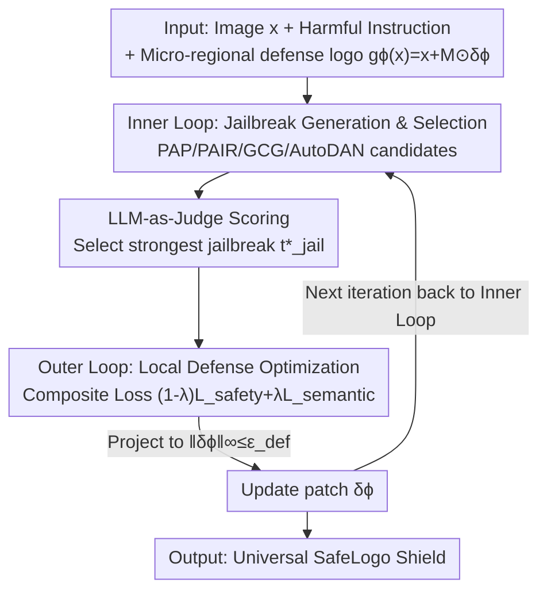

# SafeLogo: Turning Your Logos into Jailbreak Shields via Micro-Regional Adversarial Training

**Conference**: CVPR 2026  
**Paper**: [CVF Open Access](https://openaccess.thecvf.com/content/CVPR2026/html/Duan_SafeLogo_Turning_Your_Logos_into_Jailbreak_Shields_via_Micro-Regional_Adversarial_CVPR_2026_paper.html)  
**Code**: None  
**Area**: AI Safety / Multimodal VLM  
**Keywords**: VLM Jailbreak Defense, Adversarial Training, Visual Defense Prompt, min-max optimization, Local Perturbation

## TL;DR
SafeLogo optimizes a "logo-level" small patch, occupying ≤2% of image pixels, into a universal jailbreak shield via min–max adversarial training. The inner loop dynamically selects the strongest current jailbreak attack, while the outer loop updates this local patch to resist it. Without modifying the VLM backbone, it significantly reduces jailbreak success rates on MM-SafetyBench, VLGuard, and FigStep, while maintaining near-original performance on benign tasks.

## Background & Motivation
**Background**: As Vision-Language Models (VLMs, e.g., LLaVA-1.5, MiniGPT-4, Qwen-VL) become increasingly powerful, they are also more susceptible to "jailbreak attacks" that bypass safety alignment. Attackers construct textual or multimodal malicious inputs (e.g., PAP using 40 persuasive tactics, PAIR iteratively refining attacks using LLMs, and GCG using gradient searches for adversarial suffixes) to induce harmful outputs.

**Limitations of Prior Work**: Existing defenses rely on either fine-tuning (RLHF, SFT), which is computationally expensive and degrades general capabilities, or plug-and-play visual/textual defense prompts. The latter often depend on strong priors or heavy prompt engineering, frequently introducing visible global perturbations that ruin image quality (as shown in Figure 1 b/c of the paper). Furthermore, they have narrow defense coverage, struggling against adaptive or cross-modal jailbreaks.

**Key Challenge**: There is a trade-off between defense strength and image usability—stronger defense often requires larger modifications that degrade visual quality. Additionally, "static defenses" trained on fixed directions naturally fail against "evolving adaptive attacks" because the attack space is dynamic whereas the defense remains static.

**Goal**: Train a defense mechanism capable of generalizing to unseen jailbreak strategies without modifying the backbone and with minimal impact on visual quality.

**Key Insight**: The authors pose a counter-intuitive question: Can a visually negligible "logo" be optimized into a universal shield against various jailbreaks? A key observation is that the min–max paradigm of traditional adversarial training (AT) is inherently suited for "worst-case perturbations." By treating "worst-case jailbreaks" as the inner maximization objective, the defense can continuously align with the strongest attacks.

**Core Idea**: Utilize min–max adversarial training to optimize a local perturbation patch (occupying ≤2% of pixels, resembling a watermark/logo) into a "SafeLogo" that resists diverse jailbreak attacks.

## Method

### Overall Architecture
SafeLogo takes an image and a harmful instruction as input and outputs a locally constrained perturbation patch (SafeLogo). During inference, this patch is applied to any image alongside a fixed safety instruction, causing the VLM to refuse jailbreak queries. The training follows a bi-level min–max game: the **inner loop** acts as an "evolving attacker," generating a pool of jailbreak candidates for the current defense and using an LLM-as-Judge to select the most toxic one; the **outer loop** acts as a "local defender," updating patch parameters under the pressure of the strongest attack and projecting updates back into the magnitude constraints. These loops alternate to keep the defense aligned with the "strongest currently effective attack."

### Key Designs

**1. Micro-regional defense logo: Compressing defense into ≤2% pixels**

To address the issue of image quality degradation from global perturbations, the authors parameterize the defense as a function $g_\phi(x) = x + M \odot \delta_\phi$ effective only in a fixed sparse region. Here, $\delta_\phi \in [-\epsilon_{def}, \epsilon_{def}]^{H\times W\times C}$ is a learnable bounded perturbation and $M \in \{0,1\}^{H\times W\times C}$ is a binary mask where $\|M\|_0 = \rho\cdot H\cdot W\cdot C$ and coverage $\rho$ is typically 0.02. The mask $M$ remains **fixed** during training, ensuring a consistent perturbation space transferable across images. This preserves visual fidelity (resembling a watermark) while achieving defensive performance comparable to global perturbations even with a magnitude limit of 64/255. The authors note that such a small area alone is insufficient, so SafeLogo must be **jointly trained** with a standard safety instruction to "activate and amplify" the model's intrinsic safety alignment.

**2. Bi-level min–max game: Pursuing adaptive attacks with static defense**

To counter evolving attacks, the defense learning is formulated as a bi-level min–max problem:
$$\min_{\phi} \max_{t_{jail}\in T_{jail}(t_{harm})} L_{defense}(\phi, x, t_{jail}).$$
The inner maximization identifies the most aggressive jailbreak given the current defense, while the outer minimization updates parameters $\phi$ to neutralize it. This adapts the classic AT idea of "finding/resisting the worst perturbation" to jailbreak defense—the difference being that "perturbations" here are **discrete selections** from multiple attack families. This is the first work to introduce AT into local visual defense prompts and reconstruct visual defense as a min–max game, allowing the defense to generalize across attack types.

**3. Inner Loop — Jailbreak Generation & LLM-as-Judge Selection: Dynamic locking of the "most toxic" attack**

Given current defense $\phi^{(t)}$, the inner loop uses jailbreak generators $J=\{J_1,\dots,J_n\}$ (e.g., PAP, PAIR, GCG, AutoDAN) to construct a candidate pool $T_{pool}(x,t_{harm}) = \{J_i(x,t_{harm},f_\theta,g_\phi)\}$. A safety judge LLM scores these based on toxicity:
$$t^*_{jail} = \arg\max_{t_{jail}\in T_{pool}} J_{LLM}\big(f_\theta(g_\phi(x), t_{jail})\big).$$
This $J_{LLM}(\cdot)$ is an LLM-as-Judge function providing a scalar "harmful score." This step ensures the training signal originates from the attack most likely to breach the current defense, ensuring robustness against adaptive/unseen attacks.

**4. Outer Loop — Composite Loss & Projected Update: Balancing safety and capability**

After obtaining $t^*_{jail}$, the outer loop updates the local perturbation to minimize the composite loss $L_{defense} = (1-\lambda)L_{safety} + \lambda L_{semantic}$, where $\lambda\in[0,1]$ balances "safety robustness" and "benign usability." The safety loss $L_{safety} = \mathbb{E}\big[-\log P_{refuse}(g_\phi(x), t^*_{jail})\big]$ forces refusal under the strongest jailbreak. The semantic preservation loss $L_{semantic} = \mathbb{E}_{benign}\big[\|f_\theta(g_\phi(x),t) - f_\theta(x,t)\|_2^2\big]$ ensures outputs for benign inputs remain unchanged. Updates use a projected gradient step $\phi^{(t+1)} = \Pi_{\|\delta_\phi\|_\infty\le\epsilon_{def}}\big(\phi^{(t)} - \alpha_{out}\nabla_\phi L_{defense}\big)$ to maintain visual imperceptibility.

### Loss & Training
The total loss is $L_{defense} = (1-\lambda)L_{safety} + \lambda L_{semantic}$. Training uses LLaVA-1.5-13B and Qwen3-VL-8B-Instruct as backbones for 5000 steps with a batch size of 3 and a learning rate of 1/255. A fixed safety instruction is maintained throughout. The training set consists of 600 samples from MM-SafetyBench initially not recognized as harmful, with PAIR/GCG/PAP attacks generated per image. The benign set includes 100 random MM-Vet samples.

## Key Experimental Results

### Main Results
Comparison of Attack Success Rate (ASR, lower is better) on MM-SafetyBench (ID) and VLGuard (OOD):

| Model / Defense | MM-SB SD+TYPO PAIR | GCG | PAP | VLGuard PAIR | GCG | PAP |
|------|------|------|------|------|------|------|
| LLaVA-1.5-13B None | 13.3% | 17.1% | 16.9% | 33.3% | 32.4% | 41.0% |
| AdaShield | 1.4% | 7.5% | 2.5% | 6.7% | 15.2% | 13.3% |
| DAVSP (Global) | 0.1% | 1.3% | 0.2% | 17.1% | 17.1% | 9.5% |
| **SafeLogo** | **0.9%** | **4.2%** | **0.4%** | **2.9%** | **11.4%** | **1.9%** |
| Qwen3-VL-8B None | 6.7% | 6.3% | 4.6% | 10.5% | 15.2% | 13.3% |
| **SafeLogo** | **0.5%** | **0.0%** | **0.1%** | **1.0%** | **0.0%** | **0.0%** |

> **Key Finding**: While DAVSP is slightly stronger in ID, it requires **unconstrained** perturbations across the entire image. In OOD (VLGuard), its performance drops (ASR 9.5%~17.1%), whereas SafeLogo maintains stable generalization (PAP 1.9%) with only 2% coverage and constrained magnitude.

### Ablation Study (Usability)
Performance on MM-Vet (ID benign) before and after defense (higher is better):

| Model / Defense | Rec | OCR | Know | Spat | Math | Total |
|------|------|------|------|------|------|------|
| LLaVA-1.5-13B None | 41.1 | 32.8 | 28.5 | 39.1 | 7.1 | 39.2 |
| DAVSP | 39.3 | 30.9 | 24.3 | 41.1 | 20.7 | 38.0 |
| MLLMP | 40.5 | 31.9 | 28.5 | 37.8 | 7.1 | 38.6 |
| **SafeLogo** | — | — | — | — | — | ≈None |

> SafeLogo's total score is comparable to the undefended model. While Qwen3-VL shows a small drop in fine-grained tasks like OCR, it remains superior to baselines with similar defense strength.

### Key Findings
- **2% coverage is sufficient**: Confining perturbations to a logo-sized region can match or exceed global boundary perturbations, showing that full-image modification is unnecessary.
- **OOD generalization is the differentiator**: Unlike baselines that fail on OOD data (VLGuard/MME), SafeLogo's inner loop alignment with the strongest attack ensures robust cross-distribution performance.
- **Adjustable Safety-Usability**: $\lambda$ acts as a knob to tune defense intensity versus task performance.

## Highlights & Insights
- **Logo as a Shield**: Optimizing a visually benign watermark-like patch into a universal shield is a novel "plug-and-play" approach that remains elegant and non-destructive.
- **Adversarial Training for Jailbreaks**: Replacing continuous noise in traditional AT with discrete attack family selection is a transferable strategy for any safety task with multiple known attack modes.
- **LLM-as-Judge as Signal Source**: Using LLM toxicity scores to dynamically select training targets avoids over-fitting to specific attacks, which is key to generalization.

## Limitations & Future Work
- **Dependency on Attack Pool**: The inner loop only selects from known generators (PAP/PAIR/GCG/AutoDAN); coverage for entirely new attack paradigms is unproven.
- **Safety Instruction Coupling**: The patch relies on "amplifying" an existing safety instruction; its effectiveness might diminish if the instruction is missing or tampered with.
- **Judge Model Costs**: LLM-as-Judge (e.g., DeepSeek-V3) introduces inference overhead during training and its individual biases affect the selected "strongest jailbreak."

## Related Work & Insights
- **vs DAVSP**: DAVSP uses unconstrained training in image boundaries with activation-space alignment. It is strong in ID but lacks OOD generalization; SafeLogo is more stable and visually preserves the image better.
- **vs AdaShield**: AdaShield uses adaptive textual prompts; SafeLogo covers multimodal/adaptive attacks more broadly via visual local perturbations.
- **vs ECSO / MLLM-Protector**: Unlike these methods, SafeLogo does not require extra inference steps (like image-to-text) or modified backbones, baking the defense directly into a patch.

## Rating
- Novelty: ⭐⭐⭐⭐⭐ 
- Experimental Thoroughness: ⭐⭐⭐⭐ 
- Writing Quality: ⭐⭐⭐⭐ 
- Value: ⭐⭐⭐⭐ 

<!-- RELATED:START -->

## Related Papers

- [\[CVPR 2026\] Towards Robust Multimodal Large Language Models Against Jailbreak Attacks](towards_robust_multimodal_large_language_models_against_jailbreak_attacks.md)
- [\[CVPR 2026\] UniGame: Turning a Unified Multimodal Model Into Its Own Adversary](unigame_turning_a_unified_multimodal_model_into_its_own_adversary.md)
- [\[CVPR 2026\] Taming the Long Tail: Rebalancing Adversarial Training via Adaptive Perturbation](taming_the_long_tail_rebalancing_adversarial_training_via_adaptive_perturbation.md)
- [\[CVPR 2026\] Mitigating Error Amplification in Fast Adversarial Training](mitigating_error_amplification_in_fast_adversarial_training.md)
- [\[CVPR 2026\] Your Classifier Can Do More: Towards Balancing the Gaps in Classification, Robustness, and Generation](your_classifier_can_do_more_towards_balancing_the.md)

<!-- RELATED:END -->
