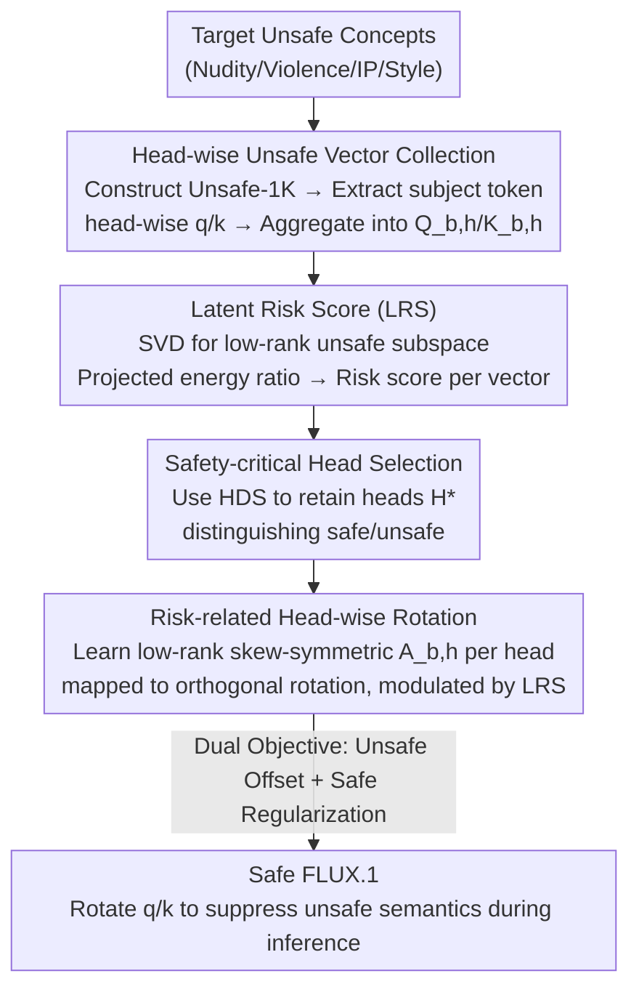

# SafeRoPE: Risk-specific Head-wise Embedding Rotation for Safe Generation in Rectified Flow Transformers

**Conference**: CVPR 2026  
**Paper**: [CVF Open Access](https://openaccess.thecvf.com/content/CVPR2026/html/Yang_SafeRoPE_Risk-specific_Head-wise_Embedding_Rotation_for_Safe_Generation_in_Rectified_CVPR_2026_paper.html)  
**Code**: https://github.com/deng12yx/SafeRoPE  
**Area**: AI Security / Diffusion Models / Concept Erasure  
**Keywords**: Safe generation, Concept erasure, RoPE, MMDiT, Attention heads, Rectified flow  

## TL;DR
SafeRoPE observes that in MMDiTs (e.g., FLUX), only a few "safety-critical attention heads" carry unsafe semantics, and these semantics are concentrated in low-dimensional subspaces. Consequently, it learns low-rank orthogonal rotation matrices for these specific heads to adaptively rotate unsafe components based on the "latent risk score" of each token. This precisely suppresses unsafe content—such as nudity, violence, and copyright—without modifying the 10-billion-parameter backbone or compromising normal generation quality.

## Background & Motivation

**Background**: Text-to-Image (T2I) generation is shifting from U-Net diffusions (SD1.5/2.x) to Rectified Flow-based Multimodal Diffusion Transformers (MMDiT, such as SD3 and FLUX). MMDiTs concatenate text and image tokens into a unified sequence for self-attention and replace absolute positional encodings with Rotary Positional Embedding (RoPE), significantly enhancing image quality and text-following capabilities.

**Limitations of Prior Work**: Mainstream safety methods rely on "concept unlearning," which erases target concepts via fine-tuning (ESD), modifying cross-attention with closed-form solutions (UCE), projecting unsafe text embeddings into safe zones (DES), or using LoRA with attention regularization (EraseAnything). These methods suffer from three major issues: ① They depend on predefined labels and fail to capture implicit risks triggered by multi-token combinations (e.g., "jailbreaking" via seemingly ordinary complex prompts); ② Most are designed for U-Net cross-attention and are incompatible with the unified self-attention of MMDiT; ③ For 10B+ models like FLUX, modifying parameters is computationally expensive and tends to destroy normal denoising behavior, degrading overall image quality.

**Key Challenge**: A trade-off exists between "thoroughly erasing unsafe concepts" and "preserving normal generation quality." Coarsely intervening in the entire model is both costly and performance-degrading, while existing methods lack analysis of the MMDiT attention structure, leading to suboptimal global interventions.

**Goal**: To achieve fine-grained, low-overhead, and interpretable safety intervention in MMDiT—precisely suppressing unsafe semantics while leaving normal content and quality intact.

**Key Insight**: The authors perform a head-level analysis of MMDiT attention and arrive at two key observations. First, unsafe semantics are not dispersed throughout the model but are concentrated in the low-dimensional subspaces of a few "safety-critical heads." Applying SVD to unsafe embeddings for each head reveals that the first few principal directions capture the dominant unsafe semantics, while projections of safe tokens in these subspaces are near zero. Second, perturbations applied to the RoPE rotations of queries/keys can selectively destroy unsafe semantics: simple (mostly safe) concepts are insensitive to RoPE perturbations, whereas complex (mostly unsafe) concepts depend heavily on them. Randomly perturbing position IDs can prevent the faithful generation of nudity, violence, or specific styles.

**Core Idea**: Reformulate "concept erasure" as "controlled orthogonal rotation within the unsafe subspaces of safety-critical heads based on risk scores." Use RoPE—an inherently differentiable, norm-preserving rotational geometry—as the interface for safety alignment. This approach learns a small number of low-rank rotation matrices instead of modifying backbone parameters.

## Method

### Overall Architecture
SafeRoPE takes a FLUX.1 model and a set of target unsafe concepts as input and outputs a "safety-patched" model. During inference, it performs risk-related rotation on query/key embeddings, suppressing unsafe directions while preserving benign ones. The pipeline consists of three stages: first, **collecting** unsafe query/key vectors for each head to construct matrices; second, constructing **unsafe subspaces** using SVD, calculating the Latent Risk Score (LRS) for each vector, and **filtering safety-critical heads** based on these scores; finally, learning a low-rank orthogonal **rotation operator** only for these heads, with the rotation magnitude modulated by the LRS. Training is completed using a dual objective: "increasing offset on unsafe data + suppressing offset on safe data."

### Key Designs

**1. Head-level Unsafe Subspace + Latent Risk Score (LRS): Quantifying token-level risk**

Existing methods rely on predefined labels to judge risk, failing to capture implicit unsafe content from token combinations. SafeRoPE measures risk within the embedding geometry. First, an Unsafe-1K dataset is constructed using subjects $S$, modifiers $M$, and templates $T$. Since subject embeddings are the primary triggers, the authors extract the query/key vectors of these tokens for head $h$ in block $b$ to form matrices $Q_{b,h}, K_{b,h}\in\mathbb{R}^{d\times n}$. SVD is performed such that $Q_{b,h}=U_{b,h}\Sigma_{b,h}V_{b,h}^\top$, and the top $r\ll d$ left singular vectors $U_{r,b,h}=[u_1,\dots,u_r]$ are used as the unsafe basis. The projection operator $P_{b,h}=U_{r,b,h}U_{r,b,h}^\top$ maps any vector to its unsafe component. For any query vector, the **LRS is defined as the projection energy ratio**:

$$\mathrm{LRS}_{q_{b,h}}=\frac{\lVert P_{b,h}q_{b,h}\rVert_2^2}{\lVert q_{b,h}\rVert_2^2}=\frac{q_{b,h}^\top U_{r,b,h}U_{r,b,h}^\top q_{b,h}}{q_{b,h}^\top q_{b,h}}$$

The LRS ranges from $[0, 1]$: a value of 1 indicates the vector lies entirely within the unsafe subspace, while 0 indicates it is orthogonal (safe). This provides a continuous, differentiable signal for the magnitude of rotation.

**2. Safety-critical Head Selection (HDS): Targeted intervention**

MMDiT consists of over 1000 attention heads; intervening in every head is computationally expensive and can damage image quality. SafeRoPE uses a discriminative metric to select heads: for each head, it calculates the difference in the proportion of "high-risk" ($\mathrm{LRS}>0.7$) vectors between unsafe and safe prompts:

$$\Delta_{b,h}=\frac{\sum_{x\in X_{\text{unsafe}}}\mathbb{I}(\mathrm{LRS}_x>0.7)}{|X_{\text{unsafe}}|}-\frac{\sum_{x\in X_{\text{safe}}}\mathbb{I}(\mathrm{LRS}_x>0.7)}{|X_{\text{safe}}|}$$

The head discriminative score is binarized as $\mathrm{HDS}_{b,h}=\mathbb{I}(\Delta_{b,h}\ge 0.5)$. Only heads with $\mathrm{HDS}=1$ are included in $H^\star$. This ensures that only heads "responsible" for unsafe semantics are modified, preserving the model's benign generation capabilities.

**3. Risk-related Head-wise Orthogonal Rotation: Specialized RoPE**

To maintain orthogonality (preserving norms and relative attention properties), the authors introduce a trainable skew-symmetric matrix $A_{b,h}\in\mathbb{R}^{r\times r}$ ($A^\top=-A$) for each safety-critical head, where $\exp(A)$ is naturally orthogonal. Rotation is applied only to the unsafe basis $U_{r,b,h}$. Decomposing the query into unsafe and safe components, the rotation operator is:

$$R_{b,h}=U_{r,b,h}\exp(\mathrm{LRS}_{q_{b,h}}A_{b,h})U_{r,b,h}^\top+(I-P_{b,h})$$

The transformed vector is $\tilde q_{b,h}=R_{b,h}q_{b,h}$. The LRS serves as a modulation coefficient: when $\mathrm{LRS}\to 0$ (safe), $R_{b,h}\approx I$; when $\mathrm{LRS}\to 1$ (unsafe), the maximum rotation is applied to the unsafe component.

**4. Dual Training Objective: Balancing erasure and fidelity**

The rotation matrices are learned with two goals. For unsafe prompts, the objective **maximizes** the deviation between the original and rotated velocity fields $L_{\text{unl}}=\mathbb{E}_{c\sim C_{\text{unsafe}}}\lVert v_\theta-v_{(\theta,A)}\rVert_2^2$. For safe prompts, it **minimizes** the deviation $L_{\text{reg}}=\mathbb{E}_{c\sim C_{\text{safe}}}\lVert v_\theta-v_{(\theta,A)}\rVert_2^2$. This is formulated as a bilevel optimization $\max_A L_{\text{unl}}\ \text{s.t.}\ A=\arg\min_A L_{\text{reg}}$.

## Key Experimental Results

### Main Results
Testing on FLUX.1-dev and FLUX.1-sch involved four categories of concept erasure: nudity, violence, IP characters (Pikachu), and artistic styles (Van Gogh). Performance was measured using the Unsafe Rate (UR; lower is better) and image quality metrics (FID, CLIP Score, VQA Score).

| Concept (FLUX.1-dev) | Metric | FLUX.1-dev Original | Best Baseline | SafeRoPE |
|--------|------|------|----------|------|
| Nude (Unsafe-1K UR↓) | UR↓ | 38.8 | 18.6 (ESD) | **15.4** |
| Nude (I2P UR↓) | UR↓ | 10.3 | 7.5 (EraseAnything) | **7.0** |
| Bloody (UR↓) | UR↓ | 68.1 | 25.2 (UCE) | **15.5** |
| VanGogh (UR↓) | UR↓ | 76.7 | 24.6 (Rand) | **19.2** |
| Pikachu (UR↓) | UR↓ | 62.4 | 14.1 (SLD) | **13.3** |
| Nude | FID↓ | 76.8 | 75.6 (Rand) | **68.9** |

SafeRoPE achieved the lowest UR across all concepts while improving FID compared to the original model (68.9 vs 76.8). Rotation matrices learned on FLUX.1-dev successfully transferred to FLUX.1-sch, reducing its UR from 6.9 to 5.1 while maintaining quality.

### Ablation Study

| Configuration | CLIP↑ | VQA↑ | Unsafe-1K UR↓ | I2P UR↓ | Description |
|------|------|------|------|------|------|
| Shr-NS | 31.1 | 85.5 | 24.2 | 9.3 | Shared rotation, no safety separation |
| Shr-S | 31.2 | 87.5 | 29.0 | 7.1 | Shared rotation, safety separation |
| Indep | 31.1 | 86.3 | 26.3 | 8.2 | Independent heads, no LRS modulation |
| Rank-Low | 31.3 | 89.2 | 34.0 | 10.4 | Subspace rank too low |
| Rank-High | 31.2 | 87.6 | 21.6 | 11.1 | Subspace rank too high |
| **SafeRoPE** | **31.3** | **88.7** | **15.4** | **7.0** | Full model |

### Key Findings
- **Risk-related rotation and head selection are core**: SafeRoPE significantly outperforms configurations using shared rotations or lacking LRS modulation.
- **Optimal rank for rotation**: A rank that is too low fails to erase concepts effectively (UR 34.0), while a rank that is too high harms benign generation.
- **Indiscriminate perturbation degrades quality**: Head selection via HDS is essential for maintaining FID.

## Highlights & Insights
- **Geometric Concept Erasure**: Instead of modifying parameters, SafeRoPE uses RoPE's orthogonal rotation as a safety interface. This low-rank approach preserves norms and leaves the massive 10B backbone untouched.
- **Continuous LRS Gating**: The LRS acts as a meticulous "volume knob" for suppression, automatically bypassing safe tokens to avoid "one-size-fits-all" degradation.
- **Transferability**: The stability of unsafe subspaces across model variants allows rotation matrices to be ported successfully between different FLUX versions.
- **Interpretability**: HDS identifies safety-critical heads, offering insights into how unsafe semantics are organized within MMDiT architectures.

## Limitations & Future Work
- The method is specifically tied to the RoPE structure within MMDiT; its effectiveness on models without RoPE remains unverified.
- Robustness against adversarial "jailbreaking" attempts that bypass the Unsafe-1K distribution remains a boundary for future research.
- Hyperparameters such as rank $r$ and HDS thresholds require tuning; their stability across different families of models has not been fully explored.
- Future work should involve stress testing against adaptive attackers who specifically target the rotation mechanism.

## Related Work & Insights
- **vs ESD / UCE / DES**: Unlike these methods that modify cross-attention or rely on predefined labels, SafeRoPE operates on head-level subspaces within MMDiT's self-attention, capturing implicit multi-token risks.
- **vs EraseAnything**: While EraseAnything uses LoRA and attention regularization, SafeRoPE's low-rank orthogonal rotation offers a more efficient alternative with superior UR and image quality.
- **vs LieRE / RoPECraft**: While previous works used dynamic RoPE for long-sequence modeling, SafeRoPE creatively adapts this geometric control for safety alignment.

## Rating
- Novelty: ⭐⭐⭐⭐⭐ Uses RoPE as a safety interface via head-wise low-rank subspaces and LRS modulation.
- Experimental Thoroughness: ⭐⭐⭐⭐ Extensive testing across concepts and model variants, though adaptive attacks and non-FLUX architectures were not covered.
- Writing Quality: ⭐⭐⭐⭐ Clear motivation and methodology; some minor notation inconsistencies in the training objective.
- Value: ⭐⭐⭐⭐ Provides a low-overhead, transferable safety solution for modern Rectified Flow models.

<!-- RELATED:START -->

## Related Papers

- [\[CVPR 2026\] When Understanding Becomes a Risk: Authenticity and Safety Risks in the Emerging Image Generation Paradigm](when_understanding_becomes_a_risk_authenticity_and_safety_risks_in_the_emerging_.md)
- [\[CVPR 2026\] WaTeRFlow: Watermark Temporal Robustness via Flow Consistency](waterflow_watermark_temporal_robustness_via_flow_consistency.md)
- [\[CVPR 2026\] Roots Beneath the Cut: Uncovering the Risk of Concept Revival in Pruning-Based Unlearning for Diffusion Models](roots_beneath_the_cut_uncovering_the_risk_of_concept_revival_in_pruning-based_un.md)
- [\[CVPR 2026\] ReMoE: Region-Mixture Experts for Adversarially-Robust Vision Transformers](remoe_region-mixture_experts_for_adversarially-robust_vision_transformers.md)
- [\[CVPR 2026\] Stealing Split Learning Bottom Models by Recovering Embedding Geometry](stealing_split_learning_bottom_models_by_recovering_embedding_geometry.md)

<!-- RELATED:END -->
