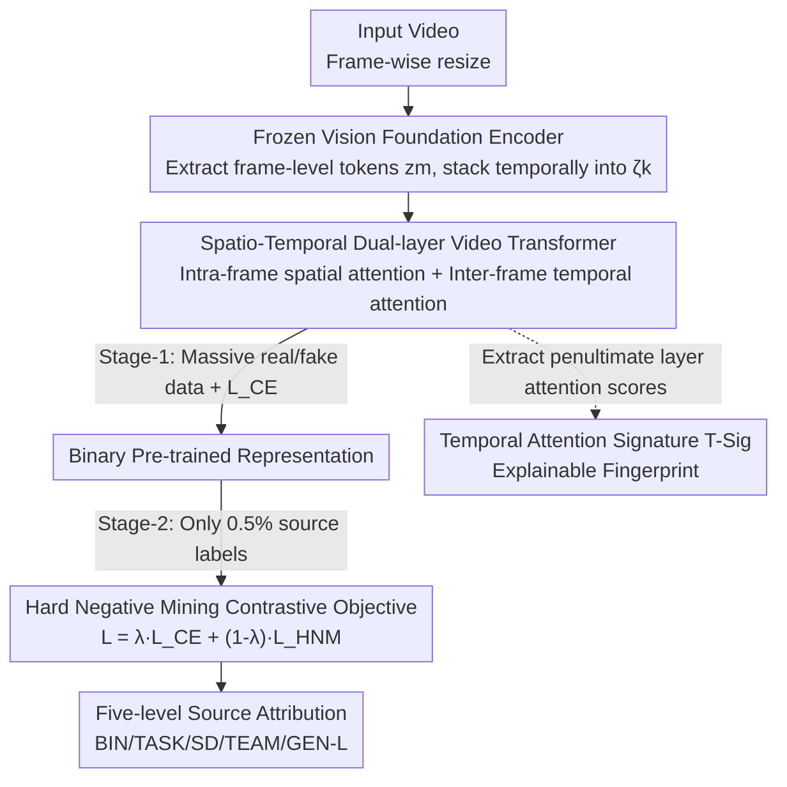

# SAGA: Source Attribution of Generative AI Videos

**Conference**: CVPR 2026  
**Paper**: [CVF Open Access](https://openaccess.thecvf.com/content/CVPR2026/html/Kundu_SAGA_Source_Attribution_of_Generative_AI_Videos_CVPR_2026_paper.html)  
**Code**: None (Project page: https://rohit-kundu.github.io/SAGA)  
**Area**: AI Security / Synthetic Video Forensics  
**Keywords**: Video Source Attribution, Synthetic Video Forensics, Data-efficient, Contrastive Learning, Explainability

## TL;DR
SAGA upgrades the question "is this video AI-generated?" to "which generator did it come from?". By utilizing frozen Vision Large Model features and a spatio-temporal dual-layer Transformer, combined with a two-stage strategy of "binary classification pre-training followed by contrastive adaptation with 0.5% labels," it achieves five-level source attribution from real/fake to specific models across 19 video generators. It further introduces Temporal Attention Signatures (T-Sig) to provide the first visual explanation of "why different generators are distinguishable."

## Background & Motivation
**Background**: Faced with increasingly realistic AI-generated videos, mainstream defenses are almost entirely focused on binary "real/fake detection" (e.g., DeMamba, UNITE), which only answer whether a video is synthetic.

**Limitations of Prior Work**: As generative models explode in number, knowing a video is "fake" is insufficient. Digital forensics, IP accountability, and targeted mitigation require knowing "which model or team produced it." Source attribution has previously been performed almost exclusively on **static images**; the only existing work on video attribution (Vahdati et al.) covers only 4 closed-source generators and performs only single-granularity attribution.

**Key Challenge**: Video attribution is significantly harder than image attribution due to three hurdles: ① **Temporal Fingerprints**: Videos leave unique inter-frame motion artifacts during generation that static analysis cannot capture; ② **Greater Model Diversity**: Video generation involves multiple stages like frame synthesis and motion modeling, making the attribution space far larger than images; ③ **Video Compression**: Codecs introduce complex spatio-temporal artifacts that can mask or destroy the subtle traces of the generator. Furthermore, while binary labels are abundant, **fine-grained source labels are extremely scarce**.

**Goal**: To build a large-scale video source attribution framework that is deployable in real-world scenarios, data-efficient, and **explainable**, decomposing "attribution" into multiple granularities.

**Key Insight**: The authors observe that different generators leave stable and unique "fingerprints" in **temporal attention**, which remain distinguishable even for generators unseen during training. Consequently, temporal self-attention is used as both a discriminative feature and an explanatory tool.

**Core Idea**: Utilize "frozen VLM features + spatio-temporal dual-layer Transformer" to capture temporal artifacts, and a "binary pre-training → contrastive adaptation" paradigm to transfer knowledge from massive real/fake labels to multi-class attribution with only 0.5% source labels.

## Method
Given a video $x_k$, the goal is to predict its source label $y_k$ from $n_c$ candidates: $n_c=2$ for binary classification and $n_c>2$ for source attribution. SAGA's mechanism is **not to train an $n_c$-class model from scratch**, but to first pre-train a binary video Transformer on abundant real/fake data (Stage-1, using $L_{CE}$ only), and then adapt it into a fine-grained attribution model (Stage-2, introducing a contrastive objective with only 0.5% source labels). Pre-training is performed once as a common starting point for all attribution granularities.

SAGA defines source attribution across **five granularities** (denoted as "-L"): BIN-L (Real/Synthetic), TASK-L (Real vs. T2V vs. I2V), SD-L (Distinguishing Stable Diffusion versions), TEAM-L (Attributing to development teams), and GEN-L (Specific generator ID). This hierarchy is crucial for practical forensics: if GEN-L gives low confidence for two similar generators, coarser levels like SD-L or TEAM-L can still provide valuable clues.

### Overall Architecture
The input is a video, resized frame-by-frame and fed into a **frozen vision foundation encoder** (trained on web-scale image-text data to provide domain-agnostic features and mitigate the domain gap in real deployments). Each frame yields token embeddings $z_m \in \mathbb{R}^{l_t \times d_t}$, stacked into a video-level representation $\zeta_k \in \mathbb{R}^{L \times l_t \times d_t}$ ($L$ is the number of frames). $\zeta_k$ enters a **trainable spatio-temporal dual-layer Transformer** $\theta$ to produce $\phi_k = \theta(\zeta_k)$. Stage-1 uses a classification head $\beta_1$ to map $\phi_k$ to real/fake using $L_{CE}$; Stage-2 adapts this pre-trained Transformer to $n_c$-class attribution with an additional hard negative mining contrastive loss $L_{HNM}$. Simultaneously, T-Sig is extracted from the attention scores of the penultimate temporal encoder block as an explainable fingerprint.

### Key Designs

**1. Two-stage "Pre-train—Adapt" Paradigm: Leveraging real/fake labels for scarce source labels**

This step addresses the scarcity of source labels. Instead of training a multi-class model directly, Stage-1 uses abundant real/fake data and $L_{CE}$ to pre-train a strong binary video Transformer, establishing a general representation for "synthetic traces." Stage-2 adapts this base to $n_c$-class source attribution using **only 0.5% of source labels per class**. The benefit is data efficiency: on the GEN-L task, the two-stage scheme achieves 94.99% mean accuracy with 0.5% labels, nearing the fully supervised performance (97.41%) using 100% of labels (approx. 1.6 million samples).

**2. Spatio-Temporal Hierarchical Video Transformer: Decoupling "Intra-frame Spatial" and "Inter-frame Temporal" Modeling**

To address temporal fingerprints missed by static analysis, $\theta$ processes $\zeta_k$ hierarchically: first, **Spatial Encoding** refines the $l_t$ tokens of each frame through a standard Transformer encoder block, followed by average pooling to obtain a single feature vector $\mathbb{R}^{d_t}$ per frame. Then, **Temporal Encoding** adds sinusoidal positional embeddings to the $L$ frame vectors to inject temporal order, passing them through $D=\text{depth}+1$ stacked encoder blocks. Each block captures increasingly complex temporal dynamics/inconsistencies. The frozen foundation model provides domain-agnostic frame features, while the trainable Transformer focuses exclusively on cross-frame motion artifacts.

**3. Hard Negative Mining (HNM) Contrastive Objective: Separating overlapping generator clusters**

In GEN-L tasks, many generator embeddings overlap significantly in t-SNE space. The authors find that **$L_{CE}$ alone is insufficient**, as it maximizes class separability in logit space but does not enforce geometric separation in embedding space. Standard semi-hard negative mining (semi-HNM) only selects negatives further than the positive but within a margin ($\|a-p\|_2^2 < \|a-n\|_2^2 < \|a-p\|_2^2+\alpha$). When clusters overlap heavily, many negatives are **hard negatives** ($\|a-n\|_2^2 \le \|a-p\|_2^2$) and are discarded by semi-HNM, resulting in insufficient gradient signals. HNM consistently selects the most difficult negative in the batch $n_{\text{hard}} = \arg\min_{j:\,y_j \ne y_i}\|a_i-n_j\|_2^2$, with gradients $\nabla_\theta L_{HNM} \propto 2(a-n_{\text{hard}}) - 2(a-p)$ that force the anchor away from the nearest heterogenous sample. The final loss is $L = \lambda \cdot L_{CE} + (1-\lambda)\cdot L_{HNM}$. The impact is clear: Accuracy on GEN-L rises from 70.31% (CE+semi-HNM) to 94.99% (CE+HNM).

**4. Temporal Attention Signature (T-Sig): Visualizing "Why It Is Distinguishable"**

This is SAGA's contribution to explainability, answering why different generators can be distinguished. Inter-frame attention scores from the **penultimate** encoder block are averaged and normalized across many videos from the same source to obtain the T-Sig. These signatures capture stable yet subtle temporal artifacts (characteristic motion dynamics, inter-frame inconsistencies). Key observations: ① T-Sigs are highly consistent for videos of the same source despite varying content, while being visually distinct across different sources; ② Even **completely unseen generators** produce unique and recognizable T-Sigs, indicating the model learns fundamental temporal properties of synthesis rather than just memorizing training patterns.

### Loss & Training
- Stage-1: $L_{CE}$ only, pre-training the binary video Transformer on massive real/fake videos.
- Stage-2: $L = \lambda \cdot L_{CE} + (1-\lambda)\cdot L_{HNM}$, adapting to $n_c$ classes with 0.5% source labels; triplet margin constraint is $\|a-p\|_2^2 + \alpha < \|a-n\|_2^2$.
- T-Sig is extracted during inference from attention scores of the penultimate temporal block, requiring no additional training objective.

## Key Experimental Results

Datasets: Training on DeMamba (19 generators + 1M real videos), cross-dataset evaluation on DVF (8 generators). Three training regimes compared: 1-stage@0.5% data, 1-stage@100% data, and Ours 2-stage@0.5% data.

### Main Results: Binary Classification (BIN-L) Cross-dataset Comparison

| Dataset | Method | Accuracy |
|---------|--------|----------|
| DeMamba (In-domain) | MINTIME-CLIP-B | 89.98% |
| DeMamba (In-domain) | FTCN-CLIP-B | 89.67% |
| DeMamba (In-domain) | **SAGA (BIN-L)** | **99.94%** |
| DVF (Cross-dataset) | DVF (In-domain training) | 92.00% |
| DVF (Cross-dataset) | HifiNet | 84.30% |
| DVF (Cross-dataset) | **SAGA (Trained only on DeMamba)** | **95.39%** |

SAGA's performance on DVF is a **pure cross-dataset** evaluation (trained only on DeMamba), yet it outperforms SOTA methods trained specifically on DVF, demonstrating strong generalization.

### Main Results: Multi-granularity Attribution

| Task Granularity | 1-stage@0.5% | 1-stage@100% | **2-stage@0.5% (Ours)** |
|------------------|-------------|--------------|--------------------------|
| TASK-L (Overall) | 82.41% | 99.96% | **98.20%** |
| SD-L (Overall)   | 59.77% | 98.35% | **98.49%** |
| TEAM-L (Overall) | 80.55% | 94.94% | **97.77%** |
| GEN-L (Overall)  | 24.55% | 97.41% | **94.99%** |

With 0.5% data, 1-stage training collapses on difficult classes (e.g., SD 1.4/1.5 in SD-L drop to 0%, OpenAI in TEAM-L drops to near 0%, and GEN-L drops to 24.55%). The 2-stage paradigm recovers these almost entirely, nearing or even exceeding the 100% data setting.

### Ablation Study: Impact of Loss Function on GEN-L

| Configuration (GEN-L, 0.5% data) | Overall Accuracy | Note |
|-----------------------------------|------------------|------|
| 1-stage, $L_{CE}$ only | 24.55% | CE collapses under low data |
| 1-stage, $L_{CE}+L_{HNM}$ | 65.80% | HNM significantly improves scores |
| 2-stage, $L_{CE}$ only | 55.13% | 2-stage alone is insufficient |
| **2-stage, $L_{CE}+L_{HNM}$ (Ours)** | **94.99%** | 2-stage + HNM synergy is optimal |

Comparison with semi-HNM: CE+semi-HNM achieves only 70.31% on GEN-L, while CE+HNM reaches 94.99%, confirming semi-HNM misses hard negatives in overlapping clusters.

### Key Findings
- **HNM is the decisive factor for fine-grained attribution**: Finer granularities (GEN-L) depend on geometric separation in embedding space. HNM forces clusters apart by selecting the hardest negatives.
- **Two-stage training provides low-data robustness**: While single-stage fails on difficult classes, two-stage recovers class-wise performance, showing binary pre-trained representations transfer well.
- **Coarse supervision facilitates fine-grained separation**: t-SNE shows that even when trained on TASK-L/SD-L/TEAM-L labels, the model naturally clusters individual generators and makes **unseen generators** (like Hotshot, Show 1) separable, suggesting potential for open-set attribution.

## Highlights & Insights
- **"Five-level Granularity" is a pragmatic forensic design**: When GEN-L is uncertain, retreating to TEAM-L or SD-L still provides useful clues, making it more robust than a single-output system.
- **Multi-purpose Attention Scores**: The same temporal self-attention serves as a discriminative feature and an averaged T-Sig fingerprint. This "discrimination as explanation" design is transferable to other forensics or anomaly detection tasks.
- **Leveraging abundant labels for scarce ones**: The two-stage paradigm essentially treats "real/fake detection" as a self-supervised pre-training for source attribution, a concept applicable to any hierarchical classification task with imbalanced label availability.

## Limitations & Future Work
- Dependency on the feature quality of frozen vision encoders; sensitivity to encoder choice is not deeply discussed in the main text.
- Some specific generators remain difficult in GEN-L (e.g., DynamiCrafter at 56.64%, Sora at 73.33% in Stage-2); confusion between similar architectures is not fully resolved.
- Although compression robustness is mentioned as a motivation, systematic compression experiments are limited in the main text.
- T-Sig is currently a qualitative visualization with a lack of quantitative interpretability metrics; open-set recognition is observed in t-SNE but lacks a formal protocol.

## Related Work & Insights
- **vs. Binary Video Detection (DeMamba, UNITE)**: These only answer "real/fake," SAGA extends this to multi-granularity "which model/team," while outperforming them in binary detection cross-dataset.
- **vs. Image Source Attribution (POSE, Wang et al.)**: These target static images and fail to handle video-specific temporal/motion artifacts; SAGA uses a dual-layer Transformer for inter-frame inconsistency.
- **vs. Vahdati et al.**: The latter only covers 4 closed generators at a single level; SAGA attribution covers 19 generators across five levels with explainable T-Sig analysis.

## Rating
- Novelty: ⭐⭐⭐⭐⭐ First large-scale, multi-granularity AI video source attribution framework; T-Sig provides a novel visual explanation.
- Experimental Thoroughness: ⭐⭐⭐⭐⭐ Comprehensive evaluation across 19 generators, 5 levels, in-domain/cross-dataset, and extensive loss/data ablations.
- Writing Quality: ⭐⭐⭐⭐ Motivation clearly outlined; Method description is solid, though many implementation details on compression are relegated to the supplement.
- Value: ⭐⭐⭐⭐⭐ Directly addresses real-world needs in generative AI governance and digital forensics with high data efficiency.

<!-- RELATED:START -->

## Related Papers

- [\[ICLR 2026\] Watermark-based Detection and Attribution of AI-Generated Content](../../ICLR2026/ai_safety/watermark-based_attribution_of_ai-generated_content.md)
- [\[CVPR 2026\] TokenTrace: Multi-Concept Attribution through Watermarked Token Recovery](tokentrace_multi-concept_attribution_through_watermarked_token_recovery.md)
- [\[CVPR 2026\] GVIS: Generative Vector Image Steganography](gvis_generative_vector_image_steganography.md)
- [\[CVPR 2026\] RunawayEvil: Jailbreaking the Image-to-Video Generative Models](runawayevil_jailbreaking_the_image-to-video_generative_models.md)
- [\[CVPR 2026\] Generative Adversarial Perturbations with Cross-paradigm Transferability on Localized Crowd Counting](generative_adversarial_perturbations_with_cross-paradigm_transferability_on_loca.md)

<!-- RELATED:END -->
