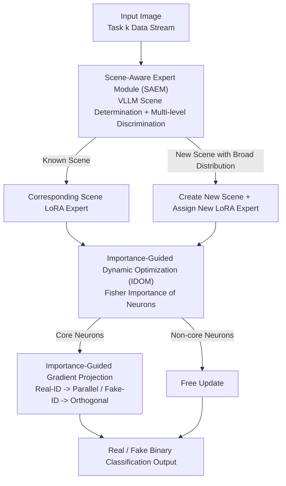

# SAIDO: Scene-Aware and Importance-Guided Dynamic Optimization for Generalizable AI-Generated Image Detection

**Conference**: CVPR 2026  
**Paper**: [CVF Open Access](https://openaccess.thecvf.com/content/CVPR2026/html/Hu_SAIDO_Generalizable_Detection_of_AI-Generated_Images_via_Scene-Aware_and_Importance-Guided_CVPR_2026_paper.html)  
**Code**: None  
**Area**: AI Security / AI-Generated Image Detection  
**Keywords**: AIGI Detection, Continual Learning, Catastrophic Forgetting, Gradient Projection, LoRA Experts

## TL;DR
SAIDO frames AI-generated image detection as a replay-free continual learning framework: a Vision-Large Language Model (VLLM) routes images to scene-specific LoRA experts based on scene awareness, while a "neuron-level" importance-guided gradient projection based on Fisher information harmonizes plasticity and stability. This reduces the detection error rate by 44.22% in the continual learning protocol and improves open-set accuracy by 9.47%.

## Background & Motivation
**Background**: The mainstream approach for AI-Generated Image (AIGI) detection involves data-driven discriminative models that learn differences between real and generated images from cues such as frequency distribution, texture structure, and semantic consistency to draw decision boundaries in high-dimensional feature spaces. These methods perform well under closed-set conditions (same distribution for training and testing).

**Limitations of Prior Work**: Generative models iterate extremely fast (from ProGAN to Stable Diffusion, and then to Midjourney/FLUX), leading to increasingly large distribution gaps between different generative domains. Detectors encounter **catastrophic forgetting** when adapting to new generators, causing performance on old generative methods to collapse. Existing continual learning detection schemes mostly rely on **replaying** historical samples to mitigate forgetting—whereas in real-world scenarios, storing and replaying old samples is often infeasible. Furthermore, these methods exhibit poor scalability and weak generalization when facing diverse scene content.

**Key Challenge**: There is a trade-off between plasticity (learning new generators) and stability (remembering old generators) in continual learning. Although existing gradient projection methods (e.g., RegO) do not require a replay buffer, they typically use a coarse-grained threshold to partition neurons, failing to achieve fine-grained control over "which neurons should preserve old knowledge and which should learn new information." Consequently, neither stability nor plasticity is optimized. Additionally, existing methods cram all scene content into a single detector, where scene domain shifts can directly degrade performance.

**Goal**: To achieve efficient adaptation and strong generalization to new generators and new scenes under the realistic constraints of not relying on replay and handling multiple generative methods and diverse scene domains.

**Key Insight**: The authors decouple "scene generalization" and "continual learning forgetting" into two orthogonal problems. For the scene dimension, **expert routing** is employed (different scenes managed separately). For the generator dimension, **neuron-level gradient regulation** is utilized (deciding whether to preserve or learn at the level of individual neurons).

**Core Idea**: A VLLM is used to dynamically allocate LoRA experts to accommodate scene drift. Subsequently, Fisher information is used to categorize neurons as "core" or "non-core," applying direction-adaptive gradient projection to core neurons to achieve a dynamic balance of "stability-plasticity" at the neuron granularity.

## Method

### Overall Architecture
SAIDO utilizes a frozen CLIP ViT-L/14 as the backbone, connected by two modules: the **Scene-Aware Expert Module (SAEM)**, which is responsible for "routing images to the correct experts," and the **Importance-Guided Dynamic Optimization Mechanism (IDOM)**, which ensures that these experts "learn the new without forgetting the old" during training.

An input image first enters SAEM: the VLLM determines which scene it belongs to (animals, food, vehicles, architecture, etc.) and routes it to the corresponding scene-specific LoRA expert. This expert performs real/fake binary classification on top of the CLIP backbone. When a completely new scene is encountered, SAEM confirms whether the scene is sufficiently prevalent in reality through multi-level discrimination before creating a new scene label and allocating a new LoRA expert. The training (LoRA update) step is handled by IDOM: it calculates the importance of each neuron for "identifying real" and "identifying fake" using the Fisher information matrix, categorizes neurons into core and non-core, and applies direction-adaptive gradient projection to core neurons (protecting old knowledge / learning new patterns), while non-core neurons are updated freely.

### Key Designs

**1. SAEM: Handling Scene Drift with VLLM-routed LoRA Experts**

Limitations of Prior Work: Cramming all scene content into one detector causes distribution differences (e.g., between animal, food, and vehicle images) to be mistaken as "real/fake signals," leading to performance collapse under scene domain shift. Furthermore, scenes emerge dynamically in the open world, making fixed manual classifiers insufficient. SAEM employs VLLM for scene awareness: for an input $x$, it runs $p=\text{VLLM}(x)$ to obtain a confidence distribution over all known scenes $p=[p_1,\dots,p_N,p_{N+1}]\in\mathbb{R}^{N+1}$, where $p_{N+1}$ represents the confidence of "this is a new scene." The image is routed to the LoRA expert $\phi_n\leftarrow\max[p_1,\dots,p_{N+1}]$ corresponding to the maximum confidence, resulting in the prediction $\hat{y}=f_{\phi+\phi_n}(x)$, where each expert learns forgery traces only within its own scene.

The inclusion of a new scene is not immediate; it undergoes **multi-level discrimination**: first checking if the new scene confidence exceeds a threshold, and then verifying if "this scene's distribution in the real world is sufficiently broad." Only after passing both stages is a new scene label officially created and a new LoRA expert $\phi_{N+1}$ assigned. To inject scene/content information into the high-level semantic space, the authors design **Scene-Aware Prompts (SAP)**: $l_\text{SAP}=[l_\text{content};l_\text{scene};l_\text{common}]$, where $l_\text{content}$ is the image content description generated by the VLLM, $l_\text{scene}$ is the scene text, and $l_\text{common}$ uses public terms like "real"/"fake" to distinguish real and fake features in the semantic space. During training, the CLIP text encoder extracts feature $u$ from $l_\text{SAP}$, and the image encoder extracts feature $v$, followed by a bidirectional contrastive loss $\mathcal{L}_\text{contrastive}=(\mathcal{L}_{v\to u}+\mathcal{L}_{u\to v})/2$, supplemented by a cross-entropy classification loss. The total loss is $\mathcal{L}_\text{loss}=\mathcal{L}_\text{contrastive}+\lambda\mathcal{L}_\text{CE}$. An interesting observation is that across multiple real datasets, the set of scenes **naturally converges to stability**, indicating that "building experts by scene" captures the structure of generalization without an infinite expansion of the number of experts.

**2. IDOM: Deciding Preservation vs. Learning at the Neuron Level**

Even with scene experts, experts themselves can experience forgetting as new generators emerge within the same scene. Existing gradient projection methods like RegO use a single threshold for coarse binary partitioning of neurons, lacking fine-grained control and limiting both stability and plasticity. The core of IDOM is pushing the "preservation vs. learning" decision down to the level of **individual neurons + real/fake categories**.

Specifically, the Fisher information matrix is used to quantify neuron importance: $\mathbf{F}_k^{(c)}=\mathbb{E}[g_k^{(c)}(g_k^{(c)})^\top|_{\theta=\theta_k^*}]$, where $c\in\{0,1\}$ distinguishes real (0) and fake (1) samples, and $\theta_k^*$ is the optimal parameter after training task $k$. Neuron importance $I_k^{(c)}$ is aggregated via scene normalization, and core neurons are selected using an $\alpha$-quantile function: $M_k^{(c)}[i][j]=1$ if $I_k^{(c)}[i][j]\ge Q_\alpha(I_k^{(c)})$, otherwise 0. From the second task onward, historical $M$ are aggregated into a composite mask $\overline{M}$.

The key insight is the **asymmetry in the stability of real and fake features**: real image features are compact and stable, while fake image features change drastically with generative methods and are most prone to being forgotten. Thus, **direction-adaptive** projection is applied to core neurons: for neurons important for "identifying real," the current gradient $g$ is projected onto the old gradient $\hat{g}$ direction to obtain the parallel component $g_p=\frac{g^\top\hat{g}}{\|\hat{g}\|^2}\cdot\hat{g}$ (strict preservation); for neurons important for "identifying fake," the orthogonal component $g_o=g-g_p$ is taken (learning the new without interfering with old representations). A control factor $q_0=\frac{\tilde{I}_k^{(0)}}{\tilde{I}_k^{(0)}+\tilde{I}_k^{(1)}}$ and $q_1=1-q_0$ calculated from the ratio of historical importance adaptively mixes the two directions. Importance scaling $u_k=\frac{1}{1+e\cdot\bar{I}_i$ is used to suppress drastic updates to high-importance neurons. The final gradient for core neurons is $g_A=u_k\cdot(q_0 g_p+q_1 g_o)\odot\mathbb{I}_{\overline{M}=1}$, while non-core neurons are updated freely as $g_B=g\odot\mathbb{I}_{\overline{M}=0}$, with the overall update $w=g_A+g_B$. This mechanism allows "protecting real-identification capability and flexibly updating fake-identification capability" to occur simultaneously at the neuron scale, suppressing forgetting without requiring replay.

## Key Experimental Results

Datasets: Continual Learning (Protocol 1) sequentially learns 9 generators {ADM, GLIDE, SAGAN, ProGAN, BigGAN, Wukong, SD1.5, VQDM, Midjourney-V5}. Open World (Protocol 2) tests generalization on 6 unseen advanced generators {StyleGAN-xl, R3GAN, FLUX1-dev, Midjourney-V6, SD3, Imagen3}. Metrics: AA (Average Accuracy, higher is more stable), AF (Average Forgetting, lower is better), New.ACC (Current task accuracy, reflecting plasticity). Backbone: CLIP ViT-L/14, SGD (lr 0.01, 10 epochs), $\alpha=0.75$, $\lambda=1.0$, $e=1.0$.

### Main Results (Protocol 1: Continual Learning, after learning all 9 tasks)

| Method | Continual Learning | Replay | AA(↑) | AF(↓) | New.ACC(↑) |
|------|:------:|:----:|:-----:|:-----:|:----------:|
| CLIP+LoRA (Upper Bound) | × | × | 89.63 | 11.17 | 99.56 |
| Universe (CVPR'23) | × | — | 80.59 | 14.46 | 93.45 |
| NPR (CVPR'24) | × | — | 81.92 | 15.17 | 95.40 |
| AIDE (ICLR'25) | × | — | 87.38 | 12.07 | 96.47 |
| EWC (PNAS'17) | ✓ | × | 91.01 | 9.14 | 97.07 |
| RegO (AAAI'25) | ✓ | × | 86.34 | 11.30 | 90.04 |
| Tang et al. (TIFS'25) | ✓ | ✓ | 92.13 | 6.63 | 92.88 |
| **Ours (SAIDO)** | ✓ | **×** | **95.61** | **3.94** | **97.27** |

Despite **not using a replay buffer**, SAIDO's AA/AF comprehensively exceeds Tang et al., which uses replay. Compared to the second-best method, the detection error rate relatively decreased by 44.22%, and the average forgetting rate relatively decreased by 40.57%, while a New.ACC of 97.27% indicates no sacrifice in plasticity.

In the Open World (Protocol 2, 6 unseen generators), SAIDO achieved an average accuracy of **91.35%**, which is **9.47%** higher than the second-best, Tang et al. (81.88%). The advantage is particularly evident on difficult samples like R3GAN (97.83) and FLUX1-dev (88.10).

### Ablation Study (Protocol 1, viewing AA of the last task Midjourney-V5)

| Configuration | Midjourney-V5 AA | Description |
|------|:----------------:|------|
| CLIP+SAEM | 88.85 | Scene experts only, no IDOM, weak forgetting control |
| CLIP+SAEM+RAO | 92.89 | Experts + RegO's gradient strategy, still inferior to IDOM |
| CLIP+IDOM | 94.81 | IDOM only (no scene routing), already strong |
| **Ours (SAEM+IDOM)** | **95.61** | Optimal full model |

### Key Findings
- **IDOM is the primary driver for forgetting control**: Replacing the gradient strategy from RegO's RAO with IDOM (CLIP+SAEM+RAO → SAIDO) increased the final task AA from 92.89 to 95.61, indicating that neuron-level direction-adaptive projection is superior to coarse threshold partitioning.
- **The benefits of SAEM depend on the intensity of scene drift**: When the scene distribution across tasks is concentrated and drift is mild, a single LoRA consuming more data may perform slightly better; hence, CLIP+IDOM also achieved optimality on some tasks. The value of SAEM is more prominent in open-world scenarios where scene domains are truly dispersed.
- **Robustness** (Table 4): Under three degradations (JPEG compression, Gaussian noise, and up/down-sampling), SAIDO performed best overall in average accuracy (AA1 88.79 / AA2 81.40) on both known and unseen generators, suggesting the features it learns are more stable against common degradations.

## Highlights & Insights
- **"Asymmetry in real-fake feature stability" is a reusable prior**: Real image features are compact and stable, whereas fake image features change drastically with generators. Based on this, applying parallel projection protection for "real-identifying" neurons and orthogonal updates for learning in "fake-identifying" neurons is more rational than treating all parameters identically. This idea can be migrated to any continual learning scenario where "old concepts are stable and new concepts are highly variable."
- **Using VLLM as a "router" rather than a classifier**: Letting the large model handle routing samples to lightweight experts allows the system to leverage the open-world semantics of the VLLM while delegating detection to small, continuously trainable LoRAs. This is a low-cost paradigm for utilizing foundation models.
- **The natural convergence of the scene set** is a compelling empirical observation: it suggests that the scene diversity of real-world images is bounded, meaning the "scene-based expert" approach won't expand indefinitely, making the solution engineering-viable.
- **Replay-free** is a key selling point for practical utility—suppressing forgetting without storing historical samples aligns with real-world deployment constraints involving privacy and storage.

## Limitations & Future Work
- Strong dependency on VLLM scene determination quality: scene misclassification would route images to the wrong expert. The main text does not provide a sufficient analysis of VLLM selection or the impact of scene misclassification on end-to-end performance (authors claim it is discussed in the supplementary material; ⚠️ refer to the original text).
- The number of experts grows with scenes. Although "broad distribution" acts as a gate, the scalability upper bound for the number of experts and inference routing overhead in extremely long-tail open worlds remains to be verified.
- Ablations show that when scene drift is mild, the benefit of SAEM is limited or even inferior to a single LoRA, suggesting the framework's advantage zone is biased toward "diverse and dispersed scene domains" and may be over-engineered for narrow-domain tasks.
- Several core formulas are from OCR text (Eq. 5/7/13, etc.); symbol details should be verified against the original paper or supplementary materials.

## Related Work & Insights
- **vs. RegO (AAAI'25, Gradient Projection Continual Learning)**: Both are based on gradient projection and are replay-free, but RegO uses a single threshold to coarsely partition neurons, lacking fine-grained regulation. SAIDO’s IDOM refines importance to "neuron × real/fake" and applies direction-adaptive projection based on real-fake stability differences, resulting in better stability and plasticity (IDOM comprehensively outperformed RAO in ablations).
- **vs. Tang et al. (TIFS'25, Content-Agnostic Adapter)**: Tang uses replay + content-agnostic adapters. SAIDO is replay-free and does the opposite—rather than stripping content/scene information, it explicitly routes experts by scene to accommodate scene drift, resulting in a 9.47% higher open-world generalization.
- **vs. DFIL / Replay-based methods**: Replay requires storing and replaying historical samples, which is often infeasible in reality. SAIDO replaces replay with neuron-level gradient regulation, making it more suitable for deployment constraints involving privacy and storage.

## Rating
- Novelty: ⭐⭐⭐⭐ Combining "scene expert routing" with "neuron-level real-fake differentiated gradient projection" for sustained AIGI detection is a novel approach.
- Experimental Thoroughness: ⭐⭐⭐⭐ Two protocols + robustness + ablations + multiple sequences provide comprehensive coverage; VLLM selection sensitivity is addressed in the supplement.
- Writing Quality: ⭐⭐⭐⭐ Motivation and methodology are logically clear; although there are many formulas, the narrative is coherent.
- Value: ⭐⭐⭐⭐ Replay-free operation and strong open-world generalization are practically significant for real-world AIGI detection deployment.

<!-- RELATED:START -->

## Related Papers

- [\[CVPR 2026\] Detect Any AI-Counterfeited Text Image](detect_any_ai-counterfeited_text_image.md)
- [\[CVPR 2026\] SAGA: Source Attribution of Generative AI Videos](saga_source_attribution_of_generative_ai_videos.md)
- [\[CVPR 2026\] Skyra: AI-Generated Video Detection via Grounded Artifact Reasoning](skyra_ai-generated_video_detection_via_grounded_artifact_reasoning.md)
- [\[CVPR 2026\] Detecting Compressed AI-Generated Images via Phase Spectrum Robustness](detecting_compressed_ai-generated_images_via_phase_spectrum_robustness.md)
- [\[CVPR 2026\] Zero-shot Detection of AI-Generated Image via RAW-RGB Alignment](zero-shot_detection_of_ai-generated_image_via_raw-rgb_alignment.md)

<!-- RELATED:END -->
