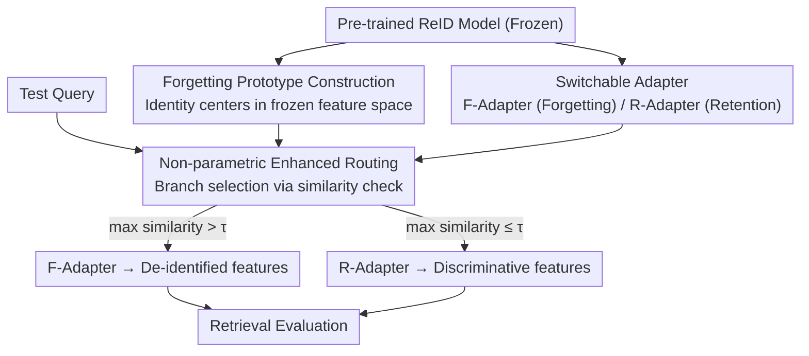

# SANER: Switchable Adapter with Non-parametric Enhanced Routing for Person De-Reidentification

**Conference**: CVPR 2026  
**Paper**: [CVF Open Access](https://openaccess.thecvf.com/content/CVPR2026/html/Liu_SANER_Switchable_Adapter_with_Non-parametric_Enhanced_Routing_for_Person_De-Reidentification_CVPR_2026_paper.html)  
**Code**: https://github.com/Yimin-Liu/SANER  
**Area**: AI Security (Privacy Protection / Machine Unlearning)  
**Keywords**: Person De-Reidentification, Machine Unlearning, Privacy Protection, LoRA Adapter, Test-time Routing

## TL;DR
SANER decouples the task of "selectively forgetting specific pedestrians" (De-ReID) from contradictory optimization in a single feature space into two independent low-rank adapters (forgetting / retention). It then utilizes a non-parametric test-time routing algorithm to determine the processing branch based on the similarity between queries and prototypes, effectively "forgetting" target identities with minimal impact on the identification accuracy of others.

## Background & Motivation
**Background**: Person Re-identification (ReID) is mature for cross-camera retrieval but relies on sensitive biometric features like faces and appearance, posing privacy and ethical risks. This has led to the paradigm of Person De-Reidentification (De-ReID), which draws on machine unlearning to actively "forget" specified individuals while maintaining high retrieval precision for other identities.

**Limitations of Prior Work**: Existing De-ReID methods (e.g., VIS) jointly optimize "forgetting" and "retention" targets within the **same feature space**. These objectives are inherently contradictory: suppressing the discriminability of forgotten identities often pollutes the representations of retained identities (especially novel queries unseen during training), leading to unintended performance degradation—a factor largely overlooked in previous research.

**Key Challenge**: Satisfying the opposing constraints of "unidentifiability for identity A" and "high identifiability for identity B" in a shared feature space inevitably results in a trade-off. A natural solution is to **decouple** the pre-trained feature space into separate "forgetting" and "retention" subspaces for independent optimization.

**Goal**: (1) Design a mechanism to decouple feature spaces so that forgetting and retention do not interfere with each other; (2) Address the new challenge introduced by decoupling—determining whether a novel query at test time should routed to the forgetting or retention space (the "test-time routing problem").

**Key Insight**: Utilize two independent Low-Rank Adapters (LoRA) to carry the two subspaces, achieving both decoupling and parameter efficiency. For routing, instead of training an overfit-prone classifier, the method reverts to the original pre-trained feature space and uses the similarity between the query and forgetting prototypes for non-parametric judgment.

**Core Idea**: **"Decoupled Feature Spaces + Non-parametric Test-time Routing"**—using a Switchable Adapter (SA) to split contradictory targets into two branches and Non-parametric Enhanced Routing (NER) to select the correct branch at test time without additional training.

## Method

### Overall Architecture
SANER consists of a training phase and a testing phase. In the training phase, each sample is assigned a routing variable $R\in\{0,1\}$ indicating whether it is a forgotten or retained sample. It is then sent to the corresponding branch in the Switchable Adapter: forgotten samples enter the F-Adapter (optimized with forgetting loss $L_f$ to erase identity semantics), and retained samples enter the R-Adapter (optimized with retention loss $L_r$ to maintain discriminability). Simultaneously, the frozen pre-trained model calculates prototypes for each forgotten identity in the original feature space. In the testing phase, the query first extracts original features using the frozen pre-trained model. NER compares it with the forgotten prototypes to decide the routing branch, and the selected branch extracts the final features for retrieval. The entire routing process occurs in the training-independent pre-trained feature space, bypassing the training-test gap.

### Key Designs

**1. Switchable Adapter: Decoupling Forgetting and Retention into Two Subspaces using LoRA**

Addressing the "interference in a single space" issue, SA uses two independent LoRA modules to handle mutually exclusive objectives. Standard LoRA expresses the update of pre-trained weights $W$ as a low-rank residual. From a feature mapping perspective: $f^*=W^*x=Wx+(BA)x=f+\Delta f$. SANER builds two branches based on this: the F-Adapter maps input to a "forgetting space" $f_f=f+B_fA_f x$ to suppress identity semantics, while the R-Adapter maps input to a "retention space" $f_r=f+B_rA_r x$ to preserve discriminative cues. The joint loss during training is $L(x,y,R)=(1-R)L_r(f_r,y)+RL_f(f_f,y)$. This ensures opposite goals are optimized in their respective subspaces, preventing the forgetting loss from "leaking" and damaging retained identity representations. The low-rank design ($r\ll d$) ensures minimal computational overhead.

**2. Non-parametric Enhanced Routing: Training-free Branch Selection at Test Time**

Decoupling introduces a challenge: the status (forgotten vs. retained) of a novel test query is unknown. While a classifier seems intuitive, it is prone to overfitting when forgotten identities are sparse and suffers from the training-test gap. NER adopts a **non-parametric** approach: during training, prototypes for each forgotten identity $i$ are computed as $p_f^i=\frac{1}{|D_f^i|}\sum_{x\in D_f^i}f_p(x)$ using the frozen model. At test time, the query feature $q=f_p(x)$ is compared with all forgotten prototypes via cosine similarity $s_i=\frac{q\cdot p_f^i}{\|q\|\|p_f^i\|}$. Routing is decided by the maximum similarity: $\hat{y}=1$ (F-Adapter) if $\max(s)>\tau$, otherwise $\hat{y}=0$ (R-Adapter). The threshold $\tau$ is determined by an **adaptive minimum distance strategy**, taking the maximum observed similarity between different identity prototypes. This non-parametric approach avoids the training-test gap and remains stable regardless of the number of forgotten identities.

### Loss & Training
The backbone is ViT-B, with SA connected in parallel to the attention projections and the two MLP layers of each Transformer block. The optimizer is AdamW with an initial learning rate of $3\times10^{-4}$ and zero weight decay. Batch sizes are 48 for retained samples and 32 for forgotten samples. The losses $L_f$ and $L_r$ follow the De-ReID objectives of VIS (refer to original paper for details).

## Key Experimental Results

### Main Results
Evaluation metrics include R-1$_T$ (Rank-1 for forgotten identities, lower is better), R-1$_O$ (Rank-1 for accessible identities, higher is better), and H-Mean (Harmonic Mean of forgetting effectiveness and retention accuracy).

Market-1501 (Comparison with SOTA):

| Method | $M_T$ | R-1$_T$ ↓ | R-1$_O$ ↑ | H-Mean ↑ |
|--------|-------|-----------|-----------|----------|
| VIS    | 25    | 10.7      | 91.1      | 84.4     |
| **Ours**| 25    | **7.3**   | **95.7**  | **88.3** |
| VIS    | 50    | 12.0      | 84.4      | 83.2     |
| **Ours**| 50    | **6.7**   | **95.3**  | **91.1** |

MSMT17 (Large-scale results):

| Method | $M_T$ | R-1$_T$ ↓ | R-1$_O$ ↑ | H-Mean ↑ |
|--------|-------|-----------|-----------|----------|
| VIS    | 25    | 4.6       | 77.0      | 76.3     |
| **Ours**| 25    | **4.6**   | **84.9**  | **80.0** |
| VIS    | 100   | 13.1      | 67.1      | 66.7     |
| **Ours**| 100   | **4.3**   | **82.3**  | **78.6** |

Ours maintains extremely low R-1$_T$ (thorough forgetting) while achieving significantly higher R-1$_O$ than VIS (95.3 vs 84.4 on Market-1501 with $M_T$=50). The advantage becomes more pronounced as the number of forgotten identities $M_T$ increases.

### Ablation Study
Ablation on components using MSMT17 ($M_T$=25):

| Config | Train | Test | R-1$_T$ ↓ | R-1$_O$ ↑ | H-Mean ↑ |
|--------|-------|------|-----------|-----------|----------|
| w/o SA (Single space, =VIS) | — | — | 4.6 | 77.0 | 76.3 |
| w/ SA | GT | Classifier | 5.3 | 84.0 | 79.2 |
| w/ SA | GT | Prototype (NER) | 4.6 | 84.9 | 80.0 |
| w/ SA | Classifier | Classifier | 4.1 | 77.7 | 76.9 |
| w/ SA | Prototype | Prototype | 4.2 | 78.8 | 77.4 |

### Key Findings
- **SA Decoupling is the primary performance driver**: Moving from w/o SA to w/ SA improves R-1$_O$ from 77.0 to 84+, proving that separating contradictory targets significantly mitigates the pollution of retained identity representations.
- **Non-parametric routing outperforms classifiers**: Utilizing prototypes (NER) for test-time routing yields higher and more stable R-1$_O$/H-Mean compared to learned classifiers.
- **Robustness to scale**: SANER shows minimal decay in R-1$_O$ and H-Mean as $M_T$ increases from 25 to 100, indicating robustness to the pressure of forgetting more identities.

## Highlights & Insights
- **"Physical Isolation" of contradictory goals**: Using two independent LoRAs to carry forgetting and retention targets prevents the fundamental conflict of "suppressing one while harming another." This decoupling approach is transferable to any task requiring simultaneous satisfaction of opposing constraints.
- **Bypassing the training-test gap via non-parametric routing**: Routing is performed via prototype similarity in a frozen feature space, requiring no new parameters and offering natural resistance to overfitting.
- **Simultaneous optimization of privacy and utility**: While traditional privacy-preserving ReID often sacrifices retrieval accuracy, SANER enables the coexistence of extremely low R-1$_T$ and high R-1$_O$.

## Limitations & Future Work
- **Reliance on reliable identity prototypes**: NER's performance depends on prototype quality; it may fail if samples for forgotten identities are extremely scarce or if the pre-trained space lacks discriminability.
- **Hard-thresholding logic**: The binary decision based on $\max(s)$ and $\tau$ might misclassify ambiguous queries at the forgetting/retention boundary.
- **Scope of verification**: Evaluated primarily on Market-1501 and MSMT17 with ViT-B; effectiveness on larger galleries, cross-domain scenarios, or open-set unlearning for non-pedestrians remains to be fully explored.
- **Weight storage**: Two sets of LoRA weights must be stored for each block, though only one is activated during inference.

## Related Work & Insights
- **vs. VIS (Variation-Informed Identity Shifting)**: VIS optimizes in a single space and depends on accurate variation modeling; SANER eliminates target interference through subspace decoupling.
- **vs. Machine Unlearning (BS, SCRUB, NoMUS)**: While these focus on classification or class-level unlearning, De-ReID is an instance-level, open-set retrieval unlearning task in a large embedding space, for which SANER's routing is specifically designed.
- **vs. Standard LoRA/PEFT**: Standard PEFT methods pursuit efficiency for a single task; SANER repurposes LoRA for "target isolation" rather than just parameter-efficient fine-tuning.

## Rating
- Novelty: ⭐⭐⭐⭐⭐ Decoupled spaces + non-parametric routing provides a new paradigm for De-ReID.
- Experimental Thoroughness: ⭐⭐⭐⭐ Solid results on standard benchmarks, though backbone and data variety could be broader.
- Writing Quality: ⭐⭐⭐⭐ Clear progression from motivation to design and ablation.
- Value: ⭐⭐⭐⭐⭐ High practical value for privacy compliance in surveillance systems.

<!-- RELATED:START -->

<!-- RELATED:END -->

## Related Papers

- [\[CVPR 2026\] DFD-HR: Generalizable Deepfake Detection via Hierarchical Routing Learning](dfd-hr_generalizable_deepfake_detection_via_hierarchical_routing_learning.md)
- [\[CVPR 2026\] IrisFP: Adversarial-Example-based Model Fingerprinting with Enhanced Uniqueness and Robustness](irisfp_adversarial-example-based_model_fingerprinting_with_enhanced_uniqueness_a.md)
- [\[CVPR 2026\] R$^2$TUA: Reconstruction-residual Based Targeted and Untargeted Attack Against Text-Image Person Re-Identification](r2tua_reconstruction-residual_based_targeted_and_untargeted_attack_against_text-.md)
- [\[CVPR 2026\] FedMOP: Achieving Enhanced Privacy and Performance in Federated Learning via Momentum Orthogonal Projection](fedmop_achieving_enhanced_privacy_and_performance_in_federated_learning_via_mome.md)
- [\[CVPR 2026\] Federated Active Learning Under Extreme Non-IID and Global Class Imbalance](federated_active_learning_extreme_noniid.md)

<!-- RELATED:END -->
