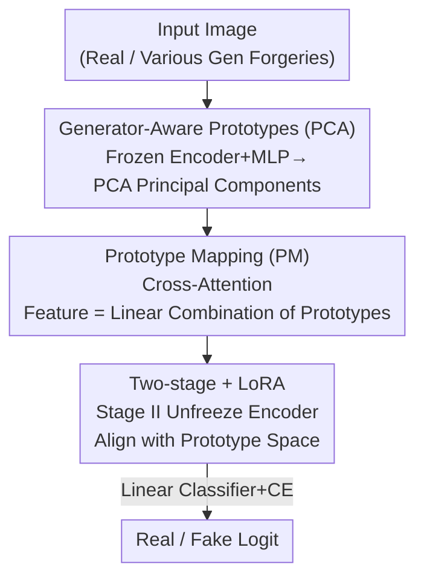

# Scaling Up AI-Generated Image Detection with Generator-Aware Prototypes

**Conference**: CVPR 2026  
**Paper**: [CVF Open Access](https://openaccess.thecvf.com/content/CVPR2026/html/Qin_Scaling_Up_AI-Generated_Image_Detection_with_Generator_Aware_Prototypes_CVPR_2026_paper.html)  
**Code**: https://github.com/UltraCapture/GAPL  
**Area**: AI Security / Generated Image Detection  
**Keywords**: AIGI detection, prototype learning, data heterogeneity, LoRA, scalability

## TL;DR
The authors identify a paradox where training AIGI detectors with an increasing number of generators leads to performance improvement followed by a decline ("Benefit then Conflict"). This is attributed to excessive heterogeneity in generated image features and the capacity bottleneck of frozen encoders. They propose GAPL, which distills thousands of generators into a small set of "generator-aware prototypes" using PCA, reorganizes arbitrary image features into this low-variance prototype space via cross-attention, and employs two-stage LoRA fine-tuning. It achieves a 90.4% mean accuracy across 6 benchmarks, outperforming the previous SOTA by 3.5%.

## Background & Motivation
**Background**: The mainstream approach for general AIGI (AI-Generated Image) detection is "Train on one → Train on many": aggregating synthetic images from various generators into a large training set, expecting the detector to generalize after exposure to diverse data. The community has pushed data scaling from single generators to hundreds, and recently to the level of thousands in Community-Forensics.

**Limitations of Prior Work**: The authors make a counter-intuitive observation: **as the variety of generators used for training continues to increase, detector performance does not rise monotonically but benefits initially and then deteriorates** (termed the "Benefit then Conflict" dilemma). This suggests that blind expansion of source diversity suffers from structural flaws that cannot be resolved simply by "feeding more data."

**Key Challenge**: Using controlled datasets where the image count is constant but the number of generators varies from 1 to 8, the authors pinpoint two root causes. The first is **data-level heterogeneity**: different generators have varying abilities to fit the real distribution. Decomposition via the law of total variance shows that synthetic image covariance includes an extra "cross-generator variance" term that expands with diversity, leading to overlapping real/synthetic feature distributions and distorted decision boundaries (measured by the trace of the scatter matrix $\mathrm{tr}(S)$, generated image variance increases significantly with generator count while real image variance remains stable). The second is **model-level bottleneck**: many SOTA detectors rely on frozen pre-trained encoders (e.g., CLIP). While the CLIP semantic prior aids generalization for single sources, these priors conflict in the face of heterogeneous data. 可分性 measured by the Fisher ratio of LDA shows that end-to-end trained detectors exhibit significantly higher Fisher ratios and accuracy than "frozen encoder + head" schemes in scaling settings, indicating that frozen encoders set a performance ceiling.

**Core Idea**: Instead of treating thousands of generators equally, the authors follow the principle of **"Turn Thousands into a Few"**. They learn a small set of "generator-aware prototypes" representing typical forgery patterns and represent arbitrary image features as linear combinations of these prototypes. This compresses the high-variance heterogeneous feature space into a low-variance compact space. Simultaneously, they abandon the frozen encoder in favor of LoRA to allow the encoder to capture forgery cues.

## Method

### Overall Architecture
The input to GAPL (Generator-Aware Prototype Learning) is an image, and the output is a binary classification logit. The pipeline consists of two serial stages: **Stage I establishes a "forgery-aware subspace" on a frozen encoder and extracts generator-aware prototypes via PCA; Stage II unfreezes the encoder using LoRA and maps image features to the prototype space through cross-attention before classification**. Intuitively, Stage I is responsible for "finding a set of axes (prototypes) that summarize all forgery patterns," and Stage II is for "teaching the encoder to project any image from a new generator onto these axes."

### Key Designs

**1. Generator-Aware Prototypes (PCA Extraction): Compressing thousands of forgery patterns into dozens of "principal axes"**

To address "data-level heterogeneity"—where feature variance explodes with the number of generators—the authors select a few **typical** generators as benchmarks rather than force-fitting all generators. Specifically in Stage I: a prototype set is formed using $M=2000$ images each from ProGAN (GAN representative), Stable Diffusion v1.4 (Latent Diffusion representative), and Midjourney (Commercial API representative), combined with real images. The encoder $\phi(\cdot)$ is frozen, and an MLP is trained for binary classification ($f=\phi(x)$, $\hat y=\mathrm{MLP}(\mathrm{Normalize}(f))$) to grant the feature space basic "forgery awareness." Forgery-related embeddings $F_f, F_r$ from the MLP's intermediate layers are extracted, and PCA is performed on the real and fake subsets separately. The top $N/2$ principal components are concatenated to form the prototype matrix:

$$C=\tfrac{1}{3M-1}(F_f-\mathbf{1}\bar\mu)^\top(F_f-\mathbf{1}\bar\mu),\quad C v_i=\lambda_i v_i,\quad P=[P_r;P_f]\in\mathbb{R}^{N\times D'}$$

The logic of choosing PCA components is critical: high-variance components capture **universal** forgery information, low-variance components reflect generator-specific traits, and extremely low-variance components are task-irrelevant noise and are discarded. These prototypes serve as axes that summarize forgery patterns, converging the diversity of thousands of generators into $N$ (set to 64) prototypes.

**2. Prototype Mapping PM (Cross-Attention): Dynamic linear combination of prototypes**

The image feature must reside in the low-variance space spanned by the prototypes. The authors use cross-attention with the image embedding as the query and prototypes as key/value pairs for feature reorganization:

$$\tilde f=\mathrm{Attn}(W_q f, W_k P, W_v P)=\mathrm{softmax}\!\Big(\tfrac{(fW_q)(PW_k)^\top}{\sqrt{D'}}\Big)\cdot PW_v$$

This step represents the original high-variance feature $f$ as a **similarity-weighted combination** $\tilde f$, forcing every image to "explain itself using these prototypes." Since the output is constrained within the subspace defined by the prototypes, heterogeneous features are pulled into a compact, low-variance space, smoothing the "cross-generator variance" and yielding a more regular decision boundary. $\tilde f$ is finally fed into a linear classifier.

**3. Two-stage Training + LoRA: Unfreezing the encoder without losing pre-trained knowledge**

To address the "model-level bottleneck" and avoid destroying pre-trained generalization, GAPL uses LoRA to fine-tune the encoder in a low-rank subspace ($f=g_{\mathrm{proj}}(\phi_{\mathrm{lora}}(x)$). This allows the encoder to learn new forgery cues while preserving pre-trained knowledge. PM and LoRA are synergistic: ablation shows PM provides the "skeleton" for prototype matching, while LoRA aligns the encoder to the prototype space. Stage II is trained end-to-end using binary cross-entropy.

### Loss & Training
Binary cross-entropy (BCE) is used in both stages. Stage I freezes the encoder and trains the MLP. Stage II uses LoRA to fine-tune the encoder and trains the PM parameters $W_q, W_k, W_v$ along with the linear classifier. The backbone is CLIP-ViT:L, with projection dimension $D'=128$, number of prototypes $N=64$, and $M=2000$ images per generator for the prototype set. The scaling training set uses a 550k version of Community-Forensics (covering all ~4.7K generators).

## Key Experimental Results

### Main Results
Overall comparison across 6 benchmarks and 55 test subsets (Acc / AP in %). GAPL uses 4.7K generators but only 550k images, leading in accuracy and precision:

| Method | Training Source | Mean Acc | Mean AP |
|------|--------|---------|---------|
| UniFD (CVPR'23) | ProGAN/720k | 70.1 | 77.2 |
| AIDE (Extended) | 8gens/1.3M | 75.4 | 77.9 |
| D3 (CVPR'25) | 9gens/2M | 83.2 | 88.0 |
| CommForen (CVPR'25) | 4.7K gens/5M | 86.9 | 93.4 |
| **GAPL (Ours)** | 4.7K gens/**550k** | **90.4** | **94.9** |

Compared to Community-Forensics, GAPL increases mean accuracy by 3.5% with 1/10 of the training data, showing significant advantages in extended scenarios like SynthBuster (91.1) and Community-Forensics Eval (89.4).

General vision models vs. dedicated AIGI detectors (Mean Acc across 4 benchmarks):

| Method | Type | Mean Acc |
|------|------|---------|
| Swin-T | General Vision | 89.7 |
| ConvNext | General Vision | 86.2 |
| Co-SPY (CVPR'25) | AIGI Detector | 50.4 |
| AIDE (ICLR'25) | AIGI Detector | 85.2 |
| **GAPL (Ours)** | AIGI Detector | **95.5** |

### Ablation Study
Ablation of PCA, PM, and LoRA (mean across 4 benchmarks):

| Group | PCA | PM | LoRA | MAcc | MAp |
|-------|-----|----|----|------|-----|
| 1 | ✗ | ✗ | ✗ | 60.05 | 66.07 |
| 2 | ✗ | ✓ | ✗ | 68.59 | 72.43 |
| 3 | ✗ | ✗ | ✓ | 88.52 | 97.91 |
| 4 | ✓ | ✓ | ✗ | 71.88 | 82.18 |
| 5 | ✗ | ✓ | ✓ | 90.35 | 95.40 |
| **Ours** | ✓ | ✓ | ✓ | **95.54** | **98.97** |

### Key Findings
- **PM provides the skeleton, LoRA performs the alignment**: Adding PCA for generator-aware prototypes (Group 2→4) provides a 3.28% Gain. PM and LoRA together achieve 95.54%, with significant drops if either is missing.
- **"A few" is really few**: Increasing the number of generators in the prototype set from random prototypes → 1 → 2 → 3 classes improves accuracy (90.35 → 93.67 → 94.1 → 95.54). Adding a 4th class drops it to 95.29, confirming that 3-4 typical generators are sufficient.
- **Prototype number $N$ is insensitive**: Accuracies for 16/32/64 prototypes are 95.28/95.31/95.54, suggesting performance stems from the structure, not the quantity.
- **Robustness**: GAPL's degradation curves under JPEG compression and Gaussian blur are significantly better than Ojha/SAFE/NPR/AIDE.

## Highlights & Insights
- **Diagnosis precedes methodology**: The authors quantify "Benefit then Conflict" using scatter matrix traces and LDA Fisher ratios before proposing a solution. This diagnostic paradigm is valuable for analyzing other "more data, worse results" phenomena.
- **PCA as an efficient prototype extractor**: Mapping the variance hierarchy to universal forgery, generator traits, and noise provides an interpretable coordinate system for forgery detection at zero extra training cost.
- **"Less is More" counter-intuitive conclusion**: While the industry favors more data/sources, this paper proves that for AIGI detection, blind expansion triggers conflict. The key is **structured compression** of diversity rather than simple stacking.
- **Exceeding SOTA with 1/10 data**: Surpassing Community-Forensics' 5M images with 550k images validates that the bottleneck lies in representation structure, not quantity.

## Limitations & Future Work
- The prototype set relies on the manual selection of "typical" generators. Future generative paradigms may require rebuilding the prototype set.
- Accuracy on the Chameleon benchmark (71.0) is lower than on others (>90), indicating a gap in handling "unknown/real-world mixed" distributions. The benchmark's unknown labels invite caution in interpretation.
- The method is tied to the CLIP-ViT:L encoder and LoRA; its effectiveness on smaller backbones or pure CNNs is not fully verified.

## Related Work & Insights
- **vs UniFD / AIDE (Frozen/Half-frozen CLIP-based)**: These rely on fixed embeddings for generalization, but are constrained by them when scaling. GAPL uses LoRA to unfreeze and explicitly learn prototypes.
- **vs Community-Forensics (Large-scale data)**: CommForen uses generic backbones without specific designs for heterogeneous data. GAPL achieves higher accuracy with much less data by structurally utilizing diversity.
- **vs D3 / SAFE (Artifact-based)**: These look for specific artifacts (e.g., VAE traces) which are diluted when sources increase. GAPL maps various artifacts to a set of typical forgery concepts.

## Rating
- Novelty: ⭐⭐⭐⭐⭐ "Benefit then Conflict" diagnosis + generator-aware prototypes are novel.
- Experimental Thoroughness: ⭐⭐⭐⭐⭐ Extensive coverage across 55 subsets, architectures, and ablations.
- Writing Quality: ⭐⭐⭐⭐ Clear logic, though some benchmark drops lack deep explanation.
- Value: ⭐⭐⭐⭐⭐ Proves "structured compression of diversity" is superior for open-world detection.

<!-- RELATED:START -->

## Related Papers

- [\[CVPR 2026\] Zero-shot Detection of AI-Generated Image via RAW-RGB Alignment](zero-shot_detection_of_ai-generated_image_via_raw-rgb_alignment.md)
- [\[CVPR 2026\] Skyra: AI-Generated Video Detection via Grounded Artifact Reasoning](skyra_ai-generated_video_detection_via_grounded_artifact_reasoning.md)
- [\[CVPR 2026\] Cross-modal Representation Learning for Diffusion-generated Image Detection](cross-modal_representation_learning_for_diffusion-generated_image_detection.md)
- [\[CVPR 2026\] LaSM: Layer-wise Scaling Mechanism for Defending Pop-up Attack on GUI Agents](lasm_layer-wise_scaling_mechanism_for_defending_pop-up_attack_on_gui_agents.md)
- [\[CVPR 2026\] Enabling Supervised Learning of Generative Signatures for Generalized AI-Generated Images Detection](enabling_supervised_learning_of_generative_signatures_for_generalized_ai-generat.md)

<!-- RELATED:END -->
