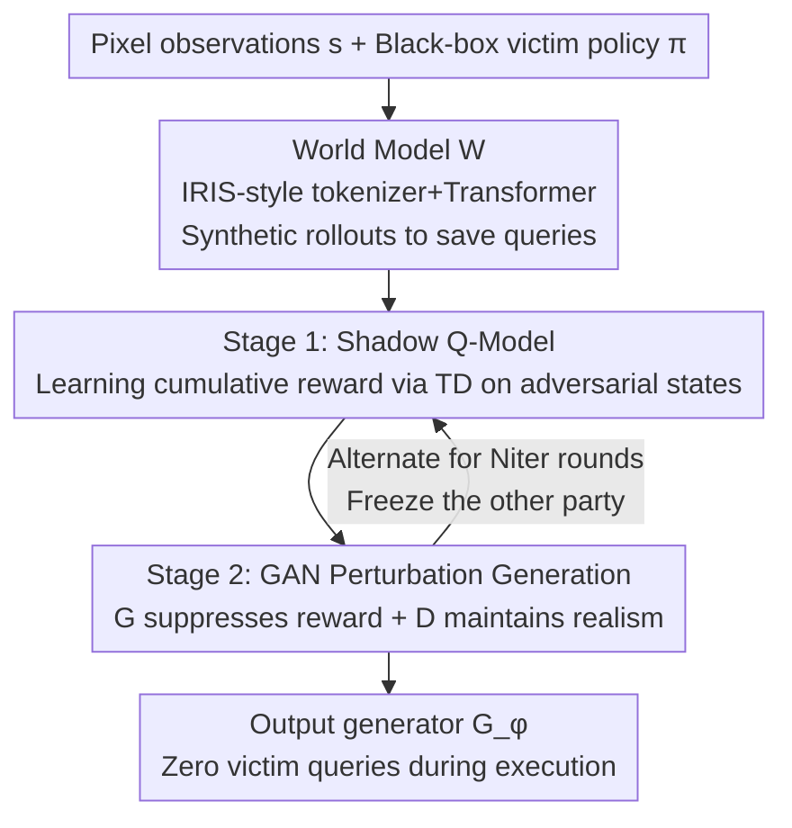

# SEBA: Sample-Efficient Black-Box Attacks on Visual Reinforcement Learning

**Conference**: CVPR 2026  
**Paper**: [CVF Open Access](https://openaccess.thecvf.com/content/CVPR2026/html/Huang_SEBA_Sample-Efficient_Black-Box_Attacks_on_Visual_Reinforcement_Learning_CVPR_2026_paper.html)  
**Code**: https://github.com/tairanhuang/seba  
**Area**: AI Security / Adversarial Attacks  
**Keywords**: Black-box Adversarial Attack, Visual Reinforcement Learning, Continuous Control, Shadow Q-Model, World Model

## TL;DR
SEBA utilizes a differentiable "Shadow Critic," a GAN-based perturbation generator, and a World Model to generate nearly imperceptible adversarial perturbations for pixel-input continuous control RL agents under **black-box conditions (no access to victim policy gradients)**. It reduces cumulative rewards to near zero while decreasing environment/victim query volume by one to two orders of magnitude compared to RL-based attacks.

## Background & Motivation
**Background**: Visual reinforcement learning (visual RL) learns control policies directly from pixels and has become a primary driver for robotic manipulation, autonomous navigation, and visual control. However, heavy reliance on visual perception makes these systems vulnerable to carefully crafted infinitesimal perturbations (adversarial attacks), posing a security risk for autonomous systems deployed in the real world.

**Limitations of Prior Work**: Existing RL adversarial attacks are mostly limited to two simple settings: **vector states** (low-dimensional observations) or **visual RL with discrete actions** (e.g., Atari, where the policy essentially acts as a classifier). Once moved to **continuous actions + pixel observations**, these methods fail because the action space is infinite, the observation dimensionality is high (perturbation dimension $d=3\times84\times84\approx2\times10^4$), and perturbations affect long-term dynamics in complex ways.

**Key Challenge**: In a black-box setting, attackers cannot access gradients and must rely on repeated environment queries to estimate attack directions. Since each RL rollout involves expensive sequential interactions, attackers face a trade-off between three objectives: **attack strength (suppressing reward), imperceptibility (visual realism), and sample efficiency (minimal queries)**. Approaches like PA-AD and OPTIMAL, which model the attacker as a policy $\pi_a$ to optimize long-term goals, suffer from explosive sample complexity and noisy gradient signals when exploring the $\mathbb{R}^{2\times10^4}$ perturbation space, making them unsustainable for pixel-level control.

**Goal / Core Idea**: Instead of "learning policy exploration" in high-dimensional perturbation space, SEBA **directly trains a generator $G_\phi$** guided by a differentiable Shadow Critic that indicates "where to perturb to lower the value." This is combined with a World Model using synthetic rollouts to save real queries. In short: **replace "RL policy search in high-dimensional space" with a "generator guided by a proxy Critic."**

## Method

### Overall Architecture
The attack target of SEBA is a black-box victim policy $\pi(a\mid s)$: the attacker can only query it for actions without seeing internal parameters or gradients. The attacker outputs a bounded perturbation $\delta=\mathrm{clip}(G_\phi(s),-\epsilon,\epsilon)$, forming an adversarial observation $s'=\mathrm{clip}(s+\delta,0,1)$. The goal is to minimize the victim's discounted reward:

$$\min_\phi\ \mathbb{E}\Big[\sum_{t=0}^{\infty}\gamma^t\, r(s'_t,a_t)\Big],\quad a_t\sim\pi(\cdot\mid s'_t).$$

The pipeline consists of four components: ① A **World Model** $W$ trained on replay data to predict visual dynamics and produce synthetic rollouts; ② A **Shadow Critic** $Q_{\text{shadow}}$ that estimates the victim's cumulative reward on adversarial states, serving as a differentiable optimization signal; ③ A **GAN (Generator $G_\phi$ + Discriminator $D_\psi$)** responsible for generating perturbations that are both effective and imperceptible; ④ A **two-stage alternating optimization** that decouples the training of the Critic and the GAN to avoid instability caused by objective coupling. Real environment queries are only periodically used to correct model drift.

### Key Designs

**1. Shadow Q-Model: Building a Differentiable "Victim Value Proxy" in a Black Box**

The main difficulty in a black-box setting is the lack of gradients; the attacker does not know "where to perturb." SEBA solves this by training a Shadow Critic $Q_{\text{shadow}}(s',a)$ specifically to estimate the victim's expected cumulative reward under adversarial perturbations—it serves as a **differentiable surrogate** for the victim policy. During training, the generator adds a bounded perturbation to the clean observation $s_t$ to get $s'_t$, which is fed into the black-box policy $\pi(a\mid s'_t)$ to obtain action $a_t$. Sequential data $(s'_t,a_t,r_t,s'_{t+1},\text{done}_t)$ from environment interactions are stored in a replay buffer and updated using the TD target:

$$L_Q=\tfrac12\,\mathbb{E}\big[(Q_{\text{shadow}}(s'_t,a_t)-y_t)^2\big],\quad y_t=r_t+\gamma\,\mathbb{E}_{a\sim\pi(\cdot\mid s'_{t+1})}\,Q_{\text{shadow}}(s'_{t+1},a).$$

Importantly, this process **only queries $\pi$ for actions** and never touches its gradients or parameters. With $Q_{\text{shadow}}$, the attacker converts "gradient-free black-box optimization" into "gradient descent on a differentiable function," which is the prerequisite for guiding the generator.

**2. GAN Perturbation Generation: Combining "Strong Attack" and "Imperceptibility" in an Adversarial Game**

The attacker must satisfy two conflicting goals: the perturbation must be strong enough to suppress rewards but subtle enough to maintain visual realism. SEBA uses a GAN framework ($G_\phi$ and $D_\psi$) to balance this: the discriminator tries to distinguish between clean and adversarial states, while the generator aims to fool the discriminator and minimize the value provided by the Shadow Critic. Their objectives are:

$$L_D=-\tfrac1B\sum_{k=1}^{B}\big[\log D_\psi(s_k)+\log(1-D_\psi(s'_k))\big],$$
$$L_G=-\tfrac1B\sum_{k=1}^{B}\big(\log D_\psi(s'_k)-\lambda\,Q_{\text{shadow}}(s'_k,a_k)\big).$$

The first term of $L_G$ forces the generator to make perturbations realistic, while the second term (with $-\lambda Q_{\text{shadow}}$) forces it to drive down the victim's value. Crucially, **gradients flow directly through the Shadow Critic**: $\nabla_\phi L_G \approx -\nabla_\phi Q_{\text{shadow}}(s_t+\delta_t,a_t)$. Therefore, optimization focuses solely on "perturbation directions that genuinely reduce value," unlike PA-AD/OPTIMAL which perform RL exploration in $\mathbb{R}^{2\times10^4}$. This is why SEBA succeeds in pixel space while RL-based attacks fail.

**3. Two-Stage Alternating Optimization: Decoupling Objectives to Stabilize Training**

Simultaneously training $G_\phi$ and $Q_{\text{shadow}}$ can lead to oscillations because their objectives are tightly coupled (the Critic must follow the perturbation distribution, while the generator relies on the Critic's value estimation). SEBA splits each iteration into two phases: **Stage 1** freezes $(G_\phi, D_\psi)$ and uses adversarial interactions from the current generator to collect $(s',a,r,s'_{+1})$ to update $Q_{\text{shadow}}$ via Eq.(2), ensuring it accurately models victim rewards under the current distribution. **Stage 2** freezes $Q_{\text{shadow}}$ and uses stable value supervision to update $(G_\phi, D_\psi)$. Both stages run for $T_1=T_2=5\text{K}$ steps for a total of $N_{\text{iter}}=20$ rounds. This rhythm—fixing the Critic before allowing the generator to learn under fixed supervision—is essential for convergence. ⚠️ A subtle but critical detail: Stage 1 must train the Critic on **perturbed states** $s'_t=s_t+G_\phi(s_t)$, not clean states; changing this leads to a drastic drop in attack effectiveness (see -Noise in Ablation).

**4. World Model: Using Synthetic Rollouts to Slash Real Queries**

The most expensive part of RL attacks is the environment/victim query volume. SEBA trains a World Model $W$ using the IRIS framework: a discrete image tokenizer $(E,D)$ encodes observations into tokens, and an autoregressive Transformer $G$ predicts future latent tokens and rewards: $z_t=E(s_t)$, $\hat z_{t+1},\hat r_t=G(z_{\le t},a_{\le t})$, and $\hat s_{t+1}=D(\hat z_{t+1})$. The joint loss is:

$$L_W=\mathbb{E}\big[-\log p_G(z_{t+1}\mid z_{\le t},a_{\le t})\big]+\mathbb{E}\big[\lVert\hat r_t-r_t\rVert_2^2\big].$$

Once trained, $W$ generates "imaginary" transitions $(\hat s'_t,a_t,\hat r_t,\hat s'_{t+1})$ without calling the real environment, which are used to update both the Critic and the generator. Each real interaction is supplemented by $H=4$ model-generated transitions, reducing real environment queries to approximately $1/H$. Ablation shows that removing the World Model maintains attack strength but spikes environment queries from 160K to 800K—it **enhances sample efficiency rather than attack effectiveness**, providing SEBA's practicality over PA-AD/OPTIMAL (which require ~4M queries).

### Loss & Training
The overall process is detailed in Algorithm 1: first, the World Model is trained on real transitions (minimizing $L_W$), followed by $N_{\text{iter}}=20$ rounds of alternating Stage 1 (TD updates for Critic) and Stage 2 (GAN updates). Key hyperparameters: perturbation bound $\epsilon=8/255$, generator loss weight $\lambda=1$, World Model rollout horizon $H=4$ with $N_w=200\text{K}$ update steps, and $T_1=T_2=5\text{K}$ per stage. The Shadow Critic uses Double-DQN style updates; final evaluation is conducted entirely in the real environment.

## Key Experimental Results

### Main Results
On 5 pixel-based MuJoCo continuous control tasks (victim: DrQ-SAC), SEBA leads in attack strength, visual imperceptibility (FID), and query efficiency. Lower reward and lower FID indicate stronger/better attacks:

| Task (Reward ↓) | Clean | PGD (White-box) | SimBA (Black-box) | Square (Black-box) | SEBA |
|------|------|------|------|------|------|
| Cheetah Run | 859.26 | 150.72 | 52.15 | 182.90 | **1.61** |
| Walker Walk | 944.28 | 342.78 | 68.77 | 752.19 | **35.74** |
| Reacher Hard | 870.9 | 232.3 | 2.7 | 870.7 | **0.3** |
| Hopper Stand | 849.60 | 1.85 | 4.86 | 652.10 | **1.25** |
| FID ↓ | / | 109.43 | 78.05 | 118.01 | **62.43** |
| Atk. Vic (Query/step) ↓ | / | 20 | 400 | 202 | **0** |

Compared to vector-based RL attacks adapted for pixel control, SEBA outperforms them in both effectiveness and query volume:

| Task (Reward ↓) | MAD | PA-AD | OPTIMAL | SEBA |
|------|------|------|------|------|
| Cheetah Run | 29.02 | 146.61 | 271.73 | **1.61** |
| Reacher Hard | 26.19 | 45.37 | 592.64 | **0.3** |
| FID ↓ | 106.34 | 97.55 | 93.04 | **62.43** |
| Train Env (Total) ↓ | / | 4M | 4M | **160K** |
| Train Vic (Total) ↓ | / | 4M | 4M | **800K** |

While PA-AD/OPTIMAL require ~4M queries, SEBA uses only 160K Env + 800K Vic queries and requires **zero victim queries** during execution. Transferred to Atari (Rainbow victim, discrete actions), SEBA still dropped Freeway from 34 to 10 and Alien from 8858 to 982, with the lowest FID (81.7), trailing only white-box PA-AD (which is expected as PA-AD uses full gradients).

### Ablation Study
Components were removed individually (-D for discriminator, -Noise for training Stage 1 on clean states, -WM for removing the World Model):

| Config | Walker Walk Reward | FID ↓ | Train Env ↓ | Description |
|------|------|------|------|------|
| SEBA (Full) | 35.74 | 62.43 | 160K | All components active |
| -D | 22.64 | **97.18** | 160K | FID increases; perturbations more visible; strength unchanged |
| -Noise | **118.11** | 60.72 | 160K | Attack effectiveness drops significantly (largest impact) |
| -WM | 36.01 | 63.98 | **800K** | Attack strength similar, but real queries increase 5x |

### Key Findings
- **Shadow Critic is the engine of effectiveness**: The -Noise setting (training Critic on clean states) caused the Walker Walk reward to jump from 35.74 to 118.11 because the Critic learned on a mismatched distribution, making value estimates unreliable under perturbation.
- **The Discriminator manages "Appearance," not "Strength"**: Removing it increased FID from 62.43 to 97.18, but the reward remained low. Its role is to keep perturbations smooth while the Shadow Critic drives the attack.
- **World Model buys Sample Efficiency**: Without it (-WM), attack strength is maintained, but environment queries spike from 160K to 800K, proving its role in cost reduction.
- **Targeted Attacks are possible**: By modifying the generator objective to push action $a^{(i)}_t$ into a target range $R_{\text{target}}$, SEBA achieved a success rate far exceeding baselines (91.3% vs. 37.2% for PGD on Walker Walk).

## Highlights & Insights
- **"Proxy Critic + Generator" over "High-dim RL Policy Search"**: By transforming a black-box zero-gradient problem into gradient descent on a differentiable shadow value function, SEBA avoids the sample and gradient catastrophes of RL exploration in $2\times10^4$ dimensions.
- **Clear separation of concerns**: The ablation study elegantly proves that the Critic handles effectiveness, the Discriminator handles imperceptibility, and the World Model handles efficiency.
- **Zero victim queries during execution**: Perturbations are generated by a single forward pass of $G_\phi$, making it much more practical than SimBA (400 queries) or Square (202 queries) for real-time deployment.
- The philosophy of "using World Models for synthetic rollouts to reduce real interaction" can be transferred to any black-box attack or safety evaluation scenario where queries are expensive.

## Limitations & Future Work
- The reliability of the Shadow Critic depends heavily on training on the "perturbed state distribution"; if the victim policy has massive distribution shifts, the method's stability might be compromised.
- The World Model uses IRIS-style reconstruction. Whether it can maintain fidelity and predict dynamics in more complex/realistic visual scenes without bias remains to be tested in real-world robotics.
- On Atari, it still trails white-box PA-AD, suggesting an upper bound for black-box methods when compared to adversaries with full gradient access.
- Defense mechanisms were not explored; as an attack framework, future work should discuss how adversarial training or detection handles such attacks.

## Related Work & Insights
- **vs. PA-AD / OPTIMAL**: These model the attacker as a policy $\pi_a$ optimized via RL. While feasible for vector states, they fail in pixel space where $d \approx 2\times10^4$ and gradients are noisy. SEBA avoids learning a policy and instead uses the Shadow Critic to guide the generator.
- **vs. SA-MDP / Critic-Based / MAD**: These target vector states or discrete Atari actions. SEBA is the **first** to target black-box attacks on pixel-based continuous control RL.
- **vs. Pixel-space Attacks (PGD/C&W/SimBA/Square)**: These do not model long-term returns. They either have high FID (obvious) or require excessive per-step queries. SEBA explicitly optimizes cumulative reward via the Shadow Critic, making it both more effective and stealthier.

## Rating
- Novelty: ⭐⭐⭐⭐⭐ First black-box attack for pixel continuous control; clever "Shadow Critic-guided generator" bypasses high-dim RL exploration.
- Experimental Thoroughness: ⭐⭐⭐⭐⭐ Extensive MuJoCo + Atari testing, white/black-box baselines, complete ablation, and 10 seeds.
- Writing Quality: ⭐⭐⭐⭐ Clear methods and formulas; ablation explanations are insightful.
- Value: ⭐⭐⭐⭐ Provides a practical framework for black-box robustness evaluation in Embodied AI.

<!-- RELATED:START -->

## Related Papers

- [\[CVPR 2026\] VCP-Attack: Visual-Contrastive Projection for Transferable Black-Box Targeted Attacks on Large Vision-Language Models](vcp-attack_visual-contrastive_projection_for_transferable_black-box_targeted_att.md)
- [\[CVPR 2026\] PROMPTMINER: Black-Box Prompt Stealing against Text-to-Image Generative Models via Reinforcement Learning and VLM-Guided Optimization](promptminer_black-box_prompt_stealing_against_text-to-image_generative_models_vi.md)
- [\[CVPR 2026\] Shedding Light on VLN Robustness: A Black-box Framework for Indoor Lighting-based Adversarial Attack](shedding_light_on_vln_robustness_a_black-box_framework_for_indoor_lighting-based.md)
- [\[ICLR 2026\] Sample-Efficient Distributionally Robust Multi-Agent Reinforcement Learning via Online Interaction](../../ICLR2026/ai_safety/sample-efficient_distributionally_robust_multi-agent_reinforcement_learning_via_.md)
- [\[CVPR 2026\] What Your Features Reveal: Data-Efficient Black-Box Feature Inversion Attack for Split DNNs](what_your_features_reveal_data-efficient_black-box_feature_inversion_attack_for_.md)

<!-- RELATED:END -->
