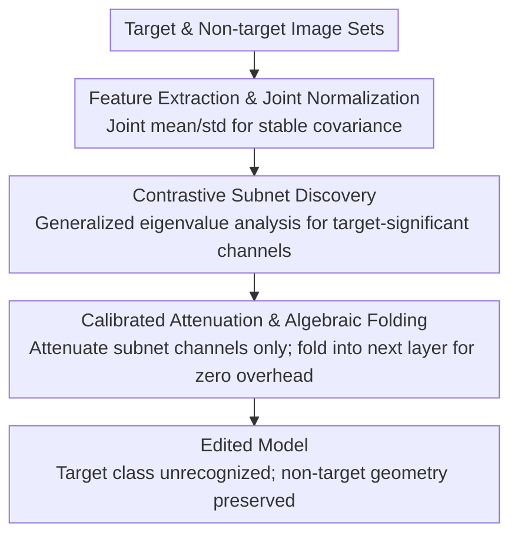

# Selective Amnesia using Contrastive Subnet Erasure for Class Level Unlearning in Vision Models

**Conference**: CVPR 2026  
**Paper**: [CVF Open Access](https://openaccess.thecvf.com/content/CVPR2026/html/Pramanik_Selective_Amnesia_using_Contrastive_Subnet_Erasure_for_Class_Level_Unlearning_CVPR_2026_paper.html)  
**Code**: https://github.com/VishalPramanik/CSE  
**Area**: AI Security / Machine Unlearning  
**Keywords**: Concept Unlearning, Class-level unlearning, Channel editing, Generalized eigenvalue analysis, Cross-dataset evaluation

## TL;DR
CSE addresses "class-level concept unlearning" for pre-trained vision models—making the model completely unable to recognize an entire semantic category (rather than just forgetting specific training samples). It avoids training and does not modify task heads; instead, it employs contrastive subnet discovery to identify a small subset of channels responsible for the target class, applies calibrated attenuation, and algebraically folds the changes into the next layer to achieve zero inference overhead, stability, and reduced collateral damage to non-target classes.

## Background & Motivation

**Background**: Pre-trained vision models inevitably internalize information that must later be removed—for compliance with deletion requests, the removal of unsafe/biased knowledge, or the neutralization of backdoor poisoning. Existing approaches fall into two categories: data unlearning (removing the influence of specific samples) and concept erasure (suppressing a specific semantic factor within the representation).

**Limitations of Prior Work**: The authors systematically compare five categories of encoder editing methods—ESC (global subspace projection, removing target-related directions), DELETE / BU (gradient training, reshaping parameters to push away target regions or contract decision boundaries), and SCAR / Targeted-CLIP (retain-forget objectives with extra supervision). These methods either employ "global projections" that are too blunt or "fine-tune parameters" in a way that degrades shared filters. Common issues include: as unlearning strength increases, **collateral damage to unrelated features grows significantly, training becomes unstable**, and additional computational resources are required.

**Key Challenge**: The fundamental difficulty lies in **feature entanglement**—target and non-target classes often share directions and channels within the same encoder. Thus, crudely deleting "target" signals deforms adjacent structures, harming tasks that share visual cues with the forgotten content. This results in two recurring limitations: (i) **Non-locality**—editing affects large subspaces or parameter blocks, causing changes to spill over into unrelated regions; (ii) **Lack of geometric preservation**—even if target accuracy drops, the relative arrangement between non-target classes is distorted, impairing downstream linear separability.

**Goal**: To develop a "surgical" edit—modifying only the specific channels responsible for diagnosing the target, preserving non-target geometry, requiring no training, incurring zero inference overhead, and verifying whether the unlearning **truly erases the concept** rather than just over-fitting the source data.

**Key Insight**: The authors illustrate this with a toy experiment using MNIST + frozen EfficientNet-B0: with digit "3" as the unlearning target, non-target utility is measured via a linear probe for "5 vs 8" ("3" shares strokes with "5" and "8", making it easy to cause collateral damage). CSE stays close to the no-edit baseline throughout the unlearning strength range (near-zero collateral damage) while reducing "3" accuracy to near zero; meanwhile, global projection (ESC) deteriorates rapidly as strength increases, and gradient-based methods show more pronounced negative effects on non-target utility.

**Core Idea**: Use "contrast" to identify channels that are significant for the target class but stable for non-target classes (locality), then attenuate only these channels (geometric preservation) and algebraically fold the edits into the network to achieve zero training and zero inference overhead.

## Method

### Overall Architecture
CSE solves the problem of "deleting an entire class without harming shared features." It is a three-stage, training-free, encoder-centric channel-space edit: given a set of target images $\mathcal{D}_t$ (concepts to forget) and non-target images $\mathcal{D}_b$ (concepts to retain), features are first jointly normalized across both sets. Then, generalized eigenvalue analysis identifies discriminative directions where "target variance is much larger than non-target variance." Channels are scored based on these eigenvalues, and a minimal subnet covering the discriminative quality is selected. Finally, calibrated attenuation is applied only to these channels and algebraically folded into subsequent layers—a one-time precomputation resulting in a fixed scale and bias at runtime, leaving the task head untouched and adding no inference overhead.

### Key Designs

**1. Contrastive Subnet Discovery: Identifying "Target-Sensitive Only" Channels via Variance Ratios**

The pain point is that targets and non-targets share channels. Relying solely on "high target response" risks harming shared cues. CSE first jointly normalizes features across target and non-target sets (calculating joint mean $\mu^{(\ell)}$ and per-channel standard deviation $\sigma^{(\ell)}_c$, which is critical for unbiased variance ratio calculation). Two covariances $\Sigma^{(\ell)}_t, \Sigma^{(\ell)}_b$ are calculated on normalized features to find directions $v$ that maximize the variance ratio $\rho(v)=\frac{v^\top\Sigma^{(\ell)}_t v}{v^\top\Sigma^{(\ell)}_b v}$. A large $\rho(v)$ means the target varies significantly along $v$ while the non-target remains stable—i.e., it is "target-significant." For numerical stability, a regularized generalized eigenvalue problem $\Sigma^{(\ell)}_t v=\rho(\Sigma^{(\ell)}_b+\delta I)v$ is solved, yielding pairs ordered by descending eigenvalues. The importance of each channel is measured by its participation in the discriminative directions $s^{(\ell)}_c=\sum_{j=1}^{k_\ell}\rho^{(\ell)}_j\,(v^{(\ell)}_j[c])^2$, and a **minimal channel subset** $\mathcal{C}^{(\ell)}$ is greedily selected to cover a specific ratio of total discriminative information $\tau_{\text{cov}}$. This directly addresses "non-locality"—selecting only the channels truly diagnostic of the target while preserving shared but non-target-specific directions.

**2. Calibrated Attenuation + Algebraic Folding: Subnet-Only Mod, Zero Overhead, Geometry Preservation**

After selecting the subnet, a simple binary deletion would harm the geometry. CSE calculates a $c$ attenuation factor $\beta^{(\ell)}_c=\mathrm{clip}_{[0,1]}\!\big(\frac{s^{(\ell)}_c-\tau_0}{s^{(\ell)}_c+\lambda_0}\big)$ for each selected channel based on its score ($\tau_0$ is the minimum score threshold, $\lambda_0$ controls transition smoothness), forming an attenuation matrix $A^{(\ell)}=\mathrm{diag}(1-\beta^{(\ell)}_1,\dots)$ with diagonal entries from 0 (complete removal) to 1 (complete retention). Since attenuation is calculated in normalized coordinates, it is transformed back to the original feature space $M^{(\ell)}=S^{(\ell)-1}A^{(\ell)}S^{(\ell)}$. At runtime, the operation is $h^{(\ell)}_{\text{atten}}=M^{(\ell)}h^{(\ell)}+(I-M^{(\ell)})\mu^{(\ell)}$, where the bias term compensates for the mean shift introduced by normalization. For residual blocks $h^{(\ell+1)}=F(h^{(\ell)})+S(h^{(\ell)})$, attenuation is applied at the **block output stage** $h^{(\ell+1)}_{\text{atten}}=\mathrm{diag}(M^{(\ell+1)})\odot h^{(\ell+1)}+\beta^{(\ell+1)}$, preventing signals from bypassing via the residual path while uniformly handling both Convolutional and Transformer blocks. The entire $\mathrm{diag}(M)$ and bias can be precomputed and folded into the network. During inference, this is just a fixed scaling, adding zero overhead and leaving task heads unchanged—directly addressing "geometry preservation."

**3. Cross-Dataset Evaluation Protocol: Verifying "True Concept Erasure" vs. "Source Data Overfitting"**

This is a significant contribution beyond the method itself, addressing whether unlearning generalizes beyond the specific data used to define the class. The protocol is: define and execute unlearning on a **source dataset**, but measure the unlearning effect on a **target dataset that shares no images and follows a different distribution**. For example, unlearn "airplane" on CIFAR-10, then test on ImageNet's "airliner/aircraft" to see if it is truly forgotten, while confirming proximate classes like "warplane" are preserved. Conversely, unlearn "truck" on ImageNet and test on CIFAR-10's "truck" while ensuring "automobile" is not harmed. This setup forces all three datasets to serve as both unlearning domains and evaluation domains, specifically stress-testing whether a "concept is truly removed (transfer leakage)" rather than just memorizing source set patterns, while auditing non-target utility under distribution shift.

### Loss & Training
**Training-free**. CSE is a precomputed encoder edit: normalization statistics, generalized eigenvalue decomposition, channel scoring, and attenuation matrices are all calculated offline and algebraically folded into the network. It is architecture-agnostic and has been validated on EfficientNet-B0 / ResNet-18 / Swin-T (updates only encoder parameters when explicitly requested by a comparison baseline; otherwise, it adheres to the constraint of no head modification).

## Key Experimental Results

Evaluation metrics: forget-test accuracy $A_{ft}$ (lower is better, target forgotten), retain-test accuracy $A_{rt}$ (higher is better, non-target retained), harmonic mean of the two H-Mean (higher is better), and Membership Inference Attack success rate (MIA) on the forget set (lower is better). The cross-dataset setup covers CIFAR-10 / CIFAR-100 / ImageNet.

### Main Results (Single-class cross-dataset, ResNet-18, 3 runs std<±0.02)

| Method | CIFAR-10 $A_{ft}\downarrow$/$A_{rt}\uparrow$/H↑/MIA↓ | ImageNet $A_{ft}$/$A_{rt}$/H/MIA |
|------|------|------|
| Original (No Editing) | .94/.93/.50/.22 | .70/.59/.36/.22 |
| Retrain (Gold Standard Lower Bound) | .03/.91/.89/.02 | .03/.59/.68/.02 |
| ESC (Global Projection) | .10/.92/.90/.05 | .12/.59/.67/.05 |
| DELETE (Gradient Training) | .12/.91/.89/.06 | .14/.58/.65/.05 |
| SCAR | .10/.90/.85/.08 | .17/.57/.61/.08 |
| **CSE (Ours)** | **.01/.95/.96/.01** | **.02/.61/.73/.01** |

CSE reduces $A_{ft}$ to .01–.02 across three datasets (more thorough than all baselines), while $A_{rt}$ is higher than even the Original model. H-Mean and MIA are optimal across the board, even outperforming the "Retrain" gold standard—showing cleaner forgetting and better non-target preservation.

### Ablation Study (Cross-backbone & Unlearning Strength)

| Configuration | Key Findings | Description |
|------|---------|------|
| EfficientNet-B0 / ResNet-18 / Swin-T | CSE maintains $A_{ft}\approx.01$–.02 and highest H | Architecture-agnostic; stable for both Conv and Transformer |
| Unlearning Strength $s\in[0,1]$ scan | CSE consistently tracks the no-edit baseline | Almost zero collateral damage |
| ESC as $s$ increases | Non-target utility deteriorates rapidly | Global projection destroys shared features if too much is removed |
| Gradient-based (DELETE/BU/SCAR/CLIP) | Non-target utility drops as strength increases | Reshaping shared filters requires delicate re-balancing |

### Key Findings
- **CSE generally outperforms "Retrain"**: It exceeds Retrain in $A_{rt}$ and H-Mean, suggesting that local contrastive attenuation not only forgets cleanly but also preserves non-target geometry, whereas retraining may lose useful structures learned by the original model.
- **Strength robustness is a key selling point**: While global projection and gradient fine-tuning collapse as unlearning strength increases, CSE remains stable because it only modifies the minimal subnet via calibrated attenuation.
- **Cross-dataset protocol reveals true performance**: By unlearning on a source set and testing on a distributionally shifted target set, CSE still suppresses the target to near zero, proving it erases the concept rather than just source data patterns.

## Highlights & Insights
- **Variance Ratio + Generalized Eigenvalue Analysis for "Target-Exclusive Channels"**: Formalizing "target-significant and non-target-stable" using $\rho(v)=\frac{v^\top\Sigma_t v}{v^\top\Sigma_b v}$ creates a clean, reusable "contrastive localization" tool.
- **Algebraic Folding = Zero Inference Overhead**: Precomputing the attenuation matrix and folding it into the next layer allows the model to be "deployable" without needing online fine-tuning or specialized operators.
- **Cross-Dataset Unlearning Evaluation Protocol**: Stress-testing "true concept removal" and "non-target utility under distribution shift" simultaneously is much stricter than self-testing on the source set and likely deserves adoption by future unlearning research.

## Limitations & Future Work
- Subnet discovery depends on both target and non-target datasets to estimate covariance; if target samples are sparse or the non-target set is poorly chosen, the variance ratio estimate may be unstable (regularization $\delta$ helps, but extreme cases are not fully discussed).
- There are several hyperparameters: threshold $\tau_0$, smoothing $\lambda_0$, coverage ratio $\tau_{\text{cov}}$, and the upper bound on eigenvectors; their robustness across different tasks is not fully detailed in the main text.
- Evaluation focuses on image classification backbones; class-level unlearning for detection/segmentation/generative models and scenarios involving many highly-entangled classes remain to be verified.

## Related Work & Insights
- **vs ESC (Global Subspace Projection)**: ESC projects out directions related to the target; it is effective at low intensities but destroys shared features at high intensities. CSE attenuates minimal subnets, preserves geometry, and is superior and stable across datasets.
- **vs DELETE / BU (Gradient Training)**: These reshape parameters to push away target regions; while effective, they degrade shared filters and require compute and careful regularization. CSE is training-free and suppresses the target more thoroughly ($A_{ft}$ .01 vs .12).
- **vs SCAR / Targeted-CLIP (Supervised Retain-Forget)**: These use extra prompts or balanced sets for control but introduce compute costs and hyperparameter sensitivity. CSE's MIA of .01 indicates that memory patterns are truly cleared with a single precomputation.

## Rating
- Novelty: ⭐⭐⭐⭐ The combination of contrastive variance-ratio localization and algebraic folding is clean and effective; the cross-dataset protocol is also a contribution.
- Experimental Thoroughness: ⭐⭐⭐⭐ Solid coverage across three datasets, three backbones, single/multiple classes, and strength scans; hyperparameter robustness could be expanded.
- Writing Quality: ⭐⭐⭐⭐ Clear logic from motivation (toy experiments) to method and evaluation; formulas are well-labeled.
- Value: ⭐⭐⭐⭐ Training-free, zero inference overhead, and stable; this is a truly "deployable" class-level unlearning solution.

<!-- RELATED:START -->

## Related Papers

- [\[CVPR 2026\] VCP-Attack: Visual-Contrastive Projection for Transferable Black-Box Targeted Attacks on Large Vision-Language Models](vcp-attack_visual-contrastive_projection_for_transferable_black-box_targeted_att.md)
- [\[CVPR 2026\] Towards Highly Transferable Vision-Language Attack via Semantic-Augmented Dynamic Contrastive Interaction](towards_highly_transferable_vision-language_attack_via_semantic-augmented_dynami.md)
- [\[ICLR 2026\] Distributional Machine Unlearning via Selective Data Removal](../../ICLR2026/ai_safety/distributional_machine_unlearning_via_selective_data_removal.md)
- [\[CVPR 2026\] Eliminate Distance Differences Induced by Backdoor Attacks: Layer-Selective Training and Clipping to Mask Backdoor Models](eliminate_distance_differences_induced_by_backdoor_attacks_layer-selective_train.md)
- [\[CVPR 2026\] Hierarchically Robust Zero-shot Vision-language Models](hierarchically_robust_zero-shot_vision-language_models.md)

<!-- RELATED:END -->
