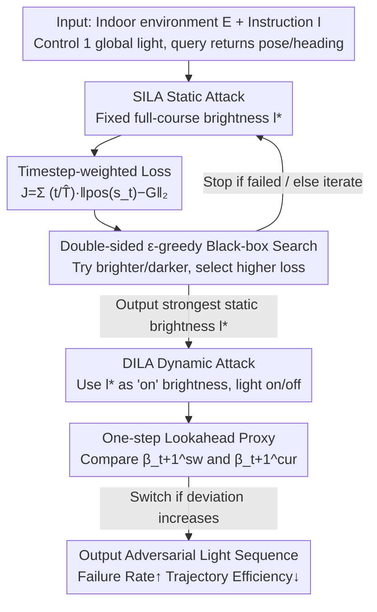

# Shedding Light on VLN Robustness: A Black-box Framework for Indoor Lighting-based Adversarial Attack

**Conference**: CVPR 2026  
**Paper**: [CVF Open Access](https://openaccess.thecvf.com/content/CVPR2026/html/Li_Shedding_Light_on_VLN_Robustness_A_Black-box_Framework_for_Indoor_CVPR_2026_paper.html)  
**Code**: https://github.com/LiChenyang0820/ILA4VLN  
**Area**: AI Security / Vision-Language Navigation  
**Keywords**: VLN Robustness, Black-box Adversarial Attack, Indoor Lighting, Embodied AI, Trajectory Deviation

## TL;DR
This paper points out that robustness evaluations for Vision-Language Navigation (VLN) agents have traditionally relied on "weird textures that rarely appear in reality." Instead, it proposes ILA, a black-box attack framework that only manipulates global indoor lighting intensity. Its static mode (SILA) searches for a constant brightness that best disrupts navigation, while the dynamic mode (DILA) suddenly switches lights on/off at critical moments. Evaluated on two SOTA VLN models across three tasks, it significantly pushes up failure rates and lowers trajectory efficiency, revealing the hidden vulnerability of VLN to "daily lighting variations" as natural perturbations.

## Background & Motivation
**Background**: VLN requires agents to navigate in 3D indoor environments following natural language instructions, serving as a fundamental capability for embodied AI. Recent models (SPOC using shortest-path expert trajectories for behavior cloning, and FLaRe adding RL fine-tuning on top of SPOC) have steadily improved navigation performance, but research on robustness is severely lacking—whereas navigation failure could lead to real-world harms like collisions or injuries.

**Limitations of Prior Work**: Existing VLN robustness evaluations (Consistent Attack, using differentiable rendering to optimize object appearance, or applying adversarial patches to object surfaces) share two common flaws: ① the generated perturbations manifest as **highly unusual textures** rarely encountered in real indoor settings, limiting the practical significance of "failing under such artificial patterns"; ② most rely on **white-box** access to model internals for optimization, which is inapplicable in realistic threat scenarios where model internals are inaccessible.

**Key Challenge**: The goal is to evaluate whether agents fail under "natural, inevitable environmental changes," yet existing attacks modify the environment into something that would not exist in reality—creating a disconnect between "real-world relevance" and "attack strength."

**Goal**: Find a **daily-occurring and easily controllable** intrinsic scene attribute to systematically expose VLN vulnerabilities under **black-box** conditions.

**Key Insight**: The authors focused on indoor lighting—an omnipresent, daily-changing intrinsic scene attribute. Preliminary experiments (scanning intensity in [0, 2] with a 0.1 step for 200 episodes using SPOC on ObjectNav) revealed two phenomena: ❶ success rates fluctuate **non-monotonically and irregularly** with light intensity, indicating that lighting affects model behavior non-linearly; ❷ the gap between the highest and lowest success rates can reach nearly 10 percentage points. This suggests that even moderate lighting changes can dictate navigation outcomes, leading to the **Core Problem**: Can lighting modulation patterns be **deliberately designed** to systematically expose this vulnerability?

**Core Idea**: Abstract "daily indoor lighting usage" (either staying steadily on or sudden switching) into two black-box attack modes. By manipulating only the intensity of a single global light, one can effectively disrupt VLN.

## Method

### Overall Architecture
The attacker's only controllable variable is the lighting sequence $\mathcal{L}=\{l_1,\dots,l_T\}$ (step-wise intensity of a global controllable light), and each black-box query returns only the agent's position and orientation. Centered around "two typical uses of household lights," ILA is designed with two modes working in series: **SILA (Static)** first searches for a constant brightness $l^\star$ that best deviates the trajectory from the goal; **DILA (Dynamic)** then uses $l^\star$ as the "on" default brightness and selects appropriate moments during navigation to suddenly switch the light on/off, creating sharp lighting transitions to further undermine navigation. Both share a black-box closed loop: select light intensity → render scene → agent executes navigation → evaluate trajectory via loss → feedback guides the next update.

### Key Designs

**1. Black-box Lighting Attack Paradigm: Replacing Weird Textures with "Daily Perturbations"**

Addressing the pain point that existing attack textures are unrealistic and require white-box access, the authors shift the attack surface from "object textures/patches" to the intrinsic scene attribute of "global indoor lighting intensity." Formally, the environment $E$, agent state $s_t$, and current lighting $l_t$ pass through a rendering function $r$ to produce observation $o_t = r(E, s_t, l_t)$; the agent acts according to policy $a_t\sim\pi(a_t\mid o_{1:t}, I)$. The attacker's goal is to find a lighting sequence that causes episode failure: $\max_{\mathcal{L}}\mathbf{1}\big(\forall t\le T,\ \neg(\mathrm{pos}(s_t)\in G \land a_t=\text{STOP})\big)$. The process assumes only control over a global light and pose/orientation feedback per query, making it purely black-box—validating the attack in realistic threat scenarios where model internals are hidden, while lighting changes are naturally occurring events.

**2. SILA Timestep-weighted Loss: Embedding "Late Errors are More Fatal" into the Objective**

Designing attack losses for navigation is difficult—navigation is a sequential process producing a whole trajectory; using only "goal reached or not" as a loss discards vast trajectory information. Furthermore, early deviations can often be corrected, whereas late errors are usually decisive and irreversible. Treating all timesteps equally overlooks their true importance. Consequently, the authors designed **increasing timestep weights** $w_t = t/\hat{T}$ (where $\hat{T}$ is the actual steps in the episode), giving higher weights to deviations closer to the endpoint. The loss is defined as:
$$\mathcal{J}_{static} = \sum_{t=1}^{\hat{T}} w_t\, d_t = \sum_{t=1}^{\hat{T}} \frac{t}{\hat{T}} \|\mathrm{pos}(s_t) - G\|_2,$$
where $d_t=\|p_t-G\|_2$ is the Euclidean distance to the goal at each step. This integrates "full trajectory aggregation + late-stage emphasis" into one loss, proving more effective at eliciting fatal deviations than final distance or uniform weighting.

**3. SILA Double-sided ε-greedy Black-box Search: Approximating Strongest Brightness Without Gradients**

Finding the adversarial lighting is treated as black-box optimization: using task loss as feedback to adjust brightness. In each iteration, two candidates are tested around the current intensity $l^k=l_0+\Delta l$: slightly brighter $l^{k+}=\mathrm{clip}(l^k+\alpha)$ and slightly darker $l^{k-}=\mathrm{clip}(l^k-\alpha)$. VLN runs are conducted for each to calculate losses, and the direction with higher loss (more disruptive) is chosen: $\xi^k=\mathrm{sign}(\mathcal{J}(\mathcal{L}^{k+})-\mathcal{J}(\mathcal{L}^{k-}))\in\{+1,-1\}$. To avoid local optima, $\varepsilon$-greedy is introduced: with probability $\varepsilon$, the update direction is flipped ($b^k=-1$), otherwise, it follows the worse direction ($b^k=+1$). Update: $\Delta l\leftarrow\mathrm{clip}(\Delta l+\alpha\cdot b^k\cdot\xi^k)$. If any candidate causes immediate failure, that brightness is returned. This double-sided comparison + exploration directs the search toward a constant brightness $l^\star$ that maximizes loss without touching model internals.

**4. DILA One-step Lookahead Switching Proxy: Precise Light Switching at Critical Moments**

The dynamic mode inherits the strongest static brightness $l^\star$ from SILA as the "on" state and uses 0 for "off." The stepwise intensity is $l_t=i_t\cdot l^\star$ (where $i_t\in\{0,1\}$ is the switch indicator). There are two challenges: ❶ waiting for a full trajectory rollout to evaluate each candidate switch is too slow; ❷ attributing failure to a specific switch in an episode with multiple switches is difficult. The authors design a **lightweight one-step lookahead proxy**: define a target vector $\vec{v}_1=(\mathrm{tar}_x-\mathrm{pos}_x,\ \mathrm{tar}_z-\mathrm{pos}_z)$ and a heading vector $\vec{v}_2=(\sin\mathrm{rot}_y,\ \cos\mathrm{rot}_y)$. The angle $\beta_t=\arccos\frac{\vec{v}_1\cdot\vec{v}_2}{\|\vec{v}_1\|\|\vec{v}_2\|}$ measures the degree of "heading deviation from goal." At each step, a one-step lookahead is performed for both current light $l_t$ and switched light $\tilde{l}_t$ to simulate the next state and calculate $\beta_{t+1}^{cur}$ and $\beta_{t+1}^{sw}$. A switch is triggered only if $\beta_{t+1}^{sw}-\beta_{t+1}^{cur}>0$ (switching amplifies heading deviation, leading the agent further away); otherwise, the current state is maintained. This avoids expensive trajectory rollouts while progressively leading the agent astray.

### Loss & Training
The entire attack is black-box and requires no model training; only the lighting sequence is optimized. SILA uses the aforementioned timestep-weighted loss $\mathcal{J}_{static}$ as the feedback signal for black-box search, with iteration limit $K$, step size $\alpha$, and exploration rate $\varepsilon$. Termination occurs upon task failure or reaching the iteration limit. DILA does not optimize the brightness itself but uses the difference in $\beta$ deviation from one-step lookahead to decide switches.

## Key Experimental Results

### Main Results
Evaluated on SPOC and FLaRe SOTA models across ObjectNav, Fetch, and RoomVisit tasks (totaling 576 episodes). Metrics are Attack Success Rate ASR↑ (percentage of episodes successful in clean environments but failing under attack) and average Episode Length EL↑ (longer indicates lower efficiency):

| Method | SPOC-ObjNav ASR | SPOC-Fetch ASR | SPOC-RoomVisit ASR | FLaRe-ObjNav ASR | FLaRe-Fetch ASR | FLaRe-RoomVisit ASR |
|------|------|------|------|------|------|------|
| No Attack | 0.00 | 0.00 | 0.00 | 0.00 | 0.00 | 0.00 |
| Random Intensity | 23.23 | 75.00 | 23.75 | 12.20 | 17.27 | 15.08 |
| Texture-GA (Black-box Texture) | 54.90 | 87.50 | 50.62 | 37.57 | 53.98 | 45.53 |
| Ours (SILA only) | 60.38 | 100.00 | 52.44 | 47.27 | 68.81 | 57.48 |
| **Ours (SILA+DILA)** | **96.23** | **100.00** | **70.73** | **52.73** | **93.58** | **74.80** |

> Key takeaway: Even random lighting causes 12%~75% failure, proving lighting itself is a vulnerability. SILA consistently outperforms the adversarial texture baseline. Adding DILA further improves ASR by 5.46~35.85 percentage points across five task-model combinations (SPOC-Fetch reaches 100% with SILA alone). EL often doubles (e.g., SPOC-ObjectNav 131.07→234.27), indicating severely compromised trajectory efficiency.

### Ablation Study
Ablation on SILA's loss design and DILA's switching trigger strategy (ASR↑%):

| Configuration | SPOC-ObjNav | SPOC-RoomVisit | FLaRe-ObjNav | FLaRe-Fetch | FLaRe-RoomVisit |
|------|------|------|------|------|------|
| SILA Final Loss only | 56.44 | 51.28 | 46.71 | 66.99 | 55.38 |
| SILA Unweighted | 57.94 | 47.50 | 44.44 | 64.42 | 54.55 |
| **SILA Timestep-weighted (Ours)** | **60.38** | **52.44** | **47.27** | **68.81** | **57.48** |
| DILA Random Trigger | 85.85 | 69.51 | 47.88 | 74.31 | 70.08 |
| **DILA One-step Lookahead (Ours)** | **96.23** | **70.73** | **52.73** | **93.58** | **74.80** |

### Key Findings
- **Late Weighting is Most Effective**: Timestep-increasing weights outperform "final loss only" and "unweighted" across all six combinations. Further testing with decreasing weights $w_i=\frac{\hat{T}-t+1}{\hat{T}}$ (emphasizing early steps) dropped SPOC-ObjectNav ASR to 57.55% (vs. 60.38% for increasing), confirming that "deviations closer to the goal deserve more attention."
- **One-step Lookahead ≫ Random Switching**: Changing DILA's trigger from random to $\beta$-deviation lookahead significantly boosts ASR in most combinations (e.g., FLaRe-Fetch from 74.31 to 93.58).
- **Cross-task/Architecture Generalization**: Effective across single-goal localization (ObjectNav), manipulation (Fetch), and multi-room exploration (RoomVisit). Even on the generative navigation agent GPT-4o-nav (EmbodiedBench), SILA / SILA+DILA achieved 85.37% / 87.80% ASR, suggesting lighting vulnerability is a common perceptual weakness across model architectures rather than a task-specific fluke.

## Highlights & Insights
- **Shifting Attack Surface rather than Intensity**: The most impressive "aha" moment is shifting the attack from "adding weird textures" to "adjusting the brightness of one lamp"—the attack is visually natural, black-box, and more lethal, redefining "real-world relevant VLN robustness evaluation."
- **Trajectory-level + Late-weighted Loss**: Translating the domain intuition that "navigation is sequential and late errors are irreversible" directly into loss weights $w_t=t/\hat{T}$. This weighting strategy is transferable to any "sequential decision-making, end-game critical" attack or evaluation task.
- **One-step Lookahead Proxy Avoiding Full Rollouts**: Using one-step lookahead on heading deviation $\beta$ as a proxy for switching gain saves computation and allows for switch attribution, serving as a practical efficiency trick for black-box sequential attacks.

## Limitations & Future Work
- **Control of Only One Global Light**: Assumes a single global controllable light source and static natural ambient light; it remains to be seen if the attack is as effective in realistic indoor settings with multiple sources and more complex controllability. ⚠️
- **Reliance on Pose/Heading Queries**: While black-box regarding model internals, each query requires pose and orientation feedback. If deployment environments do not expose these, search and lookahead become difficult.
- **Intensity Range Set via Manual Inspection**: The intensity range [0, 2] and step 0.1 were determined based on qualitative visual checks of multiple cases; more systematic calibration is lacking.
- **Focus on Attack, Not Defense**: The paper focuses on exposing vulnerabilities and does not provide corresponding light-robust training or defense schemes, which is a natural future direction.

## Related Work & Insights
- **vs. Consistent Attack / Differentiable Rendering (Yang et al.)**: These use universal adversarial perturbations or differentiable rendering to optimize object appearance, mostly requiring white-box access and producing unnatural textures. ILA is fully black-box and manipulates natural lighting, offering higher real-world relevance.
- **vs. Adversarial Patch (Chen et al.)**: Applying multi-view optimized adversarial patches to object surfaces results in artificial textures and relies on white-box settings. ILA moves the perturbation from "object surfaces" to "global illumination," which is closer to daily life and requires no internal model access.
- **vs. Texture-GA (Black-box Texture Baseline)**: Also black-box, but texture attacks only locally affect walls and produce unnatural patterns. SILA's global lighting changes affect a broader spatial area with more persistent disruption, resulting in consistently higher ASR.

## Rating
- Novelty: ⭐⭐⭐⭐⭐ First to use "daily indoor lighting" as a black-box attack surface for VLN robustness, highly original and realistic.
- Experimental Thoroughness: ⭐⭐⭐⭐ Solid validation on two models, three tasks, 576 episodes + generative GPT-4o-nav + double ablations; however, multi-source scenarios are not covered.
- Writing Quality: ⭐⭐⭐⭐ Motivation-Method-Experiment logic is smooth; formulas and algorithms are clear.
- Value: ⭐⭐⭐⭐ Reveals the hidden vulnerability of VLN to natural lighting changes, carrying warning significance for the secure deployment of embodied AI.

<!-- RELATED:START -->

## Related Papers

- [\[CVPR 2026\] SEBA: Sample-Efficient Black-Box Attacks on Visual Reinforcement Learning](seba_sample-efficient_black-box_attacks_on_visual_reinforcement_learning.md)
- [\[CVPR 2026\] PureProof: Diffusion-Resistant Black-box Targeted Attack on Large Vision-Language Models](pureproof_diffusion-resistant_black-box_targeted_attack_on_large_vision-language.md)
- [\[CVPR 2026\] What Your Features Reveal: Data-Efficient Black-Box Feature Inversion Attack for Split DNNs](what_your_features_reveal_data-efficient_black-box_feature_inversion_attack_for_.md)
- [\[CVPR 2026\] VCP-Attack: Visual-Contrastive Projection for Transferable Black-Box Targeted Attacks on Large Vision-Language Models](vcp-attack_visual-contrastive_projection_for_transferable_black-box_targeted_att.md)
- [\[ICLR 2026\] A General Framework for Black-Box Attacks Under Cost Asymmetry](../../ICLR2026/ai_safety/a_general_framework_for_black-box_attacks_under_cost_asymmetry.md)

<!-- RELATED:END -->
