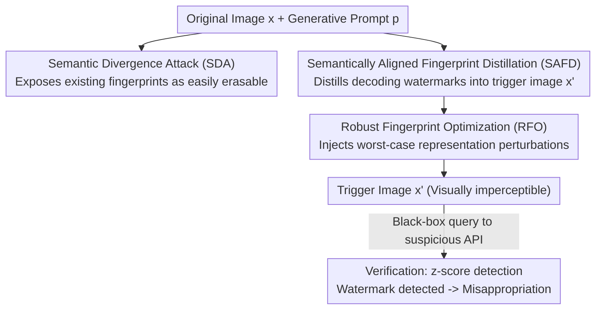

# SIF: Semantically In-Distribution Fingerprints for Large Vision-Language Models

**Conference**: CVPR 2026  
**arXiv**: [2604.17041](https://arxiv.org/abs/2604.17041)  
**Code**: https://github.com/UCF-ML-Research/SIF-VLM-Fingerprint (Available)  
**Area**: AI Security / Model Copyright / Multimodal VLM  
**Keywords**: Model Fingerprinting, Copyright Verification, Vision-Language Models, Text Watermark Distillation, Adversarial Robustness

## TL;DR
To address the copyright tracking of misappropriated open-source Large Vision-Language Models (LVLMs), SIF first utilizes a Semantic Divergence Attack (SDA) to expose the fatal flaw of existing fingerprints—being "semantically anomalous and easily detected." It then proposes a non-intrusive fingerprinting scheme that distills text decoding watermarks into trigger images and performs robust optimization against worst-case representation perturbations. This ensures stolen models generate "semantically natural yet verifiable watermarked" responses under standard decoding. SIF achieves several times higher FMR than baselines like PLA under quantization, fine-tuning, input perturbations, and SDA defense.

## Background & Motivation
**Background**: Open-source LVLMs (e.g., LLaVA, Qwen-VL) are usually released with commercial license restrictions, yet developers often violate these by building paid APIs. The mainstream approach for copyright tracking is "model fingerprinting"—constructing specific input-output pairs where the original model stably produces a characteristic response to a trigger input, while unrelated models do not, enabling black-box identification of misappropriated APIs.

**Limitations of Prior Work**: Existing LVLM fingerprints deviate from natural Q&A behavior. Instruction Fingerprint (IF) implants rare trigger-response pairs via instruction tuning, requiring retraining and proving ineffective for **previously released** models. Proflingo optimizes adversarial prompt prefixes to force specific answers, resulting in extremely high text perplexity (PPL $\gg$ 1000). PLA perturbs input images to force the model to output fixed, unrelated phrases (e.g., "CVPR conference") for any image description task. These trigger inputs or outputs are significantly out-of-distribution (OOD).

**Key Challenge**: To be verifiable, a fingerprint must make the trigger input/output "unique"; however, this uniqueness becomes a vulnerability. Attackers can identify and replace these fingerprint queries by measuring input perplexity using a lightweight reference model or by comparing semantic divergence. The authors formalize this as the **Semantic Divergence Attack (SDA)**, which empirically eliminates nearly all fingerprints from PLA, Proflingo, and IF (FMR drops to 0 or near 0). The root cause is that existing fingerprints are **not semantic-preserving**.

**Goal**: Design a fingerprint that simultaneously satisfies four properties: effectiveness (accurate identification), reliability (no false triggers on unrelated models), stealthiness (natural semantic prompts and in-distribution content-related responses), and robustness (survives quantization and fine-tuning).

**Key Insight**: Since the vulnerability stems from "semantic anomaly," the verification should be completed entirely within the model's **natural semantic space**. The authors leverage text watermarking techniques for LLMs/LVLMs—which slightly bias token logits during decoding to embed imperceptible but statistically detectable signals. These signals are naturally "fluent and semantic-preserving," but they are originally designed for **content** protection and require control over the decoding process, making them unsuitable for direct **model** protection.

**Core Idea**: Distill these "content-centric decoding watermarks" into the **visual trigger images**. This allows a stolen model to naturally generate responses that are "natural-looking but embed verifiable watermarks" under standard decoding (without logit control), followed by robust optimization against representation shifts caused by quantization or fine-tuning.

## Method

### Overall Architecture
SIF decomposes copyright tracking into three components: first, using **SDA** as a "red team" to expose the vulnerability of existing fingerprints (also acting as a threat model); second, using **SAFD + RFO** to offline construct a set of trigger images; and finally, the **Copyright Verification** stage, where trigger images are fed to a suspicious black-box API, and the response is checked for the predefined watermark signal using a z-score.

The core mechanism for construction: given an ordinary image $x$ and a generative prompt $p$, an $\ell_\infty \le \varepsilon$ perturbation is added to create a trigger image $x' = x + \delta$ (visually imperceptible). A "teacher" enhanced with text watermarking first generates a watermarked response and a step-by-step watermark token list $\mathcal{G}_t$ for $(x, p)$. SAFD optimizes $x'$ so that the frozen LVLM (student) under standard decoding both aligns semantically with the teacher's response and concentrates probability mass on $\mathcal{G}_t$. RFO then injects "worst-case representation perturbations" to ensure the fingerprint survives quantization and fine-tuning. Verification only requires a black-box query and a z-test without access to parameters or logits.

### Key Designs

**1. Semantic Divergence Attack (SDA): Proving "Semantic Anomaly" is the Achilles' Heel**

This represents the "break" phase of the paper. The insight is that PLA/Proflingo/IF triggers are OOD. A lightweight, benign reference model is introduced to measure divergence. For every incoming query, its perplexity under the reference model is calculated; if it exceeds a threshold (e.g., PPL > 1000), it is flagged. Then, responses from both the suspected and reference models are compared using **lexical overlap** (Jaccard similarity of non-stop words) and **lightweight semantic similarity** (all-MiniLM-L6-v2). If divergence is too high (e.g., lexical overlap < 0.1), it is classified as a fingerprint query and replaced by the reference model's response.

**2. Semantically Aligned Fingerprint Distillation (SAFD): Embedding Signatures in Responses**

This is the "build" phase. Text watermarking typically modifies the distribution $q_t(v) \propto \exp(z_t(v) + \Delta_t(v))$, using a key-dependent shift $\Delta_t$ to boost the probability of tokens in $\mathcal{G}_t$. SAFD instead **optimizes only the trigger image $x'$ while freezing $f_\theta$**, distilling this watermark preference into the image itself.

The optimization objective combines two terms: $\mathcal{L}(x') = \lambda_{\text{wm}}\mathcal{L}_{\text{wm}}(x') + \lambda_{\text{ce}}\mathcal{L}_{\text{ce}}(x')$. The **Watermark Alignment Loss** encourages the student distribution to place mass on $\mathcal{G}_t$:

$$\mathcal{L}_{\text{wm}}(x') = \frac{1}{T}\sum_{t=1}^{T}-\log\Big(\sum_{v\in\mathcal{G}_t}\tilde{p}_\theta(v\mid x',p,y_{<t})\Big)$$

where $\tilde{p}_\theta$ is the student distribution **truncated to top-$K$ and re-normalized** ($K=50$). This step constrains the optimization within the natural decoding region of the LVLM, embedding **in-distribution** watermarks rather than anomalous tokens. The **Semantic Alignment Loss** $\mathcal{L}_{\text{ce}}(x') = -\frac{1}{T}\sum_t \log p_\theta(\hat y_t\mid x',p,\hat y_{<t})$ uses cross-entropy targeting the teacher's watermarked response $\hat y$ to prevent semantic drift.

**3. Robust Fingerprint Optimization (RFO): Simulating Representation Drift**

Misappropriators often use quantization or fine-tuning, which shifts intermediate activations and embeddings. RFO proactively injects "worst-case representation perturbations" into SAFD. It involves two forward passes: first, calculating gradients of activations $g_\ell = \nabla_{h_\ell}\mathcal{L}_{\text{base}}(x')$, which point in the direction that most destroys the fingerprint. A norm-constrained perturbation is then aggregated:

$$\epsilon_\ell^\star = \rho\,\frac{g_\ell}{(\sum_{j=1}^{L}\|g_j\|_2^2)^{1/2}},\quad \|\epsilon_\ell^\star\|_2 \le \rho$$

This perturbation is injected into the next forward pass $\tilde h_\ell(x') = h_\ell(x') + \epsilon_\ell^\star$, and the trigger image is optimized under this "worst-case" scenario. This resembles SAM-style optimization but applied to **activations** rather than weights.

### Loss & Training
- **Total Objective**: $\mathcal{L} = \lambda_{\text{wm}}\mathcal{L}_{\text{wm}} + \lambda_{\text{ce}}\mathcal{L}_{\text{ce}}$ with $\lambda_{\text{wm}} = \lambda_{\text{ce}} = 0.5$; RFO uses the perturbed version $\mathcal{L}_{\text{RFO}}$.
- **Strategy**: PGD for 1000 steps, step size $\alpha=1/255$, budget $\varepsilon=16/255$, $K=50$, $\rho=0.5$.
- **Watermark**: Unigram watermark following Zhao et al.; z-score detection $z=(s-\mu)/\sigma$ where $s$ is the proportion of watermark tokens.
- **Data**: Random images from ImageNet-2012 with generative prompts from the AMBER benchmark. Optimization takes ~6 minutes per image on an H100.

## Key Experimental Results

**Metric: Fingerprint Matching Rate (FMR)**: The proportion of fingerprint queries where the response watermark score exceeds a threshold $\tau_i$ (calibrated on unrelated LVLMs for zero false positives).

### Main Results

Models: LLaVA-1.5-7B, Qwen2.5-VL-7B.

| Setting | Metric | PLA | Proflingo | IF | SIF (Ours) |
|------|------|-----|-----------|-----|-----------|
| LLaVA 4-bit Quant. | FMR | 0.40 | 0.43 | 0.32 | **0.49** |
| LLaVA 8-bit Quant. | FMR | 0.79 | 0.76 | 0.67 | **0.89** |
| LLaVA FT-LlavaMix | FMR | 0.00 | 0.11 | N/A | **0.31** |
| LLaVA FT-MathV | FMR | 0.37 | 0.12 | 0.09 | **0.49** |
| Qwen 4-bit Quant. | FMR | 0.76 | 0.78 | 0.50 | **0.88** |
| Qwen FT-GUI-Actor | FMR | 0.14 | 0.09 | N/A | **0.72** |

SIF achieves the highest FMR across all settings. Notably, under massive instruction-response re-alignment (LlavaMix), PLA's adversarial shortcuts fail completely (FMR=0), while SIF survives due to its semantic consistency.

### Stealthiness & Robustness

| Dimension | Config | PLA | SIF (Ours) |
|---------|------|-----|-----------|
| Query Perplexity | Avg PPL (Natural=75.7) | 46.67 | **44.56** |
| FMR under SDA Defense | LLaVA / Qwen | 0.07 / 0.11 | **0.86 / 0.85** |
| Flagged as Suspicious | Strong SDA (GPT-4.1 Judge) | 86% | **4%** |
| Unrelated Model Trigger | FMR (Lower is better) | 0–0.005 | **0** |

SIF remains effective under SDA, whereas Proflingo/IF drop to zero. SIF maintains zero FMR on all unrelated models (LLaVA-13B, Mistral, Qwen-3B), showing a clear detection margin.

## Highlights & Insights
- **"Attack then Defend" structure**: SDA quantification (PPL + semantic divergence) provides a rigorous target for stealthiness that previous works lacked.
- **Cross-modal watermark distillation**: Translating "text content watermarking" into "visual model fingerprinting" via image optimization allows for in-distribution fingerprints that require no model weight modifications.
- **RFO as an adversarial safeguard**: Simulating future tampering (quantization/fine-tuning) at the activation level during optimization is a flexible paradigm for creating robust signatures.
- **Practicality**: The 6-minute offline overhead per image is a one-time cost, and the black-box verification is highly suitable for real-world API auditing.

## Limitations & Future Work
- **Absolute FMR under heavy fine-tuning**: FMR drops to ~0.45 in specialized domains (MathV), requiring multiple queries for a high-confidence determination.
- **Reference Model Dependency**: Zero-false-positive reliability depends on calibrating thresholds using unrelated models.
- **Targeted Detection**: While SIF passes common SDA, future detectors specifically trained on SIF's statistical artifacts might emerge.
- **White-box Erasure**: The work focuses on black-box deployment; extensive white-box retraining to remove watermarks was not fully explored.

## Related Work & Insights
- **vs. IF**: IF is intrusive and requires retraining; SIF is non-intrusive and applies post-hoc.
- **vs. PLA/Proflingo**: These rely on adversarial shortcuts that produce OOD outputs; SIF's outputs are semantically aligned and pass SDA with 0.85+ FMR.
- **vs. Content Watermarking**: Those methods require logit control during decoding; SIF moves the watermark into the input image to protect the model itself.

## Rating
- Novelty: ⭐⭐⭐⭐⭐ 
- Experimental Thoroughness: ⭐⭐⭐⭐ 
- Writing Quality: ⭐⭐⭐⭐⭐ 
- Value: ⭐⭐⭐⭐

<!-- RELATED:START -->

## Related Papers

- [\[CVPR 2026\] PureProof: Diffusion-Resistant Black-box Targeted Attack on Large Vision-Language Models](pureproof_diffusion-resistant_black-box_targeted_attack_on_large_vision-language.md)
- [\[CVPR 2026\] VCP-Attack: Visual-Contrastive Projection for Transferable Black-Box Targeted Attacks on Large Vision-Language Models](vcp-attack_visual-contrastive_projection_for_transferable_black-box_targeted_att.md)
- [\[CVPR 2026\] Hierarchically Robust Zero-shot Vision-language Models](hierarchically_robust_zero-shot_vision-language_models.md)
- [\[CVPR 2026\] GenBreak: Red Teaming Text-to-Image Generation Using Large Language Models](genbreak_red_teaming_text-to-image_generation_using_large_language_models.md)
- [\[CVPR 2026\] Unlearning without Forgetting: Securely Removing Targeted Concepts from Large-Scale Vision-Language Open-Vocabulary Detectors](unlearning_without_forgetting_securely_removing_targeted_concepts_from_large-sca.md)

<!-- RELATED:END -->
