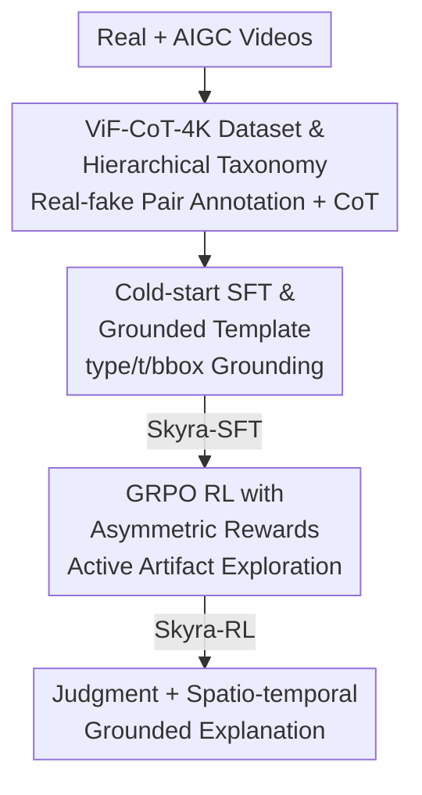

# Skyra: AI-Generated Video Detection via Grounded Artifact Reasoning

**Conference**: CVPR 2026  
**Paper**: [CVF Open Access](https://openaccess.thecvf.com/content/CVPR2026/html/Li_Skyra_AI-Generated_Video_Detection_via_Grounded_Artifact_Reasoning_CVPR_2026_paper.html)  
**Code**: https://joeleelyf.github.io/Skyra  
**Area**: AI Safety / AIGC Video Detection  
**Keywords**: AIGC Video Detection, Artifact Reasoning, MLLM, Reinforcement Learning, Interpretable Forensics

## TL;DR
Skyra transforms AI-generated video detection from black-box binary classification into interpretable artifact reasoning. It utilizes a cold-start SFT phase on the manually annotated ViF-CoT-4K dataset to teach MLLMs to spatio-temporally locate and explain artifacts. This is followed by GRPO reinforcement learning with asymmetric rewards to encourage active artifact discovery, achieving a 26.73% absolute accuracy improvement over the second-best method on the ViF-Bench.

## Background & Motivation
**Background**: As diffusion and multimodal generative models (Sora-2, Kling, Wan2.2, etc.) produce increasingly realistic synthetic videos, the community has developed AIGC video detectors. Current approaches follow two paths: binary classifiers (e.g., DeMamba, NSG-VD) that learn a decision boundary from spatio-temporal features, and MLLM-based interpretable detectors (e.g., BusterX++, DAVID-XR1).

**Limitations of Prior Work**: Binary classifiers represent an "arms race" between detectors and generators; they often fail on unseen models and lack interpretability for forensic review. While MLLM-based approaches provide reasoning, even SoTA general MLLMs with CoT prompts yield near-random accuracy (<60%). Adapted models like BusterX++ act more as "content describers," focusing on surface features like lighting while ignoring intrinsic physical violations. DAVID-XR1 suffers from vague classification and limited annotated samples.

**Key Challenge**: Prior methods fail to capture how humans identify AI videos. Humans perceive global semantics and temporal context to actively search for spatio-temporal inconsistencies (e.g., vanishing objects, unnatural motion). These are **model-agnostic, universal** intrinsic evidences. Existing MLLMs lack sensitivity to these subtle artifacts and often misjudge natural degradation (e.g., compression) as forgery.

**Goal**: To enable models to reason like humans—actively mining essential forgery cues, self-verifying suspicious regions in real videos, and grounding reasoning in specific spatio-temporal locations.

**Core Idea**: Build the first large-scale manually annotated AIGC video artifact dataset with a hierarchical taxonomy. Train Qwen2.5-VL-7B using "Cold-start SFT + Asymmetric Reward RL" to create Skyra, a grounded artifact reasoning detector.

## Method

### Overall Architecture
Skyra processes a video and outputs a "Real/Fake" judgment with interpretable reasoning grounded in temporal intervals `<t>` and spatial boxes `<bbox>`. The pipeline consists of three stages: offline construction of the ViF-CoT-4K dataset, **Cold-start SFT** to establish basic perception and template compliance (Skyra-SFT), and **GRPO RL with asymmetric rewards** to stimulate active exploration (Skyra-RL).

### Key Designs

**1. ViF-CoT-4K Dataset: Replacing Vague Labels with Real-Fake Evidence**

Prior datasets often have significant discrepancies in duration or FPS between real and fake videos, allowing models to exploit shortcuts. The authors collected 3.5K real videos from Panda-70M and 1.5K from Kinetics-400, generated corresponding AIGC videos using 10+ models (e.g., Wan2.2, CogVideoX), and used GPT-4o-mini for semantic alignment filtering to eliminate shortcut signals.

The taxonomy is three-tiered: L1 covers **Low-level Forgery** and **Violation of Laws**; L2 refines these into 8 categories (e.g., motion forgery, common sense violation); L3 defines specific observable artifacts. A key "real-fake co-play" strategy was used: annotators identified "forgery evidence" in the AI video while finding the corresponding "real evidence" in the source video to ensure artifacts were generated rather than mere compression noise. CoT responses were expanded via Gemini-2.5-Pro.

**2. Cold-start SFT & Grounded Template: Teaching Proper Formatting**

The authors observe that pure RL fails due to sparse rewards since base MLLMs lack initial artifact sensitivity. An outer template $F_{outer}$ is used: `<thinking>[Reasoning]</thinking><answer>[Fake/Real]</answer>`. For **Fake videos**, the model uses $F_{fake}$ to anchor artifacts: `<type>[Type]</type> in <t>[t_start, t_end]</t> at <bbox>[box]</bbox>`. For **Real videos**, $F_{real}$ is used to **inspect** suspicious areas without outputting a forgery type. This forces the model to perform "inspection-exclusion" for real samples, balancing the training distribution.

The SFT uses standard cross-entropy loss:

$$\mathcal{L}_{\mathrm{SFT}} = -\sum_{t=1}^{T} \log p_{\theta}\left(y^{*}_{t} \mid y^{*}_{<t}, t, v\right)$$

**3. GRPO RL & Asymmetric Reward: Stimulating Active Detection**

To adapt to new domains without constant manual labeling, GRPO is employed with a redesigned reward function:

$$R(x,y) = w_{acc}\cdot r_{acc}(x,y) + w_{chk}\cdot r_{chk}(x,y)$$

The **Asymmetric Accuracy Reward** $r_{acc}$ assigns $1.0$ for correct predictions, $0.0$ for misses (False Negatives), and a **penalty of $-0.2$ for false alarms (False Positives)**. This asymmetry addresses the fact that finding one artifact justifies a "Fake" label, whereas confirming "Real" requires exhaustive exclusion. Symmetric penalties lead the model to bias heavily towards "Fake." The **Inspection Reward** $r_{chk}$ encourages up to 3 evidence blocks:

$$r_{chk}(x,y) = \min\left(\ln(1+N_{check}),\ \ln(1+3)\right)$$

### Loss & Training
SFT is conducted for 5 epochs with a learning rate of 1e-5. RL uses an actor learning rate of 5e-7 and a KL coefficient of 0.02. Models are trained using 16 sampled frames at 256p resolution on 8 H200 GPUs.

## Key Experimental Results

### Main Results
Skyra is compared against binary detectors (AIGVDet/DeMamba/NSG-VD), general MLLMs, and MLLM-based detectors (BusterX++) on ViF-Bench.

| Method | Type | Avg Acc | Avg Recall | Avg F1 |
|------|------|---------|------------|---------|
| AIGVDet | Binary | 69.08 | 44.88 | 56.76 |
| DeMamba | Binary | 64.29 | 96.66 | 73.00 |
| BusterX++ (7B) | MLLM | 56.90 | 14.40 | 21.94 |
| **Skyra-SFT (7B)** | Ours | 90.11 | 84.65 | 88.76 |
| **Skyra-RL (7B)** | Ours | **91.02** | 88.35 | **90.27** |

Skyra-RL outperforms the best binary detector (DeMamba) by 26.73% in accuracy and 17.27% in F1. Cross-domain testing on GenVideo shows that with only 2.2K unannotated samples and 1 epoch of RL, Skyra can adapt to new domains significantly better than competitors.

### Ablation Study

| Configuration | Acc | Recall | F1 | Note |
|------|-----|--------|-----|------|
| Skyra-RL (Full) | 91.02 | 88.35 | 90.27 | Full Model |
| w/o CoT | 54.04 | 9.36 | 16.72 | Near random |
| w/o Cold-Start (Pure RL) | 50.09 | 0.18 | 0.37 | Fails to learn |
| w/o Asymmetric Reward | 76.24 | 99.07 | 80.65 | Biased towards "Fake" |

### Key Findings
- **CoT and Cold-start are fundamental**: Removing CoT drops accuracy to near-random (54.04). Pure RL (DeepSeek-R1-Zero style) fails because the base model lacks initial perception of AIGC artifacts.
- **Asymmetric reward prevents bias**: Symmetric penalties cause the model to flag everything as "Fake." The $-0.2$ penalty for false positives is crucial.
- **Zero-annotation adaptation**: RL allows the model to adapt to new generators (e.g., GenVideo) using unannotated data, providing a low-cost path to counter the "generator arms race."

## Highlights & Insights
- **Redefining Detection**: Shifting from binary classification to grounded reasoning allows for universal artifact detection that generalizes better across generator models.
- **Asymmetric Reward Insight**: The task of proving a video is "Real" is fundamentally different from finding a single artifact. Explicitly penalizing false positives in RL effectively manages this asymmetry.
- **Grounded Forensics**: Providing spatio-temporal coordinates for evidence makes the model useful for real-world forensic applications where human verification is required.

## Limitations & Future Work
- **Annotation Cost**: The initial ViF-CoT-4K dataset requires high-quality, labor-intensive manual labels.
- **Teacher Bias**: CoT responses are expanded by Gemini-2.5-Pro, which may introduce stylistic biases.
- **Future Directions**: Integrating multimodal cues (audio, metadata) into grounded evidence and exploring continuous online learning to keep pace with new generators.

## Related Work & Insights
- **Comparison to Binary Detectors**: While binary models often show high recall (e.g., DeMamba 96.66%), they suffer from low precision and lack of interpretability. Skyra achieves a better balance of Acc/F1.
- **Comparison to Pure RL**: Unlike mathematical reasoning (R1-Zero), visual artifact detection has a lower "prior" in base models. Cold-start SFT is therefore indispensable before applying RL.

## Rating
- Novelty: ⭐⭐⭐⭐⭐ 
- Experimental Thoroughness: ⭐⭐⭐⭐⭐ 
- Writing Quality: ⭐⭐⭐⭐ 
- Value: ⭐⭐⭐⭐⭐ 

<!-- RELATED:START -->

## Related Papers

- [\[CVPR 2026\] VMD-FACT: A New Video Dataset and MLLM-based method for Detecting Realistic AI-Generated Video Misinformation](vmd-fact_a_new_video_dataset_and_mllm-based_method_for_detecting_realistic_ai-ge.md)
- [\[CVPR 2026\] Scaling Up AI-Generated Image Detection with Generator-Aware Prototypes](scaling_up_ai-generated_image_detection_with_generator-aware_prototypes.md)
- [\[CVPR 2026\] Zero-shot Detection of AI-Generated Image via RAW-RGB Alignment](zero-shot_detection_of_ai-generated_image_via_raw-rgb_alignment.md)
- [\[CVPR 2026\] Enabling Supervised Learning of Generative Signatures for Generalized AI-Generated Images Detection](enabling_supervised_learning_of_generative_signatures_for_generalized_ai-generat.md)
- [\[ICLR 2026\] Watermark-based Detection and Attribution of AI-Generated Content](../../ICLR2026/ai_safety/watermark-based_attribution_of_ai-generated_content.md)

<!-- RELATED:END -->
