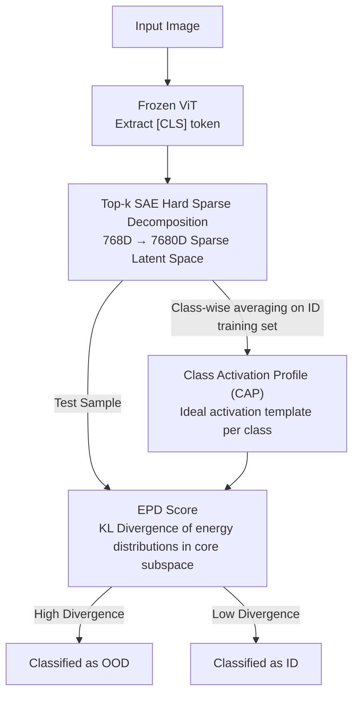

# Sparsity as a Key: Unlocking New Insights from Latent Structures for Out-of-Distribution Detection

**Conference**: CVPR 2026  
**arXiv**: [2604.26409](https://arxiv.org/abs/2604.26409)  
**Code**: None  
**Area**: AI Safety / OOD Detection  
**Keywords**: Sparse Autoencoders, OOD Detection, ViT Interpretability, Class Activation Profiles, KL Divergence Score

## TL;DR
This paper applies Top-k Sparse Autoencoders (SAE) to the ViT [CLS] token for the first time, disentangling entangled dense features into an interpretable sparse latent space. It finds that ID samples of the same class form stable "Class Activation Profiles" (CAP), whereas OOD samples, despite activating core features of the predicted class, fail to replicate the energy distribution shape. Based on this, it proposes the EPD score, achieving the best average FPR95 (40.96%) across multiple benchmarks.

## Background & Motivation
**Background**: OOD detection identifies inputs that fall outside the training distribution, which is critical for safety-sensitive scenarios like autonomous driving and medical diagnosis. Mainstream approaches include logit-based confidence methods (MSP, ODIN, Energy Score) and feature distance-based methods (Mahalanobis distance, KNN).

**Limitations of Prior Work**: Existing methods treat feature vectors as **monolithic and opaque** entities, relying on aggregate statistics such as magnitude or Euclidean distance. However, deep representations are **entangled**—multiple semantic concepts are compressed into dense activations via superposition. Relying only on the "quantity" of activation without considering the "quality" of internal structure causes distance-based methods to misinterpret geometric proximity as true semantic similarity.

**Key Challenge**: This issue is particularly severe in ViT. ViT aggregates global context into a special [CLS] token via self-attention. While this embedding is compact and expressive, it remains a black box with poorly understood internal organization. This "interpretability gap" hinders the development of robust OOD mechanisms directly on [CLS] features.

**Goal**: To find a representation that is both interpretable and capable of stably distinguishing ID/OOD samples, and to design a safety-friendly scoring function (low FPR95).

**Key Insight**: The authors draw inspiration from the success of SAEs in LLM interpretability. Unlike standard autoencoders that compress input into a low-dimensional bottleneck, SAEs **expand** the latent dimension and enforce sparsity. Each input is reconstructed using only a small set of latent neurons, exposing a set of structured, interpretable bases. The authors hypothesize that if ViT [CLS] is "unfolded" this way, samples of the same class should activate a fixed set of latent neurons, forming a recognizable structure.

**Core Idea**: Use the **hard sparsity of Top-k SAE** to disentangle [CLS] into sparse bases, abstracting each class into a stable Class Activation Profile (CAP), and then score based on the degree to which OOD samples disrupt the **shape** (not magnitude) of this profile.

## Method

### Overall Architecture
The approach consists of two phases. **Setup Phase (One-time)**: Freeze a pre-trained ViT, extract [CLS] tokens from ID data (ImageNet-1k), and train a Top-k SAE to expand them into a 7680-dimensional sparse latent space. Average the sparse activations of training samples for each class to obtain the Class Activation Profile (CAP), serving as the "ideal activation structure" template. **Inference Phase**: Pass the test sample through the ViT to get the predicted class and through the frozen SAE to get the sparse activation. Select the $L$ core features with the highest energy in the predicted class's CAP, project both the sample activation and the CAP onto these $L$ dimensions, and perform L1 normalization to obtain two energy distributions. Use KL divergence (the EPD score) to measure the shape difference; higher divergence indicates OOD.

### Key Designs

**1. Top-k SAE Hard Sparse Decomposition of [CLS]: Trading "Soft" for "Hard" Sparsity to achieve stable Class-Specific Bases**

To address the issue of "entangled dense features," the authors abandon traditional SAE "soft" sparsity ($\ell_1$ or KL penalties). A fatal flaw of soft sparsity is that it **does not guarantee sparsity for every sample**: an $\ell_1$-regularized model may still produce diffuse, low-magnitude activations (shrinkage effect) when encountering novel OOD inputs, blurring the ID/OOD boundary. Top-k SAE employs a **hard constraint**—retaining only the $k$ features with the largest activation values and forcing the rest to zero. This acts as a structural bottleneck, forcing the model to select the most salient features for each ID sample. Consequently, same-class samples converge to a **stable, non-overlapping** set of latent neurons. Jaccard similarity between core feature sets (top 5% by mean activation) of 1000 ImageNet classes shows a heatmap that is nearly diagonal, proving that Top-k SAE successfully disentangles classes into non-overlapping sparse subspaces. The SAE is overcomplete: the latent dimension $D_{latent}=7680$ is 10x the [CLS] dimension (768), providing capacity for disentanglement, while $k=128$ is much smaller than 768, creating a ~6x per-sample dimensionality bottleneck.

**2. Class Activation Profiles (CAP): Solidifying "Class Appearance" as a Comparable Structural Invariant**

With stable sparse bases, the authors compute the mean sparse activation vector $\bar{\mathbf{h}}^{c}\in\mathbb{R}^{D_{latent}}$ for all ID training samples of class $c$, yielding the CAP—a class-conditional "standard template." The value of CAP lies in revealing a key phenomenon: OOD samples **do not fail randomly**. OOD inputs are forced into an ID class by the ViT because they **partially activate core features of that class**. For instance, an iNaturalist sample misclassified as "Flowerpot (Class 738)" indeed shows significant activation in the core features of Class 738 and near-zero activation in irrelevant classes. However, a fundamental difference exists: when activations are plotted according to the CAP order, ID samples exhibit a **sharp, high-energy head** (activations concentrated in a few core features), whereas OOD samples exhibit a **flat, diffuse profile**—they hit the "right" features but fail to replicate the concentrated energy distribution shape of ID samples. This "shape disruption" serves as the detection signal and directly motivates EPD.

**3. Energy Profile Divergence (EPD): Quantifying Structural Disruption via KL Divergence of Energy Distributions**

To quantify "shape disruption," the authors treat activations in the core subspace as an **energy distribution**. First, they extract the indices $M^{c}$ of the $L$ largest core features in CAP $\bar{\mathbf{h}}^{c}$. Sample activations and the CAP are filtered by these indices to form $L$-dimensional core vectors $\mathbf{S}$ and $\mathbf{C}$. Then, L1 normalization is applied to map them onto the $(L-1)$ simplex—stripping away overall magnitude (scale) and leaving only the "shape" at the core feature level:

$$\mathbf{P}_i=\frac{\mathbf{S}_i}{\sum_{i=1}^{L}\mathbf{S}_i},\qquad \mathbf{Q}_i=\frac{\mathbf{C}_i}{\sum_{i=1}^{L}\mathbf{C}_i}$$

Where $\mathbf{Q}$ is the stable ID reference (anchor/centroid on the simplex) and $\mathbf{P}$ is the projected test sample. EPD is defined as the KL divergence between them:

$$\text{EPD} = D_{\text{KL}}(\mathbf{P}\parallel\mathbf{Q}) = \sum_{i=1}^{L}\mathbf{P}_i\log\frac{\mathbf{P}_i}{\mathbf{Q}_i}$$

(⚠️ The denominator in Equation (3) of the original text is printed as $\mathbf{G}_i$; based on context, it should be $\mathbf{Q}_i$; the original text prevails.) Higher EPD indicates that the sample's energy allocation deviates further from the class's core feature structure. The key to EPD is its focus on **proportional shape** rather than magnitude—capturing both Far-OOD (failure to activate core features) and Near-OOD (activating a conflicting pattern), making it more robust than traditional magnitude or Euclidean distance methods.

### Loss & Training
The SAE training objective is reconstruction loss + auxiliary loss: $\mathcal{L}_{\text{Total}}=\mathcal{L}_{\text{Recon}}+\alpha\mathcal{L}_{\text{AuxK}}$. $\mathcal{L}_{\text{Recon}}$ is the MSE between the normalized [CLS] and its reconstruction. $\mathcal{L}_{\text{AuxK}}$ mitigates the "dead neuron" problem common in Top-k models (where certain neurons never win the k-competition) by encouraging dead neurons to reconstruct residual error, weighted by $\alpha$. Activation head size $p=15\%$: analysis of 99%-firing showed classes average ~18.8% (std 4.6%) active latent dimensions, falling within a meaningful 14–23% activation band. Training is highly efficient: ~17 minutes for 100 epochs on ImageNet-1k (1.28M samples, batch 4096) on a single RTX 4080. Once trained, the SAE is frozen; no retraining is needed for inference.

## Key Experimental Results

### Main Results
Benchmark: OpenOOD v1.5 with ImageNet-1k as ID. OOD includes near-OOD (SSB-hard, NINCO) and far-OOD (iNaturalist, Textures, OpenImage-O). Primary metrics: AUROC (higher is better) and FPR95 (lower is better, critical for safety). Backbone: ViT-B/16 (ID Acc 81.14%).

| Method | Avg FPR95↓ | Avg AUROC↑ |
|------|------|------|
| MDS | 44.43 | 87.18 |
| RMDS | 43.40 | **87.60 (Best)** |
| SHE | 44.63 | 85.90 |
| KNN | 47.35 | 84.13 |
| ViM | 47.02 | 86.51 |
| **Ours** | **40.96 (Best)** | 87.26 (2nd) |

Ours achieves the overall best average FPR95 (40.96%), with an AUROC of 87.26% (second only to RMDS). Per-dataset results indicate leadership in SSB-hard and Textures; for far-OOD, it reaches 17.84% FPR95 on iNaturalist and 26.03% on OpenImage-O.

| Dataset | FPR95↓ | AUROC↑ |
|------|------|------|
| SSB-hard (near) | 82.41 | 72.21 |
| NINCO (near) | 48.06 | 85.74 |
| iNaturalist (far) | 17.84 | 95.17 |
| Textures (far) | 30.44 | 91.06 |
| OpenImage-O (far) | 26.03 | 92.12 |

### Ablation Study

| Configuration | Key Finding | Description |
|------|---------|------|
| EPD vs Euclidean/Cosine | EPD wins across all splits | Replacing only the score within the CAP framework proves "shape" beats "distance." |
| ViT-B/16 → Swin-T | Avg FPR95 43.99 | Swin's local attention + hierarchical aggregation leads to weaker global consistency and less "sharp" activation heads. |
| Backbone → DINOv2 | Significant FPR95 improvement | DINOv2 optimizes for object-centric global representations, rendering CAPs sharper and more stable. |

### Key Findings
- **Shape > Magnitude**: EPD (KL divergence shape metric) consistently outperforms Euclidean/Cosine distances, validating the hypothesis that OOD signals reside in energy distribution shapes rather than activation magnitudes.
- **Backbone Global Consistency Determines Ceiling**: Performance correlates strongly with the backbone's ability to produce "sharp, stable activation heads." DINOv2 performs best, followed by ViT-B/16, while Swin-T is weakest, suggesting CAP shape alignment relies on global coherence.
- **Safety-Friendly**: Achieving the best average FPR95 is critical for deployment, as it minimizes false positives while correctly accepting 95% of ID samples.

## Highlights & Insights
- **Cross-modal Transfer of SAE Interpretability**: Successfully adapts Top-k SAEs, originally for LLM explanation, to ViT [CLS] for OOD. OOD here stems from "structural disruption" in disentangled space rather than logit/distance deviations.
- **Causal Explanation of OOD Misclassification**: Provides evidence through activation affinity experiments that OOD samples are misclassified because they partially trigger core features of an ID class—turning "why misclassification happens" into an observable phenomenon.
- **Hard vs. Soft Sparsity**: Explicitly demonstrates that soft sparsity leads to diffuse activations (shrinkage) on OOD inputs, blurring boundaries, whereas hard Top-k constraints amplify ID/OOD differences.
- **Low Overhead**: One-time 17-minute training for the SAE; inference is frozen without fine-tuning, making it more engineering-friendly than methods requiring gradients or modified training.

## Limitations & Future Work
- Interpretability is validated at the **class level** (CAP), but fine-grained **single-neuron semantic visualization** is still needed to understand what specific concepts each latent neuron captures.
- Dependency on backbone architecture: Performance drops on Swin-T, indicating reliance on "globally coherent, sharp" features, which may limit generalizability to non-global architectures.
- Near-OOD remains a significant challenge (notably SSB-hard at 82.41% FPR95), as core features of semantic neighbors overlap heavily, resulting in insufficient shape divergence.
- Evaluation is limited to image classification; extension to other modalities remains a future prospect.

## Related Work & Insights
- **vs. ViM / ReAct**: While those operate on **dense, entangled** representations (ViM uses feature residuals; ReAct uses activation truncation), this work explicitly **disentangles** representations into class-conditional subspaces via SAE, detecting OOD based on structural disruption.
- **vs. distance methods (Mahalanobis/KNN)**: Unlike methods that treat features as monolithic entities prone to geometric noise, this work normalizes core subspaces into energy distributions to compare "shapes," removing magnitude interference.
- **vs. SAE research in LLM**: While using similar sparse dictionary learning, this paper proves the paradigm applies to ViT visual representations and solves a specific downstream task (OOD) rather than staying at analysis.

## Rating
- Novelty: ⭐⭐⭐⭐⭐ First application of Top-k SAE to ViT [CLS] for OOD; CAP/EPD are self-consistent and grounded in interpretability.
- Experimental Thoroughness: ⭐⭐⭐⭐ Extensive testing on OpenOOD v1.5 with multiple backbones; however, near-OOD performance is still weak.
- Writing Quality: ⭐⭐⭐⭐⭐ Clear logical progression from phenomenological analysis to methodology, supported by excellent visualizations.
- Value: ⭐⭐⭐⭐ High practical value due to best-in-class FPR95 and low overhead, though backbone dependency is a minor constraint.

<!-- RELATED:START -->

## Related Papers

- [\[CVPR 2026\] RankOOD: Class Ranking-based Out-of-Distribution Detection](rankood_-_class_ranking-based_out-of-distribution_detection.md)
- [\[CVPR 2026\] Enhancing Out-of-Distribution Detection with Extended Logit Normalization](enhancing_out-of-distribution_detection_with_extended_logit_normalization.md)
- [\[CVPR 2026\] Learning Latent Concepts for Detecting Out-of-Distribution Objects](learning_latent_concepts_for_detecting_out-of-distribution_objects.md)
- [\[CVPR 2026\] Bypassing the Transport Plan: Dynamic Reweighting for Out-of-Distribution Detection with Optimal Transport](bypassing_the_transport_plan_dynamic_reweighting_for_out-of-distribution_detecti.md)
- [\[NeurIPS 2025\] Double Descent Meets Out-of-Distribution Detection: Theoretical Insights and Empirical Analysis](../../NeurIPS2025/ai_safety/double_descent_meets_out-of-distribution_detection_theoretical_insights_and_empi.md)

<!-- RELATED:END -->
