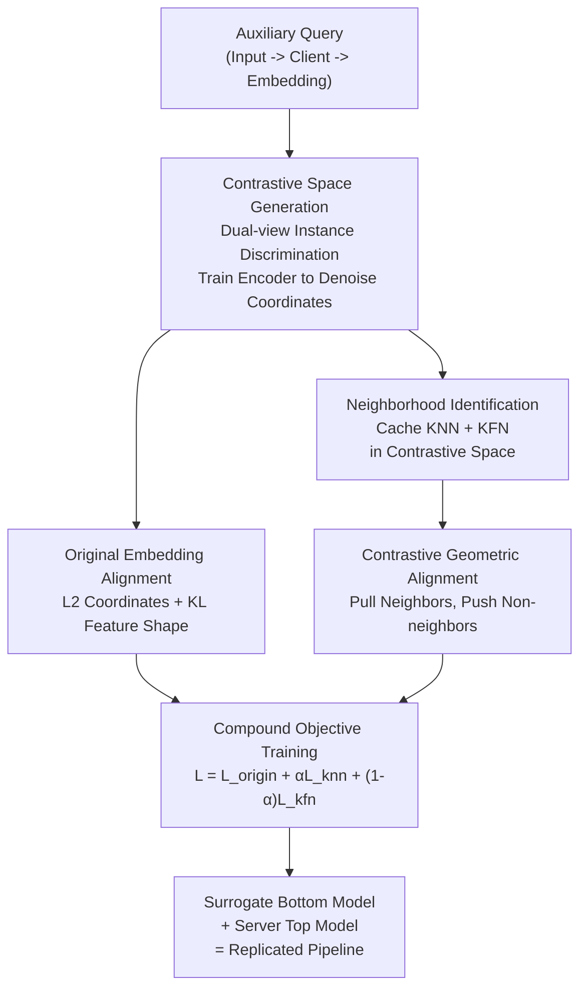

# Stealing Split Learning Bottom Models by Recovering Embedding Geometry

**Conference**: CVPR 2026  
**Paper**: [CVF Open Access](https://openaccess.thecvf.com/content/CVPR2026/html/Zhang_Stealing_Split_Learning_Bottom_Models_by_Recovering_Embedding_Geometry_CVPR_2026_paper.html)  
**Code**: None  
**Area**: AI Security / Privacy Attack  
**Keywords**: Vertical Federated Learning, Split Learning, Model Stealing, Contrastive Learning, Embedding Geometry

## TL;DR
In the context of split learning for Vertical Federated Learning (VFL), the authors propose VENOM—a "geometry-aware" model stealing attack. Instead of performing point-wise fitting of embedding coordinates seen by the server, VENOM first uses contrastive learning to reconstruct a stable neighborhood geometric space on these embeddings. It then trains a surrogate model to simultaneously align coordinates, feature shapes, and respect the local structure where "near neighbors stay near and far neighbors stay far." This approach bypasses mainstream noise-injection and decoupling defenses, restoring stealing accuracy (especially under the strong Model Rake defense) to usable levels across 6 datasets.

## Background & Motivation

**Background**: Vertical Federated Learning allows multiple institutions (e.g., hospitals, banks) to jointly train models without sharing raw features. This is commonly implemented via **split learning**: the model is divided into client-side "bottom models" and a server-side "top model." Each client processes local features through the bottom model and sends only the intermediate **embeddings** $h_i^m = f_b^m(x_i^m)$ to the server. The server concatenates these embeddings to feed into the top model for prediction and backpropagates gradients. While raw features remain local, the **embedding stream is continuously exposed to the server**.

**Limitations of Prior Work**: This exposed embedding stream constitutes an attack surface. Existing work (PISTE) indicates that an "honest-but-curious" server can act as a thief during the testing phase. It constructs auxiliary inputs in the same feature space as the client, queries the client, records returned embeddings, and then trains a **surrogate bottom model** through point-wise regression (minimizing $\|\hat f_b(x_j) - h_j\|_2^2$). Once the surrogate is trained, the server can replicate the entire pipeline independently. To prevent this, two categories of defenses have emerged: **perturbation-based** (e.g., InvL-ENP/DNP, which inject directional noise based on the Jacobian spectrum; along with pruning, random projection, and DP-SGD) and **decoupling-based** (e.g., Model Rake, which trains two bottom models for each client with mutually repelled output spaces, preventing a single surrogate from aligning with contradictory targets).

**Key Challenge**: While these defenses appear effective, the authors identify a fundamental tension: **point-wise fitting is fragile, but a specific signal cannot be erased by defenses**. Point-wise fitting is fragile because defenses can alter coordinates (via noise, rotation, or branching), making exact value matching unreliable. Crucially, **for split models to remain useful to the server-side top model, they must preserve the local similarity structure of embeddings**. If semantically similar inputs are mapped far apart, the downstream classifier accuracy collapses. To maintain utility, the system **must** preserve a consistent neighborhood structure even if coordinates are scrambled. This neighborhood structure is a **recoverable residual signal**.

**Goal**: Design an attack that recovers and exploits the **neighborhood geometry** of server-visible embeddings, allowing surrogate models to faithfully mimic client bottom models even under advanced defenses.

**Key Insight**: Defenses can manipulate coordinates but cannot easily alter "which samples are neighbors" without destroying utility. Therefore, rather than fitting unstable coordinates, the attack should fit stable relationship structures.

**Core Idea**: Use contrastive learning to map server-visible embeddings into a **denoised space that amplifies similarity/dissimilarity**. Identify near and far neighbors in this space, then force the surrogate model to satisfy "coordinate alignment + feature shape alignment + neighborhood geometry alignment," effectively "re-coupling" embeddings that were "decoupled or perturbed" by defenses.

## Method

### Overall Architecture
VENOM is a three-step stealing pipeline from the perspective of an honest-but-curious server that can only query for `(input, embedding)` pairs. Step 1: **Contrastive Space Generation**: Query clients with auxiliary inputs $X^{aux}$ to obtain embedding set $H=\{h_i\}$, then train a contrastive encoder on these embeddings to derive a representation space $H^{con}$ more stable than raw coordinates. Step 2: **Neighborhood Identification**: Calculate cosine similarities in the contrastive space for each anchor embedding to cache its $k$ nearest neighbors (KNN) and $k$ farthest neighbors (KFN), forming a "geometric scaffold." Step 3: **Surrogate Training**: Train the surrogate bottom model using a compound objective—aligning point-wise coordinates ($L_{pt}$), feature quality distributions ($L_{kl}$), and neighborhood geometry by passing surrogate outputs through the same frozen encoder to pull near neighbors and push far neighbors ($L_{knn}, L_{kfn}$).

### Key Designs

**1. Contrastive Space Generation: Replacing Scrambled Coordinates with Stable Relationships**

Direct point-wise fitting on server-visible embeddings fails to capture structures surviving defenses because coordinates are disrupted by noise or decoupling. VENOM creates two slightly perturbed views for each embedding $h_i$ (e.g., via Gaussian noise or dropout), passes them through a base encoder $e(\cdot)$ and a projection head $g(\cdot)$, and trains with an instance discrimination objective:

$$\ell_{i,j} = -\log \frac{\exp(\text{sim}(z_i, z_j)/\tau_{con})}{\sum_{k=1}^{2n} \mathbb{1}[k\neq i]\,\exp(\text{sim}(z_i, z_k)/\tau_{con})}$$

Where $\text{sim}$ is cosine similarity and $\tau_{con}=0.1$. After training, **the projection head is discarded and the encoder is frozen**, mapping original embeddings to contrastive embeddings $H^{con}=\{e(h_i)\}$. This amplifies similarity and dissimilarity, making the underlying geometry more stable than the raw coordinates exposed at the split interface.

**2. Neighborhood Identification: Excavating Geometric Scaffolds in Denoised Space**

To use relationships as supervision signals, VENOM calculates cosine similarities for each anchor $h_i^{con}$ in $H^{con}$ and identifies the $k$ nearest and $k$ farthest neighbors:

$$N_k^{near}(i) = \arg\max_{J,|J|=k} \sum_{j\in J}\text{sim}(h_i^{con}, h_j^{con}), \quad N_k^{far}(i) = \arg\min_{J,|J|=k} \sum_{j\in J}\text{sim}(h_i^{con}, h_j^{con})$$

These sets are **pre-computed and cached**. $k$ is set to 10% of the auxiliary set. Identifying neighbors in the **contrastive denoised space** is crucial, as doing so in the raw corrupted space would lead to identifying "false neighbors" induced by the defense.

**3. Compound Alignment Objective: Three-level Supervision**

VENOM integrates point-wise alignment with geometry-aware supervision. The first level is **Original Alignment**, utilizing an $L_2$ term for coordinates and a KL term to replicate the "feature quality distribution" (treating dimensions as a distribution via softmax):

$$L_{pt} = \frac{1}{N_{aux}}\sum_i \|\hat h_i - h_i\|_2^2, \quad L_{kl} = \frac{1}{N_{aux}}\sum_i \sum_d P_{h_i}(d)\log\frac{P_{h_i}(d)}{P_{\hat h_i}(d)}, \quad L_{origin}=L_{pt}+L_{kl}$$

The second level is **Contrastive Geometric Alignment**: surrogate outputs $\hat h_i$ are passed through the frozen encoder to get $\hat h_i^{con}$, which are supervised by the neighbors:

$$L_{knn} = -\frac{1}{N_{aux}}\sum_i \frac{1}{k}\sum_{j\in N_k^{near}(i)}\text{sim}(\hat h_i^{con}, h_j^{con}), \quad L_{kfn} = \frac{1}{N_{aux}}\sum_i \frac{1}{k}\sum_{j\in N_k^{far}(i)}\text{sim}(\hat h_i^{con}, h_j^{con})$$

Total loss: $L = L_{origin} + \alpha L_{knn} + (1-\alpha)L_{kfn}$ with $\alpha=0.5$. The balance between attraction and repulsion ensures the surrogate preserves the essential "local proximity and dissimilar margins" that the defense cannot remove without destroying performance.

### Loss & Training
The complete objective is as defined above. Training uses Adam (learning rate $10^{-3}$, batch size 256), temperatures $\tau_{con}=0.1, \tau_{soft}=2$, and neighborhood size $K=10\%|X^{aux}|$. All bottom models output 128-dimensional embeddings, and the contrastive encoder is a 3-layer linear model mapped to 256 dimensions.

## Key Experimental Results

The evaluation uses a 2-client + 1-server split learning setup with vertically partitioned data. Metrics include **S-ACC** (accuracy after replacing the client with the surrogate) and **AGR** (agreement with the original pipeline).

### Main Results

The table below shows S-ACC (%) under strong defenses, highlighting VENOM's advantages as defense intensity increases:

| Dataset / Defense | Steal | VENOM | Pipeline ACC | Note |
|--------|------|------|------|------|
| MNIST / InvL-ENP | 81.61 | 90.85 | 95.25 | +9.2 pp |
| CIFAR-10 / InvL-DNP | 52.16 | 61.59 | 69.57 | +9.4 pp |
| MNIST / Model Rake | 17.44 | 68.52 | 82.41 | **+51.1 pp** (Baseline collapsed) |
| CIFAR-10 / Model Rake | 12.84 | 52.58 | 61.78 | **+39.7 pp** |
| Bank / Model Rake | 45.76 | 79.35 | 85.82 | +33.6 pp |
| NUS-WIDE / Model Rake | 46.82 | 67.51 | 76.39 | +20.7 pp |

### Ablation Study (CIFAR-10, Strong Defenses)

| Configuration | InvL-ENP S-ACC | InvL-DNP S-ACC | Model Rake S-ACC | Note |
|------|------|------|------|------|
| Full VENOM | 60.47 | 61.59 | 52.58 | Full Model |
| w/o KL | 58.32 | 59.17 | 46.43 | Reduced feature shape alignment |
| w/o NM | 53.74 | 54.25 | 24.72 | **Most significant degradation** |
| w/o CON | 55.46 | 55.85 | 32.03 | Neighbors found in raw space |

### Key Findings
- **Contrastive Neighborhood Matching (NM) is the primary engine**: Removing NM resulted in the largest performance drop, especially under Model Rake, where S-ACC fell from 52.58 to 24.72.
- **Contrastive Space is Essential**: Searching for neighbors in the original corrupted space (w/o CON) is significantly less effective than in the contrastive space, proving the encoder successfully denoises the geometry.
- **KL is a Secondary Gain**: It improves point-wise fidelity and indirectly refines neighbor identification.
- **Out-of-Distribution (OOD) Tolerance**: Near-OOD auxiliary data (e.g., CIFAR-100) causes only moderate degradation, whereas far-OOD (e.g., MNIST for CIFAR-10) causes collapse as embeddings fall outside the manifold.
- **Efficiency Trade-off**: Approximate neighborhood sampling reduces attack time by 36.5% with negligible accuracy trade-offs.

## Highlights & Insights
- **Attack Philosophy Shift**: Moving from fitting fragile coordinates to fitting relational geometry that defenses must preserve for utility.
- **Contrastive Learning as a "Denoising Lens"**: Repurposing self-supervised learning to stabilize corrupted geometric structures.
- **Evidence of Geometry Recovery**: Using triplet consistency (checking if the surrogate maintains the "near vs. far" order) to verify that VENOM restores the local manifold better than point-wise methods.
- **Warning for Security**: Current defenses via coordinate perturbation are systematically bypassed; as long as the split model remains useful to the server, its neighborhood structure is exploitable.

## Limitations & Future Work
- **Far-OOD Vulnerability**: The attack relies on auxiliary data being sufficiently close to the victim distribution.
- **Threat Model Assumptions**: Assumes the server can query the client bottom model continuously; results may vary under query limitations.
- **Lack of Adaptive Defense Analysis**: Evaluated defenses were not aware of VENOM; future work should explore defenses that explicitly disrupt contrastive relationship recovery.
- **Capacity Matching**: Surrogate model capacity needs to roughly match the victim's; unknown capacities may require trial-and-error.

## Related Work & Insights
- **vs. PISTE**: PISTE uses point-wise regression. VENOM outperforms it significantly (+20–51 pp under Model Rake) by focusing on relationships rather than coordinates.
- **vs. InvL-ENP/DNP, Model Rake**: These defenses attempt to scramble coordinates; VENOM proves they leave the neighborhood structure intact due to utility constraints.
- **vs. Cont-Steal**: While both use contrastive objectives, VENOM explicitly targets the "utility-preserving local neighborhood" in split learning and uses a **learned** contrastive space to stabilize this geometry.

## Rating
- Novelty: ⭐⭐⭐⭐⭐ 
- Experimental Thoroughness: ⭐⭐⭐⭐ 
- Writing Quality: ⭐⭐⭐⭐ 
- Value: ⭐⭐⭐⭐

<!-- RELATED:START -->

## Related Papers

- [\[CVPR 2026\] PROMPTMINER: Black-Box Prompt Stealing against Text-to-Image Generative Models via Reinforcement Learning and VLM-Guided Optimization](promptminer_black-box_prompt_stealing_against_text-to-image_generative_models_vi.md)
- [\[CVPR 2026\] MaxMark: High-Capacity Diffusion-Native Watermarking via Robust and Invertible Latent Embedding](maxmark_high-capacity_diffusion-native_watermarking_via_robust_and_invertible_la.md)
- [\[AAAI 2026\] HealSplit: Towards Self-Healing through Adversarial Distillation in Split Federated Learning](../../AAAI2026/ai_safety/healsplit_towards_self-healing_through_adversarial_distillation_in_split_federat.md)
- [\[CVPR 2026\] Fine-Tuning Impairs the Balancedness of Foundation Models in Long-tailed Personalized Federated Learning](fine-tuning_impairs_the_balancedness_of_foundation_models_in_long-tailed_persona.md)
- [\[CVPR 2026\] FedDAP: Domain-Aware Prototype Learning for Federated Learning under Domain Shift](feddap_domain-aware_prototype_learning_for_federated_learning_under_domain_shift.md)

<!-- RELATED:END -->
