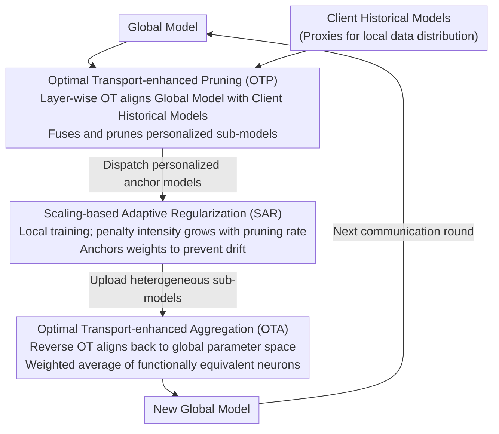

# SubFLOT: Submodel Extraction for Efficient and Personalized Federated Learning via Optimal Transport

**Conference**: CVPR 2026  
**arXiv**: [2604.06631](https://arxiv.org/abs/2604.06631)  
**Code**: None  
**Area**: AI Security  
**Keywords**: Federated Learning, Network Pruning, Optimal Transport, Personalized Models, Heterogeneous Systems

## TL;DR

Proposes the SubFLOT framework, which utilizes Optimal Transport (OT) at the server side to align global model parameter distributions with client historical models. This enables personalized pruning without access to raw data and suppresses parameter shift caused by pruning through adaptive regularization, significantly outperforming existing federated pruning methods on multiple datasets.

## Background & Motivation

**Background**: Federated Learning (FL) enables collaborative training while preserving data privacy but faces dual challenges in practical deployment: system heterogeneity (differences in device resources) and statistical heterogeneity (non-IID data distribution). Federated network pruning allows different clients to train sub-models of varying sizes, reducing computation and communication overhead.

**Limitations of Prior Work**: Federated pruning faces two key unresolved issues. First, the location of pruning decisions presents a dilemma: server-side pruning (e.g., HeteroFL) uses uniform compression strategies, lacking personalization; client-side pruning (train-prune-fine-tune paradigm) allows personalization but imposes a heavy computational burden on resource-constrained devices. Second, the act of pruning itself exacerbates heterogeneity—the weight distribution of sub-models with high pruning rates tends to deviate from the global model (parameter drift), undermining training stability and global convergence.

**Key Challenge**: How to achieve personalized pruning at the server side without accessing raw data while simultaneously resolving parameter space shifts induced by pruning?

**Goal**: (1) Server-side personalized pruning—generate customized sub-models for each client without touching raw data; (2) Parameter drift suppression—prevent parameter distributions of sub-models with different pruning rates from diverging excessively during training.

**Key Insight**: The authors treat client historical model parameters as proxies for their local data distributions. Based on this insight, the pruning problem is transformed into a Wasserstein distance minimization problem between the global model and historical models, guided by an optimal transport plan for personalized pruning.

**Core Idea**: Use Optimal Transport to align neurons between the global model and client historical models in the parameter space, achieving data-free server-side personalized pruning.

## Method

### Overall Architecture

SubFLOT aims to answer a seemingly contradictory question: How can the server, which only holds model weights from the previous round and has no access to raw data, prune a personalized sub-model that "understands" a client's local data? The key insight is treating client historical parameters as proxies for local data distributions—since weights are trained from data, closer model weights imply similar underlying data distributions. Thus, the pruning problem is reformulated as an Optimal Transport (OT) problem: "aligning the global model with a specific client's historical model in the parameter space."

Centered on this insight, each communication round follows a three-step closed loop: first, the server uses OT to align the global model with client historical models to prune customized sub-models for distribution (OTP); second, clients train these sub-models on local data using a regularization term that scales with the pruning rate to anchor weights to the dispatched model and prevent drift (SAR); third, after training, heterogeneous sub-models return to the server, where another OT step aligns them back to the global parameter space for weighted averaging into a new global model (OTA). OT is used twice—at "distribution" and "aggregation"—in opposite directions, forming a complete pipeline.

### Key Designs

**1. Optimal Transport-enhanced Pruning (OTP): Personalized Pruning Without Data Access**

The traditional problem with server-side pruning is "one size fits all"—strategies like HeteroFL apply the same compression to all clients, lacking adaptability. True personalization usually requires data. OTP bypasses this dilemma by performing layer-wise progressive matching. For layer $l$ of client $i$, it first uses the transport plan $T_i^{(l-1)}$ from the previous layer to re-map the input side of global weights: $\hat{W}_G^{(l,l-1)} = W_G^{(l,l-1)} T_i^{(l-1)}$, ensuring coherent neuron correspondence across layers. It then treats the aligned global weights and output neurons of historical weights as discrete probability distributions, builds a cost matrix based on Euclidean distance, and solves a discrete OT to obtain the current layer's plan $T_i^{(l)}$. The resulting sub-model is not a simple copy of the global model but a fusion of aligned global knowledge and historical parameters:

$$\tilde{W}_i = \alpha \cdot W_{aligned} + (1-\alpha) \cdot W_i, \quad \alpha = 0.5$$

Setting $\alpha=0.5$ balances global knowledge transfer and local specialization. This is effective because historical parameters implicitly encode the local data distribution; OT identifies the neurons in the global model most relevant to that client's data—making pruning "data-aware" without ever touching a raw sample.

**2. Scaling-based Adaptive Regularization (SAR): Tighter Constraints for Heavier Pruning**

Pruning backfires by intensifying heterogeneity—small models with high pruning rates can easily drift away from the global model distribution after local training. SAR actively suppresses this drift during client training. In addition to standard cross-entropy, it adds a regularization term pulling current weights toward the server-dispatched anchor model $\tilde{W}_i$:

$$\mathcal{L}_{SAR}(W_i) = \rho_i \cdot \|W_i - \tilde{W}_i\|_2^2,$$

The overall objective is $\mathcal{L}_i = \mathcal{L}_{CE} + \lambda \cdot \mathcal{L}_{SAR}$ ($\lambda=1.0$). The ingenuity lies in using the pruning rate $\rho_i$ as the weight for the penalty: clients that are pruned more heavily and are more prone to drift receive automatically stronger constraints. Unlike HeteroFL's post-aggregation correction, SAR suppresses drift at the source during training.

**3. Optimal Transport-enhanced Aggregation (OTA): Aligning Functionally Equivalent Neurons Before Averaging**

Averaging heterogeneous sub-models directly via FedAvg is risky: neurons at the same position in different clients might have completely different functions. Hard averaging mixes parameters with inconsistent semantics, causing destructive interference. OTA reuses the OT mechanism in reverse—calculating a mapping $\mathcal{T}_i$ for each client to align its updated model $W_i^t$ back to the global space $W_G^t$ before weighted averaging:

$$W_G^{t+1} = \sum_{i=1}^N p_i \cdot \mathcal{T}_i(W_i^t).$$

This ensures only functionally equivalent neurons are matched and summed, while the alignment process naturally normalizes scale differences introduced by varying pruning rates.

### Loss & Training

Combined, the client local loss is $\mathcal{L}_i(W_i) = \mathcal{L}_{CE}(W_i; \mathcal{D}_i) + \lambda \cdot \rho_i \cdot \|W_i - \tilde{W}_i\|_2^2$. Training configuration: 20 clients with full participation (join ratio 1.0), 200 communication rounds, 5 local epochs per round, SGD (lr=0.001), batch size 256. Pruning rates are randomly sampled from $\{0, 1/4, 1/2, 3/4\}$. Convergence analysis proves that under strong convexity assumptions, SubFLOT converges to a neighborhood of the global optimum at a linear rate of $1 - \mu\eta_l E/2$.

## Key Experimental Results

### Main Results (Label Skew Setting)

| Method | CIFAR10 | CIFAR100 | TinyImageNet | AG News | HAR |
|------|---------|----------|-------------|---------|-----|
| HeteroFL | 84.54 | 40.95 | 19.68 | 84.12 | 69.80 |
| FlexFL | 85.13 | 49.21 | 22.23 | 86.02 | 76.24 |
| **SubFLOT** | **86.89** | **58.37** | **29.30** | **87.88** | **79.72** |

### Ablation Study (Feature Shift - Average Accuracy on PACS Dataset)

| Method | Photo | Art | Cartoon | Sketch | Avg |
|------|-------|-----|---------|--------|-----|
| HeteroFL | 16.23 | 13.66 | 20.27 | 26.90 | 19.27 |
| FlexFL | 16.34 | 14.78 | 21.56 | 28.01 | 20.17 |
| **SubFLOT** | **48.23** | **28.73** | **42.55** | **46.83** | **41.58** |

### Key Findings

- On CIFAR100, SubFLOT achieves 58.37%, outperforming the runner-up FlexFL (49.21%) by 9.16 percentage points; the advantage grows with task complexity.
- In the PACS feature shift setting, SubFLOT's average accuracy (41.58%) is more than double that of the runner-up (~20%).
- Scalability experiments: When scaling from 10 to 100 clients, SubFLOT shows the least performance decay (39.20% → 32.61%), while most baselines drop sharply.
- Grad-CAM visualizations confirm that sub-models generated by OTP focus on the same semantic key regions as the client's historical models.

## Highlights & Insights

- **Paradigm Shift**: Systematically addresses the server-side personalized pruning problem for the first time, breaking the misconception that "server-side = no personalization" and proving data-aware pruning is possible without raw data access.
- **Dual Application of OT**: The same Optimal Transport mechanism is elegantly reused for both pruning (OTP) and aggregation (OTA), forming a complete closed loop from distribution to recovery.
- **Ingenious Adaptive Regularization**: Using the pruning rate as the weight for SAR is simple but effective, capturing the core intuition that "heavier pruning requires stronger constraints."
- **Comprehensive Theoretical Guarantee**: Provides rigorous convergence analysis proving a linear convergence rate.

## Limitations & Future Work

- While OT computation uses a layer-wise strategy, computational overhead remains high when model depth and neuron counts are large.
- Pruning rates are randomly sampled from a fixed set; the study does not explore dynamically determining optimal pruning rates based on actual client resources.
- Convergence analysis relies on strong convexity (Assumption 2), which has limited practical application in non-convex neural networks.
- Lacks comparison with other model compression paradigms like knowledge distillation in federated settings.
- Currently only evaluates structured pruning (width); unstructured pruning or other compression forms remain unexplored.

## Related Work & Insights

- HeteroFL [Diao et al.] is the direct baseline; its uniform server-side pruning strategy is the primary benchmark SubFLOT improves upon.
- FedOTP [Singh et al.] and FedAli use OT for feature-space alignment; SubFLOT shifts OT from feature space to parameter space and from the client to the server.
- The design logic of SAR could be extended to other heterogeneous FL scenarios, such as federated learning with diverse model architectures.

## Rating

- **Novelty**: ⭐⭐⭐⭐⭐ — First application of OT to federated pruning; the server-side personalized pruning paradigm is entirely new.
- **Experimental Thoroughness**: ⭐⭐⭐⭐⭐ — Covers CV/NLP/IoT domains, multiple settings (label skew/feature shift/real-world), and extensive scalability/ablation studies.
- **Writing Quality**: ⭐⭐⭐⭐ — Problem definitions and methodology are clear, though high formula density may require OT background knowledge.
- **Value**: ⭐⭐⭐⭐ — Highly significant for deploying FL on edge devices; the method has "plug-and-play" potential.

<!-- RELATED:START -->

## Related Papers

- [\[CVPR 2026\] Bypassing the Transport Plan: Dynamic Reweighting for Out-of-Distribution Detection with Optimal Transport](bypassing_the_transport_plan_dynamic_reweighting_for_out-of-distribution_detecti.md)
- [\[ICML 2026\] Optimal Transport under Group Fairness Constraints](../../ICML2026/ai_safety/optimal_transport_under_group_fairness_constraints.md)
- [\[CVPR 2026\] Fine-Tuning Impairs the Balancedness of Foundation Models in Long-tailed Personalized Federated Learning](fine-tuning_impairs_the_balancedness_of_foundation_models_in_long-tailed_persona.md)
- [\[CVPR 2026\] FedDAP: Domain-Aware Prototype Learning for Federated Learning under Domain Shift](feddap_domain-aware_prototype_learning_for_federated_learning_under_domain_shift.md)
- [\[CVPR 2026\] FedAFD: Multimodal Federated Learning via Adversarial Fusion and Distillation](fedafd_multimodal_federated_learning_via_adversarial_fusion_and_distillation.md)

<!-- RELATED:END -->
